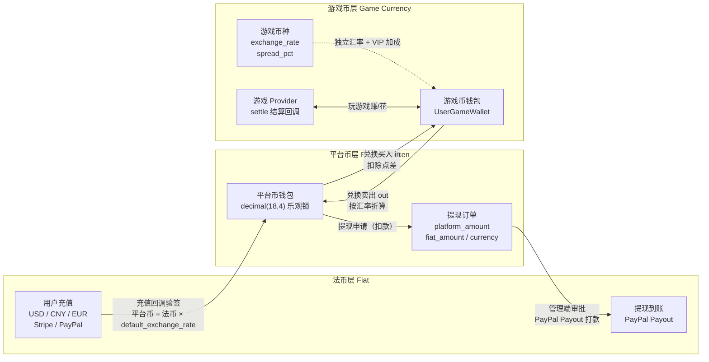
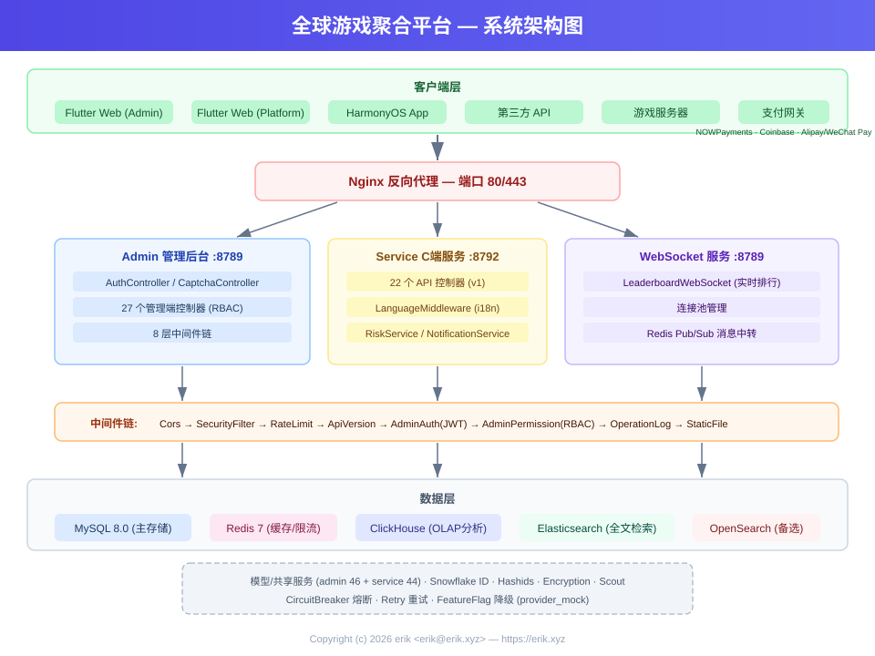
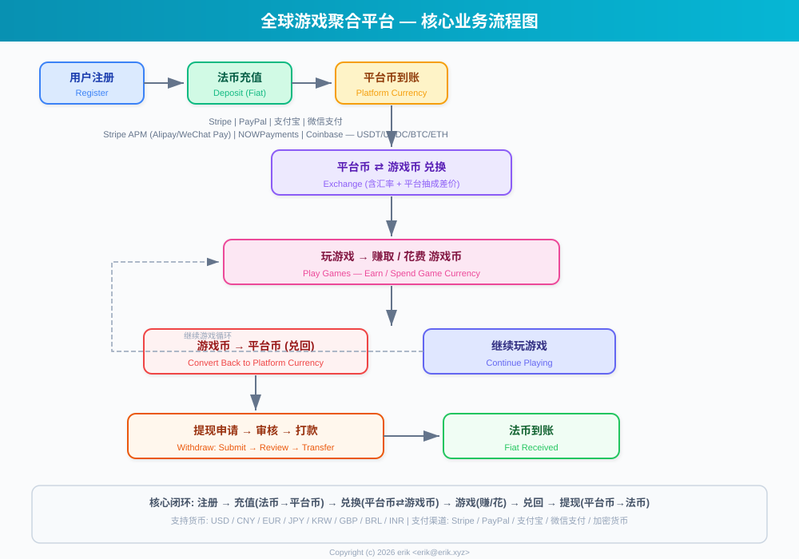
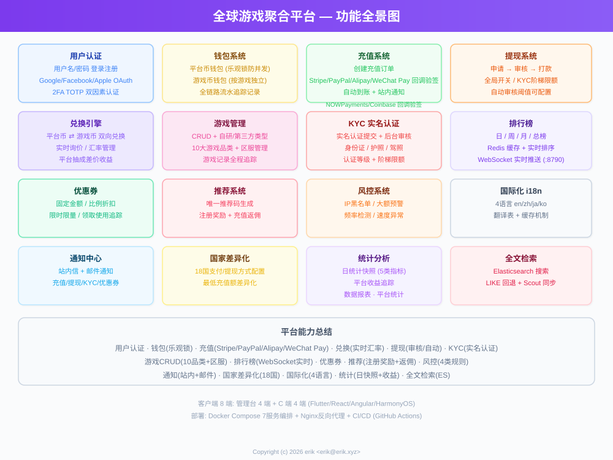
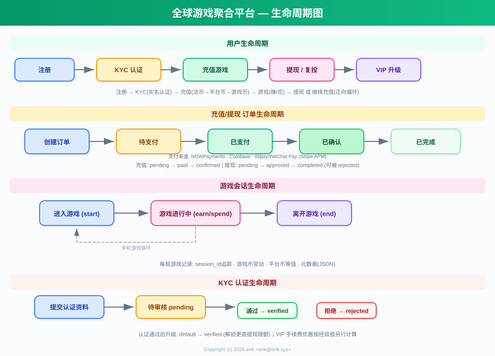
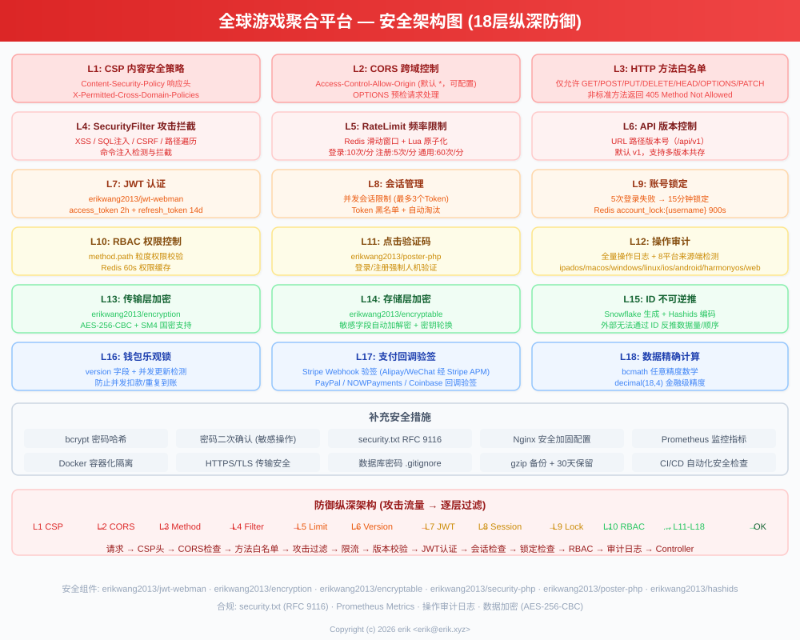
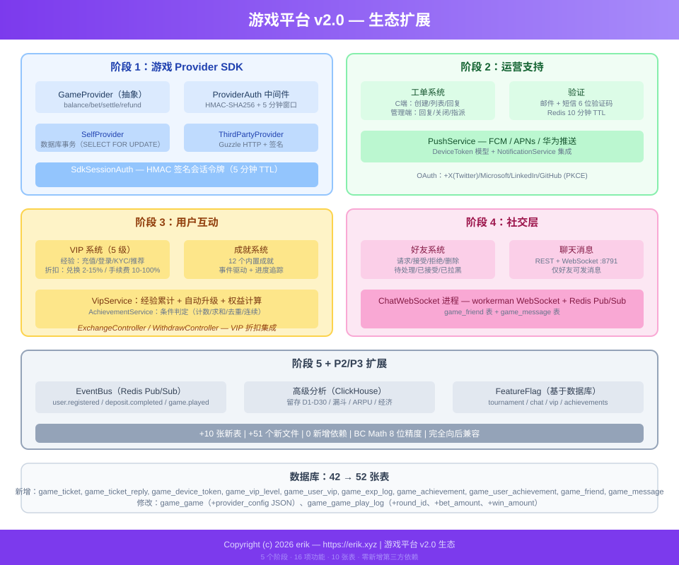

# 全球游戏聚合平台 (Global Game Platform)
<!-- lang-nav -->

Languages: **中文** · [English](docs/translations/README.en.md) · [한국어](docs/translations/README.ko.md) · [Русский](docs/translations/README.ru.md) · [Deutsch](docs/translations/README.de.md) · [Français](docs/translations/README.fr.md) · [Español](docs/translations/README.es.md) · [Português](docs/translations/README.pt.md) · [हिन्दी](docs/translations/README.hi.md) · [العربية](docs/translations/README.ar.md) · [বাংলা](docs/translations/README.bn.md) · [Bahasa Indonesia](docs/translations/README.id.md) · [日本語](docs/translations/README.ja.md)


> Copyright (c) 2026 erik <erik@erik.xyz> — https://erik.xyz

全球通用、国际化的游戏聚合平台。用户注册后在平台充值兑换游戏币，用游戏币玩游戏、赚取游戏币，游戏币可转回钱包提现。后台提供完整的游戏管理、提现审核、用户管理和支付管理功能。支持多语言切换（英文/中文）。

## 版本策略

| 版本 | 目标 | 状态 |
|------|------|------|
| 完整版 | 完全体：排行榜、优惠券、游戏分类、国家配置、ES搜索 | 已完成 |
| 生态扩展 | v2.0：游戏Provider接入、工单、VIP、成就、社交、事件总线 | 已完成 |

## 技术栈

### 后端
- PHP 8.3+, webman v2 (workerman/webman)
- MySQL 8.0+ (表前缀 `erik_`，BIGINT 非自增主键)
- Redis (Session / 缓存 / 限流)
- ClickHouse (OLAP 分析 / 概率计算)
- Elasticsearch (全文检索)
- JWT 认证 + RBAC 权限控制
- 数据加密：API 传输层 AES-256-CBC + 数据库存储层 AES-128-ECB

### 前端
- Flutter 3.x (Web PC 风格)
- HarmonyOS ArkTS (移动端)
- 响应式布局 (Phone / Tablet / Desktop)
- 国际化 (i18n)：英文 / 简体中文切换

### 核心组件
- `erikwang2013/snowflake-php` — 全局唯一 BIGINT ID 生成
- `erikwang2013/hashids` — API 层 ID 加解密
- `erikwang2013/jwt-webman` — JWT 认证
- `erikwang2013/encryption` — API 敏感数据加解密
- `erikwang2013/encryptable` — 数据库敏感字段加解密
- `erikwang2013/webman-scout` — Elasticsearch 同步与查询
- `erikwang2013/season` — 国家旗帜
- `erikwang2013/security-php` — 安全工具检测
- `erikwang2013/poster-php` — 敏感操作随机验证
- `erikwang2013/clickhouse-php` — ClickHouse 连接与概率计算

## 项目结构

```
game-platform-php/
├── admin/                     # 管理后台 (webman v2, 端口 8787)
│   ├── app/admin/controller/  #   管理端控制器
│   ├── app/middleware/        #   中间件 (Cors/Security/RateLimit/Auth/ProviderAuth)
│   ├── app/provider/          #   游戏Provider层
│   ├── app/event/             #   事件总线 (EventBus Redis Pub/Sub) (Cors/Security/RateLimit/Auth/Permission/ProviderAuth)
│   ├── app/provider/          #   游戏Provider层 (Self/ThirdParty/Factory)
│   ├── app/middleware/        #   中间件 (Cors/Security/RateLimit/Auth/ProviderAuth)
│   ├── app/provider/          #   游戏Provider层
│   ├── app/event/             #   事件总线 (EventBus Redis Pub/Sub) (Cors/Security/RateLimit/Auth/Permission)
│   ├── config/                #   配置文件
│   └── apps/flutter/          #   Flutter Web PC 管理后台
│
├── service/                   # C端业务端 (webman v2, 端口 8788)
│   ├── app/api/v1/controller/ #   C端 API 控制器
│   ├── app/middleware/        #   中间件 (Cors/Security/RateLimit/Auth/ProviderAuth)
│   ├── app/provider/          #   游戏Provider层
│   ├── app/event/             #   事件总线 (EventBus Redis Pub/Sub)
│   └── config/                #   配置文件
│
├── install/                   # 一键安装向导 + 数据库初始化 SQL
│   ├── index.php              #   安装入口
│   ├── Installer.php          #   安装核心逻辑
│   ├── install.sql            #   合并安装 SQL（MySQL 全量：43张表+种子数据）
│   ├── clickhouse.sql         #   ClickHouse 分析库 DDL（独立引擎，单独导入）
│   └── assets/                #   静态资源
│
├── admin/common/ 与 service/common/   # 共享服务各一份 (DepositLogService 等，待抽共享层)
│   └── service/               #   共享服务 (含 ClickHouse 概率计算)
│
├── apps/
│   └── flutter/platform/      # Flutter Web PC C端用户平台
│
├── docs/                      # 项目文档
│   ├── ARCHITECTURE.md        #   架构文档
│   ├── ARCHITECTURE-DESIGN.md #   架构设计文档
│   ├── FEATURES.md            #   功能文档
│   ├── FEATURE-DESIGN.md      #   功能设计文档
│   └── API.md                 #   接口文档
│
└── admin/docs/superpowers/    # 开发规范与计划
    ├── specs/                 #   设计规范
    └── plans/                 #   实现计划
```

## 快速开始

### 环境要求
- PHP 8.1+
- MySQL 8.0+
- Redis 6.0+
- Composer 2.x
- Flutter SDK 3.x (前端，可选)

### 方式一：一键安装向导（推荐）

```bash
# 1. 启动安装向导
php -S 0.0.0.0:8888 -t install/

# 2. 浏览器打开 http://localhost:8888
#    按照向导完成：环境检查 → 数据库配置 → 管理员账户设置 → 自动安装

# 3. 安装依赖
cd admin && composer install && cd ..
cd service && composer install && cd ..

# 4. 启动服务
cd admin && php start.php start -d && cd ..
cd service && php start.php start -d && cd ..

# 5. 访问管理后台: http://localhost:8787
#    使用安装时设置的管理员账号密码登录

# 6. 安装完成后删除安装目录（安全）
rm -rf install/
```

安装向导会自动完成：
- 环境检查（PHP版本、扩展、目录权限）
- 创建数据库和数据表（合并 SQL，43 张表 + 种子数据）
- 创建超级管理员账户（bcrypt 加密）
- 自动生成 JWT/加密密钥并写入 .env 文件
- 生成 install.lock 防止重复安装

### 方式二：手动安装

<details>
<summary>展开手动安装步骤</summary>

#### 1. 数据库初始化

```bash
# 一键导入合并 SQL
mysql -u root -e "CREATE DATABASE IF NOT EXISTS game_platform CHARACTER SET utf8mb4 COLLATE utf8mb4_unicode_ci;"
mysql -u root game_platform < install/install.sql
```

#### 2. 配置环境变量

```bash
# 管理后台
cd admin
cp .env.example .env
# 编辑 .env 中的数据库连接信息和密钥

# C端业务端
cd ../service
cp .env.example .env
# 编辑 .env 中的数据库连接信息和密钥
```

#### 3. 后端启动

```bash
cd admin && composer install && php start.php start -d
cd ../service && composer install && php start.php start -d
```

#### 4. 创建管理员

需要手动在数据库中插入管理员账户（密码使用 bcrypt 加密）。

</details>

### 前端启动（可选）

```bash
# 管理后台 (Flutter Web PC)
cd admin/apps/flutter
flutter pub get
flutter run -d chrome

# C端用户平台 (Flutter Web PC)
cd apps/flutter/platform
flutter pub get
flutter run -d chrome
```

### 验证

```bash
# 测试管理后台
curl http://localhost:8787/health

# 测试C端业务
curl http://localhost:8788/health

# 测试用户注册
curl -X POST http://localhost:8788/api/auth/register \
  -H "Content-Type: application/json" \
  -d '{"username":"testuser","password":"123456"}'
```

## 安全特性

- **18 层纵深防御**：XSS/SQL注入/CSRF/路径遍历/命令注入检测拦截
- **HTTP 方法白名单**：仅允许 GET/POST/PUT/DELETE/OPTIONS/HEAD
- **JWT 认证**：access_token 2h + refresh_token 14d，并发会话限制
- **JWT 密钥启动校验**：admin 端 `ADMIN_JWT_SECRET_KEY`、service 端 `SERVICE_JWT_SECRET_KEY` 独立密钥，缺失或仍为默认值直接拒绝启动
- **支付回调 fail-closed**：provider 白名单（仅 stripe/paypal）+ 未配密钥/验签失败/时间戳超限一律拒绝 + bccomp 金额核对 + 回调入账事务化
- **RBAC 权限**：method.path 粒度权限控制，Redis 60s 缓存
- **点击验证码**：登录/注册强制人机验证
- **密码二次确认**：敏感操作需输入密码确认
- **数据加密**：传输层 AES-256-CBC + 存储层 AES-128-ECB
- **ID 加密**：Snowflake 生成 + Hashids 编码，外部不可逆推
- **钱包乐观锁**：防止并发扣款/重复到账
- **操作审计**：全量操作日志，8 平台来源端自动检测
- **限流**：Redis 滑动窗口，Lua 原子化
- **CSP 头**：Content-Security-Policy 防 XSS
- **账号安全**：连续5次登录失败锁定15分钟

## 测试

测试报告（本地存储）：[docs/test-reports/](docs/test-reports/)

| 测试类型 | 用例/覆盖 | 结果 |
|---------|----------|------|
| PHP 单元测试 | admin 153 + service 60 + 新增 63 用例 | service 全过；admin 6 errors + 1 failure 为既有问题（详见报告） |
| 稳定性机制测试 | 熔断/重试/降级开关 15 用例（CircuitBreakerTest/RetryTest/ResilienceMockTest） | 全部通过 |
| API 接口自动化 | 187 端点全量覆盖，225 断言 | 171 通过 / 50 失败 / 4 跳过（失败均为确定性缺陷，详见报告） |
| Flutter UI 测试 | 12 用例（登录/仪表盘/导航/语言切换） | 全部通过 |
| Go/Rust | 仓库无 Go/Rust 代码 | 跳过，已记录 |

```bash
# PHP 单元测试（需先导出 JWT 密钥环境变量）
cd admin && ADMIN_JWT_SECRET_KEY=test-jwt-secret-change-me php vendor/bin/phpunit
cd service && SERVICE_JWT_SECRET_KEY=test-jwt-secret-change-me php vendor/bin/phpunit
# API 接口自动化（需启动服务，详见 tests/api/run_all.sh）
bash tests/api/run_all.sh
# Flutter UI 测试
cd admin/apps/flutter && flutter test --timeout 300s
```

详细报告：
- [PHP 单元测试报告](docs/test-reports/php-unit.md)
- [稳定性机制测试报告（熔断/重试/降级）](docs/test-reports/resilience.md)
- [API 接口自动化报告](docs/test-reports/api.md)
- [Flutter UI 测试报告](docs/test-reports/ui.md)

## 平台能力总览

| 能力 | 说明 |
|------|------|
| 用户认证 | 用户名密码 + 7平台 OAuth (Google/Facebook/Apple/X(Twitter)/Microsoft/LinkedIn/GitHub) + 2FA TOTP |
| 钱包 | 平台币钱包(乐观锁) + 游戏币钱包 + 流水记录 |
| 充值 | 创建订单 + Stripe/PayPal 回调验签 + 自动到账 |
| 兑换 | 平台币⇄游戏币、实时询价、差价收益 |
| 提现 | 申请→审核→打款、全局开关、KYC阶梯限额+手续费 |
| KYC | 实名认证提交+审核、三级认证体系 |
| 游戏 | CRUD + 分类(10类) + 区服 + 游戏记录追踪 |
| 搜索 | Elasticsearch 全文检索(含LIKE回退) |
| 排行榜 | 日/周/月/总榜、Redis缓存、WebSocket实时推送(8789) |
| 优惠券 | 固定金额+比例折扣、限时限量、领取使用追踪 |
| 通知 | 站内信+邮件、充值/提现/KYC/优惠券自动通知 |
| 推荐 | 推荐码、注册奖励、充值返佣 |
| 风控 | IP黑名单/大额预警/频率/速度检测 |
| 国际化 | 4语言(en-US/zh-CN/ja-JP/ko-KR)、翻译表+缓存 |
| 国家配置 | 8国差异化支付/提现方式、最低充值额 |
| 统计 | 日统计快照(5类指标) + 平台收益追踪 |
| 验证码 | 点击式人机验证(poster-php) |
| 游戏接入 | Provider SDK (Self+ThirdParty) + HMAC-SHA256 签名 + 回调网关 |
| 工单 | C端创建/回复 + 管理端处理/分配/关闭 |
| VIP | 5级忠诚度、经验值累计、兑换折扣/提现减免/汇率加成 |
| 成就 | 12个内置成就、事件驱动检测、进度追踪 |
| 社交 | 好友系统 + WebSocket 实时私信 (端口8791)、仅好友可发 |
| 赛事 | 锦标赛系统 (FeatureFlag开关) + 排行榜 + 人数上限 |
| 返佣 | 二级推荐分润 (可配置佣金率) |
| 优惠券 | 条件限制 (min_deposit/first_user/game_id) |
| 事件 | Redis Pub/Sub 事件总线 + Webhook订阅投递 (7种事件) |
| 部署 | Docker Compose 8服务编排 + Nginx反向代理 |
| 客户端 | Flutter Admin(15页) + Platform(10页) + HarmonyOS(5页) |

## 业务模型

```
法币 (USD/CNY/EUR...)
  │  充值(Stripe/PayPal/支付宝/微信)
  ▼
平台币 (统一，精度 decimal(18,4))
  │  兑换（含汇率 + 平台抽成差价）
  ▼
游戏币 (每种游戏独立，独立汇率)
  │  玩游戏赚/花
  ▼
平台币 ← 兑回 → 提现（审核/自动）
```

## 多币种结算

平台采用「法币 → 平台币 → 游戏币」三层币种隔离的结算体系：支持 USD/CNY/EUR 多法币充值，每款游戏拥有独立计价币种；金额计算全程使用 bcmath 高精度运算，杜绝浮点误差。

### 三层币种模型

| 层级 | 币种 | 说明 |
|------|------|------|
| 法币层 | USD / CNY / EUR | 用户充值/提现的实际支付货币，由 Stripe / PayPal 处理 |
| 平台币层 | 平台币（全平台统一） | 内部统一结算货币（decimal(18,4)），钱包乐观锁防并发扣款/重复到账 |
| 游戏币层 | 每款游戏独立币种 | 每款游戏独立 `exchange_rate` 汇率与 `spread_pct` 点差，独立游戏币钱包 |

### 结算路径

- **充值结算**：用户以法币支付（Stripe / PayPal 回调验签、幂等防重）→ 按 `default_exchange_rate` 换算平台币入账，充值订单同时记录 `amount + currency + platform_amount`
- **兑换结算**：平台币 ⇄ 游戏币按游戏币种汇率实时询价（quote），扣除 `spread_pct` 点差作为平台差价收益，VIP 享兑换折扣与汇率加成
- **游戏结算**：游戏 Provider 通过 `/api/provider/settle` 回调增减用户游戏币（HMAC-SHA256 签名），游戏会话超时自动结算
- **提现结算**：平台币扣款 → 生成提现订单（记录 `platform_amount / fiat_amount / currency`）→ 管理端审批 → PayPal Payout 打款 → 批次状态同步至完成

### 结算流程图



## 架构图



## 核心业务流程



## 功能全景



## 生命周期



## 安全架构



## 生态扩展 (v2.0)



## 文档索引

| 文档 | 说明 |
|------|------|
| [版本对比](docs/VERSIONS.md) | 基础版/标准版/完整版功能对比 |
| [架构设计文档](docs/ARCHITECTURE-DESIGN.md) | 架构选型理由与设计决策 |
| [架构文档](docs/ARCHITECTURE.md) | 系统拓扑、模块架构、数据流 |
| [功能设计文档](docs/FEATURE-DESIGN.md) | 业务模型、功能规格、流程设计 |
| [功能文档](docs/FEATURES.md) | 功能清单、模块说明、用户旅程 |
| [接口文档](docs/API.md) | 完整 API 参考 (102 个接口) |
| [在线文档](http://localhost:8788/apidoc/) | hg/apidoc 交互式文档 (C端) |
| [在线文档](http://localhost:8787/apidoc/) | hg/apidoc 交互式文档 (管理后台) |
| [ClickHouse 安装](docs/CLICKHOUSE_INSTALL.md) | ClickHouse 安装/配置/迁移/验证 |
| [Provider SDK 接入文档](docs/PROVIDER-SDK.md) | 第三方游戏接入指南 (签名算法+PHP/Go/Python示例) |
| [ClickHouse 使用](docs/CLICKHOUSE_USAGE.md) | 4 个 ClickHouse 服务 API 与后台看板 |
| [部署文档](docs/DEPLOYMENT.md) | 部署指南（Docker + 手动 + Nginx + 监控） |
| [设计规范](admin/docs/superpowers/specs/2026-05-22-game-platform-design.md) | 完整设计规范 |
| [实现计划](admin/docs/superpowers/plans/2026-05-22-game-platform-plan.md) | 详细实现计划 |

---

## 支持项目

如果这个项目对你有帮助，欢迎请作者喝杯咖啡 ☕

<p align="center">
  <table align="center" border="0" cellspacing="0" cellpadding="0">
    <tr>
      <td align="center" width="200">
        <br>
        <b>微信支付</b>
      </td>
      <td align="center" width="200">
        <br>
        <b>支付宝</b>
      </td>
    </tr>
  </table>
</p>

### 全球转账（Global Bank Transfer）

**收款人信息（Recipient）**

| 项 | 内容 |
|----|------|
| 收款人姓名（Beneficiary Name） | WANG KEXUN |
| 收款账户号码（Account Number） | 881015918251 |

**收款银行（Beneficiary Bank）**

| 项 | 内容 |
|----|------|
| SWIFT Code | AABLHKHHXXX |
| 银行名称（Bank Name） | ZA Bank Limited |
| 银行编号（Bank Code） | 387 |
| 银行地址（Bank Address） | Core F, Cyberport 3, 100 Cyberport Road, Hong Kong |

**跨境汇款代理银行（Correspondent Bank，如需）**

> 请留意，此为跨境汇款代理银行（中转银行）信息，非收款银行信息。请向汇款银行查询是否需要提供跨境汇款代理银行信息。

- **汇入港元、人民币及美元的代理银行为 Citibank：**
  - 银行名称：Citibank N.A. Hong Kong
  - SWIFT Code：CITIHKHXXXX
  - 银行编号：006
  - 分行名称：Hong Kong Branch
  - 分行编号：391
  - 银行地址：Citibank Tower, Citibank Plaza, 3 Garden Road, Central, Hong Kong
- **汇入其他币种时的代理银行为 BNY Mellon：**
  - 银行名称：THE BANK OF NEW YORK MELLON
  - SWIFT Code：IRVTUS3NXXX
  - 银行地址：THE BANK OF NEW YORK MELLON, 240 GREENWICH STREET, NEW YORK, United States
