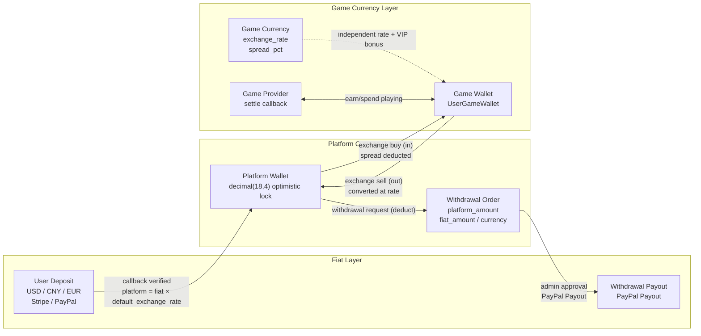

# Global Game Platform

[中文](README.md) | English

> Copyright (c) 2026 erik <erik@erik.xyz> — https://erik.xyz

A global, internationalized game aggregation platform. Users register, deposit funds, exchange for game currencies, play games to earn coins, and withdraw earnings to their wallets. The admin panel provides complete game management, withdrawal review, user management, and payment management. Supports English/Chinese language switching.

## Version Strategy

| Version | Goal | Status |
|---------|------|--------|
| Full | Complete: leaderboards, coupons, categories, country config, ES search | Complete |

## Tech Stack

### Backend
- PHP 8.3+, webman v2 (workerman/webman)
- MySQL 8.0+ (table prefix `erik_`, BIGINT non-auto-increment primary keys)
- Redis (Session / Cache / Rate Limiting)
- ClickHouse (OLAP Analytics / Probability Calculation)
- Elasticsearch (Full-text Search)
- JWT Authentication + RBAC Authorization
- Data Encryption: API transport layer AES-256-CBC + DB storage layer AES-128-ECB

### Frontend
- Flutter 3.x (Web PC style)
- HarmonyOS ArkTS (Mobile)
- Responsive layout (Phone / Tablet / Desktop)
- i18n: English / Simplified Chinese switching

### Core Components
- `erikwang2013/snowflake-php` — Globally unique BIGINT ID generation
- `erikwang2013/hashids` — API layer ID encode/decode
- `erikwang2013/jwt-webman` — JWT authentication
- `erikwang2013/encryption` — API sensitive data encryption
- `erikwang2013/encryptable` — Database field encryption
- `erikwang2013/webman-scout` — Elasticsearch sync & query
- `erikwang2013/season` — Country flags
- `erikwang2013/security-php` — Security detection tools
- `erikwang2013/poster-php` — Random verification for sensitive operations
- `erikwang2013/clickhouse-php` — ClickHouse connection & probability calculation

## Project Structure

```
game-platform-php/
├── admin/                     # Admin backend (webman v2, port 8787)
│   ├── app/admin/controller/  #   Admin controllers
│   ├── app/middleware/        #   Middleware (Cors/Security/RateLimit/Auth/Permission)
│   ├── config/                #   Configuration files
│   ├── database/migrations/   #   SQL migration files
│   └── apps/flutter/          #   Flutter Web PC admin panel
│
├── service/                   # User-facing API (webman v2, port 8788)
│   ├── app/api/v1/controller/ #   API controllers
│   ├── app/middleware/        #   Middleware (incl. LanguageMiddleware)
│   └── config/                #   Configuration files
│
├── install/                   # One-click install wizard
│   ├── index.php              #   Install entry point
│   ├── Installer.php          #   Core install logic
│   ├── install.sql            #   Merged install SQL (43 tables + seed data)
│   └── assets/                #   Static assets
│
├── admin/common/ & service/common/     # Shared services maintained per-app (DepositLogService etc., shared layer pending)
│   └── service/               #   Shared services (incl. ClickHouse probability)
│
├── apps/
│   └── flutter/platform/      # Flutter Web PC user platform
│
├── docs/                      # Documentation
│   ├── ARCHITECTURE.md        #   Architecture document
│   ├── ARCHITECTURE-DESIGN.md #   Architecture design document
│   ├── FEATURES.md            #   Features document
│   ├── FEATURE-DESIGN.md      #   Feature design document
│   └── API.md                 #   API reference
│
└── admin/docs/superpowers/    # Development specs & plans
    ├── specs/                 #   Design specifications
    └── plans/                 #   Implementation plans
```

## Quick Start

### Requirements
- PHP 8.1+
- MySQL 8.0+
- Redis 6.0+
- Composer 2.x
- Flutter SDK 3.x (frontend, optional)

### Method 1: One-Click Install Wizard (Recommended)

```bash
# 1. Start the install wizard
php -S 0.0.0.0:8888 -t install/

# 2. Open http://localhost:8888 in your browser
#    Follow the wizard: Environment Check → DB Config → Admin Account → Auto Install

# 3. Install dependencies
cd admin && composer install && cd ..
cd service && composer install && cd ..

# 4. Start services
cd admin && php start.php start -d && cd ..
cd service && php start.php start -d && cd ..

# 5. Access admin panel: http://localhost:8787
#    Log in with the admin credentials you set during installation

# 6. Remove install directory after installation (security)
rm -rf install/
```

The install wizard automatically:
- Checks environment (PHP version, extensions, directory permissions)
- Creates database and tables (merged SQL, 43 tables + seed data)
- Creates super admin account (bcrypt encrypted)
- Generates JWT/encryption keys and writes .env files
- Creates install.lock to prevent re-installation

### Method 2: Manual Installation

<details>
<summary>Expand manual installation steps</summary>

#### 1. Database Setup

```bash
# One-command import merged SQL
mysql -u root -e "CREATE DATABASE IF NOT EXISTS game_platform CHARACTER SET utf8mb4 COLLATE utf8mb4_unicode_ci;"
mysql -u root game_platform < install/install.sql
```

#### 2. Environment Configuration

```bash
# Admin backend
cd admin
cp .env.example .env
# Edit .env with your database credentials and keys

# Service API
cd ../service
cp .env.example .env
# Edit .env with your database credentials and keys
```

#### 3. Backend Start

```bash
cd admin && composer install && php start.php start -d
cd ../service && composer install && php start.php start -d
```

#### 4. Create Admin

You need to manually insert an admin user into the database (password must be bcrypt hashed).

</details>

### Frontend Start (Optional)

```bash
# Admin panel (Flutter Web PC)
cd admin/apps/flutter
flutter pub get
flutter run -d chrome

# User platform (Flutter Web PC)
cd apps/flutter/platform
flutter pub get
flutter run -d chrome
```

### Verification

```bash
# Test admin backend
curl http://localhost:8787/health

# Test user API
curl http://localhost:8788/health

# Test user registration
curl -X POST http://localhost:8788/api/auth/register \
  -H "Content-Type: application/json" \
  -d '{"username":"testuser","password":"123456"}'
```

## Security Features

- **18-layer defense-in-depth**: XSS/SQL injection/CSRF/path traversal/command injection detection
- **HTTP method whitelist**: Only GET/POST/PUT/DELETE/OPTIONS/HEAD allowed
- **JWT authentication**: access_token 2h + refresh_token 14d, concurrent session limit
- **JWT startup check**: startup refused if `JWT_SECRET_KEY` is missing or still the default value
- **Payment callback fail-closed**: provider whitelist (stripe/paypal only) + missing secret / failed verification / timestamp out of range all rejected + bccomp amount check + transactional crediting
- **RBAC authorization**: method.path granularity, Redis 60s cache
- **Click captcha**: Required for login/registration
- **Password confirmation**: Required for sensitive operations
- **Data encryption**: Transport AES-256-CBC + Storage AES-128-ECB
- **ID encryption**: Snowflake generation + Hashids encoding, non-reversible externally
- **Wallet optimistic locking**: Prevents concurrent deduction/duplicate crediting
- **Operation audit**: Full operation logging, 8-platform source detection
- **Rate limiting**: Redis sliding window, Lua atomic
- **CSP headers**: Content-Security-Policy anti-XSS
- **Account security**: 5 failed login attempts → 15-minute lockout

## Testing

```bash
cd admin
phpunit --bootstrap tests/bootstrap.php tests/
```

- PHPUnit 12.x, 116 test cases
- 56 business logic tests (PlatformTest) + 60 infrastructure tests
- Coverage: bcmath, exchange, withdraw, limits, risk, coupons, KYC, i18n

## Platform Capabilities

| Capability | Description |
|------|------|
| Auth | Username/password + Google/Facebook/Apple OAuth + 2FA TOTP |
| Wallet | Platform wallet (optimistic lock) + game wallet + transactions |
| Deposit | Order creation + Stripe/PayPal webhook verification + auto-credit |
| Exchange | Platform⇄Game currency, real-time quote, spread revenue |
| Withdraw | Apply→Review→Payout, global switch, KYC-tiered limits+fees |
| KYC | Identity verification submit+review, 3-tier system |
| Games | CRUD + categories (10) + servers + play log tracking |
| Search | Elasticsearch full-text (with LIKE fallback) |
| Leaderboard | Daily/weekly/monthly/total, Redis cache, WebSocket push (8789) |
| Coupons | Fixed/rate discount, limited time/qty, claim & usage tracking |
| Notifications | In-app + email, auto-notify for deposit/withdraw/KYC/coupons |
| Referral | Codes, signup bonus, deposit commission |
| Risk Control | IP blacklist, amount anomaly, frequency, velocity |
| i18n | 4 languages (en-US/zh-CN/ja-JP/ko-KR) with translation DB |
| Country Config | 8 countries with differentiated payment/withdraw methods |
| Stats | Daily snapshots (5 metrics) + platform revenue tracking |
| Captcha | Click-based human verification (poster-php) |
| Deployment | Docker Compose 7 services + Nginx reverse proxy |
| Clients | Flutter Admin (15 pages) + Platform (10 pages) + HarmonyOS (5 pages) |

## Business Model

```
Fiat (USD/CNY/EUR...)
  │  Deposit (Stripe/PayPal/Alipay/WeChat)
  ▼
Platform Currency (unified, precision decimal(18,4))
  │  Exchange (with rate + platform spread)
  ▼
Game Currency (per-game, independent rates)
  │  Earn/spend by playing
  ▼
Platform Currency ← Convert back → Withdraw (review/auto)
```

## Multi-Currency Settlement

The platform adopts a three-tier, currency-isolated settlement system — Fiat → Platform Currency → Game Currency: multi-fiat deposits in USD/CNY/EUR, and an independent pricing currency for each game. All amount calculations use bcmath high-precision arithmetic to eliminate floating-point errors.

### Three-Tier Currency Model

| Tier | Currency | Description |
|------|----------|-------------|
| Fiat layer | USD / CNY / EUR | Actual payment currency for deposits/withdrawals, handled by Stripe / PayPal |
| Platform layer | Platform Currency (unified) | Internal unified settlement currency (decimal(18,4)); optimistic-lock wallet prevents concurrent deductions and duplicate credits |
| Game layer | Independent currency per game | Each game has its own `exchange_rate` and `spread_pct`, with a separate game wallet |

### Settlement Paths

- **Deposit settlement**: User pays in fiat (Stripe / PayPal callback signature verification, idempotent) → converted to platform currency at `default_exchange_rate`; deposit order records `amount + currency + platform_amount`
- **Exchange settlement**: Platform ⇄ game currency via real-time quote at the game currency rate, deducting `spread_pct` as platform spread revenue; VIPs get exchange discounts and rate bonuses
- **Game settlement**: Game Provider adjusts the user's game balance via the `/api/provider/settle` callback (HMAC-SHA256 signature); game sessions auto-settle on timeout
- **Withdrawal settlement**: Platform currency deducted → withdrawal order created (recording `platform_amount / fiat_amount / currency`) → admin approval → PayPal Payout → batch status synced to completion

### Settlement Flowchart



## System Architecture


## Core Business Flow


## Feature Overview


## Lifecycle Diagram


## Security Architecture


## Supported Languages

| Code | Name | Native Name | Status |
|------|------|-------------|--------|
| en-US | English | English | Active |
| zh-CN | Chinese (Simplified) | 简体中文 | Active |
| ja-JP | Japanese | 日本語 | Active |
| ko-KR | Korean | 한국어 | Active |

Automatic language detection via `X-Language` header or `Accept-Language` header. Manual switching via `POST /api/language/switch`.

## Documentation Index

| Document | Description |
|----------|-------------|
| [Version Comparison](docs/VERSIONS_EN.md) | Lite/Standard/Full comparison |
| [Architecture Design](docs/ARCHITECTURE-DESIGN.md) | Architecture decisions and rationale |
| [Architecture](docs/ARCHITECTURE.md) | System topology, module architecture, data flow |
| [Feature Design](docs/FEATURE-DESIGN.md) | Business models, feature specs, workflow design |
| [Features](docs/FEATURES.md) | Feature catalog, module descriptions, user journeys |
| [API Reference](docs/API.md) | Complete API reference (102 endpoints) |
| [Live Docs](http://localhost:8788/apidoc/) | hg/apidoc interactive docs (Service) |
| [Live Docs](http://localhost:8787/apidoc/) | hg/apidoc interactive docs (Admin) |
| [ClickHouse Install](docs/CLICKHOUSE_INSTALL.md) | Installation, config, migration, verification |
| [ClickHouse Usage](docs/CLICKHOUSE_USAGE.md) | 4 services API reference & admin dashboard |
| [Deployment Guide](docs/DEPLOYMENT_EN.md) | Deployment guide (Docker + Manual + Nginx + Monitoring) |
| [Design Spec](admin/docs/superpowers/specs/2026-05-22-game-platform-design.md) | Full design specification |
| [Implementation Plan](admin/docs/superpowers/plans/2026-05-22-game-platform-plan.md) | Detailed implementation plan |

---

## Support

If this project helps you, consider buying the author a coffee ☕

<p align="center">
  <table align="center" border="0" cellspacing="0" cellpadding="0">
    <tr>
      <td align="center" width="200">
        <br>
        <b>WeChat Pay</b>
      </td>
      <td align="center" width="200">
        <br>
        <b>Alipay</b>
      </td>
    </tr>
  </table>
</p>
