# مخططات التصميم المعماري ومخططات منطق الأعمال
<!-- lang-nav -->

Languages: **中文** · [English](ARCHITECTURE.en.md) · [한국어](ARCHITECTURE.ko.md) · [Русский](ARCHITECTURE.ru.md) · [Deutsch](ARCHITECTURE.de.md) · [Français](ARCHITECTURE.fr.md) · [Español](ARCHITECTURE.es.md) · [Português](ARCHITECTURE.pt.md) · [हिन्दी](ARCHITECTURE.hi.md) · [العربية](ARCHITECTURE.ar.md) · [বাংলা](ARCHITECTURE.bn.md) · [Bahasa Indonesia](ARCHITECTURE.id.md) · [日本語](ARCHITECTURE.ja.md)

> Copyright (c) 2026 erik <erik@erik.xyz> — https://erik.xyz

> تُعرض مخططات Mermaid التالية تلقائيًا في GitHub / GitLab / VS Code. في البيئات الأخرى استخدم [Mermaid Live Editor](https://mermaid.live/) للمشاهدة.

---

## 1. طوبولوجيا النظام

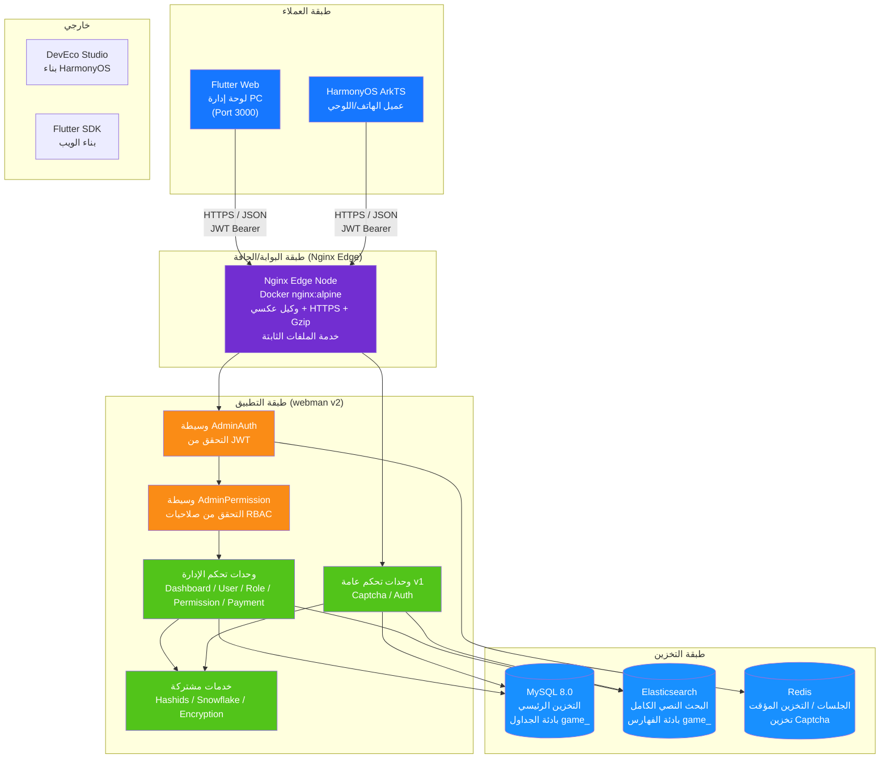

---

## 2. البنية الطبقية للواجهة الخلفية

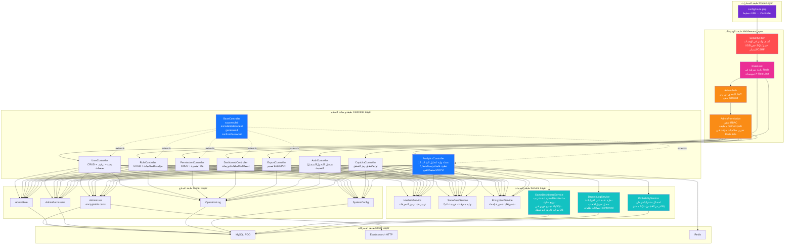

---

## 3. دورة حياة الطلب

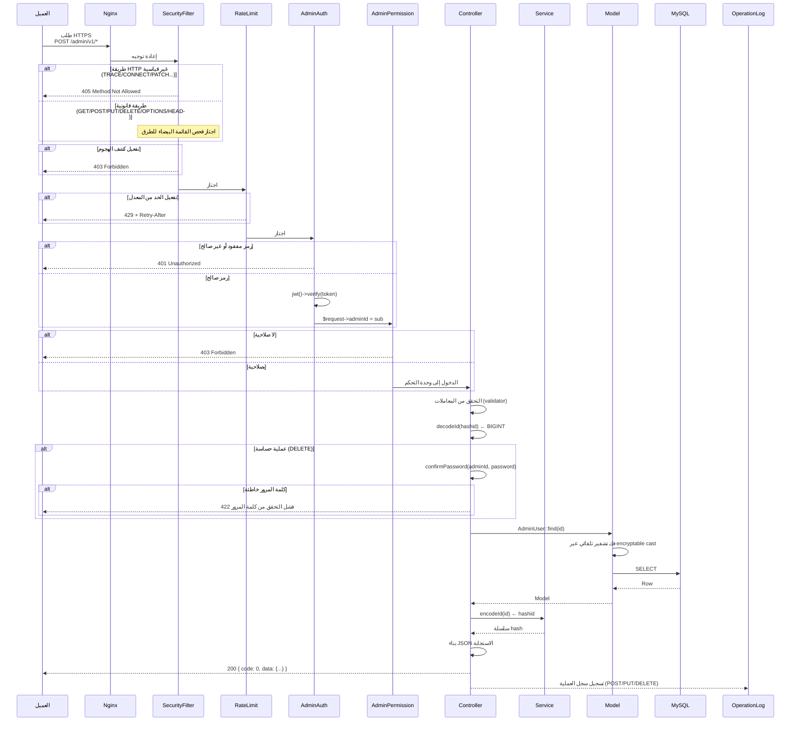

---

## 4. تدفق المصادقة ورمز التحقق

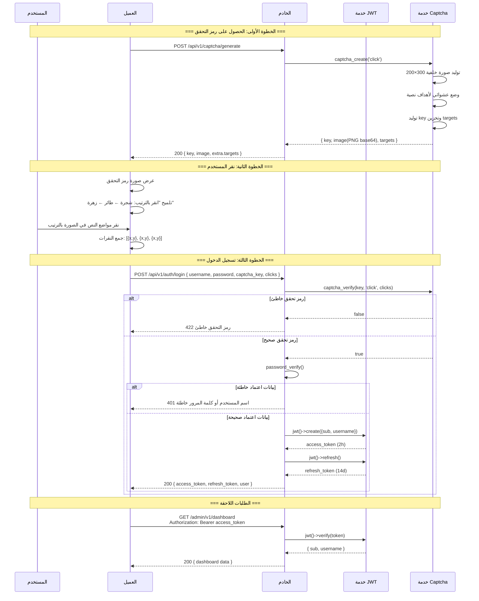

---

## 5. نموذج صلاحيات RBAC

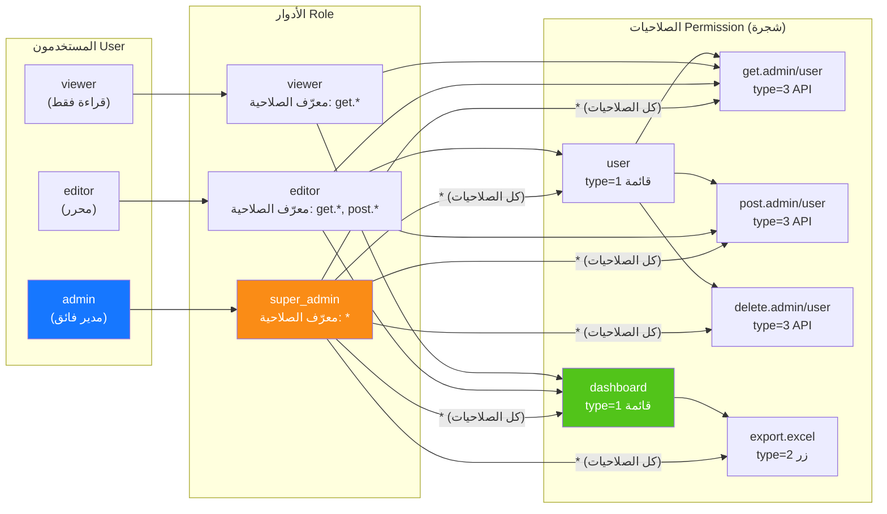

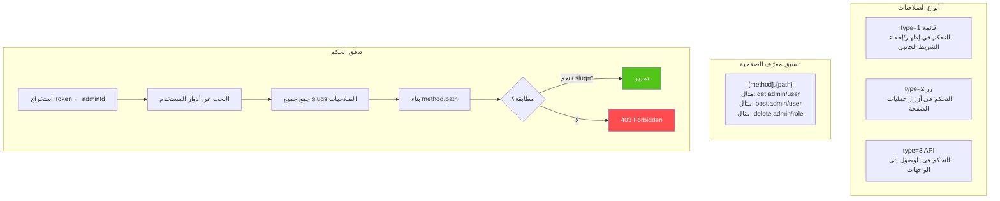

---

## 6. دورة حياة المعرف الكاملة

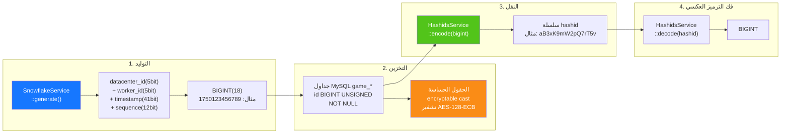

---

## 7. طبقات تشفير البيانات

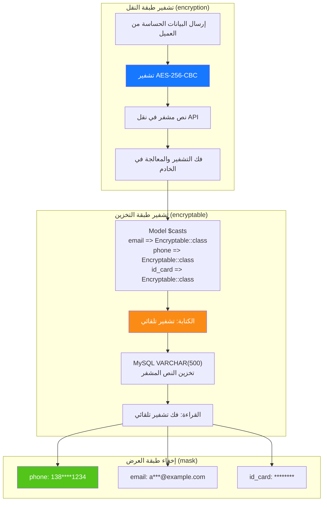

---

## 8. علاقات ER لقاعدة البيانات

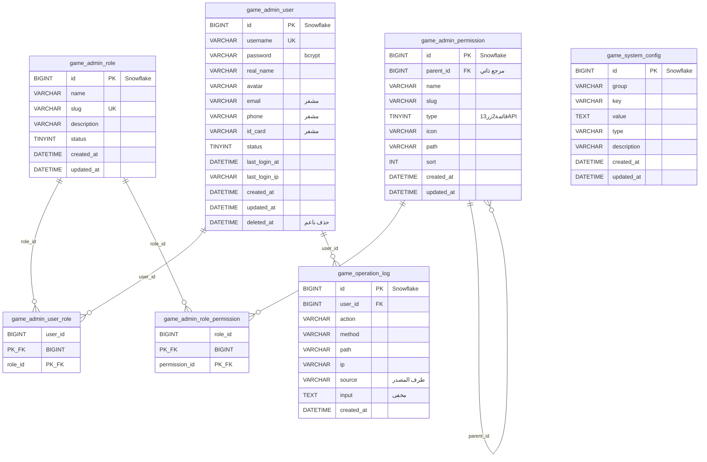

---

## 9. تدفق عملية التصدير

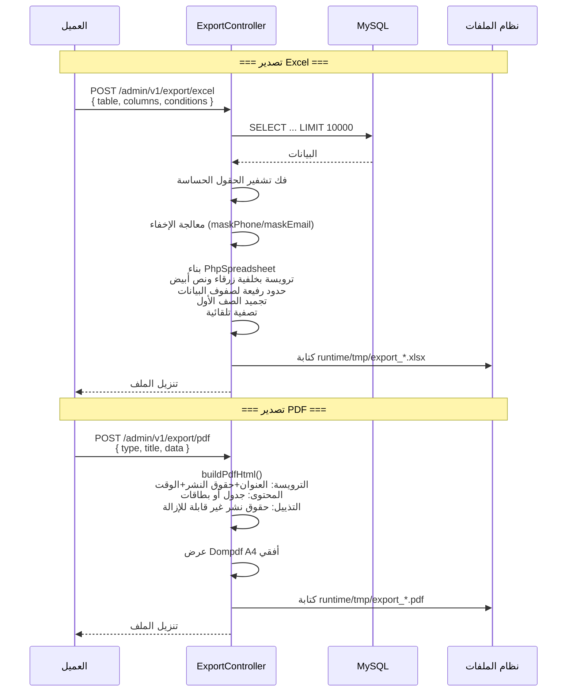

---

## 10. شجرة مكونات Flutter Web

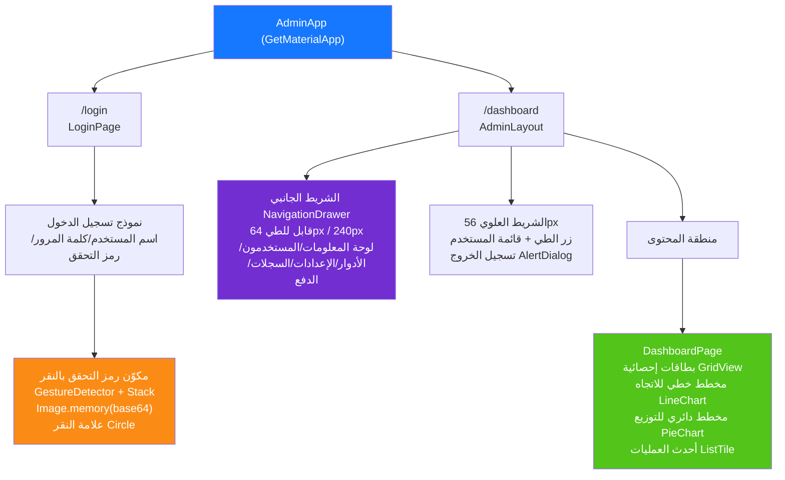

---

## 11. توجيه صفحات HarmonyOS

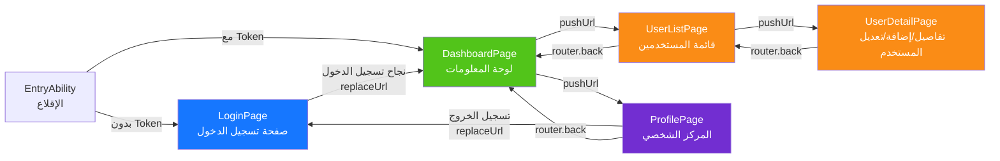

---

## 12. بانوراما الدفاع الأمني المتعمق

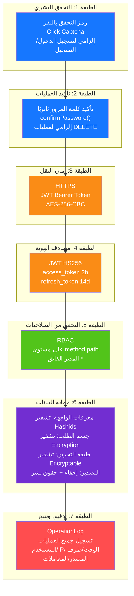

---

## 13. طوبولوجيا النشر

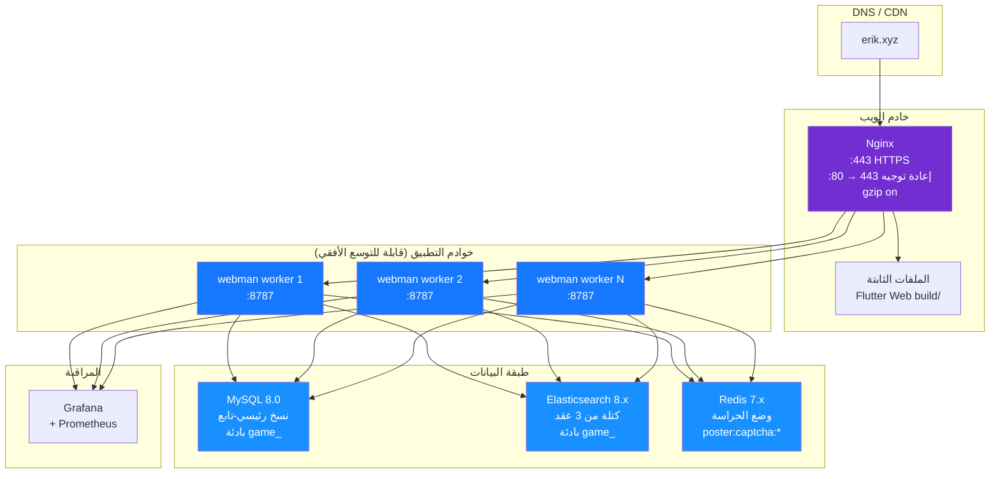
