# Architekturdiagramme und Geschäftslogik-Diagramme
<!-- lang-nav -->

Languages: [中文](ARCHITECTURE.md) · [English](ARCHITECTURE.en.md) · [한국어](ARCHITECTURE.ko.md) · [Русский](ARCHITECTURE.ru.md) · **Deutsch** · [Français](ARCHITECTURE.fr.md) · [Español](ARCHITECTURE.es.md) · [Português](ARCHITECTURE.pt.md) · [हिन्दी](ARCHITECTURE.hi.md) · [العربية](ARCHITECTURE.ar.md) · [বাংলা](ARCHITECTURE.bn.md) · [Bahasa Indonesia](ARCHITECTURE.id.md) · [日本語](ARCHITECTURE.ja.md)

> Copyright (c) 2026 erik <erik@erik.xyz> — https://erik.xyz

> Die folgenden Mermaid-Diagramme werden in GitHub / GitLab / VS Code automatisch gerendert. In anderen Umgebungen bitte den [Mermaid Live Editor](https://mermaid.live/) zum Anzeigen verwenden.

---

## 1. System-Topologie-Architektur

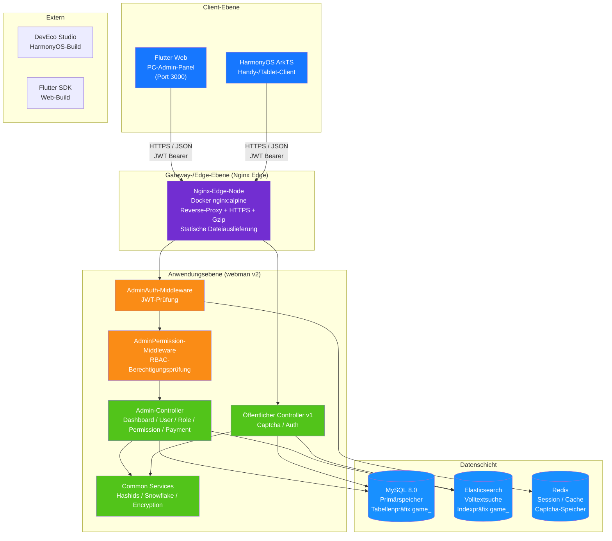

---

## 2. Backend-Schichten-Architektur

```mermaid
flowchart TD
    subgraph "Routing-Ebene"
        R1["config/route.php<br/>URL → Controller-Zuordnung"]
    end

    subgraph "Middleware-Ebene"
        M_RL["RateLimit<br/>Redis-Sliding-Window-Ratenbegrenzung<br/>X-RateLimit-Antwortheader"]
        M_SF["SecurityFilter<br/>Angriffserkennung und -blockierung<br/>XSS/SQL-Injection/Path Traversal/CSRF"]
        M1["AdminAuth<br/>JWT-Token-Prüfung<br/>injiziert adminId"]
        M2["AdminPermission<br/>RBAC-Autorisierung<br/>method.path-Abgleich<br/>Redis-Berechtigungs-Cache 60s"]
    end

    subgraph "Controller-Ebene"
        CT1["BaseController<br/>success/fail<br/>encodeId/decodeId<br/>generateId<br/>confirmPassword"]
        CT2["UserController<br/>CRUD + Suche + Paginierung"]
        CT3["RoleController<br/>CRUD + Berechtigungssynchronisierung"]
        CT4["PermissionController<br/>CRUD + Baumerstellung"]
        CT5["DashboardController<br/>Statistik/Trends/Verteilung"]
        CT6["ExportController<br/>Excel-/PDF-Export"]
        CT7["CaptchaController<br/>Captcha-Erzeugung/-Prüfung"]
        CT8["AuthController<br/>Anmeldung/Registrierung/Aktualisierung"]
        CT9["AnalyticsController<br/>12 Analyse-Endpunkte<br/>Übersicht/Rankings/Wahrscheinlichkeit/Retention/Funnel/ARPU"]
    end

    subgraph "Service-Ebene"
        S1["HashidsService<br/>ID-Kodierung/-Dekodierung"]
        S2["SnowflakeService<br/>Globale eindeutige ID-Generierung"]
        S3["EncryptionService<br/>Ver-/Entschlüsselung + Maskierung"]
        S4["GameDashboardService<br/>Übersicht/Rankings/DAU/stündlich/Verhaltensverteilung<br/>MySQL-Echtzeitaggregation; bei DB-Ausfall leere Daten"]
        S5["DepositLogService<br/>Umsatzübersicht/Spielkonversionsrate<br/>Statistik bestätigter Aufträge"]
        S6["ProbabilityService<br/>Gemeinsame/bedingte Wahrscheinlichkeit<br/>SQL-Builder (Escaping/Quoting/IN)"]
    end

    subgraph "Model-Ebene"
        MD1["AdminUser<br/>encryptable casts"]
        MD2["AdminRole"]
        MD3["AdminPermission"]
        MD4["OperationLog"]
        MD5["SystemConfig"]
    end

    subgraph "Treiber-Ebene"
        D1["MySQL PDO"]
        D2["Elasticsearch HTTP"]
        D3["Redis"]
    end

    R1 --> M_SF --> M_RL --> M1
    M1 --> M2
    M2 --> CT2 & CT3 & CT4 & CT5 & CT6 & CT9
    M_RL --> CT7 & CT8
    CT1 -.->|extends| CT2 & CT3 & CT4 & CT5 & CT6 & CT9
    CT2 & CT3 & CT4 & CT5 & CT6 & CT7 & CT8 & CT9 --> S1 & S2 & S3
    CT9 --> S4 & S5 & S6
    CT2 & CT3 & CT4 & CT5 & CT6 & CT7 & CT8 & CT9 --> MD1 & MD2 & MD3 & MD4 & MD5
    MD1 & MD2 & MD3 & MD4 & MD5 --> D1
    S4 & S5 & S6 --> D1
    MD1 --> D2
    CT7 --> D3

    style R1 fill:#722ED1,color:#fff
    style M_SF fill:#FF4D4F,color:#fff
    style M_RL fill:#EB2F96,color:#fff
    style M1 fill:#FA8C16,color:#fff
    style M2 fill:#FA8C16,color:#fff
    style CT1 fill:#1677FF,color:#fff
    style CT9 fill:#1677FF,color:#fff
    style S4 fill:#13C2C2,color:#fff
    style S5 fill:#13C2C2,color:#fff
    style S6 fill:#13C2C2,color:#fff
```

---

## 3. Anfrage-Lebenszyklus

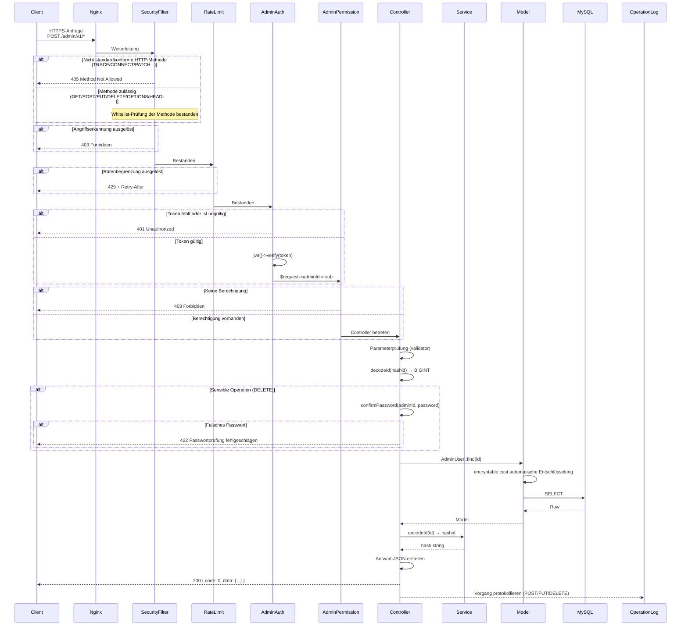

---

## 4. Authentifizierungs- und CAPTCHA-Ablauf

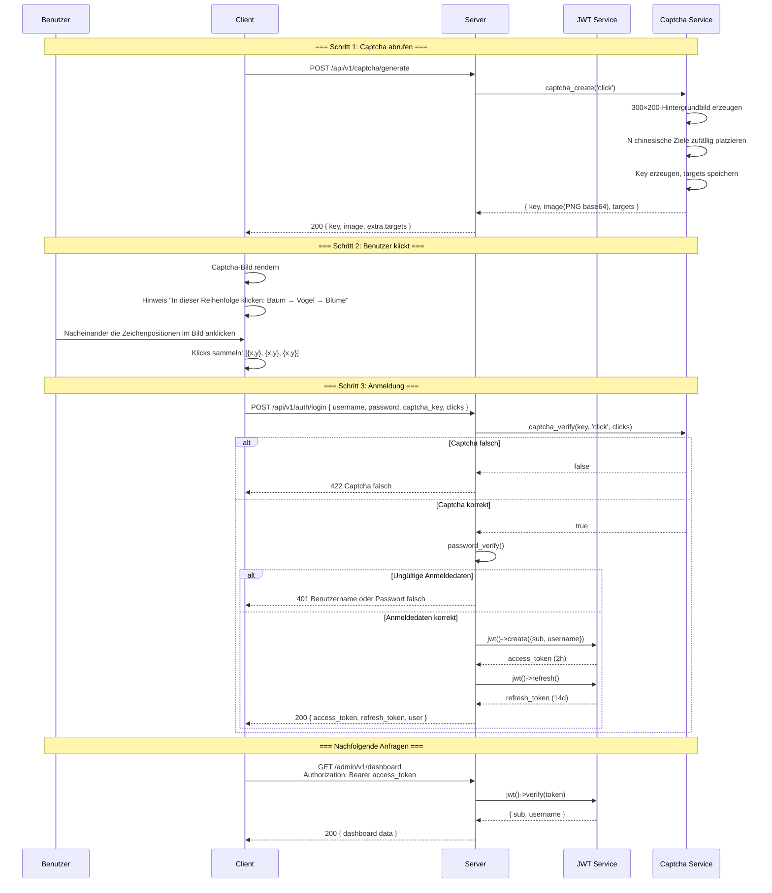

---

## 5. RBAC-Berechtigungsmodell

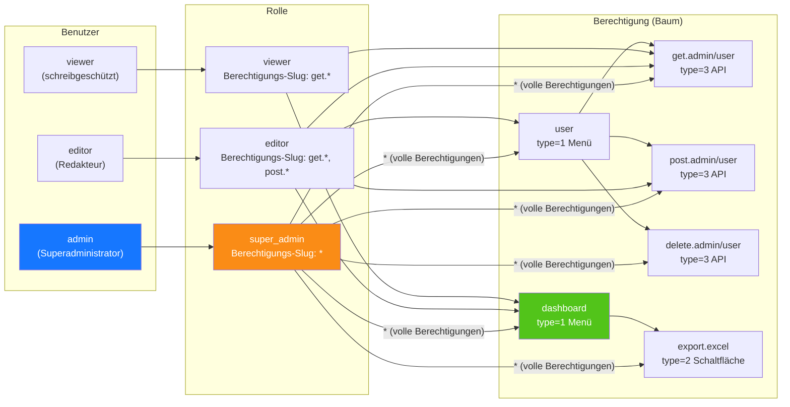

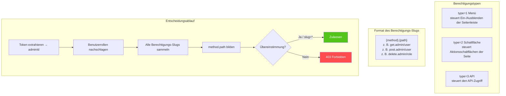

---

## 6. Vollständiger ID-Lebenszyklus

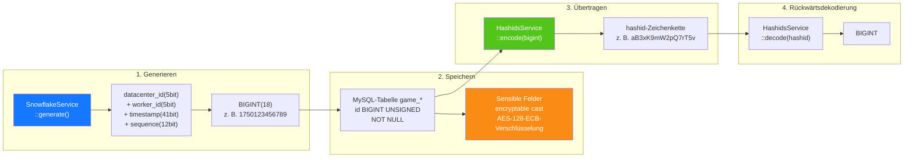

---

## 7. Datenverschlüsselungs-Schichten

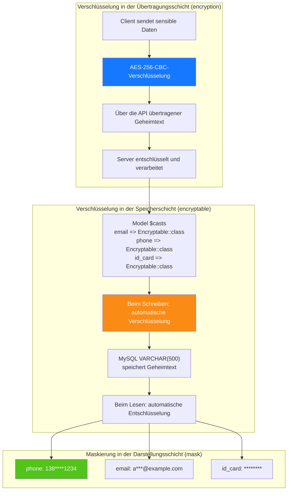

---

## 8. Datenbank-ER-Beziehungen

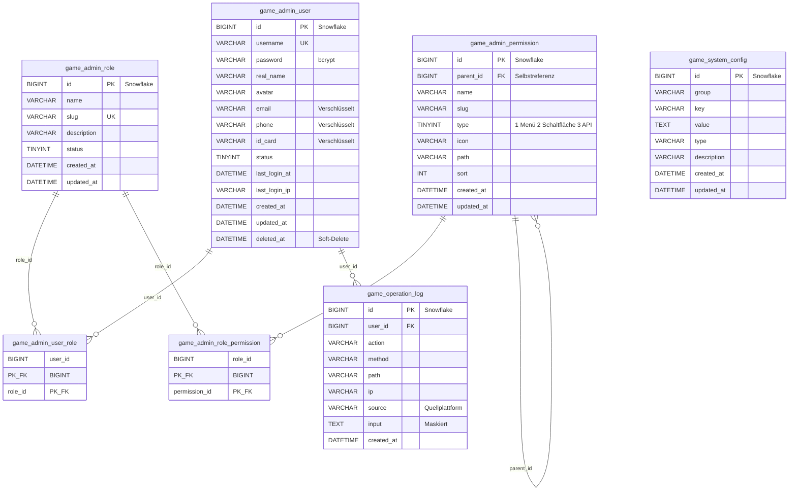

---

## 9. Export-Geschäftsablauf

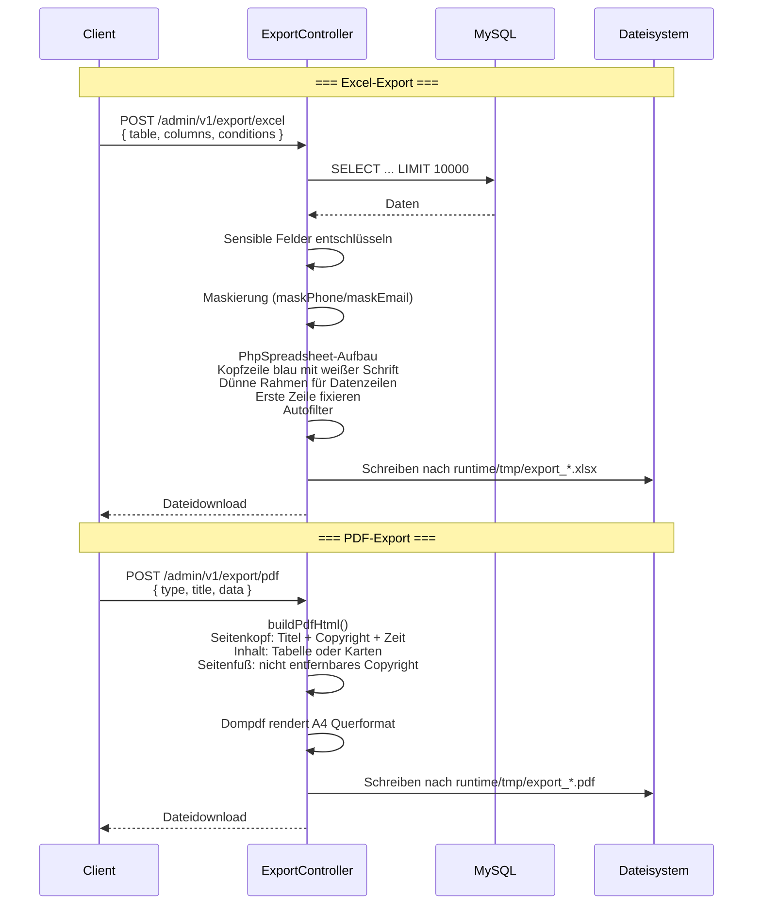

---

## 10. Flutter-Web-Komponentenbaum

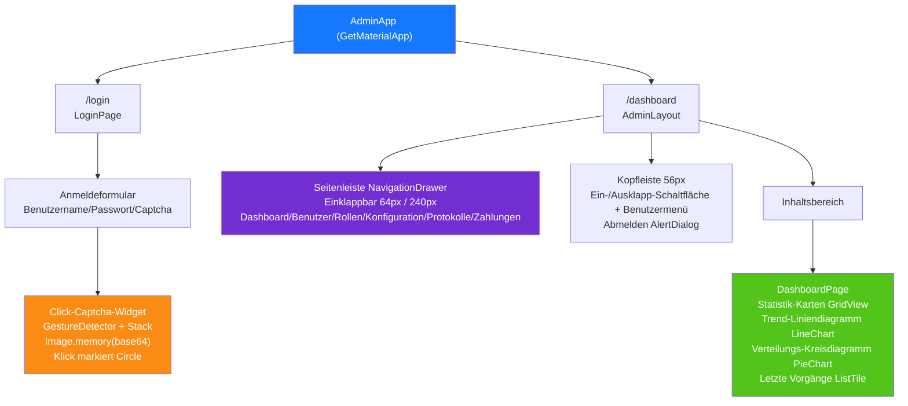

---

## 11. HarmonyOS-Seitenrouting

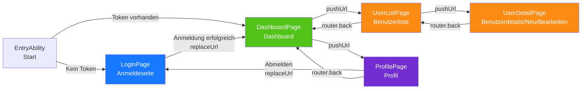

---

## 12. Übersicht Verteidigung in der Tiefe

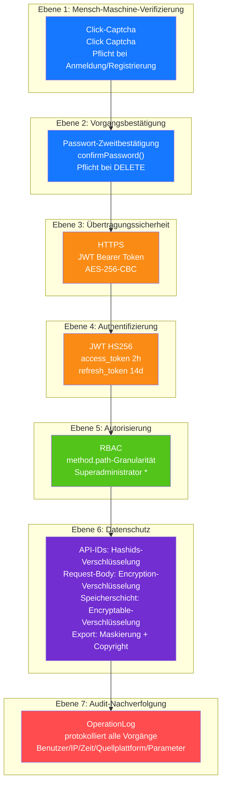

---

## 13. Bereitstellungs-Topologie

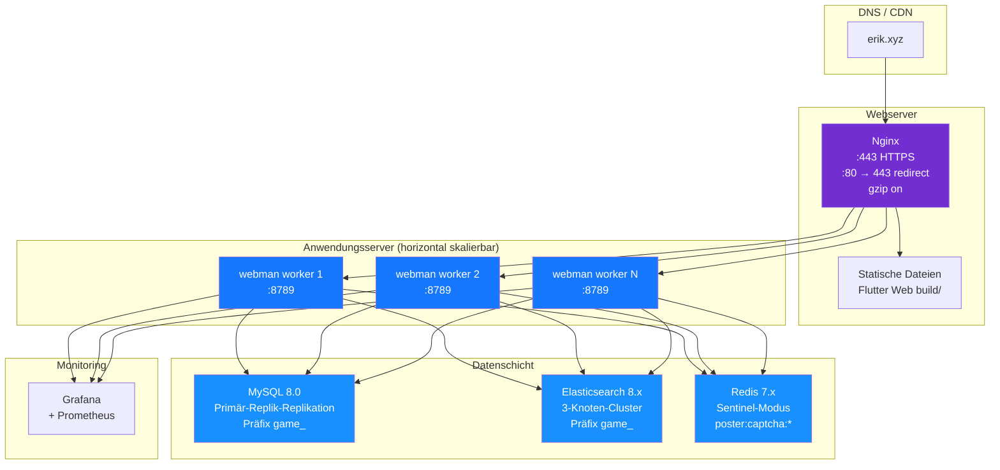
