# Architecture Diagrams and Business Logic Diagrams
<!-- lang-nav -->

Languages: [中文](ARCHITECTURE.md) · **English** · [한국어](ARCHITECTURE.ko.md) · [Русский](ARCHITECTURE.ru.md) · [Deutsch](ARCHITECTURE.de.md) · [Français](ARCHITECTURE.fr.md) · [Español](ARCHITECTURE.es.md) · [Português](ARCHITECTURE.pt.md) · [हिन्दी](ARCHITECTURE.hi.md) · [العربية](ARCHITECTURE.ar.md) · [বাংলা](ARCHITECTURE.bn.md) · [Bahasa Indonesia](ARCHITECTURE.id.md) · [日本語](ARCHITECTURE.ja.md)

> Copyright (c) 2026 erik <erik@erik.xyz> — https://erik.xyz

> The Mermaid diagrams below render automatically in GitHub / GitLab / VS Code. For other environments, use the [Mermaid Live Editor](https://mermaid.live/).

---

## 1. System Topology Architecture

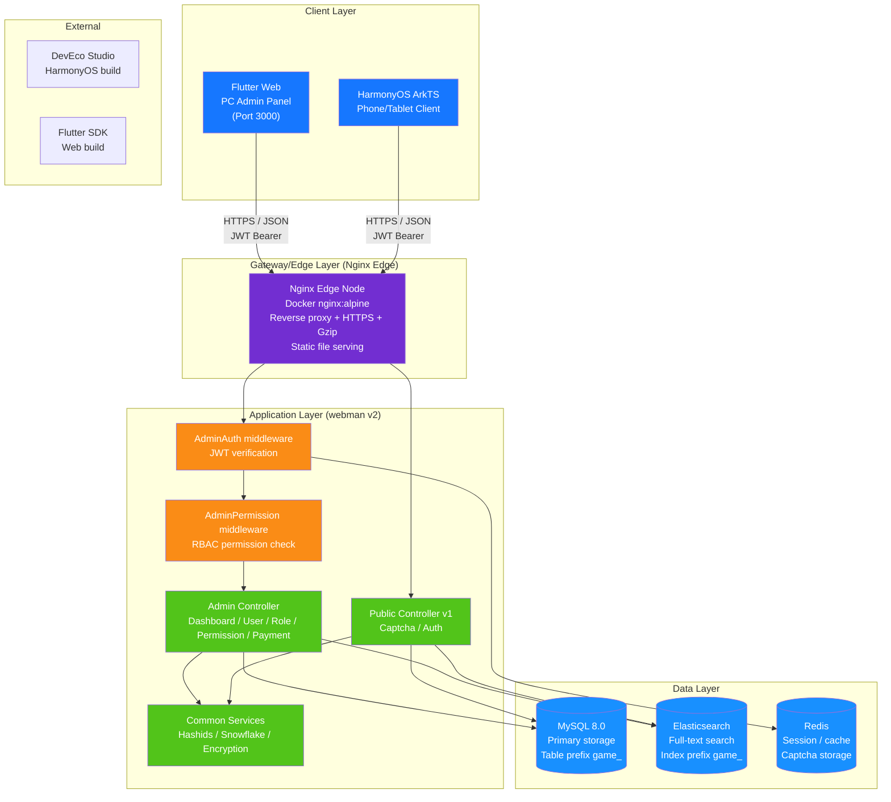

---

## 2. Backend Layered Architecture

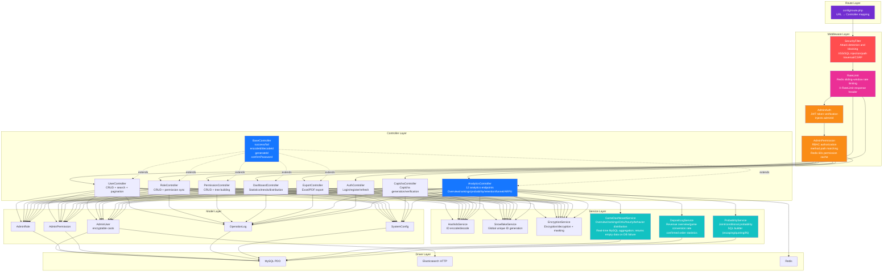

---

## 3. Request Lifecycle

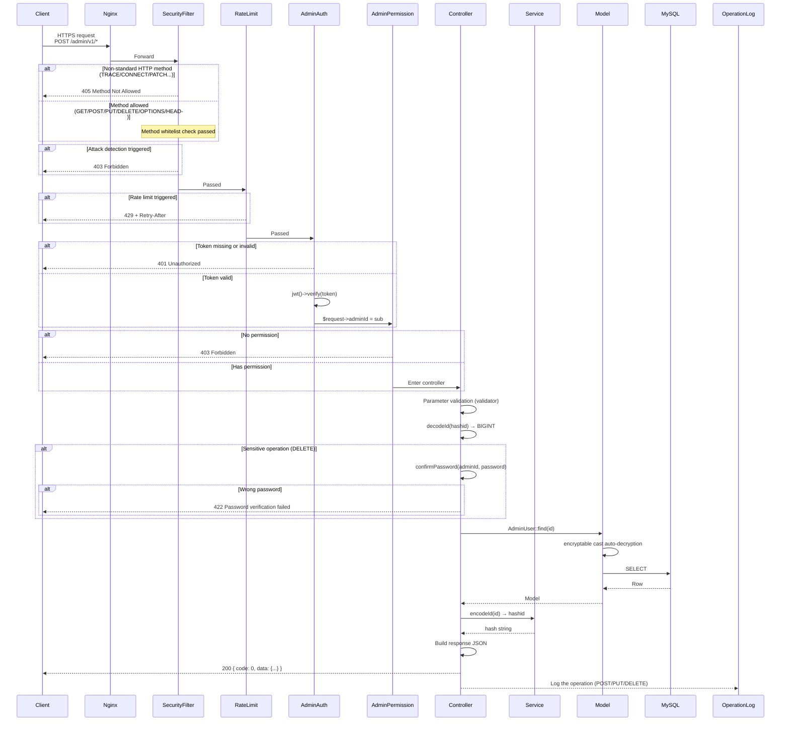

---

## 4. Authentication and Captcha Flow

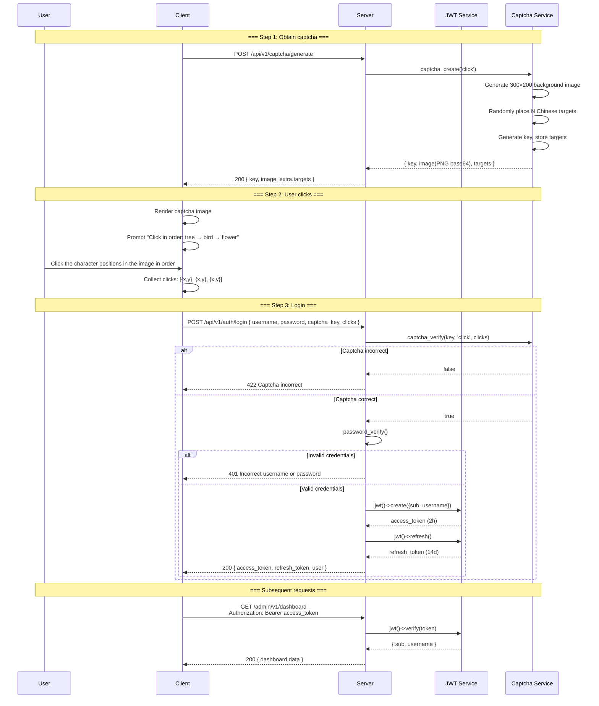

---

## 5. RBAC Permission Model

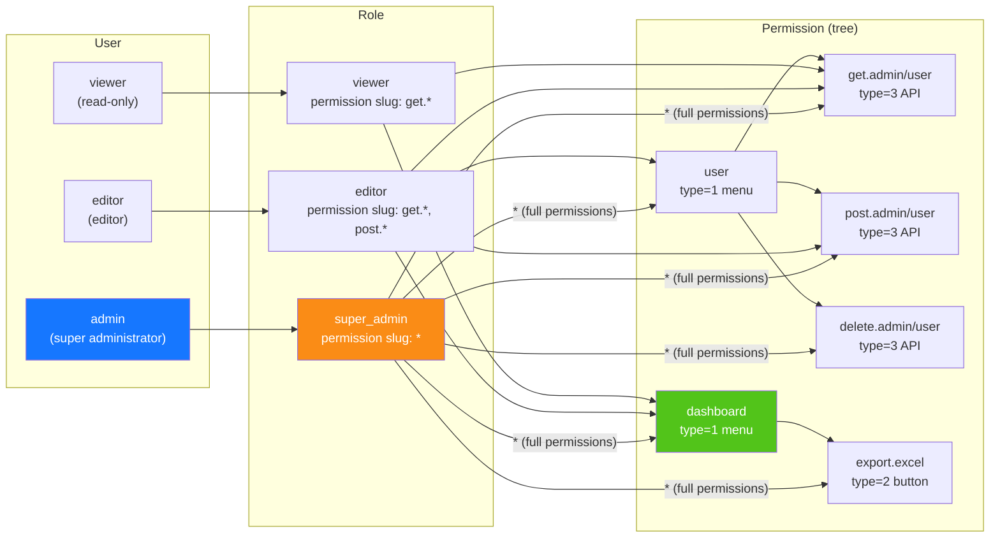

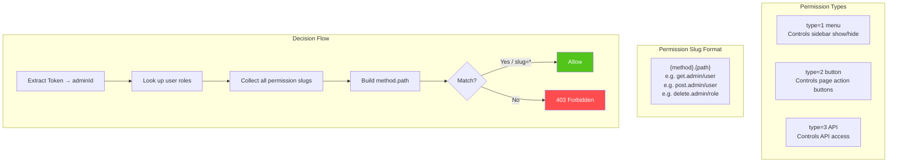

---

## 6. ID Full Lifecycle

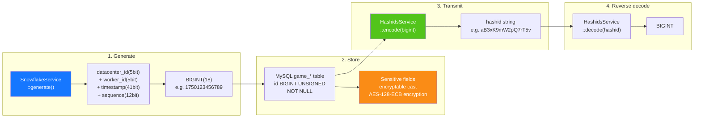

---

## 7. Data Encryption Layers

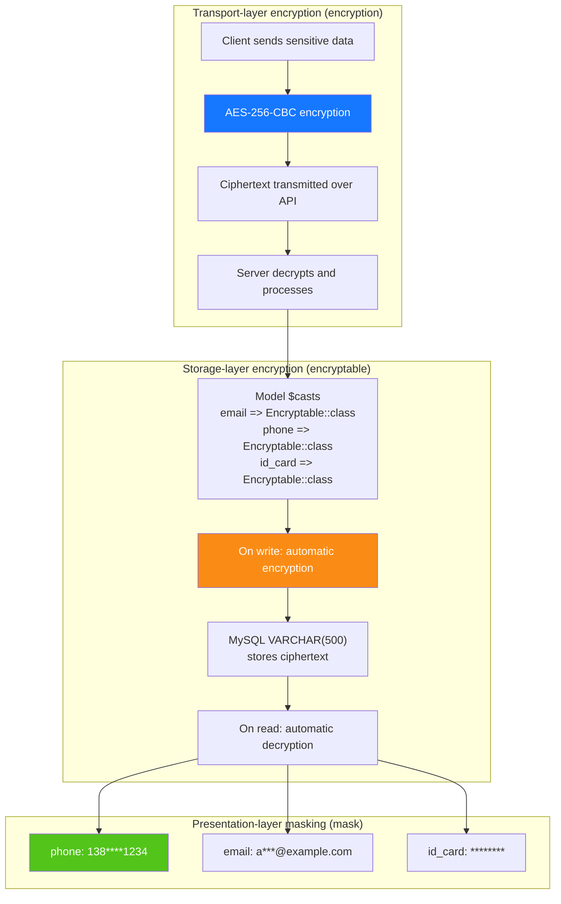

---

## 8. Database ER Relationships

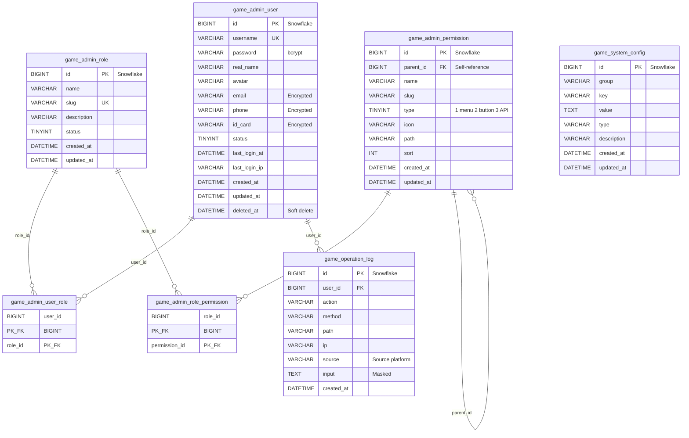

---

## 9. Export Business Flow

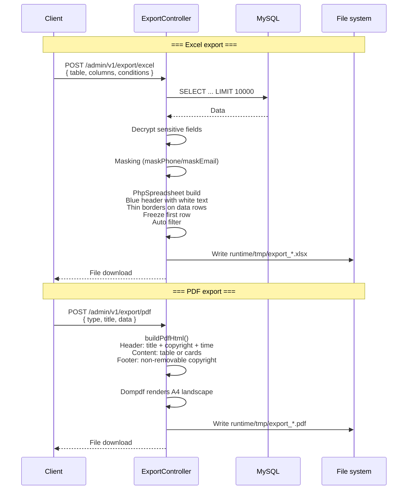

---

## 10. Flutter Web Component Tree

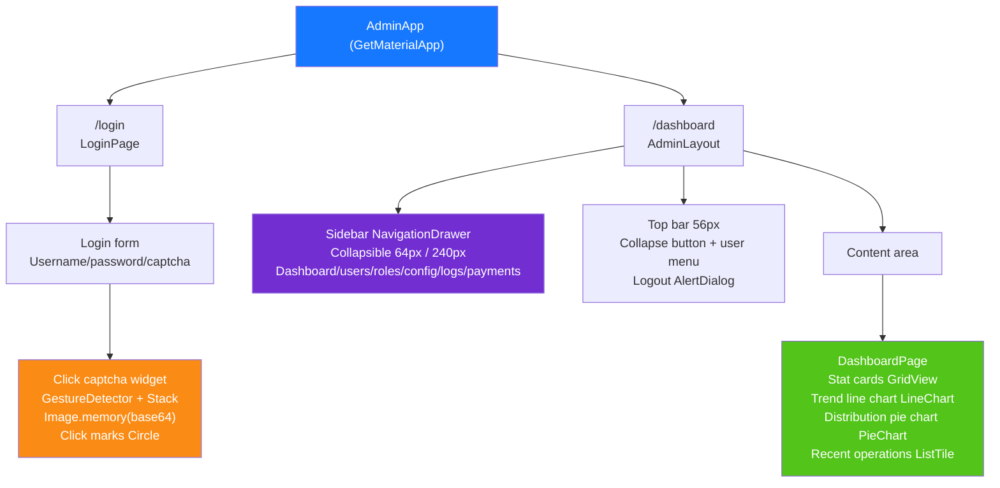

---

## 11. HarmonyOS Page Routing

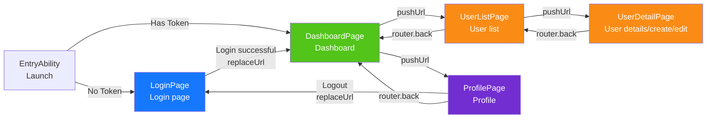

---

## 12. Security Defense-in-Depth Overview

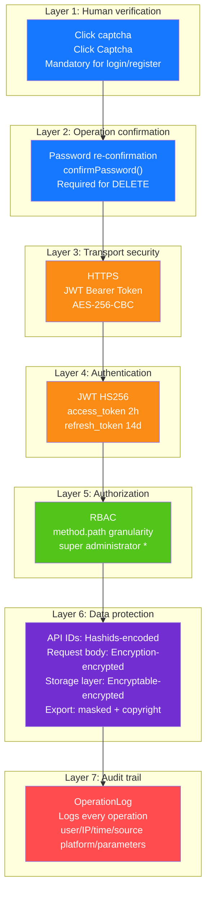

---

## 13. Deployment Topology

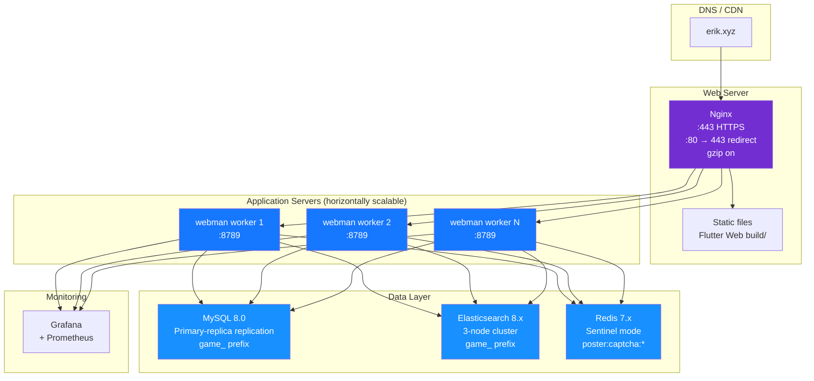
