# Diagramas de arquitectura y de lógica de negocio
<!-- lang-nav -->

Languages: [中文](ARCHITECTURE.md) · [English](ARCHITECTURE.en.md) · [한국어](ARCHITECTURE.ko.md) · [Русский](ARCHITECTURE.ru.md) · [Deutsch](ARCHITECTURE.de.md) · [Français](ARCHITECTURE.fr.md) · **Español** · [Português](ARCHITECTURE.pt.md) · [हिन्दी](ARCHITECTURE.hi.md) · [العربية](ARCHITECTURE.ar.md) · [বাংলা](ARCHITECTURE.bn.md) · [Bahasa Indonesia](ARCHITECTURE.id.md) · [日本語](ARCHITECTURE.ja.md)

> Copyright (c) 2026 erik <erik@erik.xyz> — https://erik.xyz

> Los siguientes diagramas Mermaid se renderizan automáticamente en GitHub / GitLab / VS Code. En otros entornos, usa el [Mermaid Live Editor](https://mermaid.live/).

---

## 1. Topología del sistema

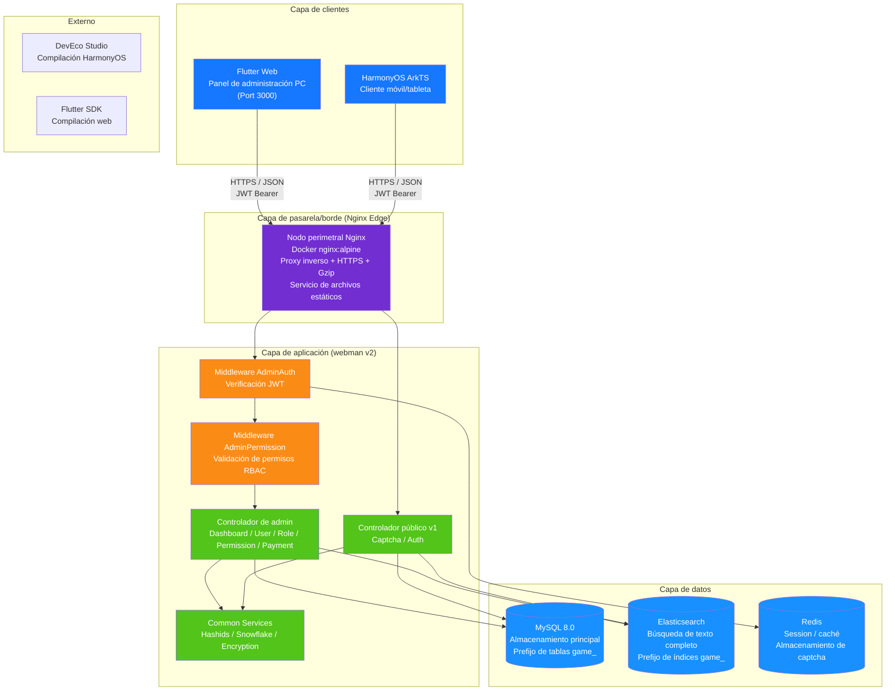

---

## 2. Arquitectura de capas del backend

```mermaid
flowchart TD
    subgraph "Capa de enrutamiento"
        R1["config/route.php<br/>Mapeo URL → Controller"]
    end

    subgraph "Capa de middleware"
        M_RL["RateLimit<br/>Límite de frecuencia por ventana deslizante en Redis<br/>Cabecera de respuesta X-RateLimit"]
        M_SF["SecurityFilter<br/>Detección e intercepción de ataques<br/>XSS/inyección SQL/path traversal/CSRF"]
        M1["AdminAuth<br/>Verificación del token JWT<br/>Inyecta adminId"]
        M2["AdminPermission<br/>Autorización RBAC<br/>Coincidencia de method.path<br/>Caché de permisos en Redis 60s"]
    end

    subgraph "Capa de controladores"
        CT1["BaseController<br/>success/fail<br/>encodeId/decodeId<br/>generateId<br/>confirmPassword"]
        CT2["UserController<br/>CRUD + búsqueda + paginación"]
        CT3["RoleController<br/>CRUD + sincronización de permisos"]
        CT4["PermissionController<br/>CRUD + construcción del árbol"]
        CT5["DashboardController<br/>Estadísticas/tendencias/distribución"]
        CT6["ExportController<br/>Exportación a Excel/PDF"]
        CT7["CaptchaController<br/>Generación/validación de captcha"]
        CT8["AuthController<br/>Inicio de sesión/registro/refresco"]
        CT9["AnalyticsController<br/>12 endpoints de análisis<br/>Resumen/clasificaciones/probabilidad/retención/embudo/ARPU"]
    end

    subgraph "Capa de servicios"
        S1["HashidsService<br/>Codificación/decodificación de ID"]
        S2["SnowflakeService<br/>Generación global de ID único"]
        S3["EncryptionService<br/>Cifrado/descifrado + enmascaramiento"]
        S4["GameDashboardService<br/>Resumen/clasificaciones/DAU/por hora/distribución de comportamiento<br/>Agregación en tiempo real en MySQL; datos vacíos si falla la BD"]
        S5["DepositLogService<br/>Resumen de ingresos/tasa de conversión de juego<br/>Estadísticas de órdenes confirmed"]
        S6["ProbabilityService<br/>Probabilidad conjunta/condicional<br/>Constructor SQL (escape/quoting/IN)"]
    end

    subgraph "Capa de modelos"
        MD1["AdminUser<br/>encryptable casts"]
        MD2["AdminRole"]
        MD3["AdminPermission"]
        MD4["OperationLog"]
        MD5["SystemConfig"]
    end

    subgraph "Capa de drivers"
        D1["MySQL PDO"]
        D2["Elasticsearch HTTP"]
        D3["Redis"]
    end

    R1 --> M_SF --> M_RL --> M1
    M1 --> M2
    M2 --> CT2 & CT3 & CT4 & CT5 & CT6 & CT9
    M_RL --> CT7 & CT8
    CT1 -.->|extends| CT2 & CT3 & CT4 & CT5 & CT6 & CT9
    CT2 & CT3 & CT4 & CT5 & CT6 & CT7 & CT8 & CT9 --> S1 & S2 & S3
    CT9 --> S4 & S5 & S6
    CT2 & CT3 & CT4 & CT5 & CT6 & CT7 & CT8 & CT9 --> MD1 & MD2 & MD3 & MD4 & MD5
    MD1 & MD2 & MD3 & MD4 & MD5 --> D1
    S4 & S5 & S6 --> D1
    MD1 --> D2
    CT7 --> D3

    style R1 fill:#722ED1,color:#fff
    style M_SF fill:#FF4D4F,color:#fff
    style M_RL fill:#EB2F96,color:#fff
    style M1 fill:#FA8C16,color:#fff
    style M2 fill:#FA8C16,color:#fff
    style CT1 fill:#1677FF,color:#fff
    style CT9 fill:#1677FF,color:#fff
    style S4 fill:#13C2C2,color:#fff
    style S5 fill:#13C2C2,color:#fff
    style S6 fill:#13C2C2,color:#fff
```

---

## 3. Ciclo de vida de las solicitudes

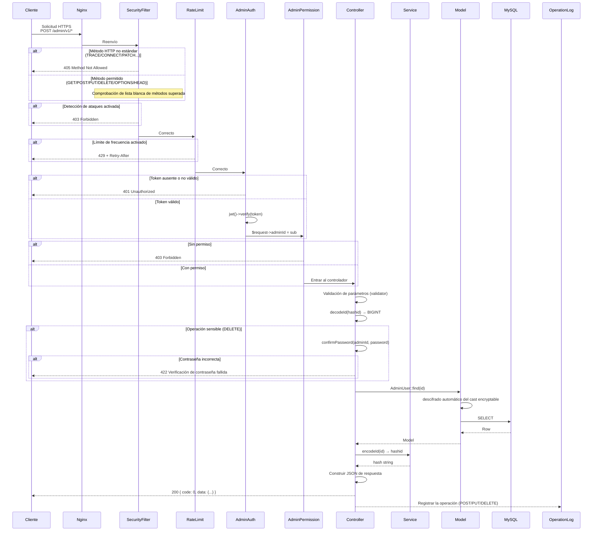

---

## 4. Flujo de autenticación y captcha

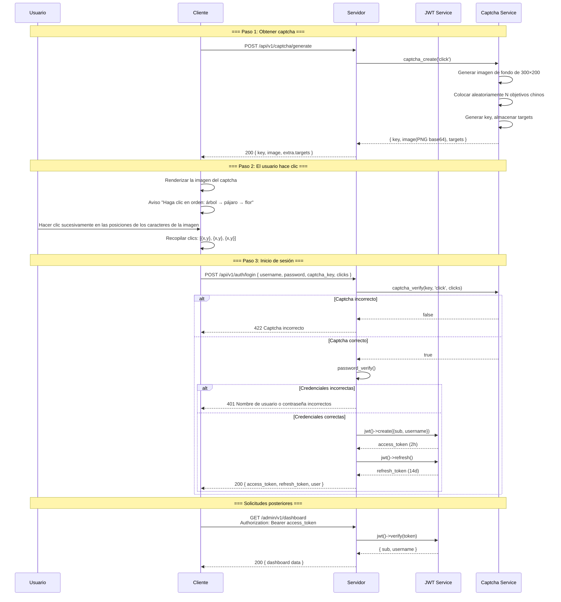

---

## 5. Modelo de permisos RBAC

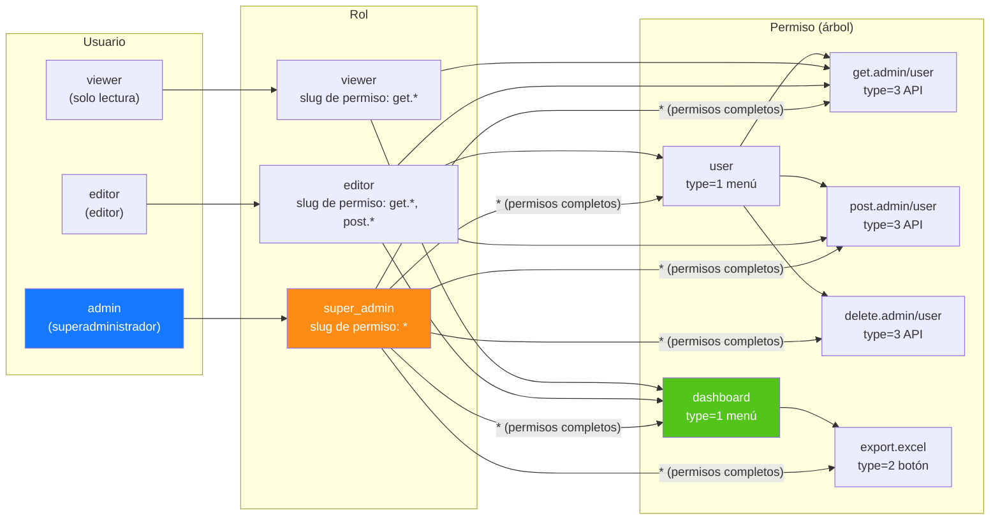

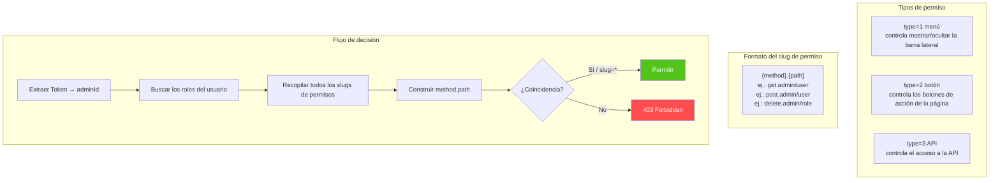

---

## 6. Ciclo de vida completo de los ID

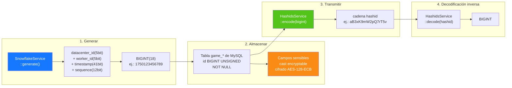

---

## 7. Capas de cifrado de datos

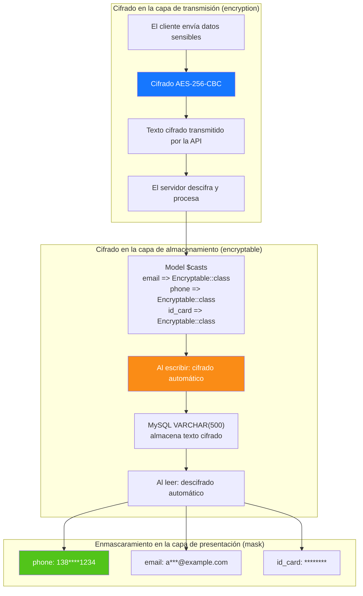

---

## 8. Relaciones ER de la base de datos

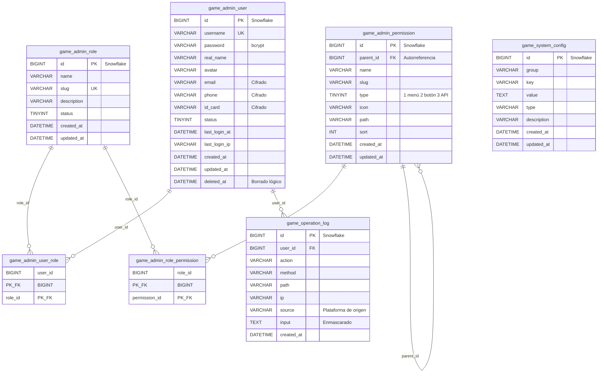

---

## 9. Flujo de negocio de exportación

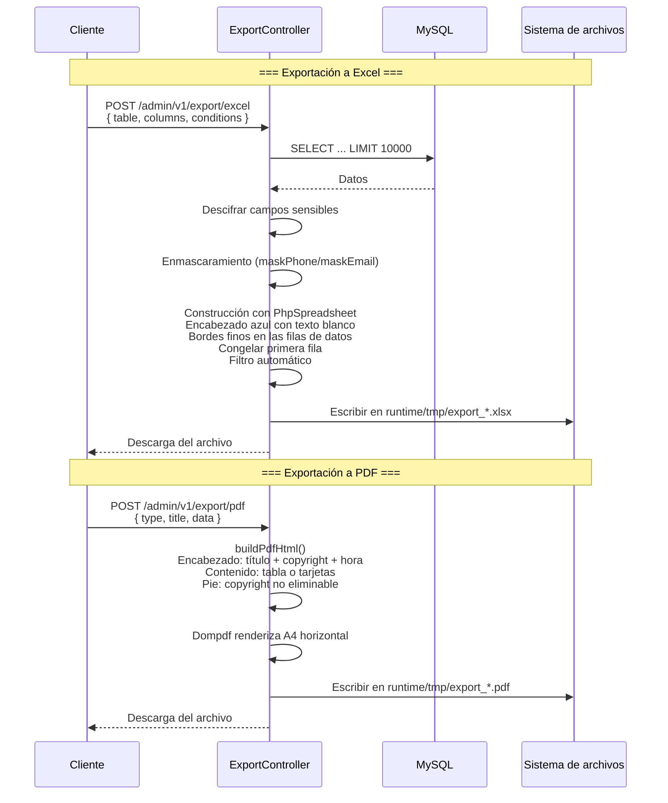

---

## 10. Árbol de componentes Flutter Web

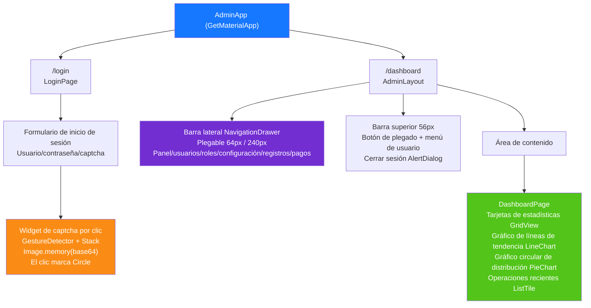

---

## 11. Rutas de páginas de HarmonyOS

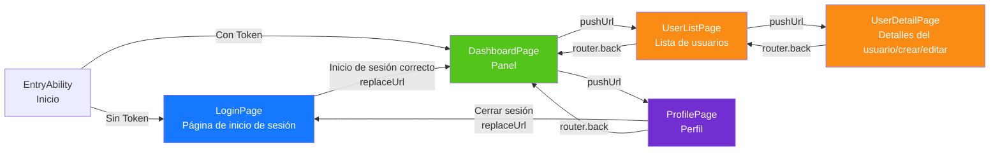

---

## 12. Panorama de defensa en profundidad de seguridad

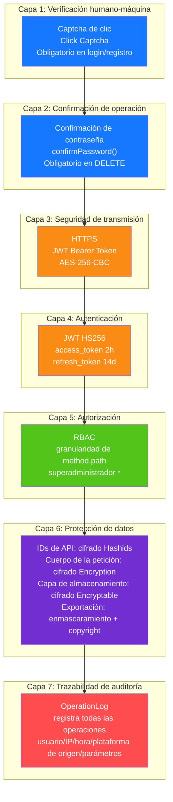

---

## 13. Topología de despliegue

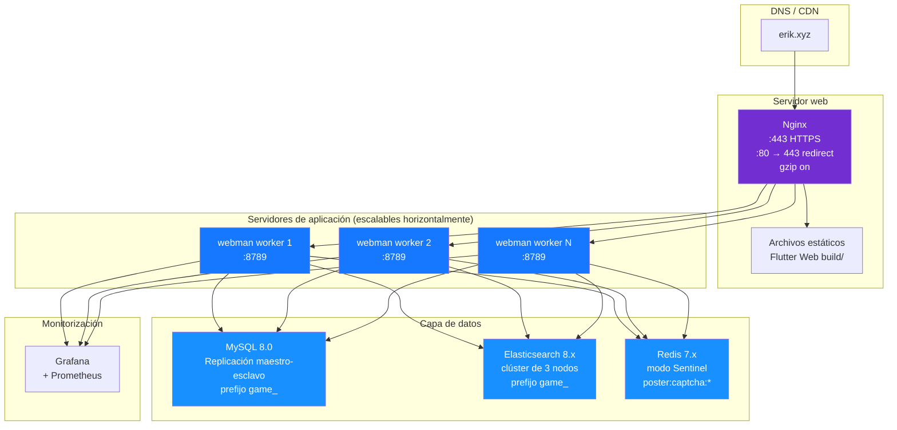
