# आर्किटेक्चर आरेख और बिज़नेस लॉजिक आरेख
<!-- lang-nav -->

Languages: [中文](ARCHITECTURE.md) · [English](ARCHITECTURE.en.md) · [한국어](ARCHITECTURE.ko.md) · [Русский](ARCHITECTURE.ru.md) · [Deutsch](ARCHITECTURE.de.md) · [Français](ARCHITECTURE.fr.md) · [Español](ARCHITECTURE.es.md) · [Português](ARCHITECTURE.pt.md) · **हिन्दी** · [العربية](ARCHITECTURE.ar.md) · [বাংলা](ARCHITECTURE.bn.md) · [Bahasa Indonesia](ARCHITECTURE.id.md) · [日本語](ARCHITECTURE.ja.md)

> Copyright (c) 2026 erik <erik@erik.xyz> — https://erik.xyz

> नीचे दिए गए Mermaid चार्ट GitHub / GitLab / VS Code में स्वचालित रूप से रेंडर होते हैं। अन्य वातावरणों के लिए [Mermaid Live Editor](https://mermaid.live/) देखें।

---

## 1. सिस्टम टोपोलॉजी आर्किटेक्चर

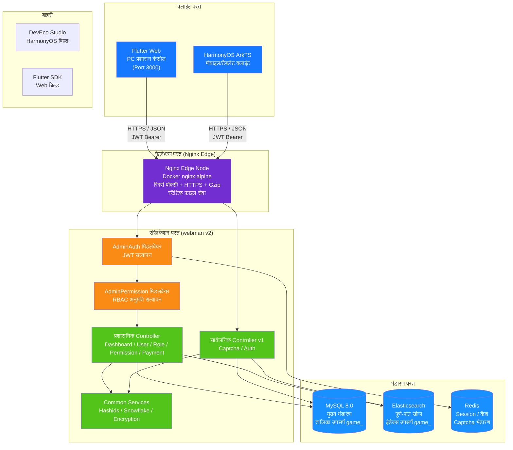

---

## 2. बैकएंड लेयर्ड आर्किटेक्चर

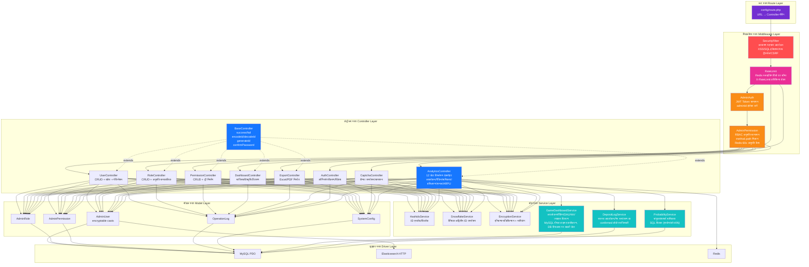

---

## 3. अनुरोध जीवनचक्र

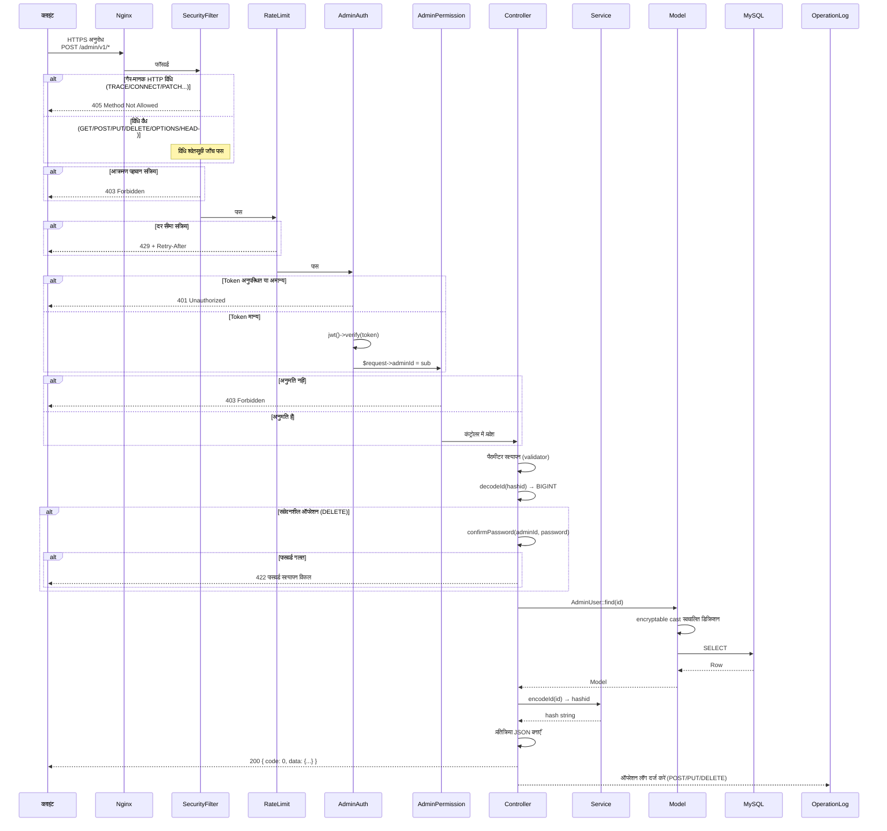

---

## 4. प्रमाणीकरण और कैप्चा प्रवाह

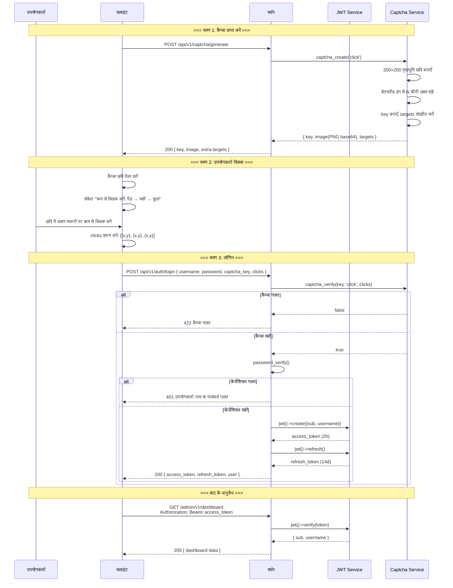

---

## 5. RBAC अनुमति मॉडल

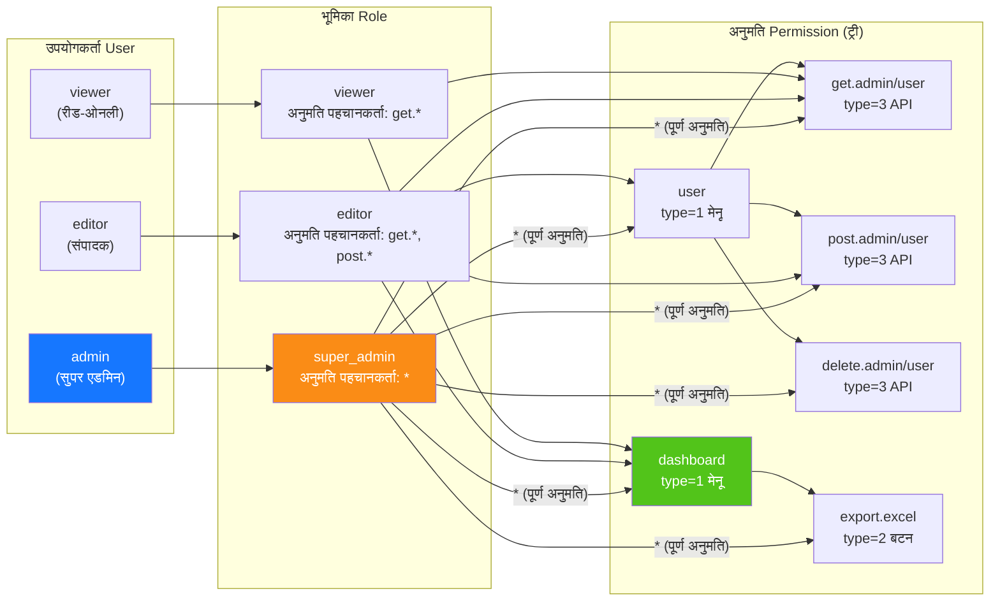

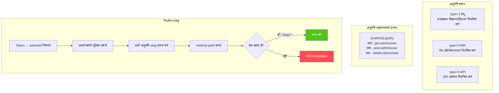

---

## 6. ID पूर्ण जीवनचक्र

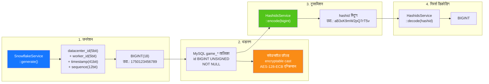

---

## 7. डेटा एन्क्रिप्शन परतें

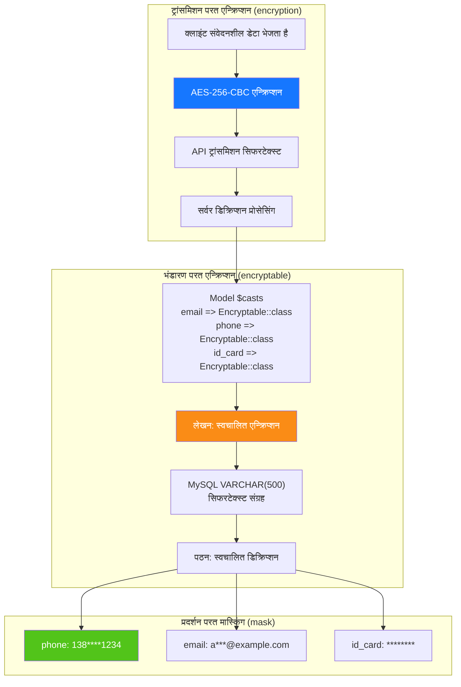

---

## 8. डेटाबेस ER संबंध

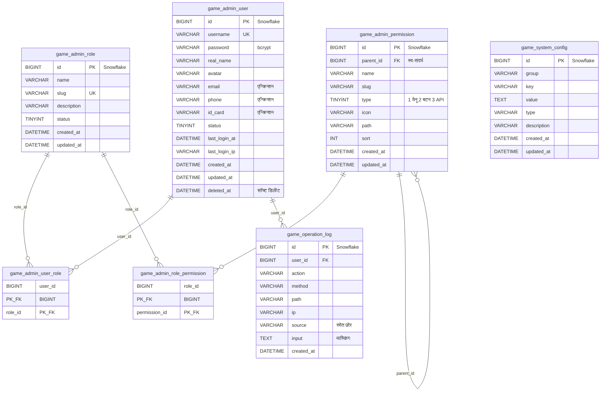

---

## 9. निर्यात व्यावसायिक प्रवाह

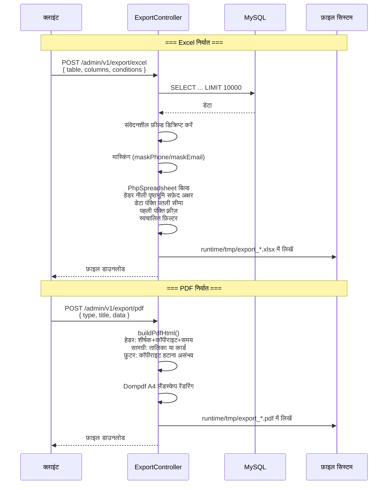

---

## 10. Flutter Web कंपोनेंट ट्री

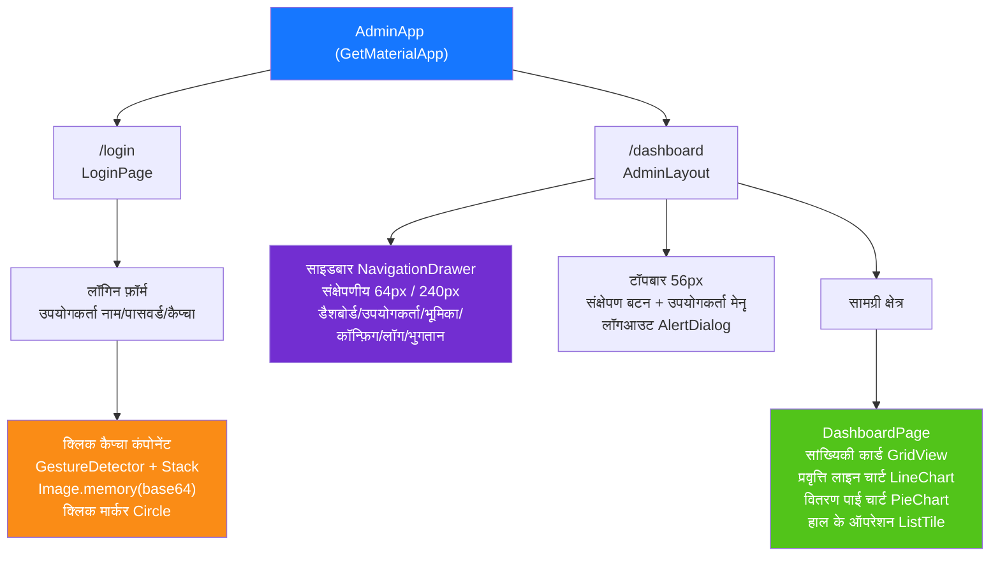

---

## 11. HarmonyOS पेज रूटिंग

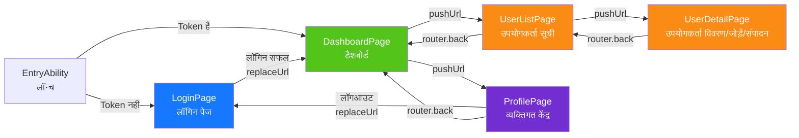

---

## 12. सुरक्षा गहराई-रक्षा परिदृश्य

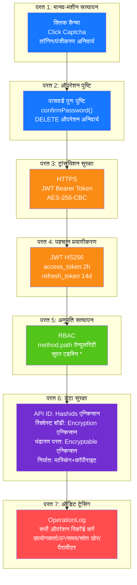

---

## 13. डिप्लॉयमेंट टोपोलॉजी

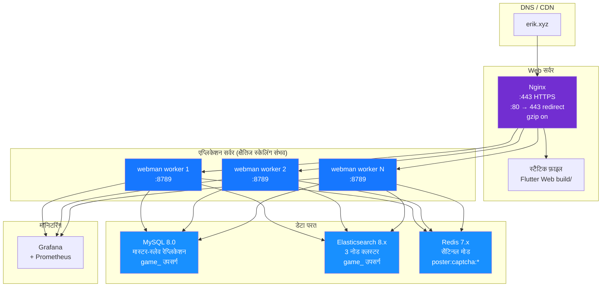
