# Diagram Arsitektur & Diagram Logika Bisnis
<!-- lang-nav -->

Languages: [中文](ARCHITECTURE.md) · [English](ARCHITECTURE.en.md) · [한국어](ARCHITECTURE.ko.md) · [Русский](ARCHITECTURE.ru.md) · [Deutsch](ARCHITECTURE.de.md) · [Français](ARCHITECTURE.fr.md) · [Español](ARCHITECTURE.es.md) · [Português](ARCHITECTURE.pt.md) · [हिन्दी](ARCHITECTURE.hi.md) · [العربية](ARCHITECTURE.ar.md) · [বাংলা](ARCHITECTURE.bn.md) · **Bahasa Indonesia** · [日本語](ARCHITECTURE.ja.md)

> Copyright (c) 2026 erik <erik@erik.xyz> — https://erik.xyz

> Diagram Mermaid di bawah ini dirender otomatis di GitHub / GitLab / VS Code. Untuk lingkungan lain, gunakan [Mermaid Live Editor](https://mermaid.live/).

---

## 1. Topologi Arsitektur Sistem

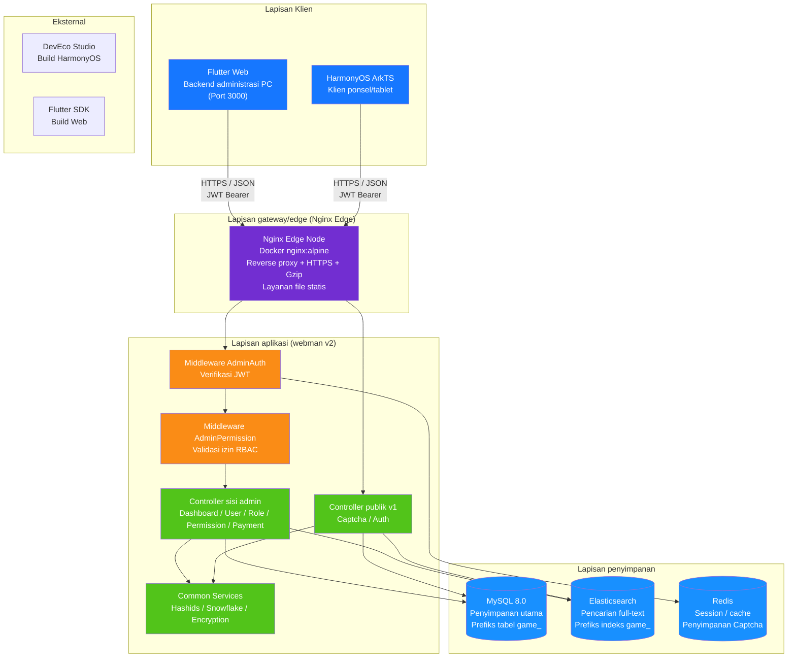

---

## 2. Arsitektur Backend Berlapis

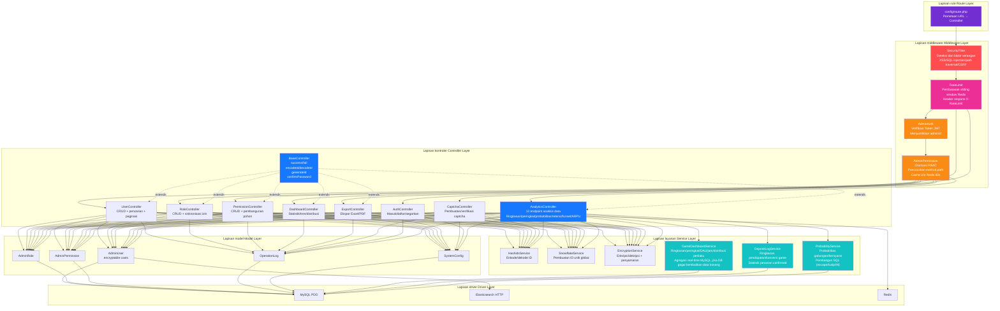

---

## 3. Siklus Hidup Permintaan

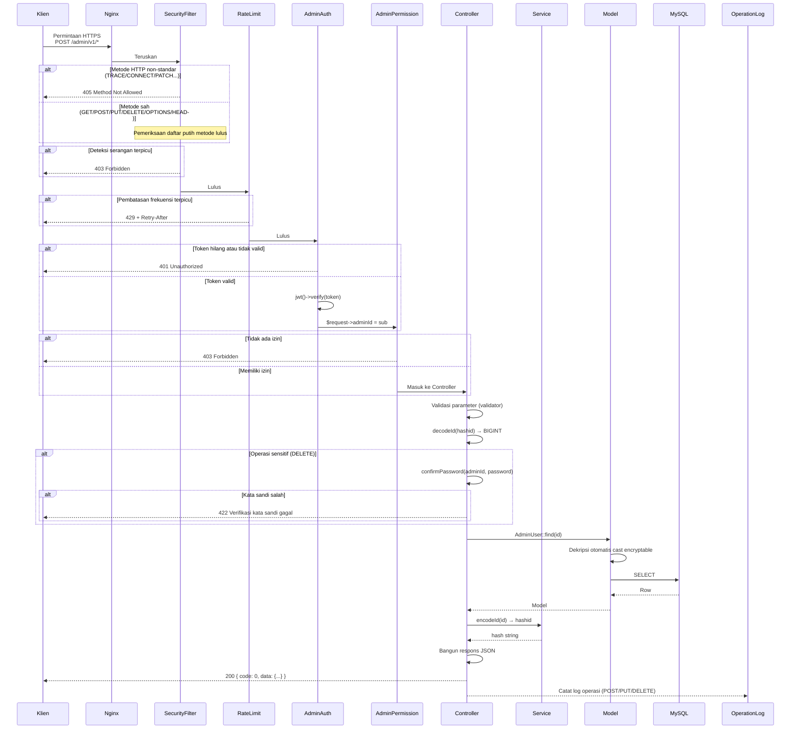

---

## 4. Alur Autentikasi & CAPTCHA

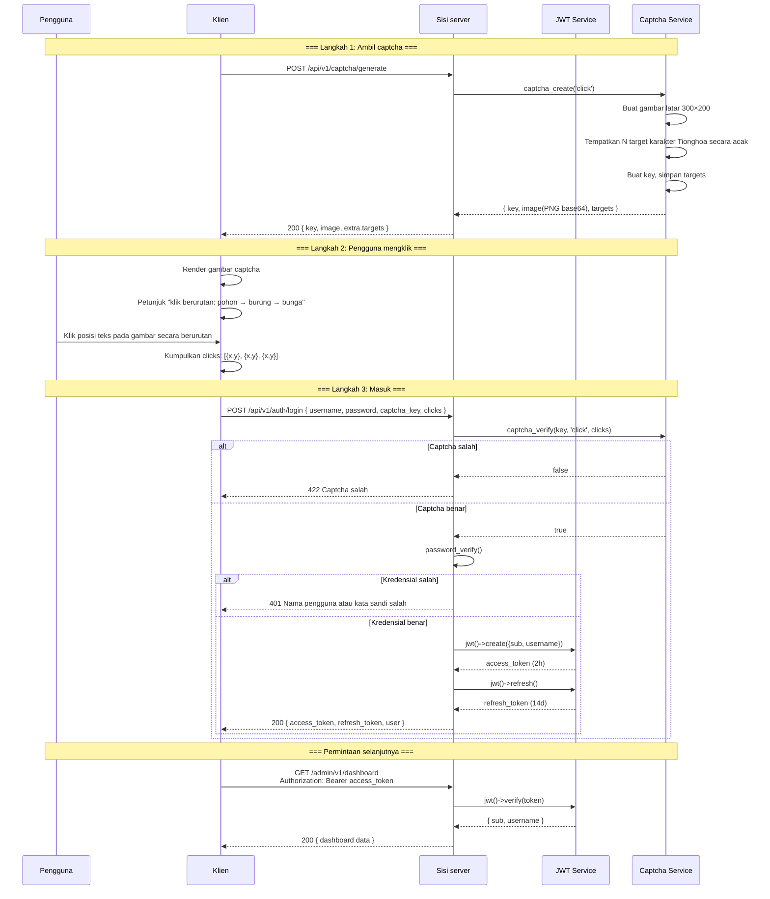

---

## 5. Model Izin RBAC

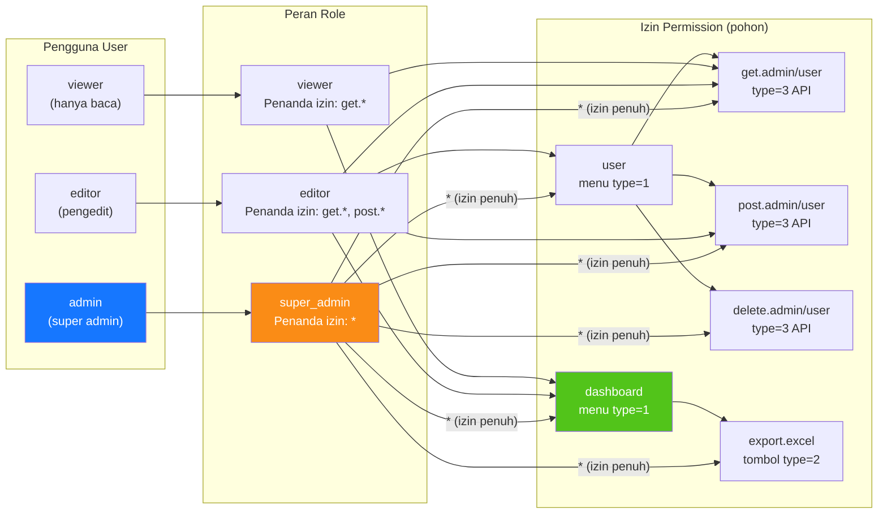

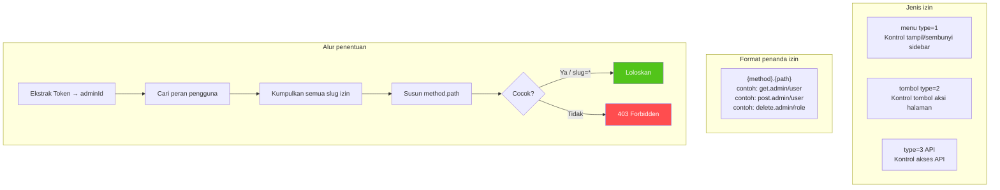

---

## 6. Siklus Hidup Penuh ID

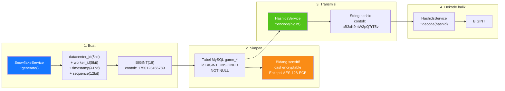

---

## 7. Lapisan Enkripsi Data

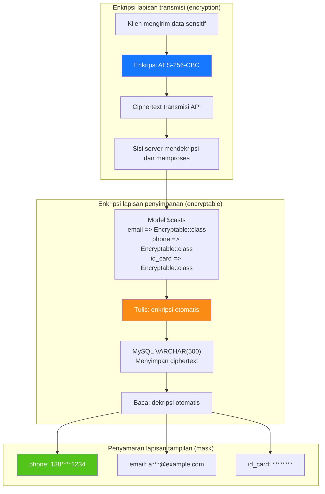

---

## 8. Hubungan ER Database

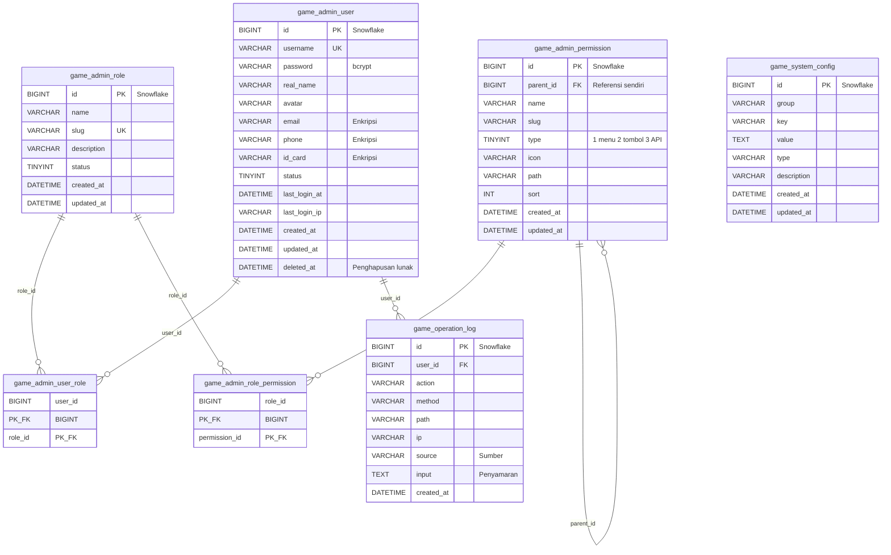

---

## 9. Alur Bisnis Ekspor

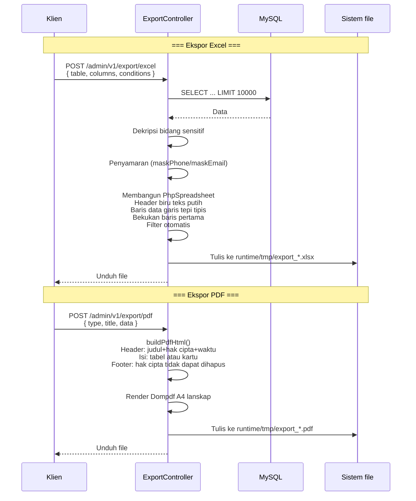

---

## 10. Pohon Komponen Flutter Web

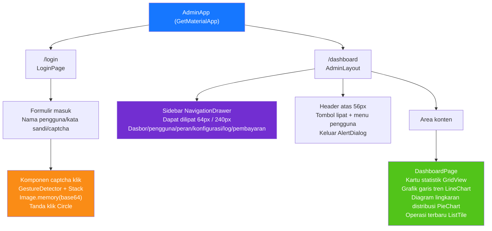

---

## 11. Rute Halaman HarmonyOS

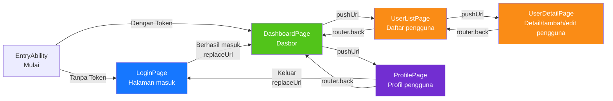

---

## 12. Panorama Pertahanan Berlapis Keamanan

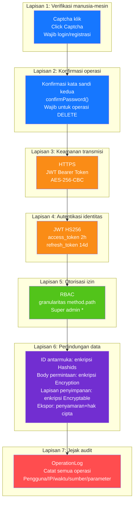

---

## 13. Topologi Deployment

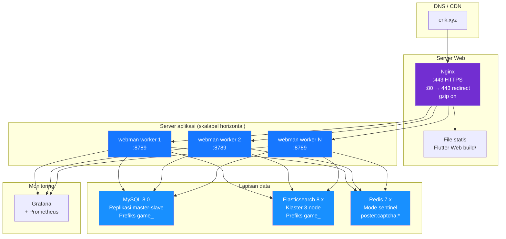
