# アーキテクチャ設計図とビジネスロジック図
<!-- lang-nav -->

Languages: [中文](ARCHITECTURE.md) · [English](ARCHITECTURE.en.md) · [한국어](ARCHITECTURE.ko.md) · [Русский](ARCHITECTURE.ru.md) · [Deutsch](ARCHITECTURE.de.md) · [Français](ARCHITECTURE.fr.md) · [Español](ARCHITECTURE.es.md) · [Português](ARCHITECTURE.pt.md) · [हिन्दी](ARCHITECTURE.hi.md) · [العربية](ARCHITECTURE.ar.md) · [বাংলা](ARCHITECTURE.bn.md) · [Bahasa Indonesia](ARCHITECTURE.id.md) · **日本語**

> Copyright (c) 2026 erik <erik@erik.xyz> — https://erik.xyz

> 以下の Mermaid 図は GitHub / GitLab / VS Code で自動レンダリングされます。その他の環境では [Mermaid Live Editor](https://mermaid.live/) でご確認ください。

---

## 1. システムトポロジーアーキテクチャ

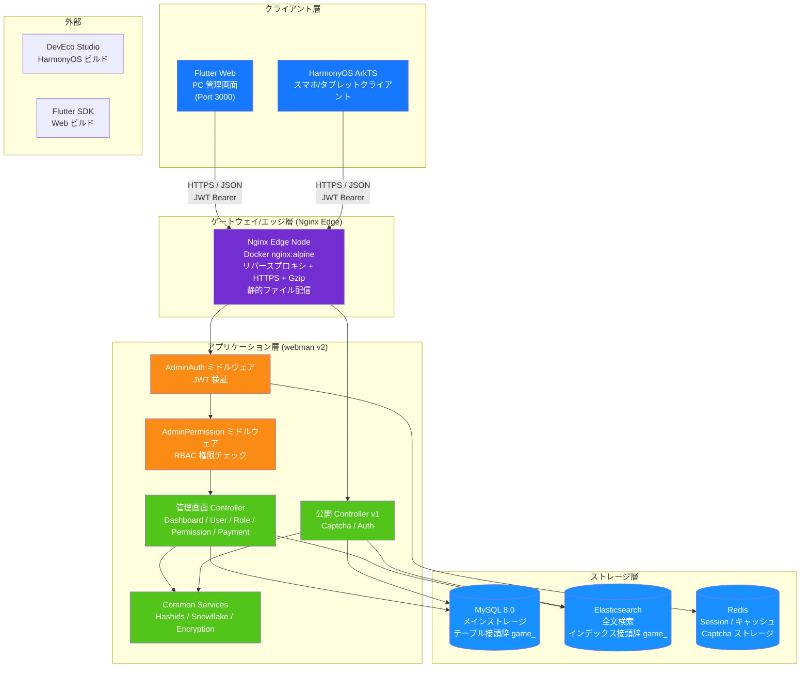

---

## 2. バックエンド階層アーキテクチャ

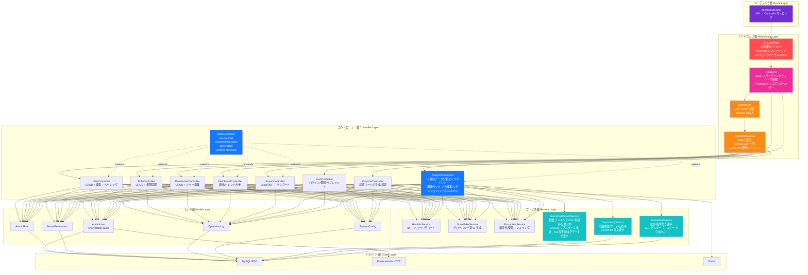

---

## 3. リクエストライフサイクル

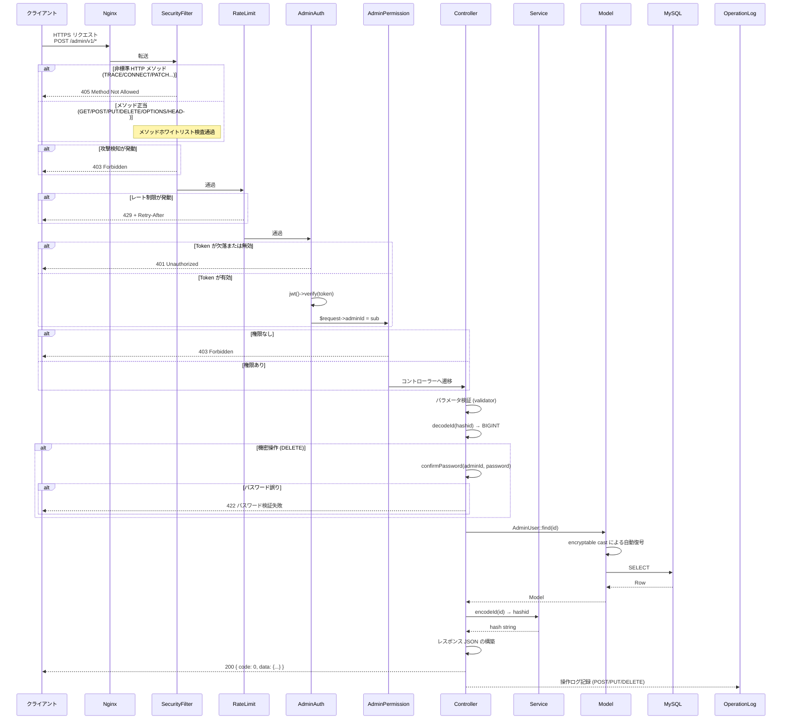

---

## 4. 認証とキャプチャのフロー

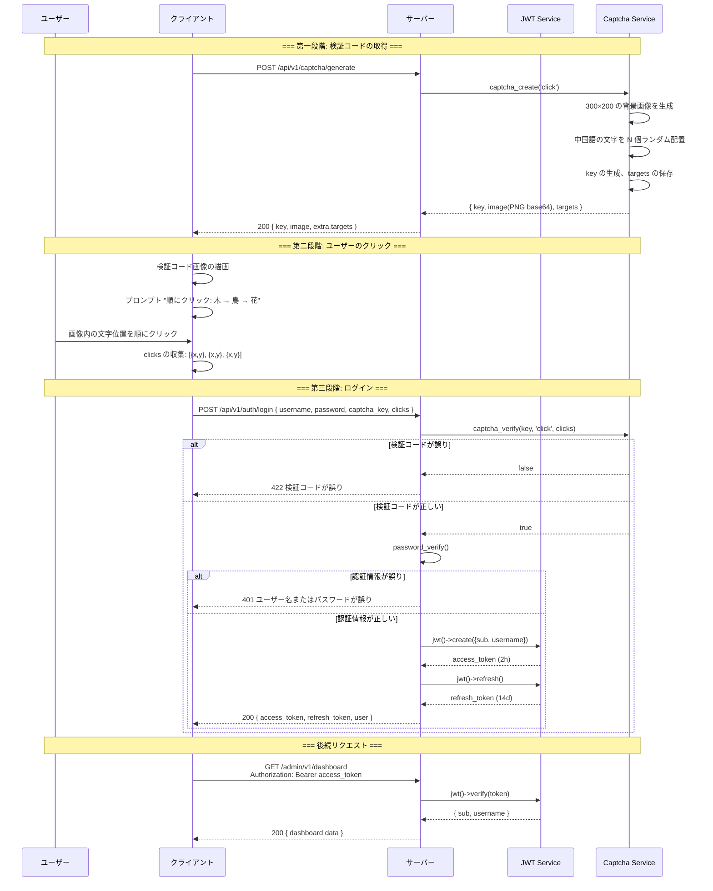

---

## 5. RBAC 権限モデル

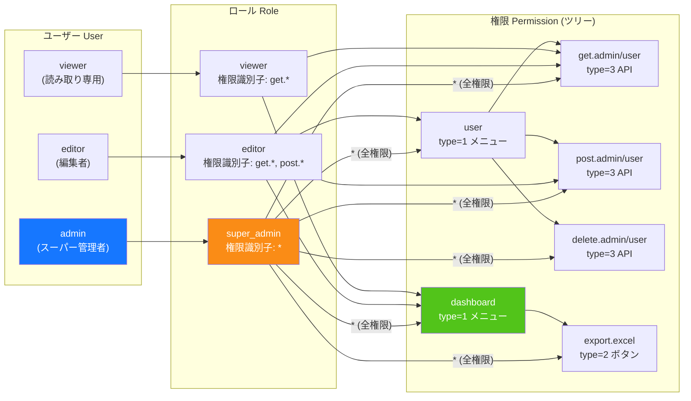

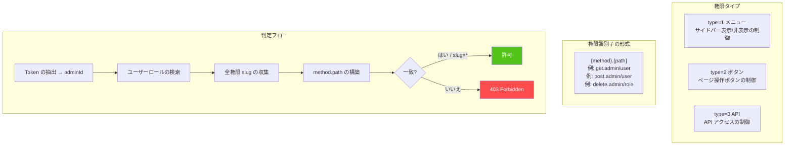

---

## 6. ID 全ライフサイクル

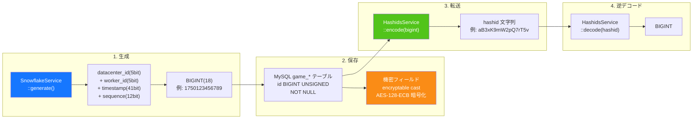

---

## 7. データ暗号化の階層

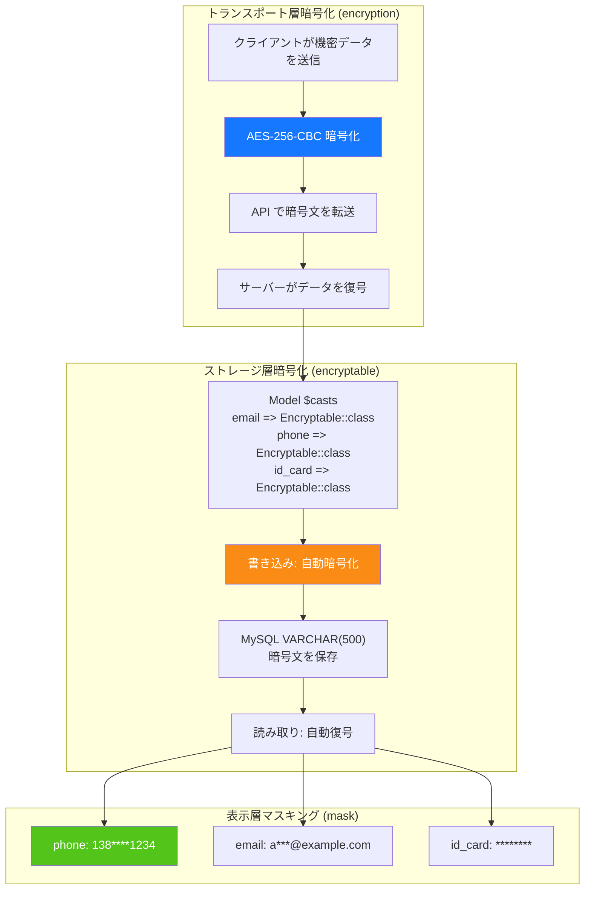

---

## 8. データベース ER 関係

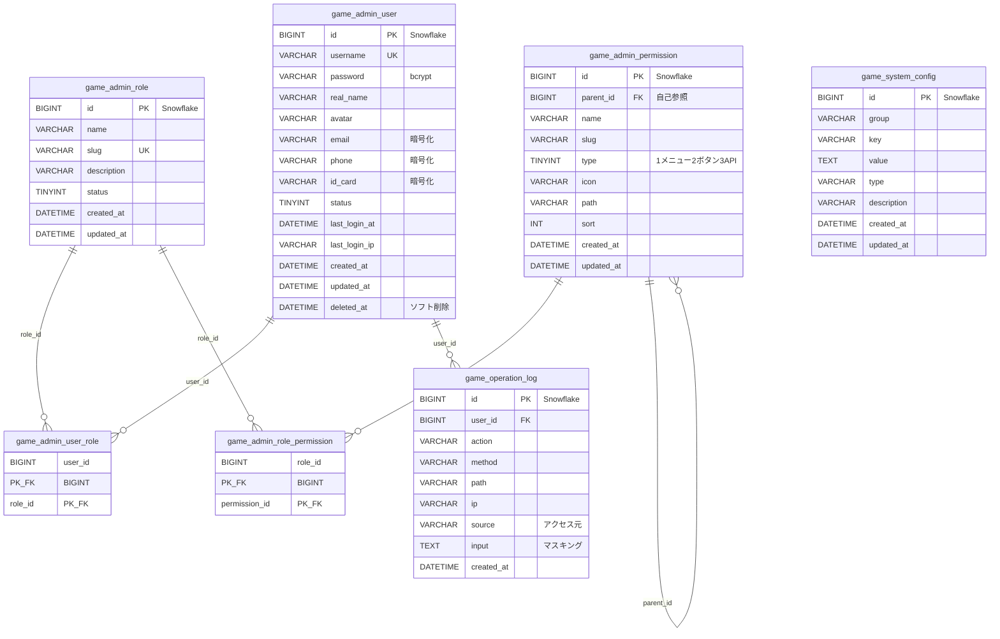

---

## 9. エクスポート業務フロー

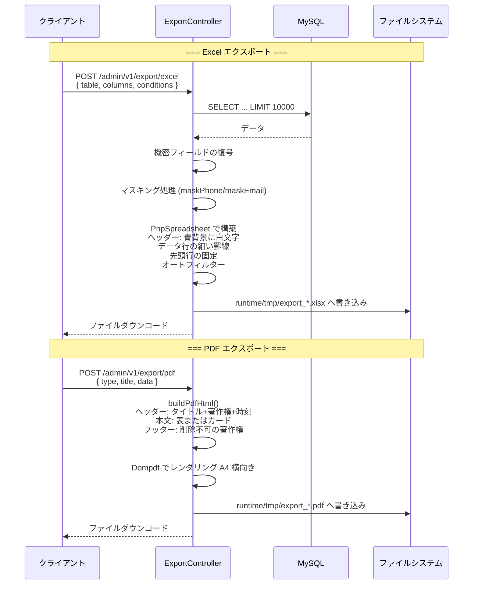

---

## 10. Flutter Web コンポーネントツリー

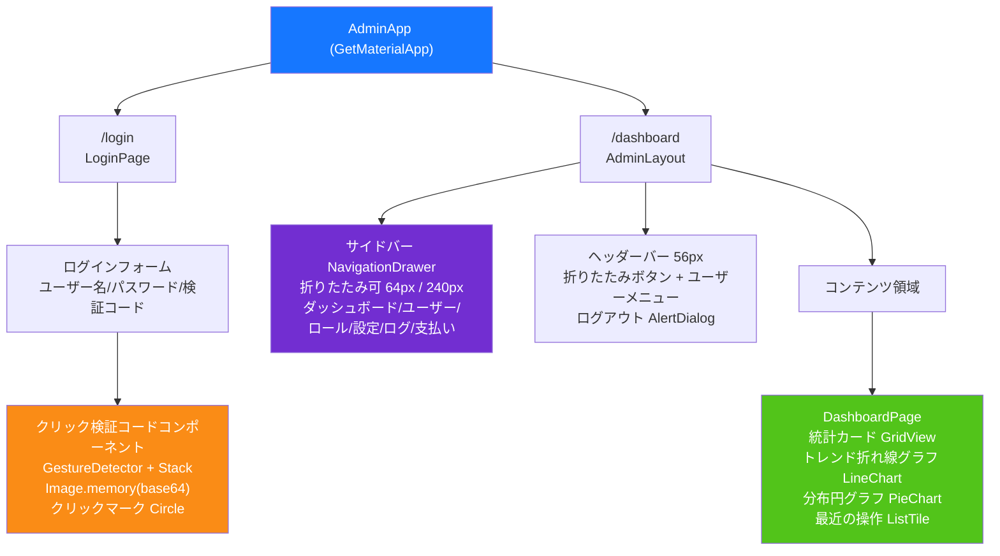

---

## 11. HarmonyOS ページルーティング

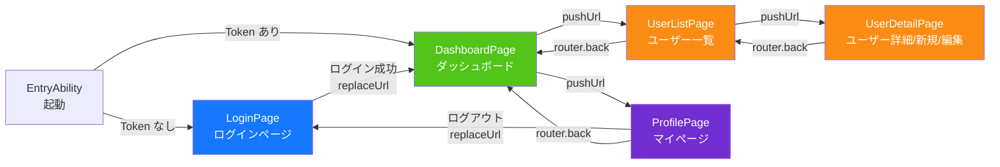

---

## 12. セキュリティ多層防御の全景

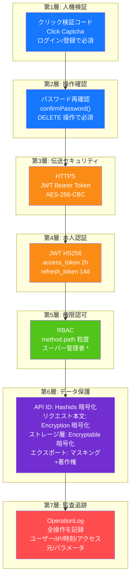

---

## 13. デプロイトポロジー

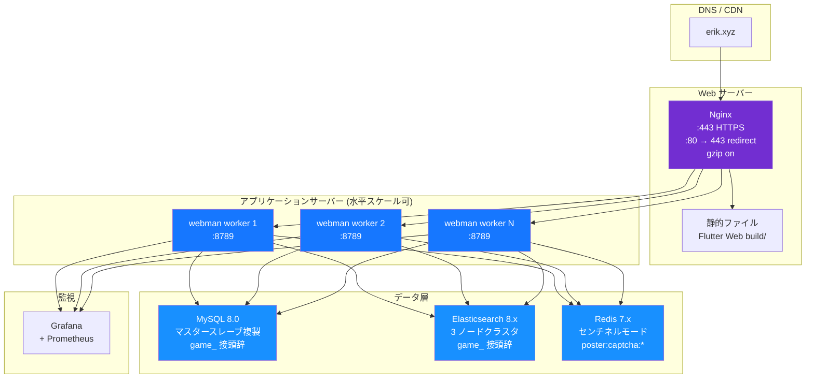
