# Diagramas de arquitetura e diagramas de lógica de negócio
<!-- lang-nav -->

Languages: [中文](ARCHITECTURE.md) · [English](ARCHITECTURE.en.md) · [한국어](ARCHITECTURE.ko.md) · [Русский](ARCHITECTURE.ru.md) · [Deutsch](ARCHITECTURE.de.md) · [Français](ARCHITECTURE.fr.md) · [Español](ARCHITECTURE.es.md) · **Português** · [हिन्दी](ARCHITECTURE.hi.md) · [العربية](ARCHITECTURE.ar.md) · [বাংলা](ARCHITECTURE.bn.md) · [Bahasa Indonesia](ARCHITECTURE.id.md) · [日本語](ARCHITECTURE.ja.md)

> Copyright (c) 2026 erik <erik@erik.xyz> — https://erik.xyz

> Os diagramas Mermaid abaixo são renderizados automaticamente no GitHub / GitLab / VS Code. Em outros ambientes, use o [Mermaid Live Editor](https://mermaid.live/).

---

## 1. Topologia do sistema

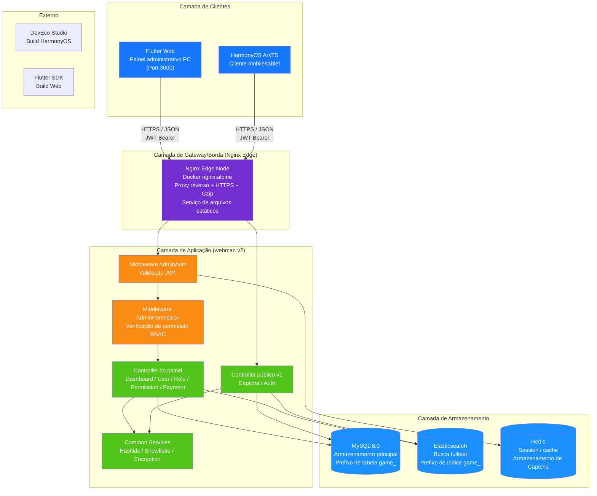

---

## 2. Arquitetura em camadas do backend

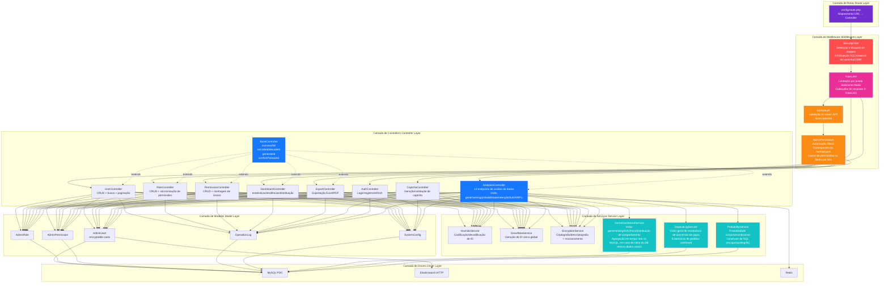

---

## 3. Ciclo de vida da requisição

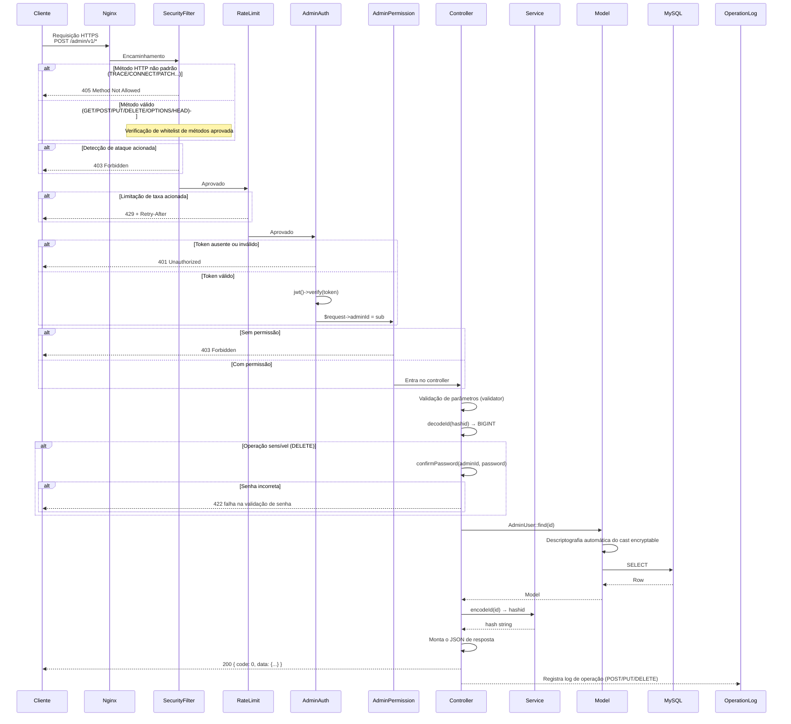

---

## 4. Fluxo de autenticação e CAPTCHA

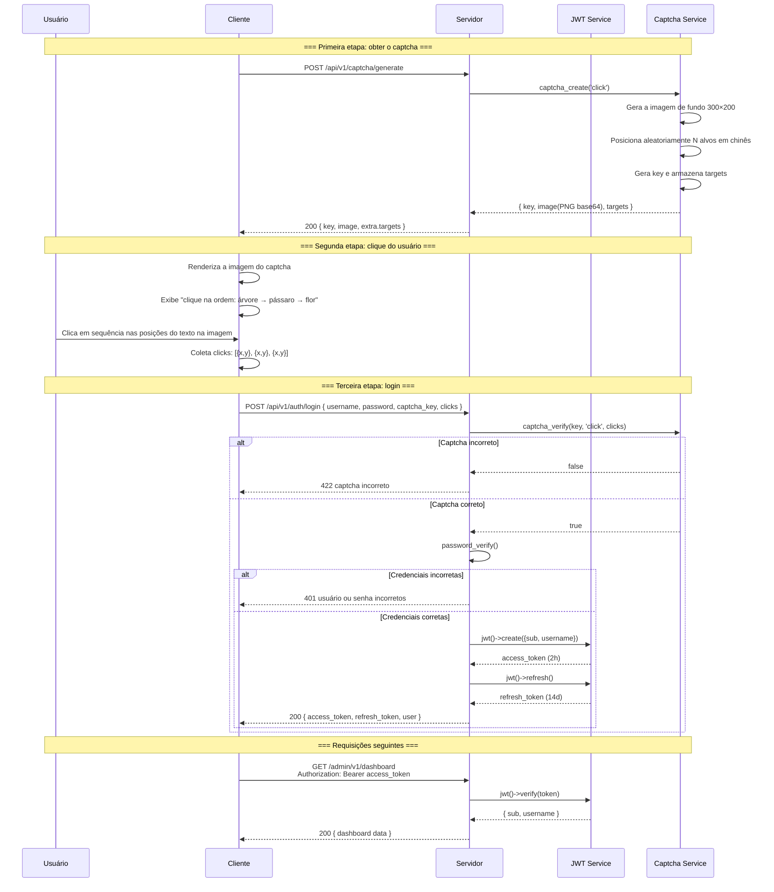

---

## 5. Modelo de permissões RBAC

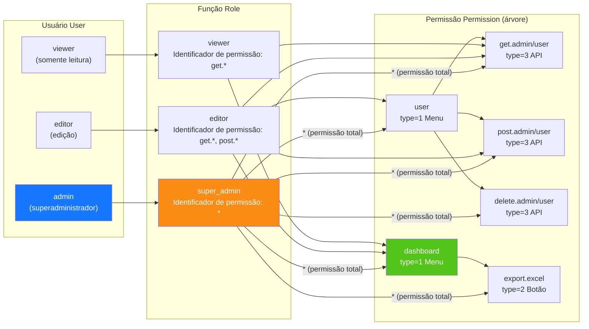

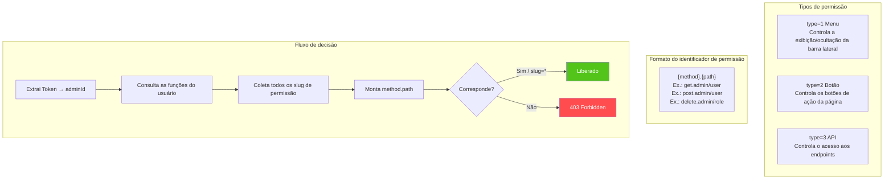

---

## 6. Ciclo de vida completo do ID

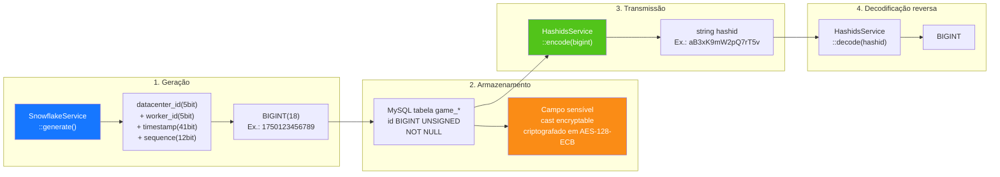

---

## 7. Camadas de criptografia de dados

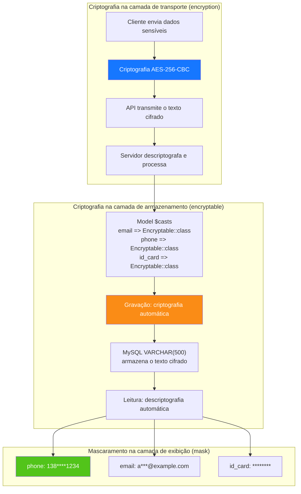

---

## 8. Relações ER do banco de dados

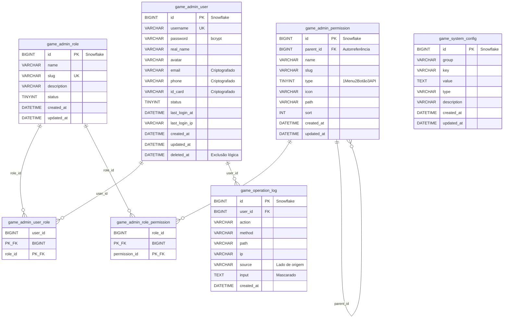

---

## 9. Fluxo de negócio de exportação

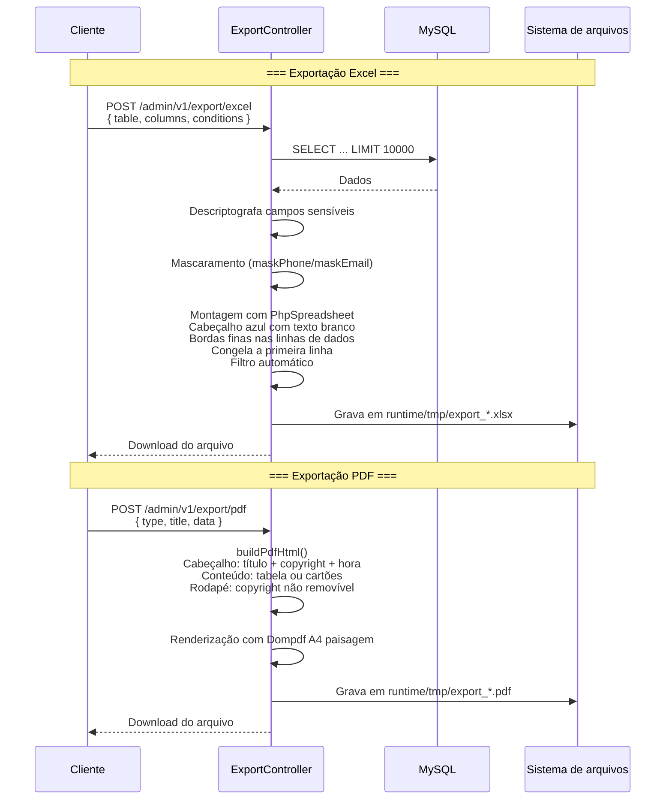

---

## 10. Árvore de componentes Flutter Web

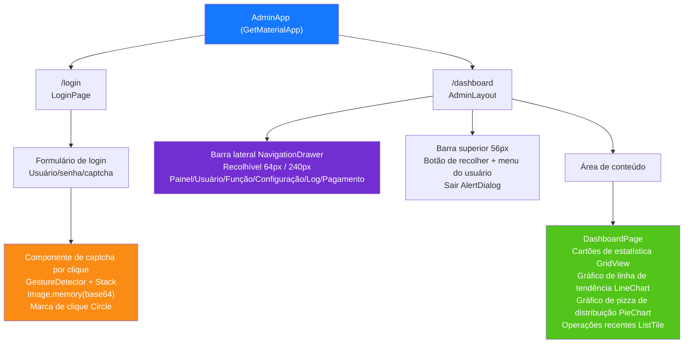

---

## 11. Rotas de páginas HarmonyOS

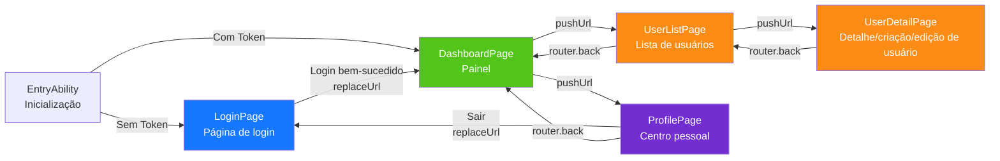

---

## 12. Panorama da defesa em profundidade

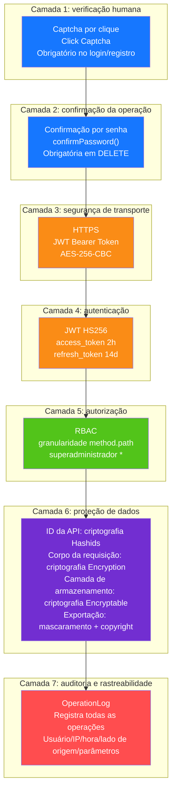

---

## 13. Topologia de deploy

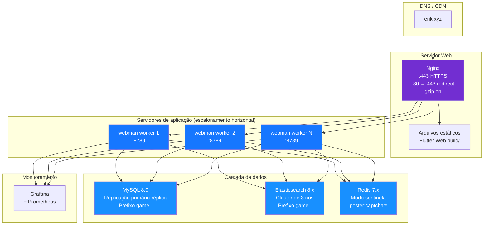
