# Схемы архитектуры и бизнес-логики
<!-- lang-nav -->

Languages: [中文](ARCHITECTURE.md) · [English](ARCHITECTURE.en.md) · [한국어](ARCHITECTURE.ko.md) · **Русский** · [Deutsch](ARCHITECTURE.de.md) · [Français](ARCHITECTURE.fr.md) · [Español](ARCHITECTURE.es.md) · [Português](ARCHITECTURE.pt.md) · [हिन्दी](ARCHITECTURE.hi.md) · [العربية](ARCHITECTURE.ar.md) · [বাংলা](ARCHITECTURE.bn.md) · [Bahasa Indonesia](ARCHITECTURE.id.md) · [日本語](ARCHITECTURE.ja.md)

> Copyright (c) 2026 erik <erik@erik.xyz> — https://erik.xyz

> Следующие диаграммы Mermaid автоматически рендерятся в GitHub / GitLab / VS Code. В других окружениях используйте [Mermaid Live Editor](https://mermaid.live/).

---

## 1. Системная топология

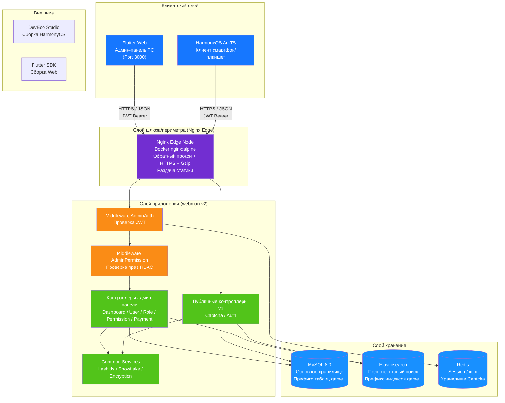

---

## 2. Многоуровневая архитектура бэкенда

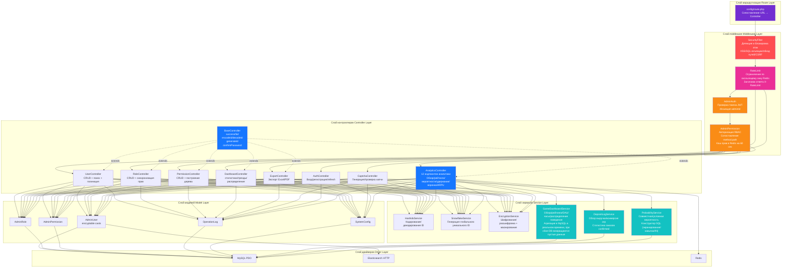

---

## 3. Жизненный цикл запроса

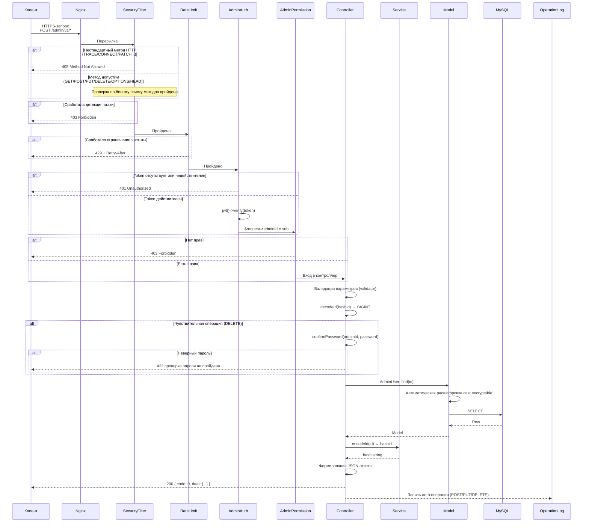

---

## 4. Процесс аутентификации и капчи

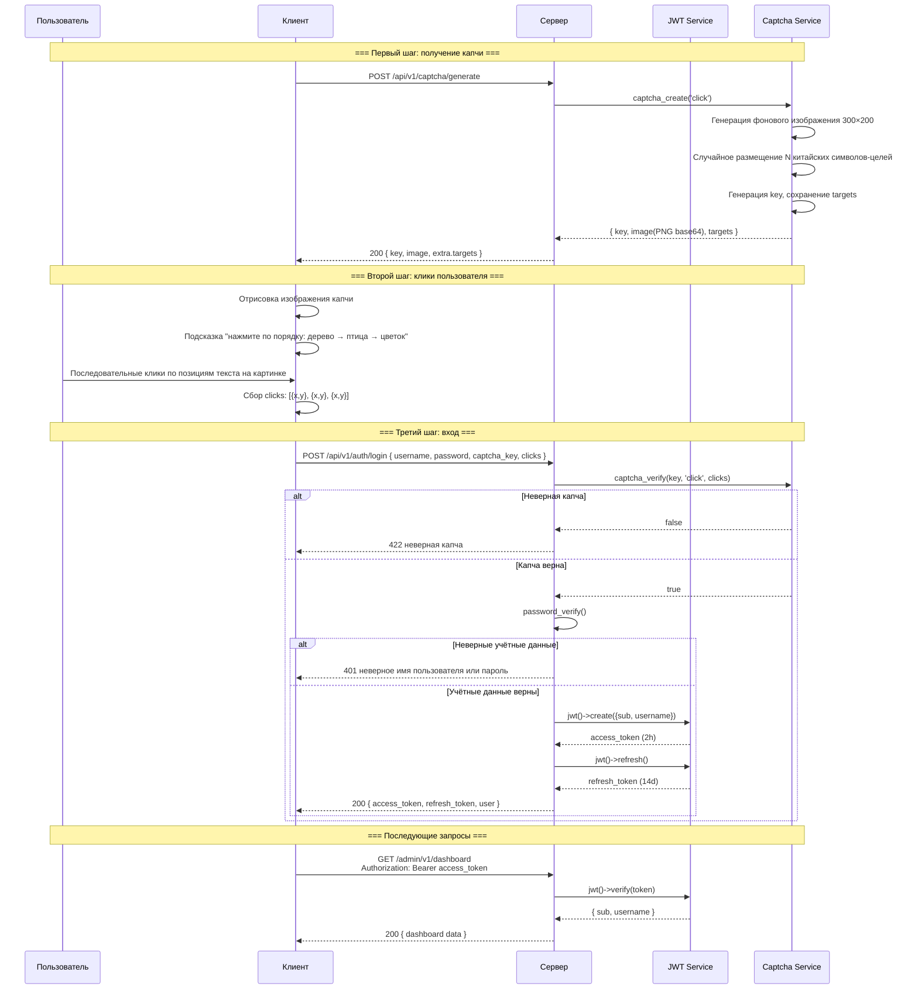

---

## 5. Модель RBAC-прав

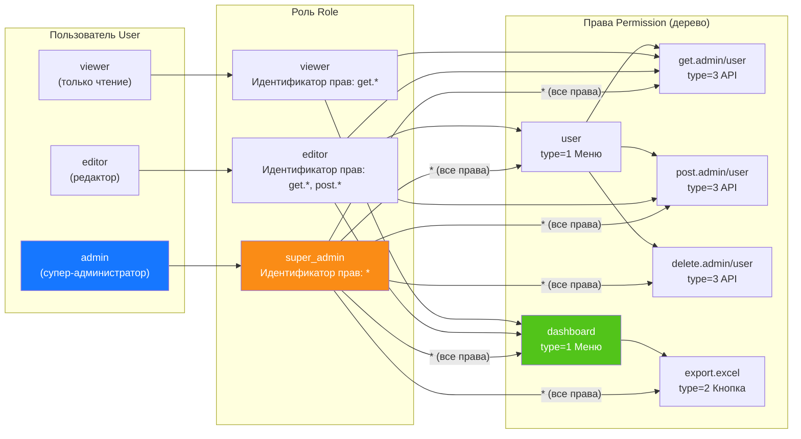

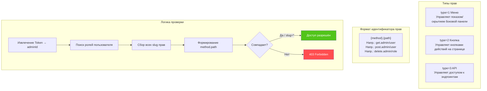

---

## 6. Полный жизненный цикл ID

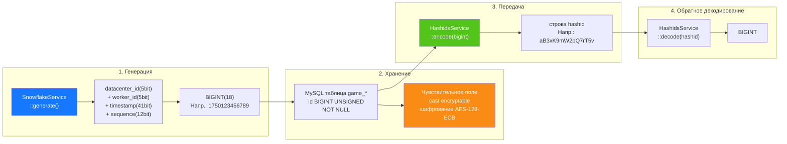

---

## 7. Многоуровневое шифрование данных

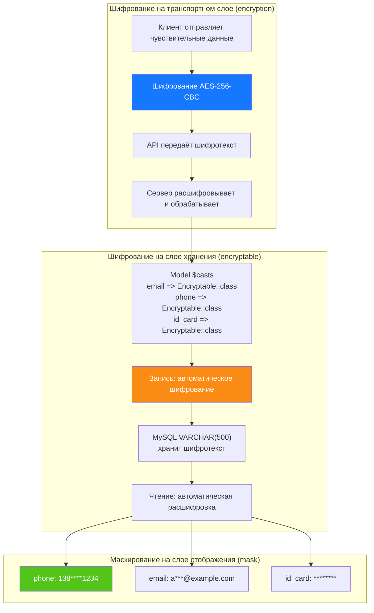

---

## 8. ER-связи базы данных

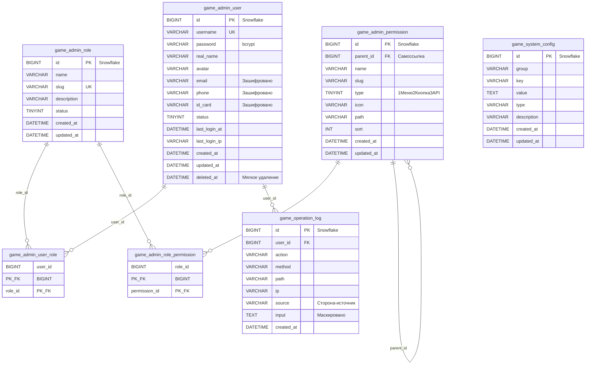

---

## 9. Процесс экспорта

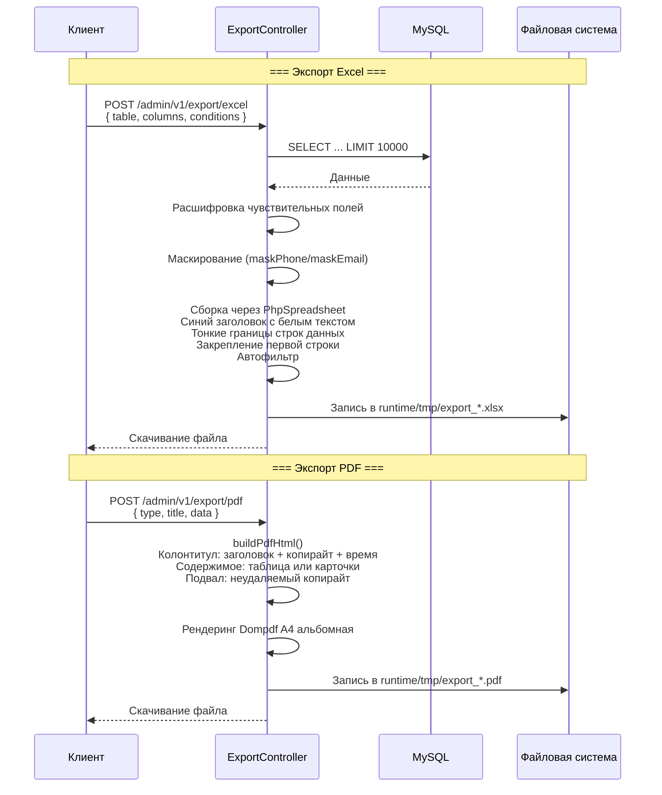

---

## 10. Дерево компонентов Flutter Web

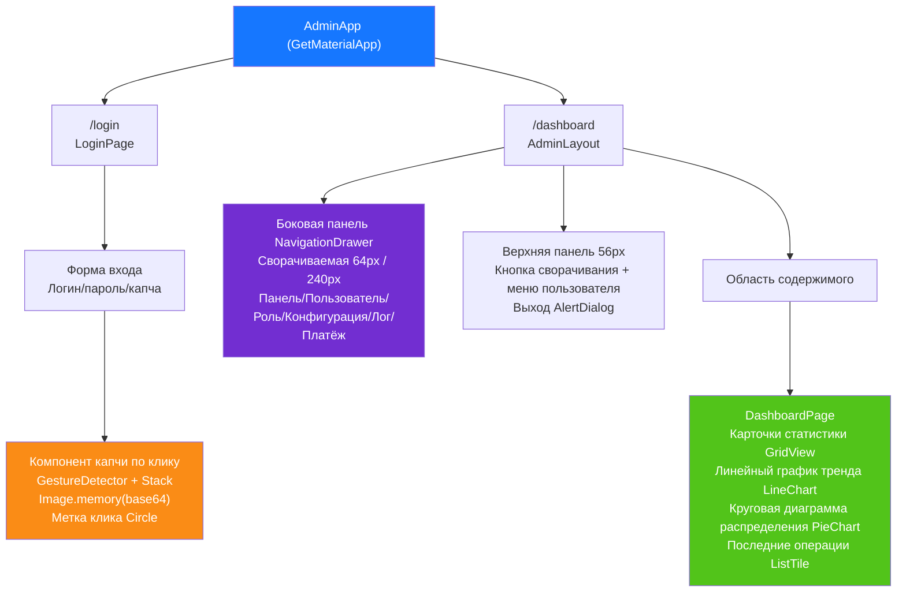

---

## 11. Маршруты страниц HarmonyOS

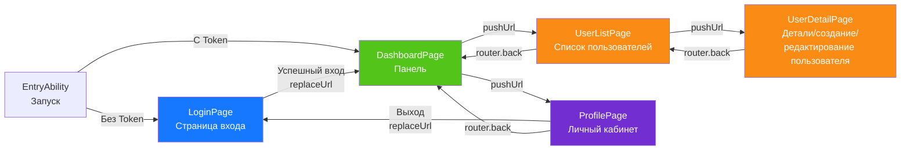

---

## 12. Панорама эшелонированной обороны

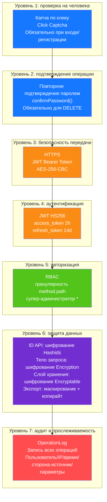

---

## 13. Топология развертывания

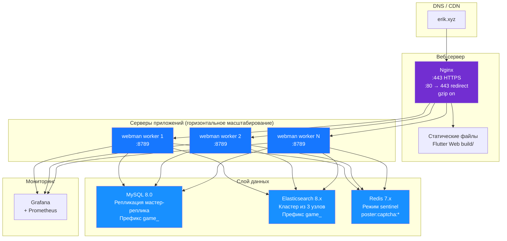
