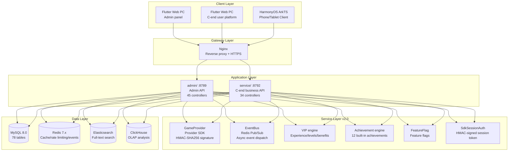

# System Architecture Diagram (v2.0)
<!-- lang-nav -->

Languages: [中文](01-system-architecture.md) · **English**

```mermaid
flowchart TB
    subgraph "Client Layer"
        A1["Flutter Web PC<br/>Admin panel"]
        A2["Flutter Web PC<br/>C-end user platform"]
        A3["HarmonyOS ArkTS<br/>Phone/Tablet Client"]
    end

    subgraph "Gateway Layer"
        B1["Nginx<br/>Reverse proxy + HTTPS"]
    end

    subgraph "Application Layer"
        C1["admin/ :8789<br/>Admin API<br/>45 controllers"]
        C2["service/ :8792<br/>C-end business API<br/>34 controllers"]
    end

    subgraph "Service Layer v2.0"
        D1["GameProvider<br/>Provider SDK<br/>HMAC-SHA256 signature"]
        D2["EventBus<br/>Redis Pub/Sub<br/>Async event dispatch"]
        D3["VIP engine<br/>Experience/levels/benefits"]
        D4["Achievement engine<br/>12 built-in achievements"]
        D5["FeatureFlag<br/>Feature flags"]
        D6["SdkSessionAuth<br/>HMAC-signed session token"]
    end

    subgraph "Data Layer"
        E1[("MySQL 8.0<br/>78 tables")]
        E2[("Redis 7.x<br/>Cache/rate limiting/events")]
        E3[("Elasticsearch<br/>Full-text search")]
        E4[("ClickHouse<br/>OLAP analysis")]
    end

    A1 & A2 & A3 --> B1
    B1 --> C1 & C2
    C1 & C2 --> D1 & D2 & D3 & D4 & D5 & D6
    C1 & C2 --> E1 & E2 & E3 & E4
```
