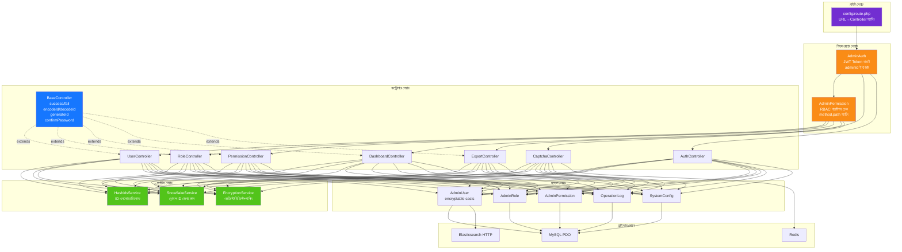

# ব্যাকএন্ড লেয়ারড আর্কিটেকচার
<!-- lang-nav -->

Languages: [中文](02-backend-layers.md) · [English](02-backend-layers.en.md) · [한국어](02-backend-layers.ko.md) · [Русский](02-backend-layers.ru.md) · [Deutsch](02-backend-layers.de.md) · [Français](02-backend-layers.fr.md) · [Español](02-backend-layers.es.md) · [Português](02-backend-layers.pt.md) · [हिन्दी](02-backend-layers.hi.md) · [العربية](02-backend-layers.ar.md) · **বাংলা** · [Bahasa Indonesia](02-backend-layers.id.md) · [日本語](02-backend-layers.ja.md)

