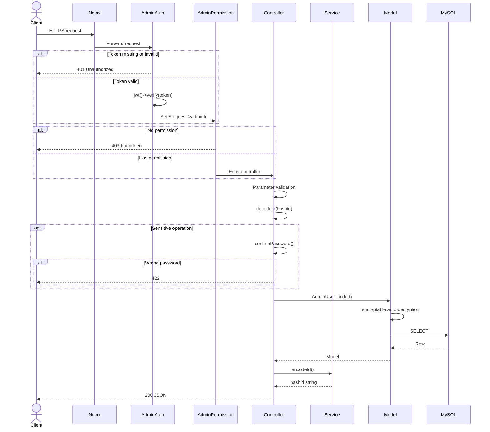

# Request Lifecycle
<!-- lang-nav -->

Languages: [中文](03-request-lifecycle.md) · **English**

```mermaid
sequenceDiagram
    actor C as Client
    participant N as Nginx
    participant MW1 as AdminAuth
    participant MW2 as AdminPermission
    participant CTL as Controller
    participant SVC as Service
    participant MDL as Model
    participant DB as MySQL

    C->>N: HTTPS request
    N->>MW1: Forward request

    alt Token missing or invalid
        MW1-->>C: 401 Unauthorized
    else Token valid
        MW1->>MW1: jwt()->verify(token)
        MW1->>MW2: Set $request->adminId
    end

    alt No permission
        MW2-->>C: 403 Forbidden
    else Has permission
        MW2->>CTL: Enter controller
    end

    CTL->>CTL: Parameter validation
    CTL->>CTL: decodeId(hashid)

    opt Sensitive operation
        CTL->>CTL: confirmPassword()
        alt Wrong password
            CTL-->>C: 422
        end
    end

    CTL->>MDL: AdminUser::find(id)
    MDL->>MDL: encryptable auto-decryption
    MDL->>DB: SELECT
    DB-->>MDL: Row
    MDL-->>CTL: Model

    CTL->>SVC: encodeId()
    SVC-->>CTL: hashid string

    CTL-->>C: 200 JSON
```
