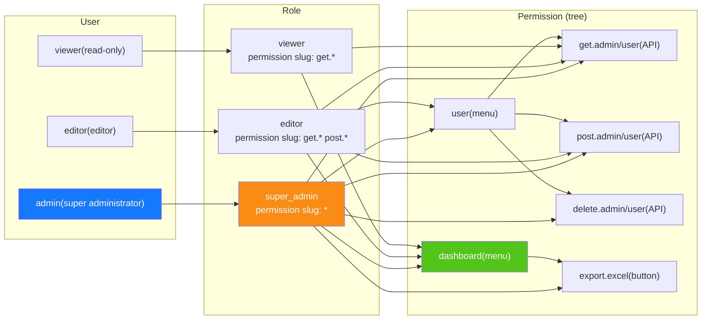
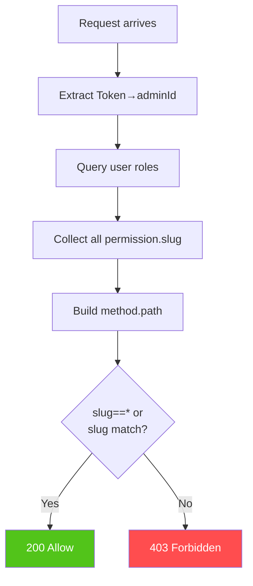
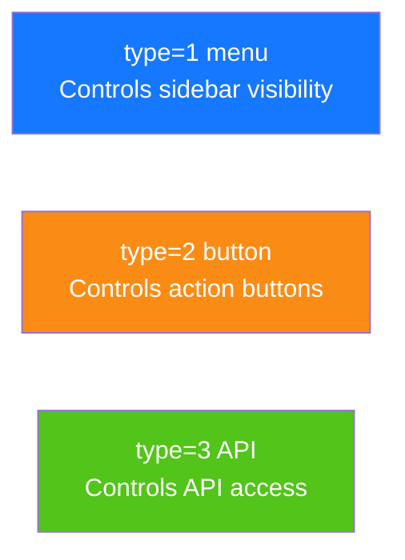

# RBAC Permission Model
<!-- lang-nav -->

Languages: [中文](05-rbac-model.md) · **English** · [한국어](05-rbac-model.ko.md) · [Русский](05-rbac-model.ru.md) · [Deutsch](05-rbac-model.de.md) · [Français](05-rbac-model.fr.md) · [Español](05-rbac-model.es.md) · [Português](05-rbac-model.pt.md) · [हिन्दी](05-rbac-model.hi.md) · [العربية](05-rbac-model.ar.md) · [বাংলা](05-rbac-model.bn.md) · [Bahasa Indonesia](05-rbac-model.id.md) · [日本語](05-rbac-model.ja.md)

## User-Role-Permission Relationships

## Permission Check Flow

## Permission Types

