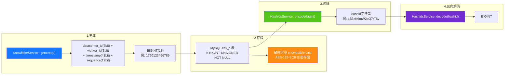

# Полный жизненный цикл ID
<!-- lang-nav -->

Languages: **中文** · [English](06-id-lifecycle.en.md) · [한국어](06-id-lifecycle.ko.md) · [Русский](06-id-lifecycle.ru.md) · [Deutsch](06-id-lifecycle.de.md) · [Français](06-id-lifecycle.fr.md) · [Español](06-id-lifecycle.es.md) · [Português](06-id-lifecycle.pt.md) · [हिन्दी](06-id-lifecycle.hi.md) · [العربية](06-id-lifecycle.ar.md) · [বাংলা](06-id-lifecycle.bn.md) · [Bahasa Indonesia](06-id-lifecycle.id.md) · [日本語](06-id-lifecycle.ja.md)

