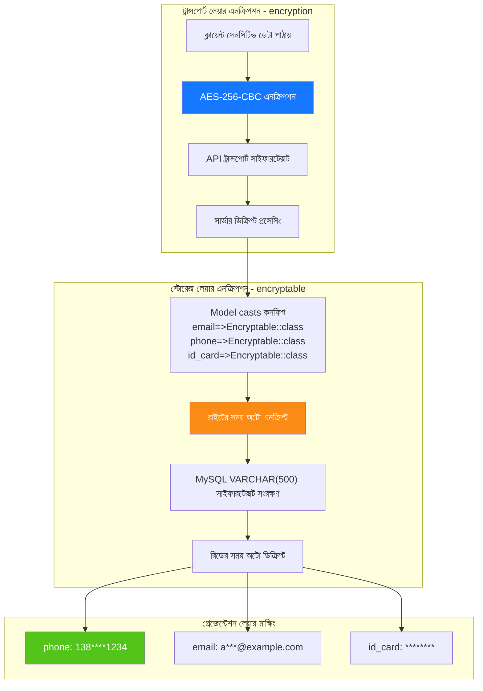

# ডেটা এনক্রিপশন লেয়ারিং
<!-- lang-nav -->

Languages: [中文](07-encryption-layers.md) · [English](07-encryption-layers.en.md) · [한국어](07-encryption-layers.ko.md) · [Русский](07-encryption-layers.ru.md) · [Deutsch](07-encryption-layers.de.md) · [Français](07-encryption-layers.fr.md) · [Español](07-encryption-layers.es.md) · [Português](07-encryption-layers.pt.md) · [हिन्दी](07-encryption-layers.hi.md) · [العربية](07-encryption-layers.ar.md) · **বাংলা** · [Bahasa Indonesia](07-encryption-layers.id.md) · [日本語](07-encryption-layers.ja.md)

