# مخطط ER لقاعدة البيانات (v2.0 — 52 جدولًا)
<!-- lang-nav -->

Languages: **中文** · [English](08-database-er.en.md) · [한국어](08-database-er.ko.md) · [Русский](08-database-er.ru.md) · [Deutsch](08-database-er.de.md) · [Français](08-database-er.fr.md) · [Español](08-database-er.es.md) · [Português](08-database-er.pt.md) · [हिन्दी](08-database-er.hi.md) · [العربية](08-database-er.ar.md) · [বাংলা](08-database-er.bn.md) · [Bahasa Indonesia](08-database-er.id.md) · [日本語](08-database-er.ja.md)

```mermaid
erDiagram
    game_user ||--|| game_user_wallet : "1:1"
    game_user ||--|| game_user_vip : "1:1"
    game_user ||--o{ game_user_game_wallet : "1:N"
    game_user ||--o{ game_deposit_order : "1:N"
    game_user ||--o{ game_withdraw_order : "1:N"
    game_user ||--o{ game_exchange_record : "1:N"
    game_user ||--o{ game_transaction : "1:N"
    game_user ||--o{ game_user_achievement : "1:N"
    game_user ||--o{ game_exp_log : "1:N"
    game_user ||--o{ game_ticket : "1:N"
    game_user ||--o{ game_device_token : "1:N"
    game_user ||--o{ game_user_session : "1:N"
    game_user ||--o{ game_friend : "1:N"
    game_user ||--o{ game_message : "1:N"

    game_ticket ||--o{ game_ticket_reply : "1:N"
    game_vip_level ||--o{ game_user_vip : "1:N"
    game_achievement ||--o{ game_user_achievement : "1:N"

    game_game ||--o{ game_game_currency : "1:N"
    game_game ||--o{ game_user_game_wallet : "1:N"
    game_game ||--o{ game_exchange_record : "1:N"
    game_game ||--o{ game_game_play_log : "1:N"
```

