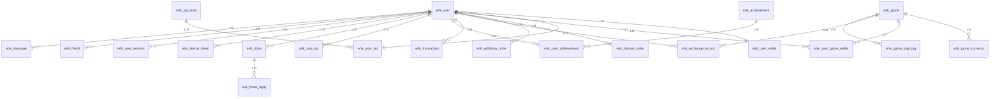

# 数据库 ER 图 (v2.0 — 52 张表)

```mermaid
erDiagram
    erik_user ||--|| erik_user_wallet : "1:1"
    erik_user ||--|| erik_user_vip : "1:1"
    erik_user ||--o{ erik_user_game_wallet : "1:N"
    erik_user ||--o{ erik_deposit_order : "1:N"
    erik_user ||--o{ erik_withdraw_order : "1:N"
    erik_user ||--o{ erik_exchange_record : "1:N"
    erik_user ||--o{ erik_transaction : "1:N"
    erik_user ||--o{ erik_user_achievement : "1:N"
    erik_user ||--o{ erik_exp_log : "1:N"
    erik_user ||--o{ erik_ticket : "1:N"
    erik_user ||--o{ erik_device_token : "1:N"
    erik_user ||--o{ erik_user_session : "1:N"
    erik_user ||--o{ erik_friend : "1:N"
    erik_user ||--o{ erik_message : "1:N"

    erik_ticket ||--o{ erik_ticket_reply : "1:N"
    erik_vip_level ||--o{ erik_user_vip : "1:N"
    erik_achievement ||--o{ erik_user_achievement : "1:N"

    erik_game ||--o{ erik_game_currency : "1:N"
    erik_game ||--o{ erik_user_game_wallet : "1:N"
    erik_game ||--o{ erik_exchange_record : "1:N"
    erik_game ||--o{ erik_game_play_log : "1:N"
```
