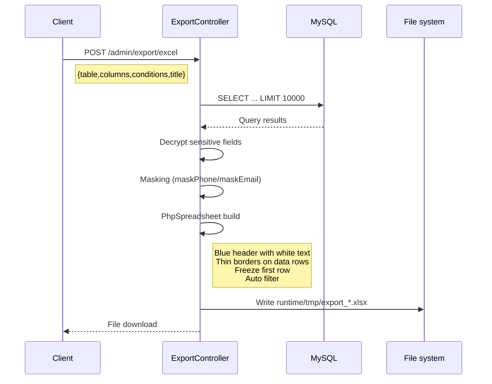
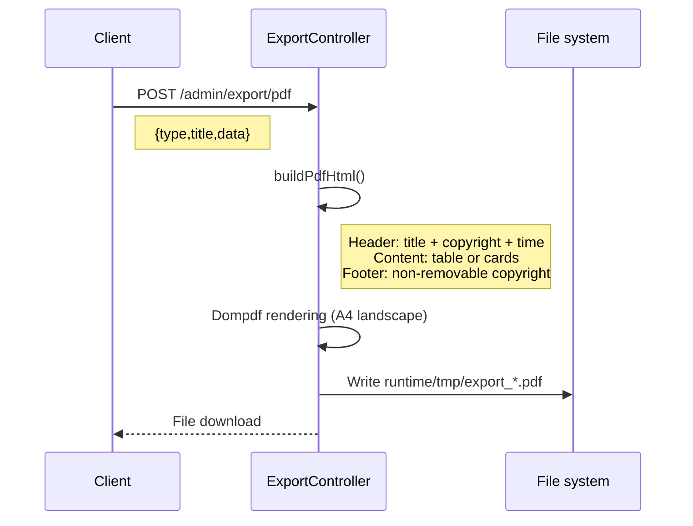

# Export Business Flow
<!-- lang-nav -->

Languages: [中文](09-export-flow.md) · **English**

## Excel Export

```mermaid
sequenceDiagram
    participant C as Client
    participant CTL as ExportController
    participant DB as MySQL
    participant FS as File system

    C->>CTL: POST /admin/export/excel
    Note right of C: {table,columns,conditions,title}
    CTL->>DB: SELECT ... LIMIT 10000
    DB-->>CTL: Query results
    CTL->>CTL: Decrypt sensitive fields
    CTL->>CTL: Masking (maskPhone/maskEmail)
    CTL->>CTL: PhpSpreadsheet build
    Note right of CTL: Blue header with white text<br/>Thin borders on data rows<br/>Freeze first row<br/>Auto filter
    CTL->>FS: Write runtime/tmp/export_*.xlsx
    CTL-->>C: File download
```

## PDF Export

```mermaid
sequenceDiagram
    participant C as Client
    participant CTL as ExportController
    participant FS as File system

    C->>CTL: POST /admin/export/pdf
    Note right of C: {type,title,data}
    CTL->>CTL: buildPdfHtml()
    Note right of CTL: Header: title + copyright + time<br/>Content: table or cards<br/>Footer: non-removable copyright
    CTL->>CTL: Dompdf rendering (A4 landscape)
    CTL->>FS: Write runtime/tmp/export_*.pdf
    CTL-->>C: File download
```
