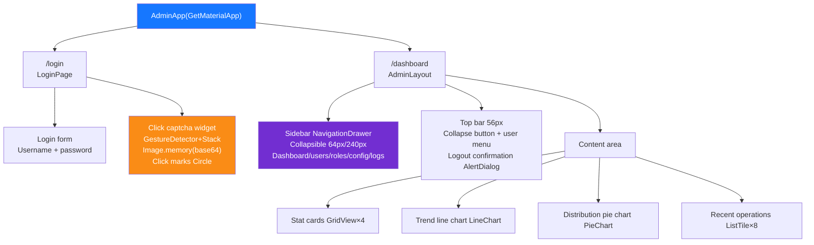
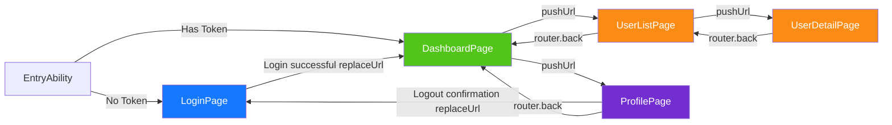

# Frontend Component Architecture
<!-- lang-nav -->

Languages: [中文](10-frontend-components.md) · **English**

## Flutter Web Component Tree

```mermaid
flowchart TD
    app["AdminApp(GetMaterialApp)"]

    app --> login["/login<br/>LoginPage"]
    app --> dashboard["/dashboard<br/>AdminLayout"]

    login --> form["Login form<br/>Username + password"]
    login --> captcha["Click captcha widget<br/>GestureDetector+Stack<br/>Image.memory(base64)<br/>Click marks Circle"]

    dashboard --> sidebar["Sidebar NavigationDrawer<br/>Collapsible 64px/240px<br/>Dashboard/users/roles/config/logs"]
    dashboard --> header["Top bar 56px<br/>Collapse button + user menu<br/>Logout confirmation AlertDialog"]
    dashboard --> content["Content area"]

    content --> stats["Stat cards GridView×4"]
    content --> chart["Trend line chart LineChart"]
    content --> pie["Distribution pie chart PieChart"]
    content --> logs["Recent operations ListTile×8"]

    style app fill:#1677FF,color:#fff
    style captcha fill:#FA8C16,color:#fff
    style sidebar fill:#722ED1,color:#fff
```

## HarmonyOS Page Routing

```mermaid
flowchart LR
    entry["EntryAbility"]
    entry -->|"No Token"| loginH["LoginPage"]
    entry -->|"Has Token"| dashH["DashboardPage"]

    loginH -->|"Login successful replaceUrl"| dashH

    dashH -->|"pushUrl"| userList["UserListPage"]
    dashH -->|"pushUrl"| profile["ProfilePage"]

    userList -->|"pushUrl"| userDetail["UserDetailPage"]
    userList -->|"router.back"| dashH
    userDetail -->|"router.back"| userList

    profile -->|"Logout confirmation replaceUrl"| loginH
    profile -->|"router.back"| dashH

    style loginH fill:#1677FF,color:#fff
    style dashH fill:#52C41A,color:#fff
    style userList fill:#FA8C16,color:#fff
    style userDetail fill:#FA8C16,color:#fff
    style profile fill:#722ED1,color:#fff
```
