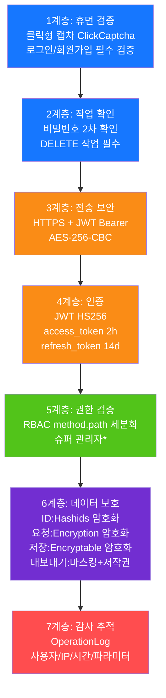

# 보안 심층 방어
<!-- lang-nav -->

Languages: [中文](11-security-defense.md) · [English](11-security-defense.en.md) · **한국어** · [Русский](11-security-defense.ru.md) · [Deutsch](11-security-defense.de.md) · [Français](11-security-defense.fr.md) · [Español](11-security-defense.es.md) · [Português](11-security-defense.pt.md) · [हिन्दी](11-security-defense.hi.md) · [العربية](11-security-defense.ar.md) · [বাংলা](11-security-defense.bn.md) · [Bahasa Indonesia](11-security-defense.id.md) · [日本語](11-security-defense.ja.md)

