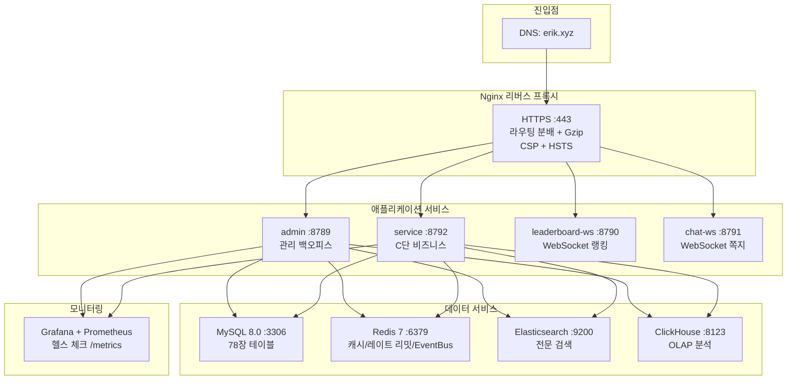

# 배포 아키텍처 (v2.0 — 7개 서비스)
<!-- lang-nav -->

Languages: [中文](12-deployment.md) · [English](12-deployment.en.md) · **한국어** · [Русский](12-deployment.ru.md) · [Deutsch](12-deployment.de.md) · [Français](12-deployment.fr.md) · [Español](12-deployment.es.md) · [Português](12-deployment.pt.md) · [हिन्दी](12-deployment.hi.md) · [العربية](12-deployment.ar.md) · [বাংলা](12-deployment.bn.md) · [Bahasa Indonesia](12-deployment.id.md) · [日本語](12-deployment.ja.md)

