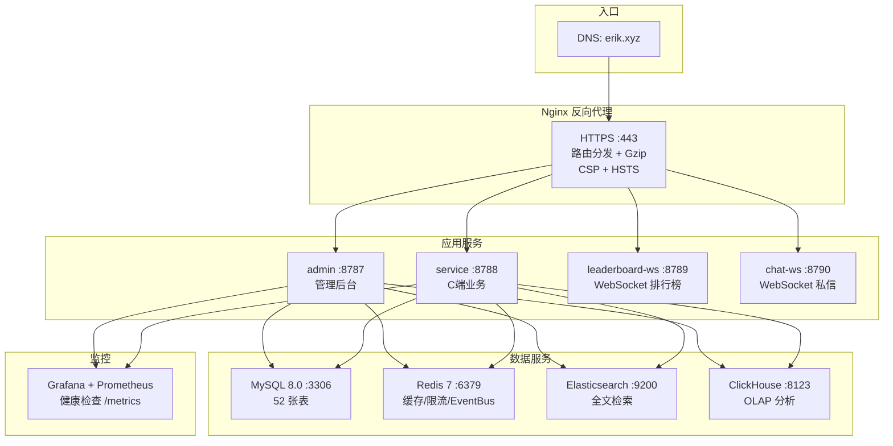

# 部署架构 (v2.0 — 8 服务)

```mermaid
flowchart TB
    subgraph "入口"
        DNS["DNS: erik.xyz"]
    end

    subgraph "Nginx 反向代理"
        NGX["HTTPS :443<br/>路由分发 + Gzip<br/>CSP + HSTS"]
    end

    subgraph "应用服务"
        ADM["admin :8787<br/>管理后台"]
        SVC["service :8788<br/>C端业务"]
        LB["leaderboard-ws :8789<br/>WebSocket 排行榜"]
        CHAT["chat-ws :8790<br/>WebSocket 私信"]
    end

    subgraph "数据服务"
        MYSQL["MySQL 8.0 :3306<br/>52 张表"]
        REDIS["Redis 7 :6379<br/>缓存/限流/EventBus"]
        ES["Elasticsearch :9200<br/>全文检索"]
        CH["ClickHouse :8123<br/>OLAP 分析"]
    end

    subgraph "监控"
        MON["Grafana + Prometheus<br/>健康检查 /metrics"]
    end

    DNS --> NGX
    NGX --> ADM & SVC & LB & CHAT
    ADM & SVC --> MYSQL & REDIS & ES & CH
    ADM & SVC --> MON
```
