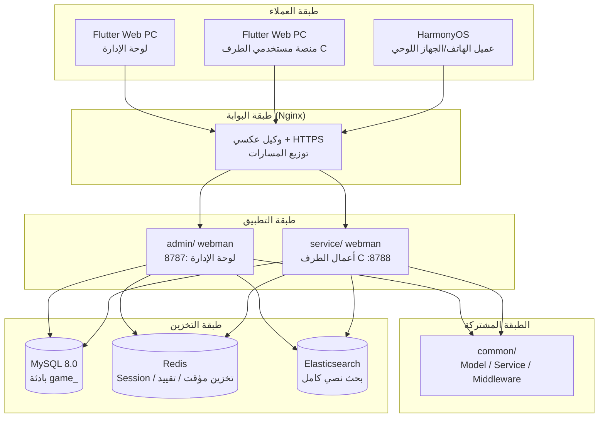

# منصة تجميع الألعاب العالمية — مواصفات التصميم
<!-- lang-nav -->

Languages: **中文** · [English](2026-05-22-game-platform-design.en.md) · [한국어](2026-05-22-game-platform-design.ko.md) · [Русский](2026-05-22-game-platform-design.ru.md) · [Deutsch](2026-05-22-game-platform-design.de.md) · [Français](2026-05-22-game-platform-design.fr.md) · [Español](2026-05-22-game-platform-design.es.md) · [Português](2026-05-22-game-platform-design.pt.md) · [हिन्दी](2026-05-22-game-platform-design.hi.md) · [العربية](2026-05-22-game-platform-design.ar.md) · [বাংলা](2026-05-22-game-platform-design.bn.md) · [Bahasa Indonesia](2026-05-22-game-platform-design.id.md) · [日本語](2026-05-22-game-platform-design.ja.md)


> Copyright (c) 2026 erik <erik@erik.xyz> — https://erik.xyz

## 1. نظرة عامة

منصة تجميع ألعاب عالمية شاملة. بعد التسجيل، يشحن المستخدم الأموال على المنصة لاستبدالها بعملات الألعاب، ويلعب الألعاب بعملات الألعاب ويكسب عملات ألعاب، ويمكن تحويل عملات الألعاب مرة أخرى إلى المحفظة وسحبها. يدير الخلفي مراجعة السحب وإدارة الألعاب وإدارة المستخدمين.

### استراتيجية الإصدارات

| الإصدار | الهدف | الفترة التقديرية |
|------|------|---------|
| الإصدار الأساسي (MVP) | تشغيل الحلقة الأساسية: تسجيل→شحن→استبدال→لعبة→سحب→مراجعة | 7-10 أيام |
| الإصدار القياسي | جاهز للإنتاج: مدفوعات عالمية، SDK ألعاب طرف ثالث، حوكمة مخاطر أساسية، واجهات أمامية ثلاثية | +10-15 يومًا |
| الإصدار الكامل | النموذج الكامل: تعدد لغات، لوحات متصدرين، قسائم، حوكمة مخاطر كاملة، وظائف شاملة | +10-15 يومًا |

---

## 2. حزمة التقنيات

### الخلفية
- PHP 8.3+، webman v2 (workerman/webman)
- قاعدة البيانات: MySQL 8.0+، بادئة الجداول `game_`
- المفتاح الأساسي: BIGINT غير تلقائي، يولَّد بواسطة `erikwang2013/snowflake-php`
- تشفير وفك تشفير معرّفات طبقة API: `erikwang2013/hashids`
- مصادقة JWT: `erikwang2013/jwt-webman`
- أعلام الدول: `erikwang2013/season`
- تشفير وفك تشفير البيانات الحساسة في API: `erikwang2013/encryption`
- تشفير وفك تشفير الحقول الحساسة في قاعدة البيانات: `erikwang2013/encryptable`
- مزامنة واستعلام ES: `erikwang2013/webman-scout`
- كشف أدوات الأمان: `erikwang2013/security-php`
- تحقق عشوائي للعمليات الحساسة: `erikwang2013/poster-php`

### الواجهة الأمامية
- Flutter 3.x، تصميم الويب بأسلوب لوحة إدارة PC (وليس أسلوب تطبيقات الجوال)
- عميل HarmonyOS ArkTS
- يُبنى لوحة الإدارة ومنصة الطرف C منفصلتين، وكلاهما بأسلوب PC

### معايير الكود
- يجب أن يحتوي رأس كل ملف `.php` جديد على إعلان الحقوق
- لا تُضاف بادئة `\` لمراجع الدوال/الفئات العامة، يُستخدم الاستيراد عبر `use`
- ملفات الإعدادات تتضمن تعليقات صينية توضح معاني عناصر الإعداد
- ملفات ترحيل قاعدة البيانات بصيغة SQL

---

## 3. هيكل المشروع

```
game-platform-php/
├── admin/                          # لوحة الإدارة (webman v2)
│   ├── app/admin/controller/       # وحدات التحكم
│   │   ├── GameController.php      # إدارة الألعاب
│   │   ├── WalletController.php    # إدارة المحافظ
│   │   ├── PaymentController.php   # إدارة المدفوعات
│   │   ├── WithdrawController.php  # مراجعة السحب
│   │   ├── CountryController.php   # إعدادات الدول
│   │   └── ...
│   ├── app/model/                  # نماذج البيانات
│   ├── config/                     # المسارات والإعدادات
│   └── install/        # ترحيلات SQL
│
├── service/                        # خادم أعمال الطرف C (webman v2)
│   ├── app/api/v1/controller/      # API الطرف C
│   │   ├── AuthController.php
│   │   ├── WalletController.php
│   │   ├── GameController.php
│   │   ├── DepositController.php
│   │   ├── WithdrawController.php
│   │   ├── ExchangeController.php
│   │   └── ...
│   ├── app/middleware/             # UserAuth(JWT) وغيرها
│   ├── config/                     # المسارات والإعدادات
│   └── install/        # الترحيلات المشتركة
│
├── common/                         # الطبقة المشتركة (PSR-4 autoload)
│   ├── model/                      # جميع النماذج
│   ├── service/                    # Snowflake, Hashids, Encryption...
│   └── middleware/                 # الوسائط المشتركة
│
├── apps/
│   ├── flutter/                    # واجهة Flutter الأمامية
│   │   ├── admin/                  # لوحة إدارة PC
│   │   └── platform/               # منصة مستخدمي الطرف C على PC
│   └── harmonyos/                  # عميل HarmonyOS
│
└── docs/superpowers/
    ├── specs/                      # مواصفات التصميم
    └── plans/                      # خطط التنفيذ
```

---

## 4. نماذج الأعمال الأساسية

### 4.1 نظام العملات

```
عملات قانونية (USD/CNY/EUR...)
  │  شحن/سحب
  ▼
عملات المنصة (موحدة)
  │  استبدال (يشمل سعر الصرف + عمولة المنصة)
  ▼
عملات الألعاب (مستقلة لكل لعبة)
  │  الربح/الإنفاق عبر اللعب
  ▼
عملات المنصة ← الاستبدال عكسيًا
```

- دقة عملات المنصة: decimal(18,4)
- لكل عملة لعبة سعر صرف مستقل مقابل عملات المنصة
- تفرض المنصة فرق الاستبدال spread_pct
- عمليات المحفظة تستخدم قفلًا تفاؤليًا عبر حقل version لمنع التزامن

### 4.2 عملية السحب

```
المستخدم يبدأ السحب
  │
  ├─ المفتاح العام مغلق → رفض، مع إشعار بعدم إمكانية السحب حاليًا
  │
  ├─ المفتاح العام مفتوح
  │     │
  │     ├─ المبلغ < عتبة المراجعة → موافقة تلقائية → تحويل
  │     │
  │     └─ المبلغ >= عتبة المراجعة → الدخول في قائمة المراجعة اليدوية
  │           │
  │           ├─ موافقة المشرف → تحويل
  │           └─ رفض المشرف → إعادة عملات المنصة + إرفاق السبب
```

---

## 5. تصميم قاعدة البيانات

### 5.1 قائمة جداول الإصدار الأساسي (12 جدولًا)

| الرقم | اسم الجدول | الوصف |
|------|------|------|
| 1 | `game_user` | مستخدمو الطرف C |
| 2 | `game_user_wallet` | محفظة عملات المنصة |
| 3 | `game_user_game_wallet` | محفظة عملات الألعاب |
| 4 | `game_game` | الألعاب |
| 5 | `game_game_currency` | عملات الألعاب |
| 6 | `game_deposit_order` | طلبات الشحن |
| 7 | `game_withdraw_order` | طلبات السحب |
| 8 | `game_exchange_record` | سجلات الاستبدال |
| 9 | `game_transaction` | حركات المنصة |
| 10 | `game_payment_method` | طرق الدفع |
| 11 | `game_announcement` | الإعلانات |
| 12 | `game-platform_config` | إعدادات المنصة (توسيع game_system_config الحالي) |

### 5.2 جداول الإصدار القياسي الجديدة (10 جداول)

| الرقم | اسم الجدول | الوصف |
|------|------|------|
| 13 | `game_user_identity` | التحقق من الهوية/KYC |
| 14 | `game_user_oauth` | تسجيل الدخول بطرف ثالث |
| 15 | `game_user_payment_account` | حسابات الاستلام |
| 16 | `game_user_session` | جلسات تسجيل الدخول |
| 17 | `game_game_server` | خوادم الألعاب |
| 18 | `game_game_play_log` | سجلات اللعب |
| 19 | `game_withdraw_limit` | قواعد حدود السحب |
| 20 | `game_risk_rule` | قواعد حوكمة المخاطر |
| 21 | `game_risk_log` | سجلات تفعيل المخاطر |
| 22 | `game_stat_daily` | لقطات الإحصائيات اليومية |

### 5.3 جداول الإصدار الكامل الجديدة (8 جداول)

| الرقم | اسم الجدول | الوصف |
|------|------|------|
| 23 | `game_game_category` | تصنيفات الألعاب |
| 24 | `game_game_category_rel` | علاقة الألعاب-التصنيفات |
| 25 | `game_leaderboard` | لوحات المتصدرين |
| 26 | `game_coupon` | القسائم |
| 27 | `game_user_coupon` | قسائم المستخدمين |
| 28 | `game_language` | تعريفات اللغات |
| 29 | `game_translation` | نصوص الترجمة |
| 30 | `game_country_config` | إعدادات الدول |
| 31 | `game-platform_revenue` | سجلات إيرادات المنصة |

---

## 6. تصميم API

### 6.1 API الإصدار الأساسي (الطرف C ~25)

```
واجهات عامة (بدون مصادقة):
  POST   /api/auth/register
  POST   /api/auth/login
  POST   /api/auth/refresh
  GET    /api/captcha/generate
  GET    /api/game/list
  GET    /api/game/{hashid}
  GET    /api/announcement/list

تتطلب مصادقة (UserAuth):
  GET    /api/wallet/info
  GET    /api/wallet/transactions
  POST   /api/deposit/create
  GET    /api/deposit/orders
  POST   /api/exchange/quote
  POST   /api/exchange/buy
  POST   /api/exchange/sell
  GET    /api/exchange/records
  POST   /api/withdraw/apply
  GET    /api/withdraw/orders
  POST   /api/game/launch
  GET    /api/game/play-logs
  GET    /api/user/profile
  PUT    /api/user/profile

لوحة الإدارة (AdminAuth + AdminPermission):
  GET    /admin/game/list
  POST   /admin/game/create
  PUT    /admin/game/{hashid}
  DELETE /admin/game/{hashid}
  GET    /admin/user/list
  GET    /admin/user/{hashid}
  PUT    /admin/user/{hashid}
  GET    /admin/deposit/orders
  GET    /admin/withdraw/orders
  PUT    /admin/withdraw/review
  PUT    /admin/withdraw/switch
  POST   /admin/withdraw/limits/set
  POST   /admin/payment/method/toggle
  POST   /admin/announcement/create
  POST   /admin/export/users
  POST   /admin/export/transactions
  GET    /admin/dashboard/platform
```

### 6.2 صيغة الاستجابة

جميع الواجهات تستجيب بصيغة موحدة:

```json
{
  "code": 0,
  "message": "success",
  "data": { ... }
}
```

| code | المعنى |
|------|------|
| 0 | نجاح |
| 400 | خطأ في المعاملات |
| 401 | غير مصادَق |
| 403 | لا صلاحية |
| 404 | غير موجود |
| 422 | فشل التحقق |
| 500 | خطأ في الخادم |

---

## 7. مخططات البنية

### 7.1 طوبولوجيا النظام



### 7.2 تدفق العملات

```mermaid
flowchart LR
    U["المستخدم"] -->|"شحن بعملة قانونية"| D["طلب الشحن"]
    D -->|"وصول"| PW["محفظة عملات المنصة"]
    PW -->|"استبدال (شراء)"| GW["محفظة عملات الألعاب"]
    GW -->|"لعب الألعاب"| G["الألعاب"]
    G -->|"كسب"| GW2["زيادة عملات الألعاب"]
    GW2 -->|"استبدال (بيع)"| PW2["رصيد عملات المنصة"]
    PW2 -->|"طلب سحب"| WO["طلب السحب"]
    WO -->|"موافقة المراجعة"| W["المحفظة/البنك"]
```



---

## 8. التصميم الأمني

على أساس الدفاع المتعمق الحالي المكون من 18 طبقة، تُضاف لمنصة الألعاب:

| الطبقة | الإجراء |
|------|------|
| أمان التزامن | قفل تفاؤلي version في جداول المحافظ، لمنع الخصم/الوصول المكرر |
| أمان السحب | مفتاح عام + مراجعة بعتبة مبلغ + حد يومي/شهري + تحقق عشوائي poster-php |
| أمان الاستبدال | فصل الاستعلام عن التسعير عن التنفيذ، انتهاء صلاحية الاستعلام بعد 60 ثانية، إعادة حساب سعر الصرف عند التنفيذ |
| أمان الألعاب | التحقق من توقيع استدعاءات الطرف الثالث، قائمة IP بيضاء، الدفاع ضد replay attack |
| حوكمة المخاطر | محرك قواعد المخاطر، حظر المعاملات الشاذة |

---

## 9. مراحل التطوير

### الإصدار الأساسي (تشغيل الحلقة الأساسية)

1. البنية التحتية: هيكل الدلائل، إعدادات composer، ترحيلات قاعدة البيانات، الطبقة المشتركة
2. أساسيات الطرف C: تسجيل/دخول، محفظة عملات المنصة، شحن (Stripe)، استبدال (سعر صرف ثابت)، سحب (مراجعة يدوية)
3. إدارة الألعاب: CRUD في الخلفية، API قائمة الألعاب، تفاصيل اللعبة
4. لوحة الإدارة: زر مراجعة السحب، المفتاح العام، إدارة المستخدمين
5. Flutter PC: توسيع لوحة الإدارة + منصة الطرف C (الحد الأدنى، 5 صفحات)
6. اختبار وتحقق: الشحن→الاستبدال→السحب حلقة كاملة

### الإصدار القياسي (جاهز للإنتاج)

1. تسجيل دخول OAuth، طرق دفع متعددة، استدعاءات تلقائية
2. ربط SDK ألعاب الطرف الثالث (التحقق من التوقيع، التسوية بالاستدعاءات)
3. سعر صرف ديناميكي، KYC، قواعد الحدود، أساسيات حوكمة المخاطر
4. تصور لوحة التحكم، تصدير Excel
5. عميل HarmonyOS

### الإصدار الكامل (النموذج الكامل)

1. التدويل (تعدد اللغات، تعدد العملات، إعدادات متميزة حسب الدولة)
2. لوحات المتصدرين، القسائم، نظام الإعلانات
3. محرك حوكمة مخاطر كامل، لقطات إحصائيات يومية
4. بحث ES، تصدير PDF
5. اختبارات شاملة، توثيق API
