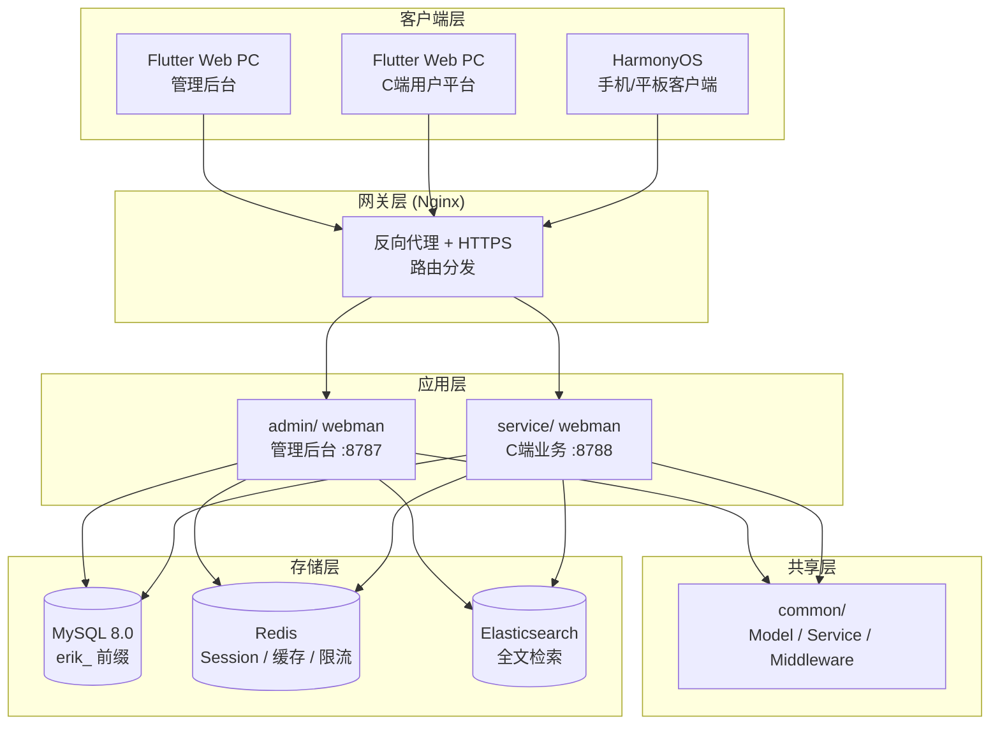
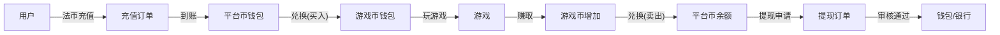

# 全球游戏聚合平台 — 设计规范
<!-- lang-nav -->

Languages: [中文](2026-05-22-game-platform-design.md) · [English](2026-05-22-game-platform-design.en.md) · [한국어](2026-05-22-game-platform-design.ko.md) · [Русский](2026-05-22-game-platform-design.ru.md) · [Deutsch](2026-05-22-game-platform-design.de.md) · [Français](2026-05-22-game-platform-design.fr.md) · [Español](2026-05-22-game-platform-design.es.md) · [Português](2026-05-22-game-platform-design.pt.md) · [हिन्दी](2026-05-22-game-platform-design.hi.md) · [العربية](2026-05-22-game-platform-design.ar.md) · **বাংলা** · [Bahasa Indonesia](2026-05-22-game-platform-design.id.md) · [日本語](2026-05-22-game-platform-design.ja.md)


> Copyright (c) 2026 erik <erik@erik.xyz> — https://erik.xyz

## 1. সংক্ষিপ্ত বিবরণ

বিশ্বব্যাপী সাধারণ-উদ্দেশ্য গেম অ্যাগ্রিগেশন প্ল্যাটফর্ম। ব্যবহারকারী রেজিস্ট্রেশনের পর প্ল্যাটফর্মে টপ-আপ করে গেম কয়েনে বিনিময় করে, গেম কয়েন দিয়ে গেম খেলে ও গেম কয়েন অর্জন করে; গেম কয়েন আবার ওয়ালেটে ফিরিয়ে উত্তোলন করা যায়। ব্যাকএন্ডে উত্তোলন পর্যালোচনা, গেম ব্যবস্থাপনা, ব্যবহারকারী ব্যবস্থাপনা পরিচালিত হয়।

### সংস্করণ কৌশল

| সংস্করণ | লক্ষ্য | আনুমানিক সময়কাল |
|------|------|---------|
| বেসিক (MVP) | মূল ক্লোজড-লুপ চালু: রেজিস্ট্রেশন→টপ-আপ→বিনিময়→গেম→উত্তোলন→পর্যালোচনা | ৭-১০ দিন |
| স্ট্যান্ডার্ড | প্রোডাকশন-রেডি: গ্লোবাল পেমেন্ট, থার্ড-পার্টি গেম SDK, মৌলিক রিস্ক কন্ট্রোল, তিন প্রান্ত ফ্রন্টএন্ড | +১০-১৫ দিন |
| কমপ্লিট | সম্পূর্ণ: বহুভাষা, লিডারবোর্ড, কুপন, সম্পূর্ণ রিস্ক কন্ট্রোল, পূর্ণ ফিচার | +১০-১৫ দিন |

---

## 2. টেক স্ট্যাক

### ব্যাকএন্ড
- PHP 8.3+, webman v2 (workerman/webman)
- ডেটাবেস: MySQL 8.0+, টেবিল প্রিফিক্স `erik_`
- প্রাইমারি কী: BIGINT নন-অটো-ইনক্রিমেন্ট, `erikwang2013/snowflake-php` দ্বারা তৈরি
- API স্তরের ID এনক্রিপশন/ডিক্রিপশন: `erikwang2013/hashids`
- JWT অথেনটিকেশন: `erikwang2013/jwt-webman`
- দেশের পতাকা: `erikwang2013/season`
- API সংবেদনশীল ডেটা এনক্রিপশন/ডিক্রিপশন: `erikwang2013/encryption`
- ডেটাবেস সংবেদনশীল ফিল্ড এনক্রিপশন/ডিক্রিপশন: `erikwang2013/encryptable`
- ES সিঙ্ক ও কুয়েরি: `erikwang2013/webman-scout`
- নিরাপত্তা টুল ডিটেকশন: `erikwang2013/security-php`
- সংবেদনশীল অপারেশন র্যান্ডম ভেরিফিকেশন: `erikwang2013/poster-php`

### ফ্রন্টএন্ড
- Flutter 3.x, Web প্রান্ত PC অ্যাডমিন প্যানেল শৈলীতে ডিজাইন করা (মোবাইল অ্যাপ শৈলী নয়)
- HarmonyOS ArkTS ক্লায়েন্ট
- অ্যাডমিন প্যানেল ও C-এন্ড প্ল্যাটফর্ম আলাদাভাবে নির্মিত, উভয়ই PC শৈলী

### কোড কনভেনশন
- সব নতুন তৈরি `.php` ফাইলের হেডারে অবশ্যই কপিরাইট ঘোষণা থাকতে হবে
- গ্লোবাল ফাংশন/ক্লাস রেফারেন্সে অগ্রবর্তী `\` নেই, `use` ইমপোর্ট ব্যবহৃত হয়
- কনফিগ ফাইলে কনফিগ আইটেমের অর্থ বোঝাতে চীনা কমেন্ট থাকে
- ডেটাবেস মাইগ্রেশন ফাইল SQL ফরম্যাটে হয়

---

## 3. প্রজেক্ট স্ট্রাকচার

```
game-platform-php/
├── admin/                          # 管理后台（webman v2）
│   ├── app/admin/controller/       # 控制器
│   │   ├── GameController.php      # 游戏管理
│   │   ├── WalletController.php    # 钱包管理
│   │   ├── PaymentController.php   # 支付管理
│   │   ├── WithdrawController.php  # 提现审核
│   │   ├── CountryController.php   # 国家配置
│   │   └── ...
│   ├── app/model/                  # 数据模型
│   ├── config/                     # 路由 & 配置
│   └── database/migrations/        # SQL 迁移
│
├── service/                        # C端业务端（webman v2）
│   ├── app/api/v1/controller/      # C端API
│   │   ├── AuthController.php
│   │   ├── WalletController.php
│   │   ├── GameController.php
│   │   ├── DepositController.php
│   │   ├── WithdrawController.php
│   │   ├── ExchangeController.php
│   │   └── ...
│   ├── app/middleware/             # UserAuth(JWT) 等
│   ├── config/                     # 路由 & 配置
│   └── database/migrations/        # 共享迁移
│
├── common/                         # 共享层（PSR-4 autoload）
│   ├── model/                      # 所有 Model
│   ├── service/                    # Snowflake, Hashids, Encryption...
│   └── middleware/                  # 共享中间件
│
├── apps/
│   ├── flutter/                    # Flutter 前端
│   │   ├── admin/                  # PC 管理后台
│   │   └── platform/               # PC C端用户平台
│   └── harmonyos/                  # HarmonyOS 客户端
│
└── docs/superpowers/
    ├── specs/                      # 设计规范
    └── plans/                      # 实现计划
```

---

## 4. মূল ব্যবসায়িক মডেল

### 4.1 মুদ্রা সিস্টেম

```
法币 (USD/CNY/EUR...)
  │  充值/提现
  ▼
平台币 (统一)
  │  兑换（含汇率+平台抽成）
  ▼
游戏币 (每种游戏独立)
  │  玩游戏赚/花
  ▼
平台币 ← 兑回
```

- প্ল্যাটফর্ম কয়েন নির্ভুলতা: decimal(18,4)
- প্রতিটি গেম কয়েনের প্ল্যাটফর্ম কয়েনের সাপেক্ষে আলাদা বিনিময় হার আছে
- প্ল্যাটফর্ম বিনিময় স্প্রেড `spread_pct` আদায় করে
- ওয়ালেট অপারেশনে কনকারেন্সি প্রতিরোধে অপটিমিস্টিক লক `version` ফিল্ড ব্যবহৃত হয়

### 4.2 উত্তোলন প্রক্রিয়া

```
用户发起提现
  │
  ├─ 全局开关关闭 → 拒绝，提示暂不可提现
  │
  ├─ 全局开关开启
  │     │
  │     ├─ 金额 < 审核阈值 → 自动通过 → 打款
  │     │
  │     └─ 金额 >= 审核阈值 → 进入人工审核队列
  │           │
  │           ├─ 管理员通过 → 打款
  │           └─ 管理员拒绝 → 退回平台币 + 附注原因
```

---

## 5. ডেটাবেস ডিজাইন

### 5.1 বেসিক সংস্করণ টেবিল তালিকা (১২টি)

| ক্রম | টেবিলের নাম | বিবরণ |
|------|------|------|
| 1 | `erik_user` | C-এন্ড ব্যবহারকারী |
| 2 | `erik_user_wallet` | প্ল্যাটফর্ম কয়েন ওয়ালেট |
| 3 | `erik_user_game_wallet` | গেম কয়েন ওয়ালেট |
| 4 | `erik_game` | গেম |
| 5 | `erik_game_currency` | গেম কয়েনের ধরন |
| 6 | `erik_deposit_order` | টপ-আপ অর্ডার |
| 7 | `erik_withdraw_order` | উত্তোলন অর্ডার |
| 8 | `erik_exchange_record` | বিনিময় রেকর্ড |
| 9 | `erik_transaction` | প্ল্যাটফর্ম লেজার |
| 10 | `erik_payment_method` | পেমেন্ট মাধ্যম |
| 11 | `erik_announcement` | ঘোষণা |
| 12 | `erik_platform_config` | প্ল্যাটফর্ম কনফিগ (বিদ্যমান erik_system_config-কে সম্প্রসারণ) |

### 5.2 স্ট্যান্ডার্ড সংস্করণে নতুন (১০টি)

| ক্রম | টেবিলের নাম | বিবরণ |
|------|------|------|
| 13 | `erik_user_identity` | রিয়েল-নেম/KYC |
| 14 | `erik_user_oauth` | থার্ড-পার্টি লগইন |
| 15 | `erik_user_payment_account` | প্রাপ্তি অ্যাকাউন্ট |
| 16 | `erik_user_session` | লগইন সেশন |
| 17 | `erik_game_server` | গেম সার্ভার/অঞ্চল |
| 18 | `erik_game_play_log` | গেম রেকর্ড |
| 19 | `erik_withdraw_limit` | উত্তোলন সীমা নিয়ম |
| 20 | `erik_risk_rule` | রিস্ক কন্ট্রোল নিয়ম |
| 21 | `erik_risk_log` | রিস্ক কন্ট্রোল ট্রিগার রেকর্ড |
| 22 | `erik_stat_daily` | দৈনিক পরিসংখ্যান স্ন্যাপশট |

### 5.3 কমপ্লিট সংস্করণে নতুন (৮টি)

| ক্রম | টেবিলের নাম | বিবরণ |
|------|------|------|
| 23 | `erik_game_category` | গেম ক্যাটাগরি |
| 24 | `erik_game_category_rel` | গেম-ক্যাটাগরি সম্পর্ক |
| 25 | `erik_leaderboard` | লিডারবোর্ড |
| 26 | `erik_coupon` | কুপন |
| 27 | `erik_user_coupon` | ব্যবহারকারী কুপন গ্রহণ |
| 28 | `erik_language` | ভাষা সংজ্ঞা |
| 29 | `erik_translation` | অনুবাদ পাঠ্য |
| 30 | `erik_country_config` | দেশ কনফিগ |
| 31 | `erik_platform_revenue` | প্ল্যাটফর্ম রাজস্ব রেকর্ড |

---

## 6. API ডিজাইন

### 6.1 বেসিক সংস্করণ API (C-এন্ড ~২৫টি)

```
公开接口（无需认证）:
  POST   /api/auth/register
  POST   /api/auth/login
  POST   /api/auth/refresh
  GET    /api/captcha/generate
  GET    /api/game/list
  GET    /api/game/{hashid}
  GET    /api/announcement/list

需认证 (UserAuth):
  GET    /api/wallet/info
  GET    /api/wallet/transactions
  POST   /api/deposit/create
  GET    /api/deposit/orders
  POST   /api/exchange/quote
  POST   /api/exchange/buy
  POST   /api/exchange/sell
  GET    /api/exchange/records
  POST   /api/withdraw/apply
  GET    /api/withdraw/orders
  POST   /api/game/launch
  GET    /api/game/play-logs
  GET    /api/user/profile
  PUT    /api/user/profile

管理后台（AdminAuth + AdminPermission）:
  GET    /admin/game/list
  POST   /admin/game/create
  PUT    /admin/game/{hashid}
  DELETE /admin/game/{hashid}
  GET    /admin/user/list
  GET    /admin/user/{hashid}
  PUT    /admin/user/{hashid}
  GET    /admin/deposit/orders
  GET    /admin/withdraw/orders
  PUT    /admin/withdraw/review
  PUT    /admin/withdraw/switch
  POST   /admin/withdraw/limits/set
  POST   /admin/payment/method/toggle
  POST   /admin/announcement/create
  POST   /admin/export/users
  POST   /admin/export/transactions
  GET    /admin/dashboard/platform
```

### 6.2 রেসপন্স ফরম্যাট

সব ইন্টারফেসের ইউনিফাইড রেসপন্স:

```json
{
  "code": 0,
  "message": "success",
  "data": { ... }
}
```

| code | অর্থ |
|------|------|
| 0 | সফল |
| 400 | প্যারামিটার ত্রুটি |
| 401 | অথেনটিকেটেড নয় |
| 403 | পারমিশন নেই |
| 404 | অস্তিত্ব নেই |
| 422 | ভেরিফিকেশন ব্যর্থ |
| 500 | সার্ভার ত্রুটি |

---

## 7. আর্কিটেকচার ডায়াগ্রাম

### 7.1 সিস্টেম টপোলজি



### 7.2 মুদ্রা প্রবাহ



---

## 8. নিরাপত্তা ডিজাইন

বিদ্যমান ১৮ স্তরের গভীর প্রতিরক্ষার ভিত্তিতে গেম প্ল্যাটফর্মের জন্য নতুন যোগ:

| স্তর | ব্যবস্থা |
|------|------|
| কনকারেন্সি নিরাপত্তা | ওয়ালেট টেবিলে version অপটিমিস্টিক লক, ডুপ্লিকেট ডেবিট/ডুপ্লিকেট ক্রেডিট প্রতিরোধ |
| উত্তোলন নিরাপত্তা | গ্লোবাল সুইচ + পরিমাণ থ্রেশহোল্ড পর্যালোচনা + দৈনিক/মাসিক সীমা + poster-php র্যান্ডম ভেরিফিকেশন |
| বিনিময় নিরাপত্তা | কোটেশন ও এক্সিকিউশন পৃথক; কোটেশন ৬০ সেকেন্ডে মেয়াদোত্তীর্ণ; এক্সিকিউশনে পুনরায় রেট গণনা |
| গেম নিরাপত্তা | থার্ড-পার্টি কলব্যাক সিগনেচার ভেরিফিকেশন, IP হোয়াইটলিস্ট, replay attack প্রতিরোধ |
| রিস্ক কন্ট্রোল | রিস্ক কন্ট্রোল রুল ইঞ্জিন, অস্বাভাবিক লেনদেন ব্লক |

---

## 9. ডেভেলপমেন্ট ফেজ

### বেসিক সংস্করণ (কোর ক্লোজড-লুপ চালু)

1. ইনফ্রাস্ট্রাকচার: ডিরেক্টরি স্ট্রাকচার, composer কনফিগ, ডেটাবেস মাইগ্রেশন, শেয়ার্ড লেয়ার
2. C-এন্ড কোর: রেজিস্ট্রেশন/লগইন, প্ল্যাটফর্ম কয়েন ওয়ালেট, টপ-আপ(Stripe), বিনিময়(ফিক্সড রেট), উত্তোলন(মানব পর্যালোচনা)
3. গেম ম্যানেজমেন্ট: ব্যাকএন্ড CRUD, গেম তালিকা API, গেম ডিটেইল
4. অ্যাডমিন প্যানেল: উত্তোলন পর্যালোচনা বাটন, গ্লোবাল সুইচ, ব্যবহারকারী ব্যবস্থাপনা
5. Flutter PC: অ্যাডমিন প্যানেল এক্সটেনশন + C-এন্ড প্ল্যাটফর্ম (সর্বনিম্ন, ৫ পেজ)
6. টেস্ট ভেরিফিকেশন: টপ-আপ→বিনিময়→উত্তোলন সম্পূর্ণ লিংক

### স্ট্যান্ডার্ড সংস্করণ (প্রোডাকশন-রেডি)

1. OAuth লগইন, মাল্টি-পেমেন্ট মাধ্যম, অটো কলব্যাক
2. থার্ড-পার্টি গেম SDK ইন্টিগ্রেশন (সিগনেচার ভেরিফিকেশন, কলব্যাক সেটেলমেন্ট)
3. ডাইনামিক এক্সচেঞ্জ রেট, KYC, সীমা নিয়ম, মৌলিক রিস্ক কন্ট্রোল
4. ড্যাশবোর্ড ভিজুয়ালাইজেশন, Excel এক্সপোর্ট
5. HarmonyOS ক্লায়েন্ট

### কমপ্লিট সংস্করণ (সম্পূর্ণ)

1. ইন্টারন্যাশনালাইজেশন (বহুভাষা, মাল্টি-কারেন্সি, দেশভেদে কনফিগ)
2. লিডারবোর্ড, কুপন, ঘোষণা সিস্টেম
3. সম্পূর্ণ রিস্ক কন্ট্রোল ইঞ্জিন, দৈনিক পরিসংখ্যান স্ন্যাপশট
4. ES সার্চ, PDF এক্সপোর্ট
5. সম্পূর্ণ টেস্টিং, API ডকুমেন্টেশন
