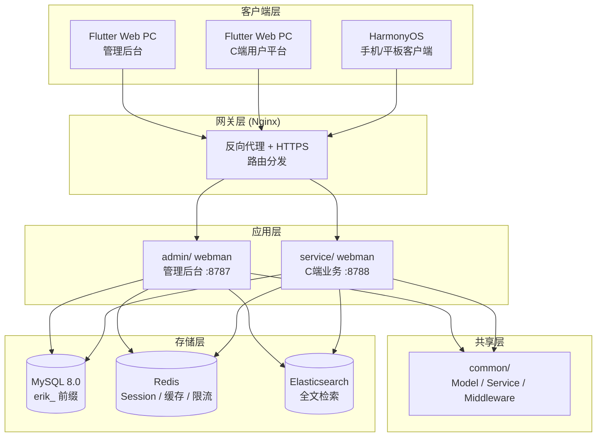
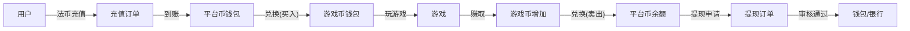

# Globale Spielaggregationsplattform — Designnorm
<!-- lang-nav -->

Languages: **中文** · [English](2026-05-22-game-platform-design.en.md) · [한국어](2026-05-22-game-platform-design.ko.md) · [Русский](2026-05-22-game-platform-design.ru.md) · [Deutsch](2026-05-22-game-platform-design.de.md) · [Français](2026-05-22-game-platform-design.fr.md) · [Español](2026-05-22-game-platform-design.es.md) · [Português](2026-05-22-game-platform-design.pt.md) · [हिन्दी](2026-05-22-game-platform-design.hi.md) · [العربية](2026-05-22-game-platform-design.ar.md) · [বাংলা](2026-05-22-game-platform-design.bn.md) · [Bahasa Indonesia](2026-05-22-game-platform-design.id.md) · [日本語](2026-05-22-game-platform-design.ja.md)


> Copyright (c) 2026 erik <erik@erik.xyz> — https://erik.xyz

## 1. Übersicht

Globale, universelle Spielaggregationsplattform. Nach der Registrierung lädt der Benutzer Guthaben auf, um Spielwährung zu kaufen; mit der Spielwährung spielt er Spiele und verdient Spielwährung, die wieder zurück in die Wallet übertragen und ausgezahlt werden kann. Das Backend verwaltet Auszahlungsprüfungen, Spieleverwaltung und Benutzerverwaltung.

### Versionsstrategie

| Version | Ziel | Geschätzte Dauer |
|------|------|---------|
| Basisversion (MVP) | Kernschleife durchlaufen lassen: Registrierung → Einzahlung → Umtausch → Spiel → Auszahlung → Prüfung | 7-10 Tage |
| Standardversion | Produktionstauglich: globalisierte Zahlungen, SDKs von Drittanbietern, Basis-Risikokontrolle, drei Frontend-Endgeräte | +10-15 Tage |
| Vollversion | Kompletter Ausbau: Mehrsprachigkeit, Ranglisten, Gutscheine, vollständige Risikokontrolle, alle Funktionen | +10-15 Tage |

---

## 2. Technologie-Stack

### Backend
- PHP 8.3+, webman v2 (workerman/webman)
- Datenbank: MySQL 8.0+, Tabellenpräfix `erik_`
- Primärschlüssel: BIGINT, nicht auto-increment, generiert von `erikwang2013/snowflake-php`
- ID-Verschlüsselung in der API-Schicht: `erikwang2013/hashids`
- JWT-Authentifizierung: `erikwang2013/jwt-webman`
- Länderflaggen: `erikwang2013/season`
- Verschlüsselung sensibler API-Daten: `erikwang2013/encryption`
- Verschlüsselung sensibler Datenbankfelder: `erikwang2013/encryptable`
- ES-Synchronisierung und -Abfrage: `erikwang2013/webman-scout`
- Sicherheitswerkzeug-Erkennung: `erikwang2013/security-php`
- Zufallsvalidierung sensibler Operationen: `erikwang2013/poster-php`

### Frontend
- Flutter 3.x, Web-Endgerät im PC-Verwaltungslayout gestaltet (nicht Mobile-App-Stil)
- HarmonyOS ArkTS-Client
- Verwaltungsbackend und C-End-Plattform werden getrennt gebaut, beide im PC-Stil

### Codestandards
- Alle neuen `.php`-Dateien müssen den Copyright-Hinweis als Dateikopf enthalten
- Globale Funktions-/Klassenreferenzen ohne vorangestelltes `\`, Import per `use`
- Konfigurationsdateien enthalten chinesische Kommentare zur Bedeutung der Konfigurationselemente
- Datenbank-Migrationsdateien im SQL-Format

---

## 3. Projektstruktur

```
game-platform-php/
├── admin/                          # Verwaltungsbackend (webman v2)
│   ├── app/admin/controller/       # Controller
│   │   ├── GameController.php      # Spieleverwaltung
│   │   ├── WalletController.php    # Wallet-Verwaltung
│   │   ├── PaymentController.php   # Zahlungsverwaltung
│   │   ├── WithdrawController.php  # Auszahlungsprüfung
│   │   ├── CountryController.php   # Länderkonfiguration
│   │   └── ...
│   ├── app/model/                  # Datenmodelle
│   ├── config/                     # Routen & Konfiguration
│   └── install/        # SQL-Migrationen
│
├── service/                        # C-End-Geschäftsbackend (webman v2)
│   ├── app/api/v1/controller/      # C-End-APIs
│   │   ├── AuthController.php
│   │   ├── WalletController.php
│   │   ├── GameController.php
│   │   ├── DepositController.php
│   │   ├── WithdrawController.php
│   │   ├── ExchangeController.php
│   │   └── ...
│   ├── app/middleware/             # UserAuth(JWT) usw.
│   ├── config/                     # Routen & Konfiguration
│   └── install/        # gemeinsame Migrationen
│
├── common/                         # gemeinsame Schicht (PSR-4 autoload)
│   ├── model/                      # alle Modelle
│   ├── service/                    # Snowflake, Hashids, Encryption...
│   └── middleware/                 # gemeinsame Middleware
│
├── apps/
│   ├── flutter/                    # Flutter-Frontend
│   │   ├── admin/                  # PC-Verwaltungsbackend
│   │   └── platform/               # PC-C-End-Benutzerplattform
│   └── harmonyos/                  # HarmonyOS-Client
│
└── docs/superpowers/
    ├── specs/                      # Designnormen
    └── plans/                      # Implementierungspläne
```

---

## 4. Kern-Geschäftsmodelle

### 4.1 Währungssystem

```
Fiat-Währung (USD/CNY/EUR...)
  │  Einzahlung/Auszahlung
  ▼
Plattformwährung (einheitlich)
  │  Umtausch (inkl. Wechselkurs + Plattformanteil)
  ▼
Spielwährung (pro Spiel unabhängig)
  │  durch Spiele verdienen/ausgeben
  ▼
Plattformwährung ← zurücktauschen
```

- Plattformwährungs-Präzision: decimal(18,4)
- Jede Spielwährung hat einen unabhängigen Wechselkurs zur Plattformwährung
- Die Plattform erhebt die Umtauschspanne spread_pct
- Wallet-Operationen verwenden das Optimistic-Lock-Feld version gegen Nebenläufigkeit

### 4.2 Auszahlungsablauf

```
Benutzer beantragt Auszahlung
  │
  ├─ Globaler Schalter aus → Ablehnung, Hinweis: derzeit keine Auszahlung möglich
  │
  ├─ Globaler Schalter an
  │     │
  │     ├─ Betrag < Prüfschwelle → automatisch genehmigt → Auszahlung
  │     │
  │     └─ Betrag >= Prüfschwelle → manuelle Prüfungswarteschlange
  │           │
  │           ├─ Admin genehmigt → Auszahlung
  │           └─ Admin lehnt ab → Plattformwährung zurückerstatten + Grund beifügen
```

---

## 5. Datenbankdesign

### 5.1 Tabellenliste der Basisversion (12 Tabellen)

| Nr. | Tabellenname | Beschreibung |
|------|------|------|
| 1 | `erik_user` | C-End-Benutzer |
| 2 | `erik_user_wallet` | Plattformwährungs-Wallet |
| 3 | `erik_user_game_wallet` | Spielwährungs-Wallet |
| 4 | `erik_game` | Spiel |
| 5 | `erik_game_currency` | Spielwährung |
| 6 | `erik_deposit_order` | Einzahlungsauftrag |
| 7 | `erik_withdraw_order` | Auszahlungsauftrag |
| 8 | `erik_exchange_record` | Umtauschprotokoll |
| 9 | `erik_transaction` | Plattformtransaktionen |
| 10 | `erik_payment_method` | Zahlungsmethode |
| 11 | `erik_announcement` | Ankündigung |
| 12 | `erik_platform_config` | Plattformkonfiguration (erweitert die bestehende erik_system_config) |

### 5.2 Standardversion neu (10 Tabellen)

| Nr. | Tabellenname | Beschreibung |
|------|------|------|
| 13 | `erik_user_identity` | Echte-Name/KYC |
| 14 | `erik_user_oauth` | Drittanbieter-Login |
| 15 | `erik_user_payment_account` | Zahlungsempfängerkonto |
| 16 | `erik_user_session` | Login-Sitzung |
| 17 | `erik_game_server` | Spielserver/Region |
| 18 | `erik_game_play_log` | Spielprotokoll |
| 19 | `erik_withdraw_limit` | Auszahlungslimitregeln |
| 20 | `erik_risk_rule` | Risikokontrollregeln |
| 21 | `erik_risk_log` | Auslöseprotokoll der Risikokontrolle |
| 22 | `erik_stat_daily` | Tagesstatistik-Snapshot |

### 5.3 Vollversion neu (8 Tabellen)

| Nr. | Tabellenname | Beschreibung |
|------|------|------|
| 23 | `erik_game_category` | Spielkategorie |
| 24 | `erik_game_category_rel` | Spiel-Kategorie-Zuordnung |
| 25 | `erik_leaderboard` | Rangliste |
| 26 | `erik_coupon` | Gutschein |
| 27 | `erik_user_coupon` | Benutzer-Gutscheine |
| 28 | `erik_language` | Sprachdefinitionen |
| 29 | `erik_translation` | Übersetzungstexte |
| 30 | `erik_country_config` | Länderkonfiguration |
| 31 | `erik_platform_revenue` | Plattformerlösprotokoll |

---

## 6. API-Design

### 6.1 APIs der Basisversion (C-End, ~25)

```
Öffentliche Schnittstellen (keine Authentifizierung erforderlich):
  POST   /api/auth/register
  POST   /api/auth/login
  POST   /api/auth/refresh
  GET    /api/captcha/generate
  GET    /api/game/list
  GET    /api/game/{hashid}
  GET    /api/announcement/list

Authentifiziert (UserAuth):
  GET    /api/wallet/info
  GET    /api/wallet/transactions
  POST   /api/deposit/create
  GET    /api/deposit/orders
  POST   /api/exchange/quote
  POST   /api/exchange/buy
  POST   /api/exchange/sell
  GET    /api/exchange/records
  POST   /api/withdraw/apply
  GET    /api/withdraw/orders
  POST   /api/game/launch
  GET    /api/game/play-logs
  GET    /api/user/profile
  PUT    /api/user/profile

Verwaltungsbackend (AdminAuth + AdminPermission):
  GET    /admin/game/list
  POST   /admin/game/create
  PUT    /admin/game/{hashid}
  DELETE /admin/game/{hashid}
  GET    /admin/user/list
  GET    /admin/user/{hashid}
  PUT    /admin/user/{hashid}
  GET    /admin/deposit/orders
  GET    /admin/withdraw/orders
  PUT    /admin/withdraw/review
  PUT    /admin/withdraw/switch
  POST   /admin/withdraw/limits/set
  POST   /admin/payment/method/toggle
  POST   /admin/announcement/create
  POST   /admin/export/users
  POST   /admin/export/transactions
  GET    /admin/dashboard/platform
```

### 6.2 Antwortformat

Alle Schnittstellen antworten einheitlich:

```json
{
  "code": 0,
  "message": "success",
  "data": { ... }
}
```

| code | Bedeutung |
|------|------|
| 0 | Erfolg |
| 400 | Parameterfehler |
| 401 | Nicht authentifiziert |
| 403 | Keine Berechtigung |
| 404 | Nicht vorhanden |
| 422 | Validierungsfehler |
| 500 | Serverfehler |

---

## 7. Architekturdiagramme

### 7.1 Systemtopologie



### 7.2 Währungsfluss



---

## 8. Sicherheitsdesign

Aufbauend auf den bestehenden 18 Verteidigungsebenen, neu für die Spielplattform:

| Ebene | Maßnahme |
|------|------|
| Nebenläufigkeitssicherheit | version-Optimistic-Lock in der Wallet-Tabelle gegen doppelte Abbuchung/doppelte Gutschrift |
| Auszahlungssicherheit | Globaler Schalter + Betragsschwellenprüfung + Tages-/Monatslimit + poster-php-Zufallsvalidierung |
| Umtauschsicherheit | Preisangebot und Ausführung getrennt, Angebot läuft in 60s ab, Wechselkurs wird bei Ausführung neu berechnet |
| Spielsicherheit | Signaturprüfung der Callbacks von Drittanbietern, IP-Whitelist, Replay-Attack-Abwehr |
| Risikokontrolle | Risikokontroll-Regel-Engine, Blockierung anormaler Transaktionen |

---

## 9. Entwicklungsphasen

### Basisversion (Kernschleife durchlaufen lassen)

1. Infrastruktur: Verzeichnisstruktur, composer-Konfiguration, Datenbankmigrationen, gemeinsame Schicht
2. C-End-Kern: Registrierung/Login, Plattformwährungs-Wallet, Einzahlung (Stripe), Umtausch (fester Wechselkurs), Auszahlung (manuelle Prüfung)
3. Spieleverwaltung: Backend-CRUD, Spielelisten-API, Spieldetails
4. Verwaltungsbackend: Auszahlungsprüfungs-Schaltflächen, globaler Schalter, Benutzerverwaltung
5. Flutter PC: Verwaltungsbackend-Erweiterung + C-End-Plattform (minimal, 5 Seiten)
6. Test und Verifikation: vollständige Kette Einzahlung → Umtausch → Auszahlung

### Standardversion (produktionstauglich)

1. OAuth-Login, mehrere Zahlungsmethoden, automatische Callbacks
2. SDK-Anbindung von Drittanbieter-Spielen (Signaturprüfung, Callback-Abrechnung)
3. Dynamische Wechselkurse, KYC, Limitregeln, Risikokontroll-Basis
4. Dashboard-Visualisierung, Excel-Export
5. HarmonyOS-Client

### Vollversion (kompletter Ausbau)

1. Internationalisierung (Mehrsprachigkeit, mehrere Währungen, länderspezifische Konfiguration)
2. Ranglisten, Gutscheine, Ankündigungssystem
3. Vollständige Risikokontroll-Engine, Tagesstatistik-Snapshots
4. ES-Suche, PDF-Export
5. Umfassende Tests, API-Dokumentation
