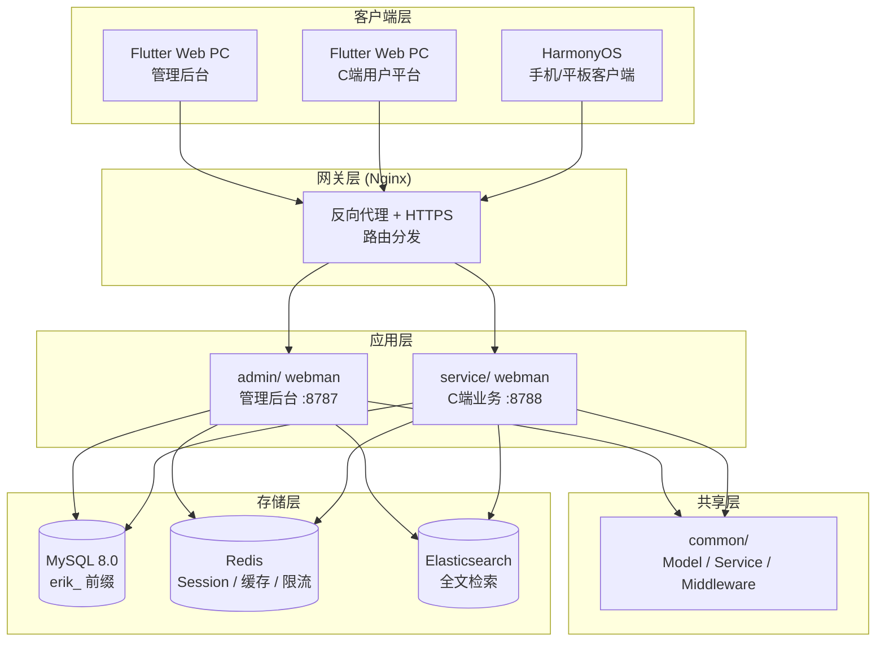
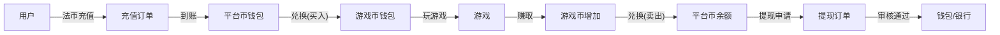

# Global Game Aggregation Platform — Design Spec
<!-- lang-nav -->

Languages: [中文](2026-05-22-game-platform-design.md) · **English** · [한국어](2026-05-22-game-platform-design.ko.md) · [Русский](2026-05-22-game-platform-design.ru.md) · [Deutsch](2026-05-22-game-platform-design.de.md) · [Français](2026-05-22-game-platform-design.fr.md) · [Español](2026-05-22-game-platform-design.es.md) · [Português](2026-05-22-game-platform-design.pt.md) · [हिन्दी](2026-05-22-game-platform-design.hi.md) · [العربية](2026-05-22-game-platform-design.ar.md) · [বাংলা](2026-05-22-game-platform-design.bn.md) · [Bahasa Indonesia](2026-05-22-game-platform-design.id.md) · [日本語](2026-05-22-game-platform-design.ja.md)


> Copyright (c) 2026 erik <erik@erik.xyz> — https://erik.xyz

## 1. Overview

A globally universal game aggregation platform. After registering, users top up on the platform and exchange for game currency, use the game currency to play games and earn game currency, and the game currency can be converted back to the wallet for withdrawal. The admin backend handles withdrawal review, game management, and user management.

### Version Strategy

| Version | Goal | Estimated Duration |
|------|------|---------|
| Basic (MVP) | Complete the core loop: register → top up → exchange → game → withdraw → review | 7-10 days |
| Standard | Production-ready: global payments, third-party game SDKs, basic risk control, three frontends | +10-15 days |
| Complete | Full product: multi-language, leaderboards, coupons, full risk control, all features | +10-15 days |

---

## 2. Tech Stack

### Backend
- PHP 8.3+, webman v2 (workerman/webman)
- Database: MySQL 8.0+, table prefix `erik_`
- Primary keys: BIGINT non-auto-increment, generated by `erikwang2013/snowflake-php`
- API-layer ID encryption/decryption: `erikwang2013/hashids`
- JWT auth: `erikwang2013/jwt-webman`
- Country flags: `erikwang2013/season`
- API sensitive data encryption/decryption: `erikwang2013/encryption`
- DB sensitive field encryption/decryption: `erikwang2013/encryptable`
- ES sync and query: `erikwang2013/webman-scout`
- Security tool detection: `erikwang2013/security-php`
- Random verification for sensitive operations: `erikwang2013/poster-php`

### Frontend
- Flutter 3.x, Web end designed in PC admin-backend style (not mobile App style)
- HarmonyOS ArkTS client
- Admin backend and C-end platform are built separately, both PC style

### Code Standards
- All new `.php` files must include the copyright notice as the header
- Global function/class references have no leading `\`; use `use` imports
- Config files include Chinese comments explaining each config item's meaning
- Database migration files use SQL format

---

## 3. Project Structure

```
game-platform-php/
├── admin/                          # 管理后台（webman v2）
│   ├── app/admin/controller/       # 控制器
│   │   ├── GameController.php      # 游戏管理
│   │   ├── WalletController.php    # 钱包管理
│   │   ├── PaymentController.php   # 支付管理
│   │   ├── WithdrawController.php  # 提现审核
│   │   ├── CountryController.php   # 国家配置
│   │   └── ...
│   ├── app/model/                  # 数据模型
│   ├── config/                     # 路由 & 配置
│   └── database/migrations/        # SQL 迁移
│
├── service/                        # C端业务端（webman v2）
│   ├── app/api/v1/controller/      # C端API
│   │   ├── AuthController.php
│   │   ├── WalletController.php
│   │   ├── GameController.php
│   │   ├── DepositController.php
│   │   ├── WithdrawController.php
│   │   ├── ExchangeController.php
│   │   └── ...
│   ├── app/middleware/             # UserAuth(JWT) 等
│   ├── config/                     # 路由 & 配置
│   └── database/migrations/        # 共享迁移
│
├── common/                         # 共享层（PSR-4 autoload）
│   ├── model/                      # 所有 Model
│   ├── service/                    # Snowflake, Hashids, Encryption...
│   └── middleware/                  # 共享中间件
│
├── apps/
│   ├── flutter/                    # Flutter 前端
│   │   ├── admin/                  # PC 管理后台
│   │   └── platform/               # PC C端用户平台
│   └── harmonyos/                  # HarmonyOS 客户端
│
└── docs/superpowers/
    ├── specs/                      # 设计规范
    └── plans/                      # 实现计划
```

---

## 4. Core Business Models

### 4.1 Currency System

```
法币 (USD/CNY/EUR...)
  │  充值/提现
  ▼
平台币 (统一)
  │  兑换（含汇率+平台抽成）
  ▼
游戏币 (每种游戏独立)
  │  玩游戏赚/花
  ▼
平台币 ← 兑回
```

- Platform currency precision: decimal(18,4)
- Each game currency has its own exchange rate against platform currency
- The platform charges the exchange spread_pct
- Wallet operations use the optimistic-lock version field against concurrency

### 4.2 Withdrawal Flow

```
用户发起提现
  │
  ├─ 全局开关关闭 → 拒绝，提示暂不可提现
  │
  ├─ 全局开关开启
  │     │
  │     ├─ 金额 < 审核阈值 → 自动通过 → 打款
  │     │
  │     └─ 金额 >= 审核阈值 → 进入人工审核队列
  │           │
  │           ├─ 管理员通过 → 打款
  │           └─ 管理员拒绝 → 退回平台币 + 附注原因
```

---

## 5. Database Design

### 5.1 Basic Version Table List (12 tables)

| # | Table | Description |
|------|------|------|
| 1 | `erik_user` | C-end users |
| 2 | `erik_user_wallet` | Platform currency wallet |
| 3 | `erik_user_game_wallet` | Game currency wallet |
| 4 | `erik_game` | Games |
| 5 | `erik_game_currency` | Game currencies |
| 6 | `erik_deposit_order` | Deposit orders |
| 7 | `erik_withdraw_order` | Withdrawal orders |
| 8 | `erik_exchange_record` | Exchange records |
| 9 | `erik_transaction` | Platform transactions |
| 10 | `erik_payment_method` | Payment methods |
| 11 | `erik_announcement` | Announcements |
| 12 | `erik_platform_config` | Platform config (extends existing erik_system_config) |

### 5.2 Standard Version Additions (10 tables)

| # | Table | Description |
|------|------|------|
| 13 | `erik_user_identity` | Real-name/KYC |
| 14 | `erik_user_oauth` | Third-party login |
| 15 | `erik_user_payment_account` | Payout accounts |
| 16 | `erik_user_session` | Login sessions |
| 17 | `erik_game_server` | Game servers |
| 18 | `erik_game_play_log` | Game play records |
| 19 | `erik_withdraw_limit` | Withdrawal limit rules |
| 20 | `erik_risk_rule` | Risk control rules |
| 21 | `erik_risk_log` | Risk trigger records |
| 22 | `erik_stat_daily` | Daily statistics snapshot |

### 5.3 Complete Version Additions (8 tables)

| # | Table | Description |
|------|------|------|
| 23 | `erik_game_category` | Game categories |
| 24 | `erik_game_category_rel` | Game-category relations |
| 25 | `erik_leaderboard` | Leaderboards |
| 26 | `erik_coupon` | Coupons |
| 27 | `erik_user_coupon` | User coupon claims |
| 28 | `erik_language` | Language definitions |
| 29 | `erik_translation` | Translation texts |
| 30 | `erik_country_config` | Country config |
| 31 | `erik_platform_revenue` | Platform revenue records |

---

## 6. API Design

### 6.1 Basic Version APIs (C-end ~25)

```
公开接口（无需认证）:
  POST   /api/auth/register
  POST   /api/auth/login
  POST   /api/auth/refresh
  GET    /api/captcha/generate
  GET    /api/game/list
  GET    /api/game/{hashid}
  GET    /api/announcement/list

需认证 (UserAuth):
  GET    /api/wallet/info
  GET    /api/wallet/transactions
  POST   /api/deposit/create
  GET    /api/deposit/orders
  POST   /api/exchange/quote
  POST   /api/exchange/buy
  POST   /api/exchange/sell
  GET    /api/exchange/records
  POST   /api/withdraw/apply
  GET    /api/withdraw/orders
  POST   /api/game/launch
  GET    /api/game/play-logs
  GET    /api/user/profile
  PUT    /api/user/profile

管理后台（AdminAuth + AdminPermission）:
  GET    /admin/game/list
  POST   /admin/game/create
  PUT    /admin/game/{hashid}
  DELETE /admin/game/{hashid}
  GET    /admin/user/list
  GET    /admin/user/{hashid}
  PUT    /admin/user/{hashid}
  GET    /admin/deposit/orders
  GET    /admin/withdraw/orders
  PUT    /admin/withdraw/review
  PUT    /admin/withdraw/switch
  POST   /admin/withdraw/limits/set
  POST   /admin/payment/method/toggle
  POST   /admin/announcement/create
  POST   /admin/export/users
  POST   /admin/export/transactions
  GET    /admin/dashboard/platform
```

### 6.2 Response Format

All endpoints return a unified response:

```json
{
  "code": 0,
  "message": "success",
  "data": { ... }
}
```

| code | Meaning |
|------|------|
| 0 | Success |
| 400 | Invalid parameters |
| 401 | Not authenticated |
| 403 | No permission |
| 404 | Not found |
| 422 | Validation failed |
| 500 | Server error |

---

## 7. Architecture Diagrams

### 7.1 System Topology



### 7.2 Currency Flow



---

## 8. Security Design

On top of the existing 18-layer defense in depth, the following additions are made for the game platform:

| Layer | Measure |
|------|------|
| Concurrency safety | version optimistic lock on wallet tables to prevent duplicate debits/credits |
| Withdrawal safety | global switch + amount threshold review + daily/monthly limits + poster-php random verification |
| Exchange safety | quote and settlement separated; quotes expire in 60s; exchange rate recalculated at settlement |
| Game safety | third-party callback signature verification, IP whitelist, replay attack defense |
| Risk control | risk rule engine, blocking abnormal transactions |

---

## 9. Development Phases

### Basic Version (complete the core loop)

1. Infrastructure: directory structure, composer config, database migrations, shared layer
2. C-end core: register/login, platform currency wallet, deposit (Stripe), exchange (fixed rate), withdrawal (manual review)
3. Game management: admin CRUD, game list API, game details
4. Admin backend: withdrawal review buttons, global switch, user management
5. Flutter PC: admin backend extension + C-end platform (minimal, 5 pages)
6. Testing: full deposit → exchange → withdrawal chain

### Standard Version (production-ready)

1. OAuth login, multiple payment methods, automatic callbacks
2. Third-party game SDK integration (signature verification, callback settlement)
3. Dynamic exchange rates, KYC, limit rules, basic risk control
4. Dashboard visualization, Excel export
5. HarmonyOS client

### Complete Version (full product)

1. Internationalization (multi-language, multi-currency, country-differentiated config)
2. Leaderboards, coupons, announcement system
3. Full risk control engine, daily statistics snapshots
4. ES search, PDF export
5. Comprehensive testing, API documentation
