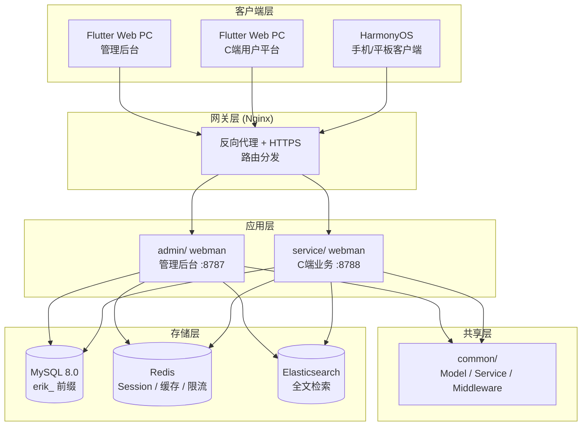
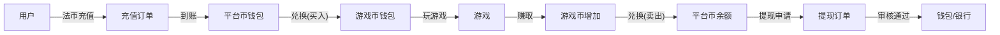

# Plataforma global de agregación de juegos — Especificación de diseño
<!-- lang-nav -->

Languages: [中文](2026-05-22-game-platform-design.md) · [English](2026-05-22-game-platform-design.en.md) · [한국어](2026-05-22-game-platform-design.ko.md) · [Русский](2026-05-22-game-platform-design.ru.md) · [Deutsch](2026-05-22-game-platform-design.de.md) · [Français](2026-05-22-game-platform-design.fr.md) · **Español** · [Português](2026-05-22-game-platform-design.pt.md) · [हिन्दी](2026-05-22-game-platform-design.hi.md) · [العربية](2026-05-22-game-platform-design.ar.md) · [বাংলা](2026-05-22-game-platform-design.bn.md) · [Bahasa Indonesia](2026-05-22-game-platform-design.id.md) · [日本語](2026-05-22-game-platform-design.ja.md)


> Copyright (c) 2026 erik <erik@erik.xyz> — https://erik.xyz

## 1. Resumen

Plataforma global universal de agregación de juegos. Los usuarios se registran, recargan y convierten su dinero en moneda de juego; juegan y ganan moneda de juego, que puede volver a convertirse a la billetera para retirar. El backend gestiona la revisión de retiros, la gestión de juegos y la gestión de usuarios.

### Estrategia de versiones

| Versión | Objetivo | Ciclo estimado |
|------|------|---------|
| Versión básica (MVP) | Completar el ciclo central: registro→recarga→conversión→juego→retiro→revisión | 7-10 días |
| Versión estándar | Lista para producción: pagos globales, SDK de juegos de terceros, control de riesgos básico, frontends en tres plataformas | +10-15 días |
| Versión completa | Totalidad: multilingüe, rankings, cupones, control de riesgos completo, funcionalidad total | +10-15 días |

---

## 2. Stack tecnológico

### Backend
- PHP 8.3+, webman v2 (workerman/webman)
- Base de datos: MySQL 8.0+, prefijo de tablas `erik_`
- Clave primaria: BIGINT no autoincremental, generada por `erikwang2013/snowflake-php`
- Cifrado/descifrado de IDs en la capa API: `erikwang2013/hashids`
- Autenticación JWT: `erikwang2013/jwt-webman`
- Banderas de países: `erikwang2013/season`
- Cifrado/descifrado de datos sensibles en la API: `erikwang2013/encryption`
- Cifrado/descifrado de campos sensibles en la base de datos: `erikwang2013/encryptable`
- Sincronización y consulta ES: `erikwang2013/webman-scout`
- Detección de herramientas de seguridad: `erikwang2013/security-php`
- Verificación aleatoria para operaciones sensibles: `erikwang2013/poster-php`

### Frontend
- Flutter 3.x, el lado Web se diseña con estilo de panel de administración PC (no estilo de app móvil)
- Cliente HarmonyOS ArkTS
- El panel de administración y la plataforma C se construyen por separado, ambos con estilo PC

### Estándares de código
- Todos los archivos `.php` nuevos deben incluir la declaración de copyright en el encabezado
- Las referencias a funciones/clases globales no llevan `\` delante; se importan con `use`
- Los archivos de configuración incluyen comentarios en chino que explican el significado de cada opción
- Los archivos de migración de la base de datos usan formato SQL

---

## 3. Estructura del proyecto

```
game-platform-php/
├── admin/                          # Panel de administración (webman v2)
│   ├── app/admin/controller/       # Controladores
│   │   ├── GameController.php      # Gestión de juegos
│   │   ├── WalletController.php    # Gestión de billeteras
│   │   ├── PaymentController.php   # Gestión de pagos
│   │   ├── WithdrawController.php  # Revisión de retiros
│   │   ├── CountryController.php   # Configuración de países
│   │   └── ...
│   ├── app/model/                  # Modelos de datos
│   ├── config/                     # Rutas y configuración
│   └── install/        # Migraciones SQL
│
├── service/                        # Negocio del lado C (webman v2)
│   ├── app/api/v1/controller/      # API del lado C
│   │   ├── AuthController.php
│   │   ├── WalletController.php
│   │   ├── GameController.php
│   │   ├── DepositController.php
│   │   ├── WithdrawController.php
│   │   ├── ExchangeController.php
│   │   └── ...
│   ├── app/middleware/             # UserAuth(JWT) etc.
│   ├── config/                     # Rutas y configuración
│   └── install/        # Migraciones compartidas
│
├── common/                         # Capa compartida (autoload PSR-4)
│   ├── model/                      # Todos los Model
│   ├── service/                    # Snowflake, Hashids, Encryption...
│   └── middleware/                  # Middleware compartido
│
├── apps/
│   ├── flutter/                    # Frontend Flutter
│   │   ├── admin/                  # Panel de administración PC
│   │   └── platform/               # Plataforma de usuarios C PC
│   └── harmonyos/                  # Cliente HarmonyOS
│
└── docs/superpowers/
    ├── specs/                      # Especificaciones de diseño
    └── plans/                      # Planes de implementación
```

---

## 4. Modelos de negocio centrales

### 4.1 Sistema de monedas

```
Moneda fiduciaria (USD/CNY/EUR...)
  │  Recarga/retiro
  ▼
Moneda de plataforma (unificada)
  │  Conversión (incluye tipo de cambio + comisión de la plataforma)
  ▼
Moneda de juego (independiente por juego)
  │  Ganar/gastar jugando
  ▼
Moneda de plataforma ← Convertir de vuelta
```

- Precisión de la moneda de plataforma: decimal(18,4)
- Cada moneda de juego tiene un tipo de cambio independiente frente a la moneda de plataforma
- La plataforma cobra la diferencia de conversión spread_pct
- Las operaciones de billetera usan el campo de bloqueo optimista `version` para prevenir concurrencia

### 4.2 Flujo de retiro

```
El usuario inicia un retiro
  │
  ├─ Interruptor global apagado → Rechazado, aviso de que no se puede retirar temporalmente
  │
  ├─ Interruptor global encendido
  │     │
  │     ├─ Importe < umbral de revisión → Aprobación automática → Pago
  │     │
  │     └─ Importe >= umbral de revisión → Entra en la cola de revisión manual
  │           │
  │           ├─ El administrador aprueba → Pago
  │           └─ El administrador rechaza → Devolución a moneda de plataforma + motivo adjunto
```

---

## 5. Diseño de la base de datos

### 5.1 Lista de tablas de la versión básica (12)

| N.º | Nombre de tabla | Descripción |
|------|------|------|
| 1 | `erik_user` | Usuario del lado C |
| 2 | `erik_user_wallet` | Billetera de moneda de plataforma |
| 3 | `erik_user_game_wallet` | Billetera de moneda de juego |
| 4 | `erik_game` | Juego |
| 5 | `erik_game_currency` | Monedas del juego |
| 6 | `erik_deposit_order` | Orden de recarga |
| 7 | `erik_withdraw_order` | Orden de retiro |
| 8 | `erik_exchange_record` | Registro de conversión |
| 9 | `erik_transaction` | Movimientos de la plataforma |
| 10 | `erik_payment_method` | Métodos de pago |
| 11 | `erik_announcement` | Anuncios |
| 12 | `erik_platform_config` | Configuración de la plataforma (extiende el erik_system_config existente) |

### 5.2 Nuevas tablas de la versión estándar (10)

| N.º | Nombre de tabla | Descripción |
|------|------|------|
| 13 | `erik_user_identity` | Verificación de identidad/KYC |
| 14 | `erik_user_oauth` | Inicio de sesión de terceros |
| 15 | `erik_user_payment_account` | Cuentas de cobro |
| 16 | `erik_user_session` | Sesiones de inicio de sesión |
| 17 | `erik_game_server` | Servidores del juego |
| 18 | `erik_game_play_log` | Registros de juego |
| 19 | `erik_withdraw_limit` | Reglas de límite de retiro |
| 20 | `erik_risk_rule` | Reglas de control de riesgos |
| 21 | `erik_risk_log` | Registros de activación de control de riesgos |
| 22 | `erik_stat_daily` | Instantáneas de estadísticas diarias |

### 5.3 Nuevas tablas de la versión completa (8)

| N.º | Nombre de tabla | Descripción |
|------|------|------|
| 23 | `erik_game_category` | Categorías de juegos |
| 24 | `erik_game_category_rel` | Relación juego-categoría |
| 25 | `erik_leaderboard` | Clasificaciones |
| 26 | `erik_coupon` | Cupones |
| 27 | `erik_user_coupon` | Cupones del usuario |
| 28 | `erik_language` | Definiciones de idioma |
| 29 | `erik_translation` | Textos de traducción |
| 30 | `erik_country_config` | Configuración de países |
| 31 | `erik_platform_revenue` | Registros de ingresos de la plataforma |

---

## 6. Diseño de API

### 6.1 API de la versión básica (C ~25)

```
Interfaces públicas (sin autenticación):
  POST   /api/auth/register
  POST   /api/auth/login
  POST   /api/auth/refresh
  GET    /api/captcha/generate
  GET    /api/game/list
  GET    /api/game/{hashid}
  GET    /api/announcement/list

Requieren autenticación (UserAuth):
  GET    /api/wallet/info
  GET    /api/wallet/transactions
  POST   /api/deposit/create
  GET    /api/deposit/orders
  POST   /api/exchange/quote
  POST   /api/exchange/buy
  POST   /api/exchange/sell
  GET    /api/exchange/records
  POST   /api/withdraw/apply
  GET    /api/withdraw/orders
  POST   /api/game/launch
  GET    /api/game/play-logs
  GET    /api/user/profile
  PUT    /api/user/profile

Panel de administración (AdminAuth + AdminPermission):
  GET    /admin/game/list
  POST   /admin/game/create
  PUT    /admin/game/{hashid}
  DELETE /admin/game/{hashid}
  GET    /admin/user/list
  GET    /admin/user/{hashid}
  PUT    /admin/user/{hashid}
  GET    /admin/deposit/orders
  GET    /admin/withdraw/orders
  PUT    /admin/withdraw/review
  PUT    /admin/withdraw/switch
  POST   /admin/withdraw/limits/set
  POST   /admin/payment/method/toggle
  POST   /admin/announcement/create
  POST   /admin/export/users
  POST   /admin/export/transactions
  GET    /admin/dashboard/platform
```

### 6.2 Formato de respuesta

Todas las interfaces usan la misma respuesta:

```json
{
  "code": 0,
  "message": "success",
  "data": { ... }
}
```

| code | Significado |
|------|------|
| 0 | Éxito |
| 400 | Error de parámetros |
| 401 | Sin autenticar |
| 403 | Sin permisos |
| 404 | No existe |
| 422 | Fallo de validación |
| 500 | Error del servidor |

---

## 7. Diagramas de arquitectura

### 7.1 Topología del sistema



### 7.2 Flujo de monedas



---

## 8. Diseño de seguridad

Sobre la base de las 18 capas de defensa en profundidad existentes, se añaden para la plataforma de juegos:

| Capa | Medida |
|------|------|
| Seguridad de concurrencia | Bloqueo optimista `version` en la tabla de billeteras para prevenir deducciones dobles / acreditaciones dobles |
| Seguridad de retiros | Interruptor global + revisión por umbral de importe + límites diarios/mensuales + verificación aleatoria con poster-php |
| Seguridad de conversión | Separación entre cotización y ejecución, la cotización expira en 60s, se recalcula el tipo de cambio al ejecutar |
| Seguridad de juegos | Verificación de firma en callbacks de terceros, lista blanca de IP, defensa contra replay attack |
| Control de riesgos | Motor de reglas de control de riesgos, bloqueo de transacciones anómalas |

---

## 9. Fases de desarrollo

### Versión básica (completar el ciclo central)

1. Infraestructura: estructura de directorios, configuración de composer, migraciones de la base de datos, capa compartida
2. Núcleo del lado C: registro/inicio de sesión, billetera de moneda de plataforma, recarga (Stripe), conversión (tipo de cambio fijo), retiro (revisión manual)
3. Gestión de juegos: CRUD en el backend, API de lista de juegos, detalle de juego
4. Panel de administración: botones de revisión de retiros, interruptor global, gestión de usuarios
5. Flutter PC: extensión del panel de administración + plataforma C (mínima, 5 páginas)
6. Pruebas y verificación: cadena completa recarga→conversión→retiro

### Versión estándar (lista para producción)

1. Inicio de sesión OAuth, múltiples métodos de pago, callback automático
2. Integración de SDK de juegos de terceros (verificación de firma, liquidación por callback)
3. Tipo de cambio dinámico, KYC, reglas de límites, control de riesgos básico
4. Visualización en dashboard, exportación Excel
5. Cliente HarmonyOS

### Versión completa (totalidad)

1. Internacionalización (multilingüe, multi-moneda, configuración diferenciada por país)
2. Clasificaciones, cupones, sistema de anuncios
3. Motor de control de riesgos completo, instantáneas de estadísticas diarias
4. Búsqueda ES, exportación PDF
5. Pruebas integrales, documentación de API
