# Plateforme mondiale d'agrégation de jeux — Spécifications de conception
<!-- lang-nav -->

Languages: [中文](2026-05-22-game-platform-design.md) · [English](2026-05-22-game-platform-design.en.md) · [한국어](2026-05-22-game-platform-design.ko.md) · [Русский](2026-05-22-game-platform-design.ru.md) · [Deutsch](2026-05-22-game-platform-design.de.md) · **Français** · [Español](2026-05-22-game-platform-design.es.md) · [Português](2026-05-22-game-platform-design.pt.md) · [हिन्दी](2026-05-22-game-platform-design.hi.md) · [العربية](2026-05-22-game-platform-design.ar.md) · [বাংলা](2026-05-22-game-platform-design.bn.md) · [Bahasa Indonesia](2026-05-22-game-platform-design.id.md) · [日本語](2026-05-22-game-platform-design.ja.md)


> Copyright (c) 2026 erik <erik@erik.xyz> — https://erik.xyz

## 1. Aperçu

Plateforme mondiale universelle d'agrégation de jeux. L'utilisateur s'inscrit puis recharge et échange des devises de jeu sur la plateforme, joue avec les devises de jeu et en gagne, et peut reconvertir les devises de jeu en portefeuille pour les retirer. Le backend gère la validation des retraits, la gestion des jeux et la gestion des utilisateurs.

### Stratégie de versions

| Version | Objectif | Durée estimée |
|------|------|---------|
| Édition de base (MVP) | Boucler le cœur : inscription→recharge→échange→jeu→retrait→validation | 7-10 jours |
| Édition standard | Utilisable en production : paiements mondiaux, SDK de jeux tiers, gestion des risques de base, frontends sur trois supports | +10-15 jours |
| Édition complète | Version aboutie : multilingue, classements, coupons, gestion des risques complète, toutes les fonctionnalités | +10-15 jours |

---

## 2. Pile technique

### Backend
- PHP 8.3+, webman v2 (workerman/webman)
- Base de données : MySQL 8.0+, préfixe de tables `game_`
- Clés primaires : BIGINT non auto-incrémentées, générées par `erikwang2013/snowflake-php`
- Chiffrement/déchiffrement des ID au niveau API : `erikwang2013/hashids`
- Authentification JWT : `erikwang2013/jwt-webman`
- Drapeaux de pays : `erikwang2013/season`
- Chiffrement/déchiffrement des données sensibles API : `erikwang2013/encryption`
- Chiffrement/déchiffrement des champs sensibles de la base : `erikwang2013/encryptable`
- Synchronisation et recherche ES : `erikwang2013/webman-scout`
- Détection d'outils de sécurité : `erikwang2013/security-php`
- Vérification aléatoire des opérations sensibles : `erikwang2013/poster-php`

### Frontend
- Flutter 3.x, le Web est conçu au style PC gestion (pas un style d'app mobile)
- Client HarmonyOS ArkTS
- L'administration et la plateforme C sont construites séparément, toutes deux au style PC

### Normes de code
- Tout nouveau fichier `.php` doit comporter la déclaration de copyright en en-tête
- Pas de `\` préfixe pour les références de fonctions/classes globales, utiliser `use` pour les imports
- Les fichiers de configuration contiennent des commentaires chinois expliquant la signification de chaque option
- Les fichiers de migration de base de données utilisent le format SQL

---

## 3. Structure du projet

```
game-platform-php/
├── admin/                          # Administration (webman v2)
│   ├── app/admin/controller/       # Contrôleurs
│   │   ├── GameController.php      # Gestion des jeux
│   │   ├── WalletController.php    # Gestion des portefeuilles
│   │   ├── PaymentController.php   # Gestion des paiements
│   │   ├── WithdrawController.php  # Validation des retraits
│   │   ├── CountryController.php   # Configuration des pays
│   │   └── ...
│   ├── app/model/                  # Modèles de données
│   ├── config/                     # Routes & configuration
│   └── install/        # Migrations SQL
│
├── service/                        # Métier côté C (webman v2)
│   ├── app/api/v1/controller/      # API côté C
│   │   ├── AuthController.php
│   │   ├── WalletController.php
│   │   ├── GameController.php
│   │   ├── DepositController.php
│   │   ├── WithdrawController.php
│   │   ├── ExchangeController.php
│   │   └── ...
│   ├── app/middleware/             # UserAuth(JWT) etc.
│   ├── config/                     # Routes & configuration
│   └── install/        # Migrations partagées
│
├── common/                         # Couche partagée (autoload PSR-4)
│   ├── model/                      # Tous les modèles
│   ├── service/                    # Snowflake, Hashids, Encryption...
│   └── middleware/                 # Middleware partagés
│
├── apps/
│   ├── flutter/                    # Frontend Flutter
│   │   ├── admin/                  # Administration PC
│   │   └── platform/               # Plateforme utilisateur PC
│   └── harmonyos/                  # Client HarmonyOS
│
└── docs/superpowers/
    ├── specs/                      # Spécifications de conception
    └── plans/                      # Plans d'implémentation
```

---

## 4. Modèles métier centraux

### 4.1 Système de devises

```
Devises fiduciaires (USD/CNY/EUR...)
  │  Recharge/retrait
  ▼
Devises de plateforme (unifiées)
  │  Échange (avec taux + marge de la plateforme)
  ▼
Devises de jeu (indépendantes par jeu)
  │  Gagner/dépenser en jouant
  ▼
Devises de plateforme ← reconversion
```

- Précision des devises de plateforme : decimal(18,4)
- Chaque devise de jeu a un taux indépendant contre la devise de plateforme
- La plateforme prélève la marge d'échange spread_pct
- Les opérations de portefeuille utilisent le champ version du verrou optimiste contre la concurrence

### 4.2 Flux de retrait

```
L'utilisateur lance un retrait
  │
  ├─ Interrupteur global désactivé → refus, message « retrait temporairement indisponible »
  │
  ├─ Interrupteur global activé
  │     │
  │     ├─ Montant < seuil de validation → approbation automatique → paiement
  │     │
  │     └─ Montant >= seuil de validation → file de validation manuelle
  │           │
  │           ├─ L'administrateur approuve → paiement
  │           └─ L'administrateur refuse → retour des devises de plateforme + motif joint
```

---

## 5. Conception de la base de données

### 5.1 Liste des tables de l'édition de base (12)

| N° | Table | Description |
|------|------|------|
| 1 | `game_user` | Utilisateurs C |
| 2 | `game_user_wallet` | Portefeuille de devises de plateforme |
| 3 | `game_user_game_wallet` | Portefeuille de devises de jeu |
| 4 | `game_game` | Jeux |
| 5 | `game_game_currency` | Devises de jeu |
| 6 | `game_deposit_order` | Commandes de recharge |
| 7 | `game_withdraw_order` | Commandes de retrait |
| 8 | `game_exchange_record` | Enregistrements d'échange |
| 9 | `game_transaction` | Flux de la plateforme |
| 10 | `game_payment_method` | Modes de paiement |
| 11 | `game_announcement` | Annonces |
| 12 | `game-platform_config` | Configuration de la plateforme (extension de game_system_config existant) |

### 5.2 Ajouts de l'édition standard (10)

| N° | Table | Description |
|------|------|------|
| 13 | `game_user_identity` | Identité réelle/KYC |
| 14 | `game_user_oauth` | Connexion tierce |
| 15 | `game_user_payment_account` | Comptes de réception |
| 16 | `game_user_session` | Sessions de connexion |
| 17 | `game_game_server` | Serveurs de jeux |
| 18 | `game_game_play_log` | Historique de jeu |
| 19 | `game_withdraw_limit` | Règles de limites de retrait |
| 20 | `game_risk_rule` | Règles de gestion des risques |
| 21 | `game_risk_log` | Enregistrements de déclenchement des risques |
| 22 | `game_stat_daily` | Instantanés des statistiques quotidiennes |

### 5.3 Ajouts de l'édition complète (8)

| N° | Table | Description |
|------|------|------|
| 23 | `game_game_category` | Catégories de jeux |
| 24 | `game_game_category_rel` | Association jeux-catégories |
| 25 | `game_leaderboard` | Classements |
| 26 | `game_coupon` | Coupons |
| 27 | `game_user_coupon` | Coupons réclamés par les utilisateurs |
| 28 | `game_language` | Définitions de langues |
| 29 | `game_translation` | Textes de traduction |
| 30 | `game_country_config` | Configuration des pays |
| 31 | `game-platform_revenue` | Enregistrements de revenus de la plateforme |

---

## 6. Conception de l'API

### 6.1 API de l'édition de base (~25 côté C)

```
Interfaces publiques (sans authentification):
  POST   /api/auth/register
  POST   /api/auth/login
  POST   /api/auth/refresh
  GET    /api/captcha/generate
  GET    /api/game/list
  GET    /api/game/{hashid}
  GET    /api/announcement/list

Avec authentification (UserAuth):
  GET    /api/wallet/info
  GET    /api/wallet/transactions
  POST   /api/deposit/create
  GET    /api/deposit/orders
  POST   /api/exchange/quote
  POST   /api/exchange/buy
  POST   /api/exchange/sell
  GET    /api/exchange/records
  POST   /api/withdraw/apply
  GET    /api/withdraw/orders
  POST   /api/game/launch
  GET    /api/game/play-logs
  GET    /api/user/profile
  PUT    /api/user/profile

Administration (AdminAuth + AdminPermission):
  GET    /admin/game/list
  POST   /admin/game/create
  PUT    /admin/game/{hashid}
  DELETE /admin/game/{hashid}
  GET    /admin/user/list
  GET    /admin/user/{hashid}
  PUT    /admin/user/{hashid}
  GET    /admin/deposit/orders
  GET    /admin/withdraw/orders
  PUT    /admin/withdraw/review
  PUT    /admin/withdraw/switch
  POST   /admin/withdraw/limits/set
  POST   /admin/payment/method/toggle
  POST   /admin/announcement/create
  POST   /admin/export/users
  POST   /admin/export/transactions
  GET    /admin/dashboard/platform
```

### 6.2 Format de réponse

Toutes les interfaces répondent uniformément :

```json
{
  "code": 0,
  "message": "success",
  "data": { ... }
}
```

| code | Signification |
|------|------|
| 0 | Succès |
| 400 | Erreur de paramètres |
| 401 | Non authentifié |
| 403 | Sans permission |
| 404 | Introuvable |
| 422 | Échec de validation |
| 500 | Erreur serveur |

---

## 7. Diagrammes d'architecture

### 7.1 Topologie du système

```mermaid
flowchart TB
    subgraph "Couche client"
        A1["Flutter Web PC<br/>Administration"]
        A2["Flutter Web PC<br/>Plateforme utilisateur C"]
        A3["HarmonyOS<br/>Client mobile/tablette"]
    end

    subgraph "Couche passerelle (Nginx)"
        B1["Reverse proxy + HTTPS<br/>Routage"]
    end

    subgraph "Couche application"
        C1["admin/ webman<br/>Administration :8787"]
        C2["service/ webman<br/>Métier C :8788"]
    end

    subgraph "Couche partagée"
        D1["common/<br/>Model / Service / Middleware"]
    end

    subgraph "Couche stockage"
        E1[("MySQL 8.0<br/>préfixe game_")]
        E2[("Redis<br/>Session / cache / rate-limit")]
        E3[("Elasticsearch<br/>recherche plein texte")]
    end

    A1 & A2 & A3 --> B1
    B1 --> C1
    B1 --> C2
    C1 & C2 --> D1
    C1 & C2 --> E1 & E2 & E3
```



### 7.2 Circulation des devises

```mermaid
flowchart LR
    U["Utilisateur"] -->|"Recharge en devise fiduciaire"| D["Commande de recharge"]
    D -->|"Crédit"| PW["Portefeuille de devises de plateforme"]
    PW -->|"Échange (achat)"| GW["Portefeuille de devises de jeu"]
    GW -->|"Jouer"| G["Jeu"]
    G -->|"Gagner"| GW2["Devises de jeu augmentées"]
    GW2 -->|"Échange (vente)"| PW2["Solde de devises de plateforme"]
    PW2 -->|"Demande de retrait"| WO["Commande de retrait"]
    WO -->|"Validation approuvée"| W["Portefeuille/banque"]
```



---

## 8. Conception de la sécurité

Sur la base des 18 couches de défense en profondeur existantes, nouvelles mesures pour la plateforme de jeux :

| Couche | Mesure |
|------|------|
| Sécurité de concurrence | Verrou optimiste version du portefeuille, empêche les débits/crédits en double |
| Sécurité des retraits | Interrupteur global + validation par seuil de montant + plafonds jour/mois + vérification aléatoire poster-php |
| Sécurité des échanges | Séparation cotation et exécution, cotation expirant en 60 s, taux recalculé à l'exécution |
| Sécurité des jeux | Vérification de signature des callbacks tiers, liste blanche IP, défense contre la relecture |
| Gestion des risques | Moteur de règles de risques, blocage des transactions anormales |

---

## 9. Phases de développement

### Édition de base (boucler le cœur)

1. Infrastructure : structure de répertoires, configuration composer, migrations de base, couche partagée
2. Cœur côté C : inscription/connexion, portefeuille de devises de plateforme, recharge (Stripe), échange (taux fixe), retrait (validation manuelle)
3. Gestion des jeux : CRUD backend, API de liste de jeux, détails de jeux
4. Administration : boutons de validation des retraits, interrupteur global, gestion des utilisateurs
5. Flutter PC : extension de l'administration + plateforme C (minimale, 5 pages)
6. Tests de validation : chaîne complète recharge→échange→retrait

### Édition standard (utilisable en production)

1. Connexion OAuth, multi-modes de paiement, callbacks automatiques
2. Intégration du SDK de jeux tiers (vérification de signature, règlement par callback)
3. Taux dynamiques, KYC, règles de limites, base de gestion des risques
4. Visualisation du tableau de bord, export Excel
5. Client HarmonyOS

### Édition complète (version aboutie)

1. Internationalisation (multilingue, multi-devises, configurations différenciées par pays)
2. Classements, coupons, système d'annonces
3. Moteur de gestion des risques complet, instantanés de statistiques quotidiennes
4. Recherche ES, export PDF
5. Tests complets, documentation API
