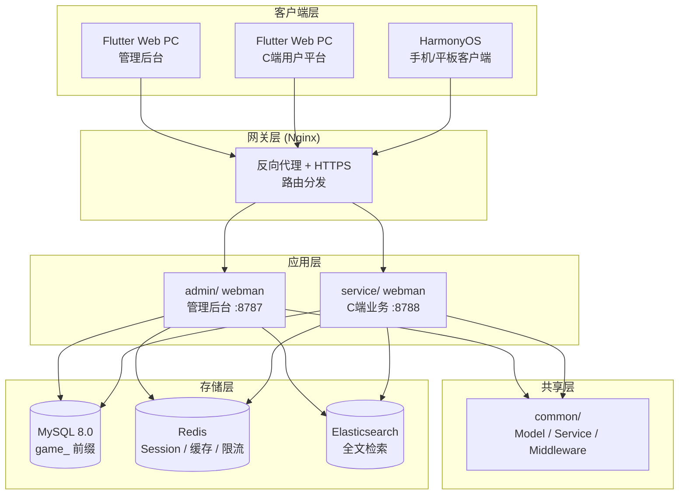
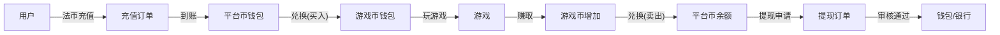

# वैश्विक गेम एग्रीगेशन प्लेटफ़ॉर्म — डिज़ाइन विनिर्देश
<!-- lang-nav -->

Languages: [中文](2026-05-22-game-platform-design.md) · [English](2026-05-22-game-platform-design.en.md) · [한국어](2026-05-22-game-platform-design.ko.md) · [Русский](2026-05-22-game-platform-design.ru.md) · [Deutsch](2026-05-22-game-platform-design.de.md) · [Français](2026-05-22-game-platform-design.fr.md) · [Español](2026-05-22-game-platform-design.es.md) · [Português](2026-05-22-game-platform-design.pt.md) · **हिन्दी** · [العربية](2026-05-22-game-platform-design.ar.md) · [বাংলা](2026-05-22-game-platform-design.bn.md) · [Bahasa Indonesia](2026-05-22-game-platform-design.id.md) · [日本語](2026-05-22-game-platform-design.ja.md)


> Copyright (c) 2026 erik <erik@erik.xyz> — https://erik.xyz

## 1. अवलोकन

वैश्विक सार्वभौमिक गेम एग्रीगेशन प्लेटफ़ॉर्म। उपयोगकर्ता पंजीकरण के बाद प्लेटफ़ॉर्म पर रिचार्ज करके गेम कॉइन खरीदते हैं, गेम कॉइन से गेम खेलते हैं और गेम कॉइन कमाते हैं; गेम कॉइन वापस वॉलेट में बदलकर निकाले जा सकते हैं। बैकएंड निकासी समीक्षा, गेम प्रबंधन और उपयोगकर्ता प्रबंधन संभालता है।

### संस्करण रणनीति

| संस्करण | लक्ष्य | अनुमानित अवधि |
|------|------|---------|
| मूल संस्करण (MVP) | मुख्य चक्र पूरा करें: पंजीकरण→रिचार्ज→विनिमय→गेम→निकासी→समीक्षा | 7-10 दिन |
| मानक संस्करण | उत्पादन-तैयार: वैश्विक भुगतान, तृतीय-पक्ष गेम SDK, बुनियादी जोखिम नियंत्रण, तीन-छोर फ्रंटएंड | +10-15 दिन |
| पूर्ण संस्करण | संपूर्ण: बहुभाषा, लीडरबोर्ड, कूपन, पूर्ण जोखिम नियंत्रण, सभी सुविधाएँ | +10-15 दिन |

---

## 2. तकनीकी स्टैक

### बैकएंड
- PHP 8.3+, webman v2 (workerman/webman)
- डेटाबेस: MySQL 8.0+, तालिका उपसर्ग `game_`
- प्राथमिक कुंजी: BIGINT गैर-ऑटोइन्क्रीमेंट, `erikwang2013/snowflake-php` से उत्पन्न
- API परत ID एन्क्रिप्शन/डिक्रिप्शन: `erikwang2013/hashids`
- JWT प्रमाणीकरण: `erikwang2013/jwt-webman`
- देश ध्वज: `erikwang2013/season`
- API संवेदनशील डेटा एन्क्रिप्शन/डिक्रिप्शन: `erikwang2013/encryption`
- डेटाबेस संवेदनशील फ़ील्ड एन्क्रिप्शन/डिक्रिप्शन: `erikwang2013/encryptable`
- ES सिंक और क्वेरी: `erikwang2013/webman-scout`
- सुरक्षा उपकरण पहचान: `erikwang2013/security-php`
- संवेदनशील संचालन यादृच्छिक सत्यापन: `erikwang2013/poster-php`

### फ्रंटएंड
- Flutter 3.x, Web छोर PC प्रशासन कंसोल शैली में डिज़ाइन किया गया (मोबाइल App शैली नहीं)
- HarmonyOS ArkTS क्लाइंट
- प्रशासन कंसोल और C-छोर प्लेटफ़ॉर्म अलग-अलग बनाए गए हैं, दोनों PC शैली के हैं

### कोड मानक
- सभी नई `.php` फ़ाइलों के शीर्ष पर कॉपीराइट घोषणा अनिवार्य है
- वैश्विक फ़ंक्शन/क्लास संदर्भों में आगे `\` नहीं, `use` आयात का उपयोग करें
- कॉन्फ़िग फ़ाइलों में कॉन्फ़िग आइटम का अर्थ समझाने वाली चीनी टिप्पणियाँ शामिल हों
- डेटाबेस माइग्रेशन फ़ाइलें SQL प्रारूप में

---

## 3. परियोजना संरचना

```
game-platform-php/
├── admin/                          # प्रशासन कंसोल (webman v2)
│   ├── app/admin/controller/       # कंट्रोलर
│   │   ├── GameController.php      # गेम प्रबंधन
│   │   ├── WalletController.php    # वॉलेट प्रबंधन
│   │   ├── PaymentController.php   # भुगतान प्रबंधन
│   │   ├── WithdrawController.php  # निकासी समीक्षा
│   │   ├── CountryController.php   # देश कॉन्फ़िगरेशन
│   │   └── ...
│   ├── app/model/                  # डेटा मॉडल
│   ├── config/                     # रूट और कॉन्फ़िग
│   └── install/        # SQL माइग्रेशन
│
├── service/                        # C-छोर व्यवसाय छोर (webman v2)
│   ├── app/api/v1/controller/      # C-छोर API
│   │   ├── AuthController.php
│   │   ├── WalletController.php
│   │   ├── GameController.php
│   │   ├── DepositController.php
│   │   ├── WithdrawController.php
│   │   ├── ExchangeController.php
│   │   └── ...
│   ├── app/middleware/             # UserAuth(JWT) आदि
│   ├── config/                     # रूट और कॉन्फ़िग
│   └── install/        # साझा माइग्रेशन
│
├── common/                         # साझा परत (PSR-4 autoload)
│   ├── model/                      # सभी Model
│   ├── service/                    # Snowflake, Hashids, Encryption...
│   └── middleware/                  # साझा मिडलवेयर
│
├── apps/
│   ├── flutter/                    # Flutter फ्रंटएंड
│   │   ├── admin/                  # PC प्रशासन कंसोल
│   │   └── platform/               # PC C-छोर उपयोगकर्ता प्लेटफ़ॉर्म
│   └── harmonyos/                  # HarmonyOS क्लाइंट
│
└── docs/superpowers/
    ├── specs/                      # डिज़ाइन विनिर्देश
    └── plans/                      # कार्यान्वयन योजनाएँ
```

---

## 4. मुख्य व्यवसाय मॉडल

### 4.1 मुद्रा प्रणाली

```
फ़िएट (USD/CNY/EUR...)
  │  रिचार्ज/निकासी
  ▼
प्लेटफ़ॉर्म कॉइन (एकीकृत)
  │  विनिमय (विनिमय दर + प्लेटफ़ॉर्म कमीशन सहित)
  ▼
गेम कॉइन (प्रत्येक गेम के लिए स्वतंत्र)
  │  गेम खेलकर कमाएँ/खर्च करें
  ▼
प्लेटफ़ॉर्म कॉइन ← वापस विनिमय
```

- प्लेटफ़ॉर्म कॉइन सटीकता: decimal(18,4)
- प्रत्येक गेम कॉइन का प्लेटफ़ॉर्म कॉइन के साथ स्वतंत्र विनिमय दर है
- प्लेटफ़ॉर्म विनिमय अंतर spread_pct वसूलता है
- वॉलेट संचालन में समवर्ती विरोध रोकने के लिए ऑप्टिमिस्टिक लॉक version फ़ील्ड का उपयोग होता है

### 4.2 निकासी प्रक्रिया

```
उपयोगकर्ता निकासी आरंभ करता है
  │
  ├─ वैश्विक स्विच बंद → अस्वीकार, अस्थायी रूप से निकासी असंभव का संकेत
  │
  ├─ वैश्विक स्विच चालू
  │     │
  │     ├─ राशि < समीक्षा सीमा → स्वचालित स्वीकृति → भुगतान
  │     │
  │     └─ राशि >= समीक्षा सीमा → मैन्युअल समीक्षा कतार में
  │           │
  │           ├─ प्रशासक स्वीकृति → भुगतान
  │           └─ प्रशासक अस्वीकृति → प्लेटफ़ॉर्म कॉइन वापस + कारण नोट
```

---

## 5. डेटाबेस डिज़ाइन

### 5.1 मूल संस्करण तालिका सूची (12 तालिकाएँ)

| क्रम | तालिका नाम | विवरण |
|------|------|------|
| 1 | `game_user` | C-छोर उपयोगकर्ता |
| 2 | `game_user_wallet` | प्लेटफ़ॉर्म कॉइन वॉलेट |
| 3 | `game_user_game_wallet` | गेम कॉइन वॉलेट |
| 4 | `game_game` | गेम |
| 5 | `game_game_currency` | गेम मुद्रा |
| 6 | `game_deposit_order` | रिचार्ज ऑर्डर |
| 7 | `game_withdraw_order` | निकासी ऑर्डर |
| 8 | `game_exchange_record` | विनिमय रिकॉर्ड |
| 9 | `game_transaction` | प्लेटफ़ॉर्म लेनदेन |
| 10 | `game_payment_method` | भुगतान विधि |
| 11 | `game_announcement` | घोषणा |
| 12 | `game-platform_config` | प्लेटफ़ॉर्म कॉन्फ़िग (मौजूदा game_system_config का विस्तार) |

### 5.2 मानक संस्करण नई तालिकाएँ (10 तालिकाएँ)

| क्रम | तालिका नाम | विवरण |
|------|------|------|
| 13 | `game_user_identity` | वास्तविक नाम/KYC |
| 14 | `game_user_oauth` | तृतीय-पक्ष लॉगिन |
| 15 | `game_user_payment_account` | प्राप्ति खाता |
| 16 | `game_user_session` | लॉगिन सत्र |
| 17 | `game_game_server` | गेम क्षेत्र/सर्वर |
| 18 | `game_game_play_log` | गेम रिकॉर्ड |
| 19 | `game_withdraw_limit` | निकासी सीमा नियम |
| 20 | `game_risk_rule` | जोखिम नियंत्रण नियम |
| 21 | `game_risk_log` | जोखिम नियंत्रण ट्रिगर रिकॉर्ड |
| 22 | `game_stat_daily` | दैनिक सांख्यिकी स्नैपशॉट |

### 5.3 पूर्ण संस्करण नई तालिकाएँ (8 तालिकाएँ)

| क्रम | तालिका नाम | विवरण |
|------|------|------|
| 23 | `game_game_category` | गेम श्रेणी |
| 24 | `game_game_category_rel` | गेम-श्रेणी संबंध |
| 25 | `game_leaderboard` | लीडरबोर्ड |
| 26 | `game_coupon` | कूपन |
| 27 | `game_user_coupon` | उपयोगकर्ता कूपन प्राप्ति |
| 28 | `game_language` | भाषा परिभाषा |
| 29 | `game_translation` | अनुवाद पाठ |
| 30 | `game_country_config` | देश कॉन्फ़िगरेशन |
| 31 | `game-platform_revenue` | प्लेटफ़ॉर्म राजस्व रिकॉर्ड |

---

## 6. API डिज़ाइन

### 6.1 मूल संस्करण API (C-छोर ~25)

```
सार्वजनिक इंटरफ़ेस (प्रमाणीकरण आवश्यक नहीं):
  POST   /api/auth/register
  POST   /api/auth/login
  POST   /api/auth/refresh
  GET    /api/captcha/generate
  GET    /api/game/list
  GET    /api/game/{hashid}
  GET    /api/announcement/list

प्रमाणीकरण आवश्यक (UserAuth):
  GET    /api/wallet/info
  GET    /api/wallet/transactions
  POST   /api/deposit/create
  GET    /api/deposit/orders
  POST   /api/exchange/quote
  POST   /api/exchange/buy
  POST   /api/exchange/sell
  GET    /api/exchange/records
  POST   /api/withdraw/apply
  GET    /api/withdraw/orders
  POST   /api/game/launch
  GET    /api/game/play-logs
  GET    /api/user/profile
  PUT    /api/user/profile

प्रशासन कंसोल (AdminAuth + AdminPermission):
  GET    /admin/game/list
  POST   /admin/game/create
  PUT    /admin/game/{hashid}
  DELETE /admin/game/{hashid}
  GET    /admin/user/list
  GET    /admin/user/{hashid}
  PUT    /admin/user/{hashid}
  GET    /admin/deposit/orders
  GET    /admin/withdraw/orders
  PUT    /admin/withdraw/review
  PUT    /admin/withdraw/switch
  POST   /admin/withdraw/limits/set
  POST   /admin/payment/method/toggle
  POST   /admin/announcement/create
  POST   /admin/export/users
  POST   /admin/export/transactions
  GET    /admin/dashboard/platform
```

### 6.2 प्रतिक्रिया प्रारूप

सभी इंटरफ़ेस एकीकृत प्रतिक्रिया:

```json
{
  "code": 0,
  "message": "success",
  "data": { ... }
}
```

| code | अर्थ |
|------|------|
| 0 | सफल |
| 400 | पैरामीटर त्रुटि |
| 401 | प्रमाणीकरण नहीं |
| 403 | कोई अनुमति नहीं |
| 404 | मौजूद नहीं |
| 422 | सत्यापन विफल |
| 500 | सर्वर त्रुटि |

---

## 7. आर्किटेक्चर आरेख

### 7.1 सिस्टम टोपोलॉजी



### 7.2 मुद्रा प्रवाह



---

## 8. सुरक्षा डिज़ाइन

मौजूदा 18-परत गहन रक्षा के आधार पर, गेम प्लेटफ़ॉर्म के लिए नया:

| परत | उपाय |
|------|------|
| समवर्ती सुरक्षा | वॉलेट तालिका version ऑप्टिमिस्टिक लॉक, बार-बार कटौती/बार-बार जमा रोकता है |
| निकासी सुरक्षा | वैश्विक स्विच + राशि सीमा समीक्षा + दैनिक/मासिक सीमा + poster-php यादृच्छिक सत्यापन |
| विनिमय सुरक्षा | मूल्य पूछताछ और निष्पादन अलग, पूछताछ 60s में समाप्त, निष्पादन पर विनिमय दर पुनर्गणना |
| गेम सुरक्षा | तृतीय-पक्ष कॉलबैक हस्ताक्षर सत्यापन, IP श्वेतसूची, replay attack सुरक्षा |
| जोखिम नियंत्रण | जोखिम नियंत्रण नियम इंजन, असामान्य लेनदेन अवरोधन |

---

## 9. विकास चरण

### मूल संस्करण (मुख्य चक्र पूरा करें)

1. बुनियादी ढाँचा: निर्देशिका संरचना, composer कॉन्फ़िग, डेटाबेस माइग्रेशन, साझा परत
2. C-छोर मुख्य: पंजीकरण/लॉगिन, प्लेटफ़ॉर्म कॉइन वॉलेट, रिचार्ज(Stripe), विनिमय(निश्चित दर), निकासी(मैन्युअल समीक्षा)
3. गेम प्रबंधन: कंसोल CRUD, गेम सूची API, गेम विवरण
4. प्रशासन कंसोल: निकासी समीक्षा बटन, वैश्विक स्विच, उपयोगकर्ता प्रबंधन
5. Flutter PC: प्रशासन कंसोल विस्तार + C-छोर प्लेटफ़ॉर्म (न्यूनतम, 5 पेज)
6. परीक्षण सत्यापन: रिचार्ज→विनिमय→निकासी पूर्ण श्रृंखला

### मानक संस्करण (उत्पादन-तैयार)

1. OAuth लॉगिन, बहु-भुगतान विधि, स्वचालित कॉलबैक
2. तृतीय-पक्ष गेम SDK एकीकरण (हस्ताक्षर सत्यापन, कॉलबैक निपटान)
3. गतिशील विनिमय दर, KYC, सीमा नियम, बुनियादी जोखिम नियंत्रण
4. डैशबोर्ड विज़ुअलाइज़ेशन, Excel निर्यात
5. HarmonyOS क्लाइंट

### पूर्ण संस्करण (संपूर्ण)

1. अंतर्राष्ट्रीयकरण (बहुभाषा, बहु-मुद्रा, देश-विभेदित कॉन्फ़िग)
2. लीडरबोर्ड, कूपन, घोषणा प्रणाली
3. पूर्ण जोखिम नियंत्रण इंजन, दैनिक सांख्यिकी स्नैपशॉट
4. ES खोज, PDF निर्यात
5. व्यापक परीक्षण, API दस्तावेज़
