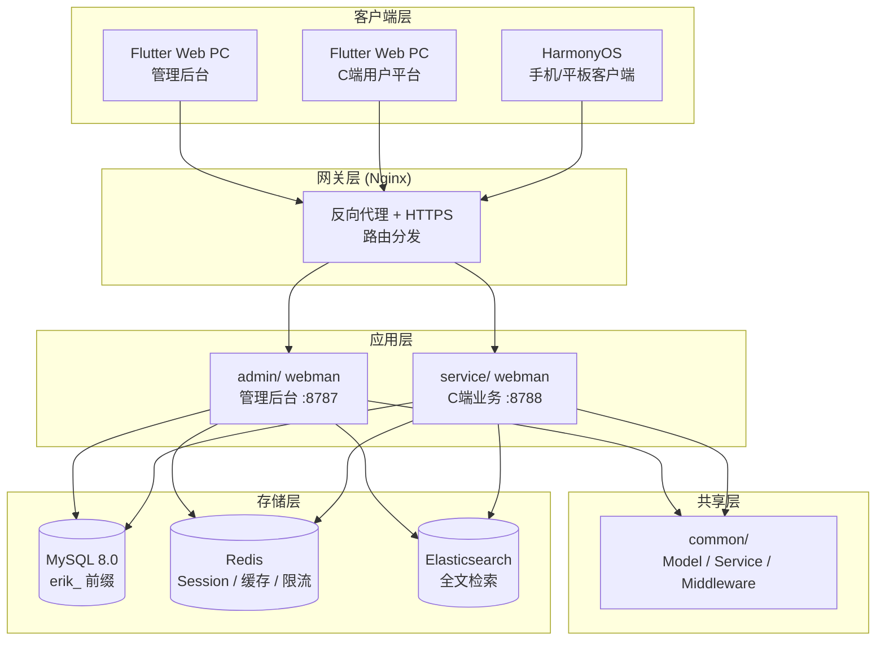
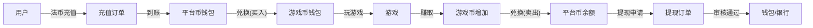

# Platform Agregasi Game Global — Spesifikasi Desain
<!-- lang-nav -->

Languages: [中文](2026-05-22-game-platform-design.md) · [English](2026-05-22-game-platform-design.en.md) · [한국어](2026-05-22-game-platform-design.ko.md) · [Русский](2026-05-22-game-platform-design.ru.md) · [Deutsch](2026-05-22-game-platform-design.de.md) · [Français](2026-05-22-game-platform-design.fr.md) · [Español](2026-05-22-game-platform-design.es.md) · [Português](2026-05-22-game-platform-design.pt.md) · [हिन्दी](2026-05-22-game-platform-design.hi.md) · [العربية](2026-05-22-game-platform-design.ar.md) · [বাংলা](2026-05-22-game-platform-design.bn.md) · **Bahasa Indonesia** · [日本語](2026-05-22-game-platform-design.ja.md)


> Copyright (c) 2026 erik <erik@erik.xyz> — https://erik.xyz

## 1. Ringkasan

Platform agregasi game global yang berlaku untuk semua orang. Setelah pengguna mendaftar, mereka melakukan deposit di platform dan menukarkannya dengan koin game, memainkan game dengan koin game, mendapatkan koin game, dan koin game dapat ditransfer kembali ke dompet untuk penarikan. Backend administrasi menangani review penarikan, manajemen game, dan manajemen pengguna.

### Strategi Versi

| Versi | Target | Perkiraan durasi |
|------|------|---------|
| Versi Dasar (MVP) | Menjalankan inti loop tertutup: daftar→deposit→tukar→main→tarik→review | 7-10 hari |
| Versi Standar | Siap produksi: pembayaran global, SDK game pihak ketiga, kontrol risiko dasar, frontend tiga platform | +10-15 hari |
| Versi Lengkap | Bentuk penuh: multi-bahasa, papan peringkat, kupon, kontrol risiko lengkap, semua fitur | +10-15 hari |

---

## 2. Tech Stack

### Backend
- PHP 8.3+, webman v2 (workerman/webman)
- Database: MySQL 8.0+, prefiks tabel `erik_`
- Primary key: BIGINT non-auto-increment, dihasilkan oleh `erikwang2013/snowflake-php`
- Enkripsi/dekripsi ID lapisan API: `erikwang2013/hashids`
- Autentikasi JWT: `erikwang2013/jwt-webman`
- Bendera negara: `erikwang2013/season`
- Enkripsi/dekripsi data sensitif API: `erikwang2013/encryption`
- Enkripsi/dekripsi kolom sensitif database: `erikwang2013/encryptable`
- Sinkronisasi dan kueri ES: `erikwang2013/webman-scout`
- Deteksi alat keamanan: `erikwang2013/security-php`
- Verifikasi acak operasi sensitif: `erikwang2013/poster-php`

### Frontend
- Flutter 3.x, sisi Web didesain dengan gaya backend administrasi PC (bukan gaya App seluler)
- Klien HarmonyOS ArkTS
- Backend administrasi dan platform sisi C dibangun terpisah, keduanya bergaya PC

### Standar Kode
- Semua file `.php` baru harus menyertakan pernyataan hak cipta di header
- Referensi fungsi/kelas global tanpa awalan `\`, menggunakan import `use`
- File konfigurasi menyertakan komentar bahasa Mandarin yang menjelaskan arti item konfigurasi
- File migrasi database menggunakan format SQL

---

## 3. Struktur Proyek

```
game-platform-php/
├── admin/                          # Backend administrasi (webman v2)
│   ├── app/admin/controller/       # Controller
│   │   ├── GameController.php      # Manajemen game
│   │   ├── WalletController.php    # Manajemen dompet
│   │   ├── PaymentController.php   # Manajemen pembayaran
│   │   ├── WithdrawController.php  # Review penarikan
│   │   ├── CountryController.php   # Konfigurasi negara
│   │   └── ...
│   ├── app/model/                  # Model data
│   ├── config/                     # Rute & konfigurasi
│   └── install/        # Migrasi SQL
│
├── service/                        # Sisi bisnis C (webman v2)
│   ├── app/api/v1/controller/      # API sisi C
│   │   ├── AuthController.php
│   │   ├── WalletController.php
│   │   ├── GameController.php
│   │   ├── DepositController.php
│   │   ├── WithdrawController.php
│   │   ├── ExchangeController.php
│   │   └── ...
│   ├── app/middleware/             # UserAuth(JWT) dll.
│   ├── config/                     # Rute & konfigurasi
│   └── install/        # Migrasi bersama
│
├── common/                         # Lapisan bersama (PSR-4 autoload)
│   ├── model/                      # Semua Model
│   ├── service/                    # Snowflake, Hashids, Encryption...
│   └── middleware/                 # Middleware bersama
│
├── apps/
│   ├── flutter/                    # Frontend Flutter
│   │   ├── admin/                  # Backend administrasi PC
│   │   └── platform/               # Platform pengguna sisi C PC
│   └── harmonyos/                  # Klien HarmonyOS
│
└── docs/superpowers/
    ├── specs/                      # Spesifikasi desain
    └── plans/                      # Rencana implementasi
```

---

## 4. Model Bisnis Inti

### 4.1 Sistem Mata Uang

```
Fiat (USD/CNY/EUR...)
  │  Deposit/Penarikan
  ▼
Koin platform (terpadu)
  │  Penukaran (termasuk kurs + komisi platform)
  ▼
Koin game (independen per game)
  │  Dapatkan/belanjakan saat bermain game
  ▼
Koin platform ← tukar kembali
```

- Presisi koin platform: decimal(18,4)
- Setiap koin game memiliki kurs independen terhadap koin platform
- Platform mengenakan selisih spread_pct untuk penukaran
- Operasi dompet menggunakan kunci optimis pada kolom version untuk mencegah konkurensi

### 4.2 Alur Penarikan

```
Pengguna mengajukan penarikan
  │
  ├─ Saklar global mati → tolak, beri tahu penarikan tidak tersedia saat ini
  │
  ├─ Saklar global nyala
  │     │
  │     ├─ Jumlah < ambang review → otomatis lolos → pembayaran
  │     │
  │     └─ Jumlah >= ambang review → masuk antrean review manual
  │           │
  │           ├─ Admin menyetujui → pembayaran
  │           └─ Admin menolak → kembalikan koin platform + catat alasan
```

---

## 5. Desain Database

### 5.1 Daftar Tabel Versi Dasar (12 tabel)

| No. | Nama tabel | Keterangan |
|------|------|------|
| 1 | `erik_user` | Pengguna sisi C |
| 2 | `erik_user_wallet` | Dompet koin platform |
| 3 | `erik_user_game_wallet` | Dompet koin game |
| 4 | `erik_game` | Game |
| 5 | `erik_game_currency` | Mata uang game |
| 6 | `erik_deposit_order` | Pesanan deposit |
| 7 | `erik_withdraw_order` | Pesanan penarikan |
| 8 | `erik_exchange_record` | Catatan penukaran |
| 9 | `erik_transaction` | Transaksi platform |
| 10 | `erik_payment_method` | Metode pembayaran |
| 11 | `erik_announcement` | Pengumuman |
| 12 | `erik_platform_config` | Konfigurasi platform (perluasan dari erik_system_config yang ada) |

### 5.2 Baru di Versi Standar (10 tabel)

| No. | Nama tabel | Keterangan |
|------|------|------|
| 13 | `erik_user_identity` | KYC/nama asli |
| 14 | `erik_user_oauth` | Login pihak ketiga |
| 15 | `erik_user_payment_account` | Akun penerima pembayaran |
| 16 | `erik_user_session` | Sesi login |
| 17 | `erik_game_server` | Server/zona game |
| 18 | `erik_game_play_log` | Catatan game |
| 19 | `erik_withdraw_limit` | Aturan batas penarikan |
| 20 | `erik_risk_rule` | Aturan kontrol risiko |
| 21 | `erik_risk_log` | Catatan pemicu kontrol risiko |
| 22 | `erik_stat_daily` | Snapshot statistik harian |

### 5.3 Baru di Versi Lengkap (8 tabel)

| No. | Nama tabel | Keterangan |
|------|------|------|
| 23 | `erik_game_category` | Kategori game |
| 24 | `erik_game_category_rel` | Relasi game-kategori |
| 25 | `erik_leaderboard` | Papan peringkat |
| 26 | `erik_coupon` | Kupon |
| 27 | `erik_user_coupon` | Kupon yang diambil pengguna |
| 28 | `erik_language` | Definisi bahasa |
| 29 | `erik_translation` | Teks terjemahan |
| 30 | `erik_country_config` | Konfigurasi negara |
| 31 | `erik_platform_revenue` | Catatan pendapatan platform |

---

## 6. Desain API

### 6.1 API Versi Dasar (sisi C ~25)

```
Antarmuka publik (tanpa autentikasi):
  POST   /api/auth/register
  POST   /api/auth/login
  POST   /api/auth/refresh
  GET    /api/captcha/generate
  GET    /api/game/list
  GET    /api/game/{hashid}
  GET    /api/announcement/list

Perlu autentikasi (UserAuth):
  GET    /api/wallet/info
  GET    /api/wallet/transactions
  POST   /api/deposit/create
  GET    /api/deposit/orders
  POST   /api/exchange/quote
  POST   /api/exchange/buy
  POST   /api/exchange/sell
  GET    /api/exchange/records
  POST   /api/withdraw/apply
  GET    /api/withdraw/orders
  POST   /api/game/launch
  GET    /api/game/play-logs
  GET    /api/user/profile
  PUT    /api/user/profile

Backend administrasi (AdminAuth + AdminPermission):
  GET    /admin/game/list
  POST   /admin/game/create
  PUT    /admin/game/{hashid}
  DELETE /admin/game/{hashid}
  GET    /admin/user/list
  GET    /admin/user/{hashid}
  PUT    /admin/user/{hashid}
  GET    /admin/deposit/orders
  GET    /admin/withdraw/orders
  PUT    /admin/withdraw/review
  PUT    /admin/withdraw/switch
  POST   /admin/withdraw/limits/set
  POST   /admin/payment/method/toggle
  POST   /admin/announcement/create
  POST   /admin/export/users
  POST   /admin/export/transactions
  GET    /admin/dashboard/platform
```

### 6.2 Format Respons

Semua antarmuka merespons secara seragam:

```json
{
  "code": 0,
  "message": "success",
  "data": { ... }
}
```

| code | Arti |
|------|------|
| 0 | Sukses |
| 400 | Kesalahan parameter |
| 401 | Belum autentikasi |
| 403 | Tanpa izin |
| 404 | Tidak ada |
| 422 | Gagal validasi |
| 500 | Error server |

---

## 7. Diagram Arsitektur

### 7.1 Topologi Sistem



### 7.2 Alur Mata Uang



---

## 8. Desain Keamanan

Berdasarkan 18 lapisan pertahanan mendalam yang ada, tambahan baru untuk platform game:

| Lapisan | Tindakan |
|------|------|
| Keamanan konkurensi | Kunci optimis kolom version tabel dompet, mencegah pengurangan berulang/penerimaan berulang |
| Keamanan penarikan | Saklar global + review ambang jumlah + batas harian/bulanan + verifikasi acak poster-php |
| Keamanan penukaran | Kueri harga terpisah dari eksekusi, kueri kedaluwarsa 60 detik, kurs dihitung ulang saat eksekusi |
| Keamanan game | Verifikasi tanda tangan callback pihak ketiga, daftar putih IP, pertahanan replay attack |
| Kontrol risiko | Mesin aturan kontrol risiko, pemblokiran transaksi abnormal |

---

## 9. Tahap Pengembangan

### Versi Dasar (menjalankan inti loop tertutup)

1. Infrastruktur: struktur direktori, konfigurasi composer, migrasi database, lapisan bersama
2. Inti sisi C: daftar/login, dompet koin platform, deposit (Stripe), penukaran (kurs tetap), penarikan (review manual)
3. Manajemen game: CRUD backend, API daftar game, detail game
4. Backend administrasi: tombol review penarikan, saklar global, manajemen pengguna
5. Flutter PC: perluasan backend administrasi + platform sisi C (paling sederhana, 5 halaman)
6. Pengujian dan verifikasi: rantai lengkap deposit→tukar→tarik

### Versi Standar (siap produksi)

1. Login OAuth, banyak metode pembayaran, callback otomatis
2. Integrasi SDK game pihak ketiga (verifikasi tanda tangan, penyelesaian callback)
3. Kurs dinamis, KYC, aturan batas, dasar kontrol risiko
4. Visualisasi dasbor, ekspor Excel
5. Klien HarmonyOS

### Versi Lengkap (bentuk penuh)

1. Internasionalisasi (multi-bahasa, multi-mata uang, konfigurasi diferensiasi negara)
2. Papan peringkat, kupon, sistem pengumuman
3. Mesin kontrol risiko lengkap, snapshot statistik harian
4. Pencarian ES, ekspor PDF
5. Pengujian menyeluruh, dokumentasi API
