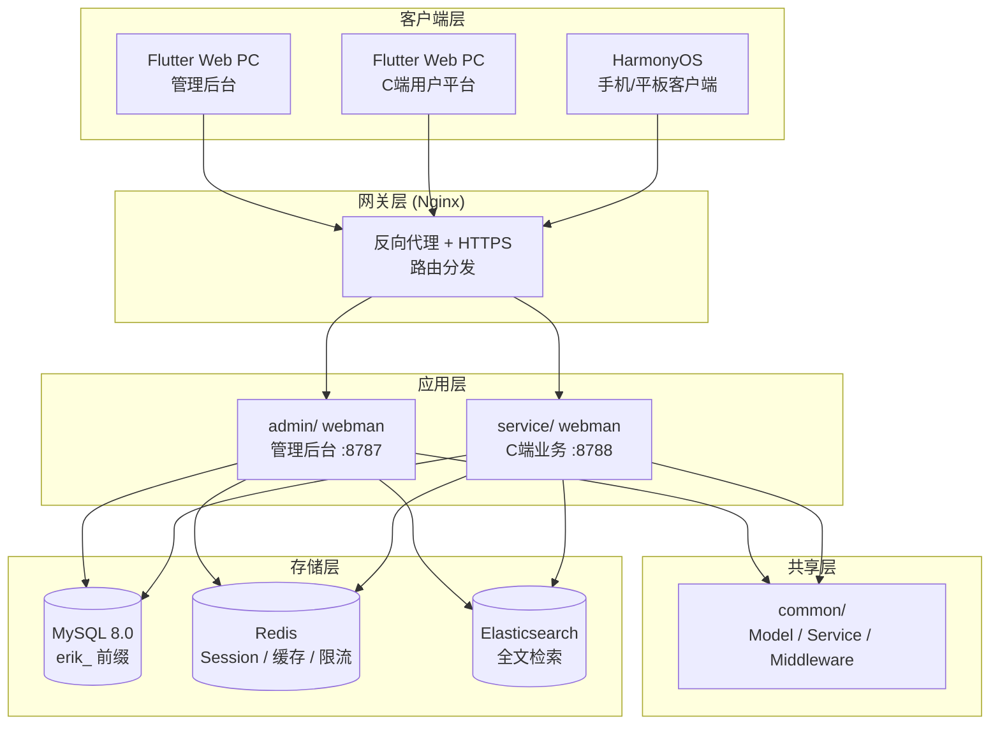
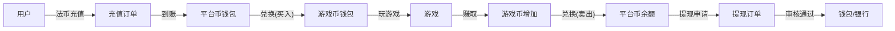

# 全球ゲームアグリゲーションプラットフォーム — 設計仕様
<!-- lang-nav -->

Languages: **中文** · [English](2026-05-22-game-platform-design.en.md) · [한국어](2026-05-22-game-platform-design.ko.md) · [Русский](2026-05-22-game-platform-design.ru.md) · [Deutsch](2026-05-22-game-platform-design.de.md) · [Français](2026-05-22-game-platform-design.fr.md) · [Español](2026-05-22-game-platform-design.es.md) · [Português](2026-05-22-game-platform-design.pt.md) · [हिन्दी](2026-05-22-game-platform-design.hi.md) · [العربية](2026-05-22-game-platform-design.ar.md) · [বাংলা](2026-05-22-game-platform-design.bn.md) · [Bahasa Indonesia](2026-05-22-game-platform-design.id.md) · [日本語](2026-05-22-game-platform-design.ja.md)


> Copyright (c) 2026 erik <erik@erik.xyz> — https://erik.xyz

## 1. 概要

全球通用のゲームアグリゲーションプラットフォーム。ユーザーは登録後、プラットフォーム上でチャージしてゲームコインに交換し、ゲームコインでゲームをプレイしてゲームコインを稼ぎ、ゲームコインはウォレットに戻して現金化できる。管理バックエンドは出金審査、ゲーム管理、ユーザー管理を行う。

### バージョン戦略

| バージョン | 目標 | 想定期間 |
|------|------|---------|
| 基礎版 (MVP) | コアクローズドループを完走: 登録→チャージ→交換→ゲーム→出金→審査 | 7-10日 |
| 標準版 | 本番利用可能: グローバル決済、サードパーティゲームSDK、基礎リスク管理、3端末フロントエンド | +10-15日 |
| 完全版 | 完全体: 多言語、ランキング、クーポン、完全なリスク管理、全機能 | +10-15日 |

---

## 2. 技術スタック

### バックエンド
- PHP 8.3+, webman v2 (workerman/webman)
- データベース: MySQL 8.0+、テーブルプレフィックス `erik_`
- 主キー: BIGINT 非自動採番、`erikwang2013/snowflake-php` が生成
- API 層 ID 暗号化/復号: `erikwang2013/hashids`
- JWT 認証: `erikwang2013/jwt-webman`
- 国旗: `erikwang2013/season`
- API 機密データ暗号化/復号: `erikwang2013/encryption`
- データベース機密フィールド暗号化/復号: `erikwang2013/encryptable`
- ES 同期と検索: `erikwang2013/webman-scout`
- セキュリティツール検出: `erikwang2013/security-php`
- 機密操作のランダム検証: `erikwang2013/poster-php`

### フロントエンド
- Flutter 3.x、Web 端は PC 管理バックエンドスタイルで設計（モバイルアプリスタイルではない）
- HarmonyOS ArkTS クライアント
- 管理バックエンドと C端プラットフォームは分けてビルドし、いずれも PC スタイル

### コード規約
- 新規作成するすべての `.php` ファイルのヘッダーには著作権表示を含めること
- グローバル関数/クラスの参照に前置 `\` を付けず、`use` でインポートする
- 設定ファイルには設定項目の意味を説明する中国語コメントを含める
- データベースマイグレーションファイルは SQL 形式を使用

---

## 3. プロジェクト構成

```
game-platform-php/
├── admin/                          # 管理后台（webman v2）
│   ├── app/admin/controller/       # 控制器
│   │   ├── GameController.php      # 游戏管理
│   │   ├── WalletController.php    # 钱包管理
│   │   ├── PaymentController.php   # 支付管理
│   │   ├── WithdrawController.php  # 提现审核
│   │   ├── CountryController.php   # 国家配置
│   │   └── ...
│   ├── app/model/                  # 数据模型
│   ├── config/                     # 路由 & 配置
│   └── install/        # SQL 迁移
│
├── service/                        # C端业务端（webman v2）
│   ├── app/api/v1/controller/      # C端API
│   │   ├── AuthController.php
│   │   ├── WalletController.php
│   │   ├── GameController.php
│   │   ├── DepositController.php
│   │   ├── WithdrawController.php
│   │   ├── ExchangeController.php
│   │   └── ...
│   ├── app/middleware/             # UserAuth(JWT) 等
│   ├── config/                     # 路由 & 配置
│   └── install/        # 共享迁移
│
├── common/                         # 共享层（PSR-4 autoload）
│   ├── model/                      # 所有 Model
│   ├── service/                    # Snowflake, Hashids, Encryption...
│   └── middleware/                  # 共享中间件
│
├── apps/
│   ├── flutter/                    # Flutter 前端
│   │   ├── admin/                  # PC 管理后台
│   │   └── platform/               # PC C端用户平台
│   └── harmonyos/                  # HarmonyOS 客户端
│
└── docs/superpowers/
    ├── specs/                      # 设计规范
    └── plans/                      # 实现计划
```

---

## 4. コアビジネスモデル

### 4.1 通貨体系

```
法币 (USD/CNY/EUR...)
  │  充值/提现
  ▼
平台币 (统一)
  │  兑换（含汇率+平台抽成）
  ▼
游戏币 (每种游戏独立)
  │  玩游戏赚/花
  ▼
平台币 ← 兑回
```

- プラットフォームコインの精度: decimal(18,4)
- 各ゲームコインはプラットフォームコインに対して独立した為替レートを持つ
- プラットフォームは交換差益 spread_pct を徴収
- ウォレット操作は楽観ロックの version フィールドで並行処理を防止

### 4.2 出金フロー

```
用户发起提现
  │
  ├─ 全局开关关闭 → 拒绝，提示暂不可提现
  │
  ├─ 全局开关开启
  │     │
  │     ├─ 金额 < 审核阈值 → 自动通过 → 打款
  │     │
  │     └─ 金额 >= 审核阈值 → 进入人工审核队列
  │           │
  │           ├─ 管理员通过 → 打款
  │           └─ 管理员拒绝 → 退回平台币 + 附注原因
```

---

## 5. データベース設計

### 5.1 基礎版テーブル一覧（12枚）

| 番号 | テーブル名 | 説明 |
|------|------|------|
| 1 | `erik_user` | C端ユーザー |
| 2 | `erik_user_wallet` | プラットフォームコインウォレット |
| 3 | `erik_user_game_wallet` | ゲームコインウォレット |
| 4 | `erik_game` | ゲーム |
| 5 | `erik_game_currency` | ゲーム通貨 |
| 6 | `erik_deposit_order` | チャージ注文 |
| 7 | `erik_withdraw_order` | 出金注文 |
| 8 | `erik_exchange_record` | 交換記録 |
| 9 | `erik_transaction` | プラットフォーム流水 |
| 10 | `erik_payment_method` | 決済方法 |
| 11 | `erik_announcement` | 公告 |
| 12 | `erik_platform_config` | プラットフォーム設定（既存の erik_system_config を拡張） |

### 5.2 標準版で追加（10枚）

| 番号 | テーブル名 | 説明 |
|------|------|------|
| 13 | `erik_user_identity` | 実名/KYC |
| 14 | `erik_user_oauth` | サードパーティログイン |
| 15 | `erik_user_payment_account` | 入金口座 |
| 16 | `erik_user_session` | ログインセッション |
| 17 | `erik_game_server` | ゲーム区サーバー |
| 18 | `erik_game_play_log` | ゲーム記録 |
| 19 | `erik_withdraw_limit` | 出金制限ルール |
| 20 | `erik_risk_rule` | リスク管理ルール |
| 21 | `erik_risk_log` | リスク管理発動記録 |
| 22 | `erik_stat_daily` | 日次統計スナップショット |

### 5.3 完全版で追加（8枚）

| 番号 | テーブル名 | 説明 |
|------|------|------|
| 23 | `erik_game_category` | ゲームカテゴリ |
| 24 | `erik_game_category_rel` | ゲーム-カテゴリ関連 |
| 25 | `erik_leaderboard` | ランキング |
| 26 | `erik_coupon` | クーポン |
| 27 | `erik_user_coupon` | ユーザークーポン取得 |
| 28 | `erik_language` | 言語定義 |
| 29 | `erik_translation` | 翻訳テキスト |
| 30 | `erik_country_config` | 国家設定 |
| 31 | `erik_platform_revenue` | プラットフォーム収益記録 |

---

## 6. API 設計

### 6.1 基礎版 API（C端 ~25個）

```
公开接口（无需认证）:
  POST   /api/auth/register
  POST   /api/auth/login
  POST   /api/auth/refresh
  GET    /api/captcha/generate
  GET    /api/game/list
  GET    /api/game/{hashid}
  GET    /api/announcement/list

需认证 (UserAuth):
  GET    /api/wallet/info
  GET    /api/wallet/transactions
  POST   /api/deposit/create
  GET    /api/deposit/orders
  POST   /api/exchange/quote
  POST   /api/exchange/buy
  POST   /api/exchange/sell
  GET    /api/exchange/records
  POST   /api/withdraw/apply
  GET    /api/withdraw/orders
  POST   /api/game/launch
  GET    /api/game/play-logs
  GET    /api/user/profile
  PUT    /api/user/profile

管理后台（AdminAuth + AdminPermission）:
  GET    /admin/game/list
  POST   /admin/game/create
  PUT    /admin/game/{hashid}
  DELETE /admin/game/{hashid}
  GET    /admin/user/list
  GET    /admin/user/{hashid}
  PUT    /admin/user/{hashid}
  GET    /admin/deposit/orders
  GET    /admin/withdraw/orders
  PUT    /admin/withdraw/review
  PUT    /admin/withdraw/switch
  POST   /admin/withdraw/limits/set
  POST   /admin/payment/method/toggle
  POST   /admin/announcement/create
  POST   /admin/export/users
  POST   /admin/export/transactions
  GET    /admin/dashboard/platform
```

### 6.2 レスポンス形式

すべてのエンドポイントは統一レスポンス:

```json
{
  "code": 0,
  "message": "success",
  "data": { ... }
}
```

| code | 意味 |
|------|------|
| 0 | 成功 |
| 400 | パラメータエラー |
| 401 | 未認証 |
| 403 | 権限なし |
| 404 | 存在しない |
| 422 | 検証失敗 |
| 500 | サーバーエラー |

---

## 7. アーキテクチャ図

### 7.1 システムトポロジー



### 7.2 通貨の流れ



---

## 8. セキュリティ設計

既存の 18 層縦深防御に基づき、ゲームプラットフォーム向けに追加:

| レイヤー | 対策 |
|------|------|
| 並行安全性 | ウォレットテーブルの version 楽観ロックで、重複引き落とし/重複入金を防止 |
| 出金安全性 | グローバルスイッチ + 金額閾値審査 + 日/月限度額 + poster-php ランダム検証 |
| 交換安全性 | 見積と約定を分離、見積は60秒で失効、約定時に為替レートを再計算 |
| ゲーム安全性 | サードパーティコールバックの署名検証、IP ホワイトリスト、replay attack 防御 |
| リスク管理 | リスク管理ルールエンジン、異常取引の遮断 |

---

## 9. 開発フェーズ

### 基礎版（コアクローズドループを完走）

1. 基盤インフラ: ディレクトリ構成、composer設定、データベースマイグレーション、共有レイヤー
2. C端コア: 登録/ログイン、プラットフォームコインウォレット、チャージ(Stripe)、交換(固定レート)、出金(手動審査)
3. ゲーム管理: 管理バックエンドCRUD、ゲーム一覧API、ゲーム詳細
4. 管理バックエンド: 出金審査ボタン、グローバルスイッチ、ユーザー管理
5. Flutter PC: 管理バックエンド拡張 + C端プラットフォーム（最小構成、5ページ）
6. テスト検証: チャージ→交換→出金の完全なチェーン

### 標準版（本番利用可能）

1. OAuthログイン、複数決済方法、自動コールバック
2. サードパーティゲームSDK連携（署名検証、コールバック決済）
3. 動的為替レート、KYC、限度額ルール、リスク管理の基礎
4. ダッシュボード可視化、Excelエクスポート
5. HarmonyOSクライアント

### 完全版（完全体）

1. 国際化（多言語、多通貨、国家別設定）
2. ランキング、クーポン、公告システム
3. 完全なリスク管理エンジン、日次統計スナップショット
4. ES検索、PDFエクスポート
5. 総合テスト、APIドキュメント
