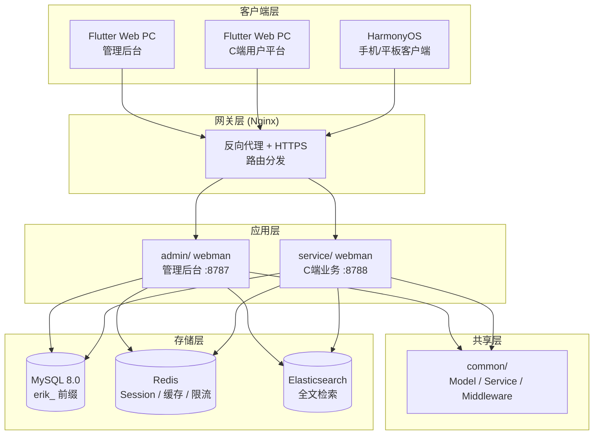
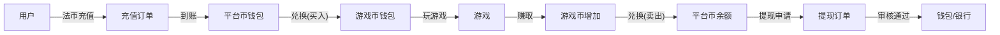

# 글로벌 게임 통합 플랫폼 — 설계 명세
<!-- lang-nav -->

Languages: [中文](2026-05-22-game-platform-design.md) · [English](2026-05-22-game-platform-design.en.md) · **한국어** · [Русский](2026-05-22-game-platform-design.ru.md) · [Deutsch](2026-05-22-game-platform-design.de.md) · [Français](2026-05-22-game-platform-design.fr.md) · [Español](2026-05-22-game-platform-design.es.md) · [Português](2026-05-22-game-platform-design.pt.md) · [हिन्दी](2026-05-22-game-platform-design.hi.md) · [العربية](2026-05-22-game-platform-design.ar.md) · [বাংলা](2026-05-22-game-platform-design.bn.md) · [Bahasa Indonesia](2026-05-22-game-platform-design.id.md) · [日本語](2026-05-22-game-platform-design.ja.md)


> Copyright (c) 2026 erik <erik@erik.xyz> — https://erik.xyz

## 1. 개요

글로벌 범용 게임 통합 플랫폼. 사용자는 회원가입 후 플랫폼에서 충전하여 게임 코인을 환전하고, 게임 코인으로 게임을 즐기고 게임 코인을 획득하며, 게임 코인은 다시 지갑으로 전환해 출금할 수 있습니다. 관리 백오피스에서 출금 심사, 게임 관리, 사용자 관리를 담당합니다.

### 버전 전략

| 버전 | 목표 | 예상 기간 |
|------|------|---------|
| 베이직 에디션 (MVP) | 핵심 폐루프 구동: 등록→충전→환전→게임→출금→심사 | 7-10일 |
| 스탠다드 에디션 | 프로덕션 사용 가능: 글로벌 결제, 서드파티 게임 SDK, 기초 리스크 관리, 3개 클라이언트 | +10-15일 |
| 풀 에디션 | 완전체: 다국어, 리더보드, 쿠폰, 완전한 리스크 관리, 전체 기능 | +10-15일 |

---

## 2. 기술 스택

### 백엔드
- PHP 8.3+, webman v2 (workerman/webman)
- 데이터베이스: MySQL 8.0+, 테이블 접두사 `erik_`
- 기본 키: BIGINT 비자동 증가, `erikwang2013/snowflake-php`로 생성
- API 계층 ID 암복호화: `erikwang2013/hashids`
- JWT 인증: `erikwang2013/jwt-webman`
- 국가 국기: `erikwang2013/season`
- API 민감 데이터 암복호화: `erikwang2013/encryption`
- 데이터베이스 민감 필드 암복호화: `erikwang2013/encryptable`
- ES 동기화 및 조회: `erikwang2013/webman-scout`
- 보안 도구 감지: `erikwang2013/security-php`
- 민감 작업 랜덤 검증: `erikwang2013/poster-php`

### 프론트엔드
- Flutter 3.x, Web은 PC 관리 백오피스 스타일로 설계 (모바일 App 스타일 아님)
- HarmonyOS ArkTS 클라이언트
- 관리 백오피스와 C단 플랫폼을 분리 구축하며, 모두 PC 스타일

### 코드 규범
- 모든 신규 `.php` 파일 상단에 저작권 선언 필수
- 전역 함수/클래스 참조에 `\` 접두사를 붙이지 않고 `use`로 import
- 설정 파일에 각 설정 항목의 의미를 설명하는 중국어 주석 포함
- 데이터베이스 마이그레이션 파일은 SQL 형식 사용

---

## 3. 프로젝트 구조

```
game-platform-php/
├── admin/                          # 관리 백오피스 (webman v2)
│   ├── app/admin/controller/       # 컨트롤러
│   │   ├── GameController.php      # 게임 관리
│   │   ├── WalletController.php    # 지갑 관리
│   │   ├── PaymentController.php   # 결제 관리
│   │   ├── WithdrawController.php  # 출금 심사
│   │   ├── CountryController.php   # 국가 설정
│   │   └── ...
│   ├── app/model/                  # 데이터 모델
│   ├── config/                     # 라우트 & 설정
│   └── install/        # SQL 마이그레이션
│
├── service/                        # C단 비즈니스 서버 (webman v2)
│   ├── app/api/v1/controller/      # C단 API
│   │   ├── AuthController.php
│   │   ├── WalletController.php
│   │   ├── GameController.php
│   │   ├── DepositController.php
│   │   ├── WithdrawController.php
│   │   ├── ExchangeController.php
│   │   └── ...
│   ├── app/middleware/             # UserAuth(JWT) 등
│   ├── config/                     # 라우트 & 설정
│   └── install/        # 공유 마이그레이션
│
├── common/                         # 공유 레이어 (PSR-4 autoload)
│   ├── model/                      # 모든 Model
│   ├── service/                    # Snowflake, Hashids, Encryption...
│   └── middleware/                  # 공유 미들웨어
│
├── apps/
│   ├── flutter/                    # Flutter 프론트엔드
│   │   ├── admin/                  # PC 관리 백오피스
│   │   └── platform/               # PC C단 사용자 플랫폼
│   └── harmonyos/                  # HarmonyOS 클라이언트
│
└── docs/superpowers/
    ├── specs/                      # 설계 명세
    └── plans/                      # 구현 계획
```

---

## 4. 핵심 비즈니스 모델

### 4.1 코인 체계

```
법정화폐 (USD/CNY/EUR...)
  │  충전/출금
  ▼
플랫폼 코인 (통일)
  │  환전 (환율 + 플랫폼 수수료 포함)
  ▼
게임 코인 (게임별 독립)
  │  게임 플레이로 획득/소비
  ▼
플랫폼 코인 ← 환전 회수
```

- 플랫폼 코인 정밀도: decimal(18,4)
- 각 게임 코인은 플랫폼 코인 대비 독립 환율
- 플랫폼이 환전 차액 spread_pct 수취
- 지갑 작업은 낙관적 잠금 version 필드로 동시성 방지

### 4.2 출금 플로우

```
사용자 출금 요청
  │
  ├─ 전역 스위치 꺼짐 → 거부, 현재 출금 불가 안내
  │
  ├─ 전역 스위치 켜짐
  │     │
  │     ├─ 금액 < 심사 임계값 → 자동 승인 → 지급
  │     │
  │     └─ 금액 >= 심사 임계값 → 수동 심사 큐 진입
  │           │
  │           ├─ 관리자 승인 → 지급
  │           └─ 관리자 거부 → 플랫폼 코인 반환 + 사유 첨부
```

---

## 5. 데이터베이스 설계

### 5.1 베이직 에디션 테이블 목록 (12장)

| 번호 | 테이블명 | 설명 |
|------|------|------|
| 1 | `erik_user` | C단 사용자 |
| 2 | `erik_user_wallet` | 플랫폼 코인 지갑 |
| 3 | `erik_user_game_wallet` | 게임 코인 지갑 |
| 4 | `erik_game` | 게임 |
| 5 | `erik_game_currency` | 게임 코인 종류 |
| 6 | `erik_deposit_order` | 충전 주문 |
| 7 | `erik_withdraw_order` | 출금 주문 |
| 8 | `erik_exchange_record` | 환전 기록 |
| 9 | `erik_transaction` | 플랫폼 거래 내역 |
| 10 | `erik_payment_method` | 결제 수단 |
| 11 | `erik_announcement` | 공지 |
| 12 | `erik_platform_config` | 플랫폼 설정 (기존 erik_system_config 확장) |

### 5.2 스탠다드 에디션 추가 (10장)

| 번호 | 테이블명 | 설명 |
|------|------|------|
| 13 | `erik_user_identity` | 실명/KYC |
| 14 | `erik_user_oauth` | 서드파티 로그인 |
| 15 | `erik_user_payment_account` | 수취 계좌 |
| 16 | `erik_user_session` | 로그인 세션 |
| 17 | `erik_game_server` | 게임 서버/구역 |
| 18 | `erik_game_play_log` | 게임 기록 |
| 19 | `erik_withdraw_limit` | 출금 제한 규칙 |
| 20 | `erik_risk_rule` | 리스크 규칙 |
| 21 | `erik_risk_log` | 리스크 트리거 기록 |
| 22 | `erik_stat_daily` | 일별 통계 스냅샷 |

### 5.3 풀 에디션 추가 (8장)

| 번호 | 테이블명 | 설명 |
|------|------|------|
| 23 | `erik_game_category` | 게임 분류 |
| 24 | `erik_game_category_rel` | 게임-분류 연관 |
| 25 | `erik_leaderboard` | 리더보드 |
| 26 | `erik_coupon` | 쿠폰 |
| 27 | `erik_user_coupon` | 사용자 쿠폰 수령 |
| 28 | `erik_language` | 언어 정의 |
| 29 | `erik_translation` | 번역 텍스트 |
| 30 | `erik_country_config` | 국가 설정 |
| 31 | `erik_platform_revenue` | 플랫폼 수익 기록 |

---

## 6. API 설계

### 6.1 베이직 에디션 API (C단 ~25개)

```
공개 인터페이스 (인증 불필요):
  POST   /api/auth/register
  POST   /api/auth/login
  POST   /api/auth/refresh
  GET    /api/captcha/generate
  GET    /api/game/list
  GET    /api/game/{hashid}
  GET    /api/announcement/list

인증 필요 (UserAuth):
  GET    /api/wallet/info
  GET    /api/wallet/transactions
  POST   /api/deposit/create
  GET    /api/deposit/orders
  POST   /api/exchange/quote
  POST   /api/exchange/buy
  POST   /api/exchange/sell
  GET    /api/exchange/records
  POST   /api/withdraw/apply
  GET    /api/withdraw/orders
  POST   /api/game/launch
  GET    /api/game/play-logs
  GET    /api/user/profile
  PUT    /api/user/profile

관리 백오피스 (AdminAuth + AdminPermission):
  GET    /admin/game/list
  POST   /admin/game/create
  PUT    /admin/game/{hashid}
  DELETE /admin/game/{hashid}
  GET    /admin/user/list
  GET    /admin/user/{hashid}
  PUT    /admin/user/{hashid}
  GET    /admin/deposit/orders
  GET    /admin/withdraw/orders
  PUT    /admin/withdraw/review
  PUT    /admin/withdraw/switch
  POST   /admin/withdraw/limits/set
  POST   /admin/payment/method/toggle
  POST   /admin/announcement/create
  POST   /admin/export/users
  POST   /admin/export/transactions
  GET    /admin/dashboard/platform
```

### 6.2 응답 형식

모든 인터페이스는 통일된 응답:

```json
{
  "code": 0,
  "message": "success",
  "data": { ... }
}
```

| code | 의미 |
|------|------|
| 0 | 성공 |
| 400 | 파라미터 오류 |
| 401 | 인증 안 됨 |
| 403 | 권한 없음 |
| 404 | 존재하지 않음 |
| 422 | 검증 실패 |
| 500 | 서버 오류 |

---

## 7. 아키텍처 다이어그램

### 7.1 시스템 토폴로지



### 7.2 코인 흐름



---

## 8. 보안 설계

기존 18단계 심층 방어를 바탕으로 게임 플랫폼에 추가:

| 레이어 | 조치 |
|------|------|
| 동시성 안전 | 지갑 테이블 version 낙관적 잠금으로 중복 차감/중복 입금 방지 |
| 출금 안전 | 전역 스위치 + 금액 임계값 심사 + 일/월 한도 + poster-php 랜덤 검증 |
| 환전 안전 | 견적과 체결 분리, 견적 60초 만료, 체결 시 환율 재계산 |
| 게임 안전 | 서드파티 콜백 서명 검증, IP 화이트리스트, replay attack 방어 |
| 리스크 관리 | 리스크 규칙 엔진, 이상 거래 차단 |

---

## 9. 개발 단계

### 베이직 에디션 (핵심 폐루프 구동)

1. 인프라: 디렉터리 구조, composer 설정, 데이터베이스 마이그레이션, 공유 레이어
2. C단 핵심: 등록/로그인, 플랫폼 코인 지갑, 충전(Stripe), 환전(고정 환율), 출금(수동 심사)
3. 게임 관리: 백오피스 CRUD, 게임 목록 API, 게임 상세
4. 관리 백오피스: 출금 심사 버튼, 전역 스위치, 사용자 관리
5. Flutter PC: 관리 백오피스 확장 + C단 플랫폼 (최소, 5페이지)
6. 테스트 검증: 충전→환전→출금 전체 체인

### 스탠다드 에디션 (프로덕션 사용 가능)

1. OAuth 로그인, 다중 결제 수단, 자동 콜백
2. 서드파티 게임 SDK 연동 (서명 검증, 콜백 정산)
3. 동적 환율, KYC, 한도 규칙, 기초 리스크 관리
4. 대시보드 시각화, Excel 내보내기
5. HarmonyOS 클라이언트

### 풀 에디션 (완전체)

1. 국제화 (다국어, 다중 코인, 국가별 차등 설정)
2. 리더보드, 쿠폰, 공지 시스템
3. 완전한 리스크 엔진, 일별 통계 스냅샷
4. ES 검색, PDF 내보내기
5. 전면 테스트, API 문서
