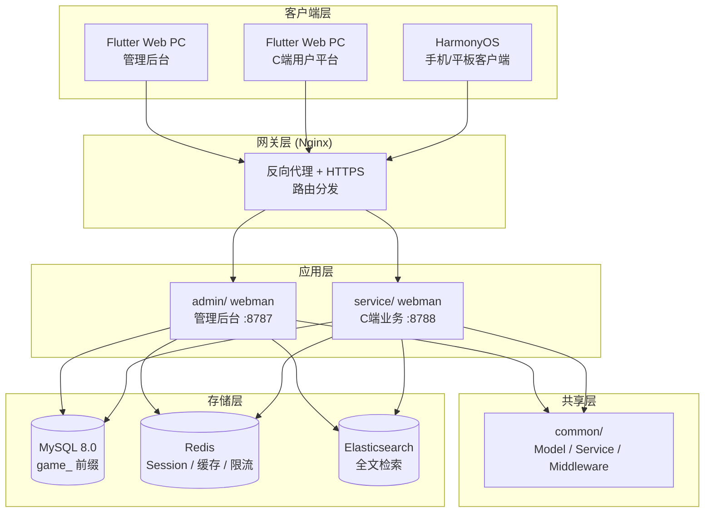
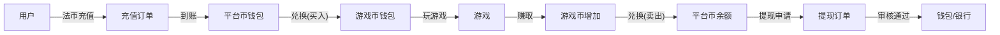

# 全球游戏聚合平台 — 设计规范
<!-- lang-nav -->

Languages: **中文** · [English](2026-05-22-game-platform-design.en.md) · [한국어](2026-05-22-game-platform-design.ko.md) · [Русский](2026-05-22-game-platform-design.ru.md) · [Deutsch](2026-05-22-game-platform-design.de.md) · [Français](2026-05-22-game-platform-design.fr.md) · [Español](2026-05-22-game-platform-design.es.md) · [Português](2026-05-22-game-platform-design.pt.md) · [हिन्दी](2026-05-22-game-platform-design.hi.md) · [العربية](2026-05-22-game-platform-design.ar.md) · [বাংলা](2026-05-22-game-platform-design.bn.md) · [Bahasa Indonesia](2026-05-22-game-platform-design.id.md) · [日本語](2026-05-22-game-platform-design.ja.md)


> Copyright (c) 2026 erik <erik@erik.xyz> — https://erik.xyz

## 1. 概述

全球通用游戏聚合平台。用户注册后在平台充值兑换游戏币，用游戏币玩游戏、赚取游戏币，游戏币可转回钱包提现。后台管理提现审核、游戏管理、用户管理。

### 版本策略

| 版本 | 目标 | 预估周期 |
|------|------|---------|
| 基础版 (MVP) | 跑通核心闭环：注册→充值→兑换→游戏→提现→审核 | 7-10天 |
| 标准版 | 生产可用：全球化支付、第三方游戏SDK、基础风控、三端前端 | +10-15天 |
| 完整版 | 完全体：多语言、排行榜、优惠券、完整风控、全量功能 | +10-15天 |

---

## 2. 技术栈

### 后端
- PHP 8.3+, webman v2 (workerman/webman)
- 数据库: MySQL 8.0+，表前缀 `game_`
- 主键: BIGINT 非自增，由 `erikwang2013/snowflake-php` 生成
- API 层 ID 加解密: `erikwang2013/hashids`
- JWT 认证: `erikwang2013/jwt-webman`
- 国家旗帜: `erikwang2013/season`
- API 敏感数据加解密: `erikwang2013/encryption`
- 数据库敏感字段加解密: `erikwang2013/encryptable`
- ES 同步与查询: `erikwang2013/webman-scout`
- 安全工具检测: `erikwang2013/security-php`
- 敏感操作随机验证: `erikwang2013/poster-php`

### 前端
- Flutter 3.x，Web 端按 PC 管理后台风格设计（非移动端 App 风格）
- HarmonyOS ArkTS 客户端
- 管理后台和C端平台分开构建，均PC风格

### 代码规范
- 所有新建 `.php` 文件头必须包含版权声明
- 全局函数/类引用不加前置 `\`，使用 `use` 导入
- 配置文件包含中文注释说明配置项含义
- 数据库迁移文件使用 SQL 格式

---

## 3. 项目结构

```
game-platform-php/
├── admin/                          # 管理后台（webman v2）
│   ├── app/admin/controller/       # 控制器
│   │   ├── GameController.php      # 游戏管理
│   │   ├── WalletController.php    # 钱包管理
│   │   ├── PaymentController.php   # 支付管理
│   │   ├── WithdrawController.php  # 提现审核
│   │   ├── CountryController.php   # 国家配置
│   │   └── ...
│   ├── app/model/                  # 数据模型
│   ├── config/                     # 路由 & 配置
│   └── install/        # SQL 迁移
│
├── service/                        # C端业务端（webman v2）
│   ├── app/api/v1/controller/      # C端API
│   │   ├── AuthController.php
│   │   ├── WalletController.php
│   │   ├── GameController.php
│   │   ├── DepositController.php
│   │   ├── WithdrawController.php
│   │   ├── ExchangeController.php
│   │   └── ...
│   ├── app/middleware/             # UserAuth(JWT) 等
│   ├── config/                     # 路由 & 配置
│   └── install/        # 共享迁移
│
├── common/                         # 共享层（PSR-4 autoload）
│   ├── model/                      # 所有 Model
│   ├── service/                    # Snowflake, Hashids, Encryption...
│   └── middleware/                  # 共享中间件
│
├── apps/
│   ├── flutter/                    # Flutter 前端
│   │   ├── admin/                  # PC 管理后台
│   │   └── platform/               # PC C端用户平台
│   └── harmonyos/                  # HarmonyOS 客户端
│
└── docs/superpowers/
    ├── specs/                      # 设计规范
    └── plans/                      # 实现计划
```

---

## 4. 核心业务模型

### 4.1 币种体系

```
法币 (USD/CNY/EUR...)
  │  充值/提现
  ▼
平台币 (统一)
  │  兑换（含汇率+平台抽成）
  ▼
游戏币 (每种游戏独立)
  │  玩游戏赚/花
  ▼
平台币 ← 兑回
```

- 平台币精度: decimal(18,4)
- 每种游戏币对平台币有独立汇率
- 平台收取兑换差价 spread_pct
- 钱包操作使用乐观锁 version 字段防并发

### 4.2 提现流程

```
用户发起提现
  │
  ├─ 全局开关关闭 → 拒绝，提示暂不可提现
  │
  ├─ 全局开关开启
  │     │
  │     ├─ 金额 < 审核阈值 → 自动通过 → 打款
  │     │
  │     └─ 金额 >= 审核阈值 → 进入人工审核队列
  │           │
  │           ├─ 管理员通过 → 打款
  │           └─ 管理员拒绝 → 退回平台币 + 附注原因
```

---

## 5. 数据库设计

### 5.1 基础版表清单（12张）

| 序号 | 表名 | 说明 |
|------|------|------|
| 1 | `game_user` | C端用户 |
| 2 | `game_user_wallet` | 平台币钱包 |
| 3 | `game_user_game_wallet` | 游戏币钱包 |
| 4 | `game_game` | 游戏 |
| 5 | `game_game_currency` | 游戏币种 |
| 6 | `game_deposit_order` | 充值订单 |
| 7 | `game_withdraw_order` | 提现订单 |
| 8 | `game_exchange_record` | 兑换记录 |
| 9 | `game_transaction` | 平台流水 |
| 10 | `game_payment_method` | 支付方式 |
| 11 | `game_announcement` | 公告 |
| 12 | `game-platform_config` | 平台配置（扩展现有 game_system_config） |

### 5.2 标准版新增（10张）

| 序号 | 表名 | 说明 |
|------|------|------|
| 13 | `game_user_identity` | 实名/KYC |
| 14 | `game_user_oauth` | 第三方登录 |
| 15 | `game_user_payment_account` | 收款账户 |
| 16 | `game_user_session` | 登录会话 |
| 17 | `game_game_server` | 游戏区服 |
| 18 | `game_game_play_log` | 游戏记录 |
| 19 | `game_withdraw_limit` | 提现限制规则 |
| 20 | `game_risk_rule` | 风控规则 |
| 21 | `game_risk_log` | 风控触发记录 |
| 22 | `game_stat_daily` | 日统计快照 |

### 5.3 完整版新增（8张）

| 序号 | 表名 | 说明 |
|------|------|------|
| 23 | `game_game_category` | 游戏分类 |
| 24 | `game_game_category_rel` | 游戏-分类关联 |
| 25 | `game_leaderboard` | 排行榜 |
| 26 | `game_coupon` | 优惠券 |
| 27 | `game_user_coupon` | 用户领券 |
| 28 | `game_language` | 语言定义 |
| 29 | `game_translation` | 翻译文本 |
| 30 | `game_country_config` | 国家配置 |
| 31 | `game-platform_revenue` | 平台收益记录 |

---

## 6. API 设计

### 6.1 基础版 API（C端 ~25个）

```
公开接口（无需认证）:
  POST   /api/auth/register
  POST   /api/auth/login
  POST   /api/auth/refresh
  GET    /api/captcha/generate
  GET    /api/game/list
  GET    /api/game/{hashid}
  GET    /api/announcement/list

需认证 (UserAuth):
  GET    /api/wallet/info
  GET    /api/wallet/transactions
  POST   /api/deposit/create
  GET    /api/deposit/orders
  POST   /api/exchange/quote
  POST   /api/exchange/buy
  POST   /api/exchange/sell
  GET    /api/exchange/records
  POST   /api/withdraw/apply
  GET    /api/withdraw/orders
  POST   /api/game/launch
  GET    /api/game/play-logs
  GET    /api/user/profile
  PUT    /api/user/profile

管理后台（AdminAuth + AdminPermission）:
  GET    /admin/game/list
  POST   /admin/game/create
  PUT    /admin/game/{hashid}
  DELETE /admin/game/{hashid}
  GET    /admin/user/list
  GET    /admin/user/{hashid}
  PUT    /admin/user/{hashid}
  GET    /admin/deposit/orders
  GET    /admin/withdraw/orders
  PUT    /admin/withdraw/review
  PUT    /admin/withdraw/switch
  POST   /admin/withdraw/limits/set
  POST   /admin/payment/method/toggle
  POST   /admin/announcement/create
  POST   /admin/export/users
  POST   /admin/export/transactions
  GET    /admin/dashboard/platform
```

### 6.2 响应格式

所有接口统一响应：

```json
{
  "code": 0,
  "message": "success",
  "data": { ... }
}
```

| code | 含义 |
|------|------|
| 0 | 成功 |
| 400 | 参数错误 |
| 401 | 未认证 |
| 403 | 无权限 |
| 404 | 不存在 |
| 422 | 验证失败 |
| 500 | 服务端错误 |

---

## 7. 架构图

### 7.1 系统拓扑



### 7.2 币种流转



---

## 8. 安全设计

在现有 18 层纵深防御基础上，针对游戏平台新增：

| 层面 | 措施 |
|------|------|
| 并发安全 | 钱包表 version 乐观锁，防止重复扣款/重复到账 |
| 提现安全 | 全局开关 + 金额阈值审核 + 日/月限额 + poster-php 随机验证 |
| 兑换安全 | 询价与成交分离，询价60s过期，成交时重算汇率 |
| 游戏安全 | 第三方回调签名验签，IP白名单，replay attack 防御 |
| 风控 | 风控规则引擎，异常交易阻断 |

---

## 9. 开发阶段

### 基础版（跑通核心闭环）

1. 基础设施：目录结构、composer配置、数据库迁移、共享层
2. C端核心：注册/登录、平台币钱包、充值(Stripe)、兑换(固定汇率)、提现(人工审核)
3. 游戏管理：后台CRUD、游戏列表API、游戏详情
4. 管理后台：提现审核按钮、全局开关、用户管理
5. Flutter PC：管理后台扩展 + C端平台（最简，5页）
6. 测试验证：充值→兑换→提现 完整链路

### 标准版（生产可用）

1. OAuth登录、多支付方式、自动回调
2. 第三方游戏SDK对接（签名验签、回调结算）
3. 动态汇率、KYC、限额规则、风控基础
4. 仪表盘可视化、Excel导出
5. HarmonyOS客户端

### 完整版（完全体）

1. 国际化（多语言、多币种、国家差异化配置）
2. 排行榜、优惠券、公告系统
3. 完整风控引擎、日统计快照
4. ES搜索、PDF导出
5. 全面测试、API文档
