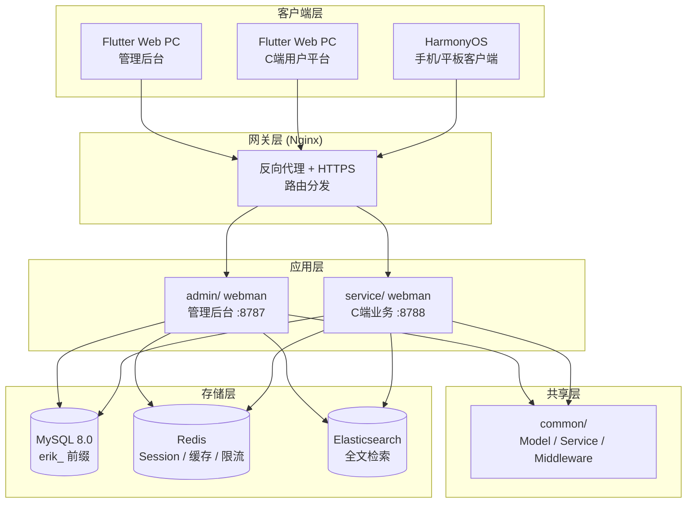
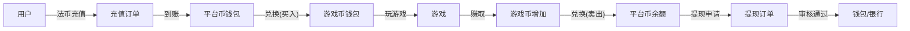

# Plataforma Global de Agregação de Jogos — Especificação de design
<!-- lang-nav -->

Languages: [中文](2026-05-22-game-platform-design.md) · [English](2026-05-22-game-platform-design.en.md) · [한국어](2026-05-22-game-platform-design.ko.md) · [Русский](2026-05-22-game-platform-design.ru.md) · [Deutsch](2026-05-22-game-platform-design.de.md) · [Français](2026-05-22-game-platform-design.fr.md) · [Español](2026-05-22-game-platform-design.es.md) · **Português** · [हिन्दी](2026-05-22-game-platform-design.hi.md) · [العربية](2026-05-22-game-platform-design.ar.md) · [বাংলা](2026-05-22-game-platform-design.bn.md) · [Bahasa Indonesia](2026-05-22-game-platform-design.id.md) · [日本語](2026-05-22-game-platform-design.ja.md)


> Copyright (c) 2026 erik <erik@erik.xyz> — https://erik.xyz

## 1. Visão geral

Plataforma global de agregação de jogos. Após o registro, o usuário deposita e troca por moeda de jogo; usa a moeda de jogo para jogar e ganhar mais moeda, que pode ser convertida de volta para a carteira e sacada. O backend administra a revisão de saques, gestão de jogos e gestão de usuários.

### Estratégia de versões

| Versão | Objetivo | Ciclo estimado |
|------|------|---------|
| Base (MVP) | Fazer funcionar o loop principal: registro→depósito→troca→jogo→saque→revisão | 7-10 dias |
| Padrão | Pronto para produção: pagamentos globais, SDK de jogos de terceiros, risco básico, três frontends | +10-15 dias |
| Completa | Forma final: multilíngue, ranking, cupons, risco completo, todos os recursos | +10-15 dias |

---

## 2. Stack tecnológico

### Backend
- PHP 8.3+, webman v2 (workerman/webman)
- Banco de dados: MySQL 8.0+, prefixo de tabelas `erik_`
- Chave primária: BIGINT não autoincrementável, gerada por `erikwang2013/snowflake-php`
- Criptografia de IDs na camada de API: `erikwang2013/hashids`
- Autenticação JWT: `erikwang2013/jwt-webman`
- Bandeiras de países: `erikwang2013/season`
- Criptografia de dados sensíveis da API: `erikwang2013/encryption`
- Criptografia de campos sensíveis do banco: `erikwang2013/encryptable`
- Sincronização e consulta ES: `erikwang2013/webman-scout`
- Detecção de ferramentas de segurança: `erikwang2013/security-php`
- Verificação aleatória de operações sensíveis: `erikwang2013/poster-php`

### Frontend
- Flutter 3.x, Web seguindo o estilo PC de painel administrativo (não estilo App mobile)
- Cliente HarmonyOS ArkTS
- Painel administrativo e plataforma C-side construídos separadamente, ambos em estilo PC

### Padrões de código
- Todo arquivo `.php` novo deve começar com a declaração de copyright
- Referências a funções/classes globais sem `\` de prefixo, usar importação `use`
- Arquivos de configuração devem conter comentários em chinês explicando o significado de cada item
- Arquivos de migração de banco usam formato SQL

---

## 3. Estrutura do projeto

```
game-platform-php/
├── admin/                          # Painel administrativo (webman v2)
│   ├── app/admin/controller/       # Controllers
│   │   ├── GameController.php      # Gestão de jogos
│   │   ├── WalletController.php    # Gestão de carteiras
│   │   ├── PaymentController.php   # Gestão de pagamentos
│   │   ├── WithdrawController.php  # Revisão de saques
│   │   ├── CountryController.php   # Configuração de países
│   │   └── ...
│   ├── app/model/                  # Modelos de dados
│   ├── config/                     # Rotas & configurações
│   └── database/migrations/        # Migrações SQL
│
├── service/                        # Serviço C-side (webman v2)
│   ├── app/api/v1/controller/      # APIs C-side
│   │   ├── AuthController.php
│   │   ├── WalletController.php
│   │   ├── GameController.php
│   │   ├── DepositController.php
│   │   ├── WithdrawController.php
│   │   ├── ExchangeController.php
│   │   └── ...
│   ├── app/middleware/             # UserAuth(JWT) etc.
│   ├── config/                     # Rotas & configurações
│   └── database/migrations/        # Migrações compartilhadas
│
├── common/                         # Camada compartilhada (PSR-4 autoload)
│   ├── model/                      # Todos os Modelos
│   ├── service/                    # Snowflake, Hashids, Encryption...
│   └── middleware/                  # Middlewares compartilhados
│
├── apps/
│   ├── flutter/                    # Frontend Flutter
│   │   ├── admin/                  # Painel administrativo PC
│   │   └── platform/               # Plataforma de usuário C-side PC
│   └── harmonyos/                  # Cliente HarmonyOS
│
└── docs/superpowers/
    ├── specs/                      # Especificações de design
    └── plans/                      # Planos de implementação
```

---

## 4. Modelos de negócio principais

### 4.1 Sistema de moedas

```
Moeda fiduciária (USD/CNY/EUR...)
  │  Depósito/saque
  ▼
Moeda da plataforma (unificada)
  │  Troca (inclui câmbio + margem da plataforma)
  ▼
Moeda de jogo (independente por jogo)
  │  Ganha/gasta jogando
  ▼
Moeda da plataforma ← converte de volta
```

- Precisão da moeda da plataforma: decimal(18,4)
- Cada moeda de jogo tem câmbio independente com a moeda da plataforma
- A plataforma cobra a diferença de câmbio spread_pct
- Operações de carteira usam lock otimista no campo version para evitar concorrência

### 4.2 Fluxo de saque

```
Usuário inicia o saque
  │
  ├─ Interruptor global desligado → recusar, informar que o saque está temporariamente indisponível
  │
  ├─ Interruptor global ligado
  │     │
  │     ├─ Valor < limite de revisão → aprovação automática → pagamento
  │     │
  │     └─ Valor >= limite de revisão → entra na fila de revisão manual
  │           │
  │           ├─ Admin aprova → pagamento
  │           └─ Admin recusa → devolve moeda da plataforma + motivo anexado
```

---

## 5. Design do banco de dados

### 5.1 Lista de tabelas da versão base (12)

| # | Nome da tabela | Observação |
|------|------|------|
| 1 | `erik_user` | Usuários C-side |
| 2 | `erik_user_wallet` | Carteira de moeda da plataforma |
| 3 | `erik_user_game_wallet` | Carteira de moeda de jogo |
| 4 | `erik_game` | Jogos |
| 5 | `erik_game_currency` | Moedas de jogo |
| 6 | `erik_deposit_order` | Ordens de depósito |
| 7 | `erik_withdraw_order` | Ordens de saque |
| 8 | `erik_exchange_record` | Registros de troca |
| 9 | `erik_transaction` | Fluxo da plataforma |
| 10 | `erik_payment_method` | Métodos de pagamento |
| 11 | `erik_announcement` | Anúncios |
| 12 | `erik_platform_config` | Configuração da plataforma (estende a erik_system_config existente) |

### 5.2 Novas tabelas da versão padrão (10)

| # | Nome da tabela | Observação |
|------|------|------|
| 13 | `erik_user_identity` | KYC/identidade real |
| 14 | `erik_user_oauth` | Login de terceiros |
| 15 | `erik_user_payment_account` | Contas de recebimento |
| 16 | `erik_user_session` | Sessões de login |
| 17 | `erik_game_server` | Servidores de jogo |
| 18 | `erik_game_play_log` | Registros de partidas |
| 19 | `erik_withdraw_limit` | Regras de limite de saque |
| 20 | `erik_risk_rule` | Regras de risco |
| 21 | `erik_risk_log` | Registros de disparo de risco |
| 22 | `erik_stat_daily` | Snapshot de estatísticas diárias |

### 5.3 Novas tabelas da versão completa (8)

| # | Nome da tabela | Observação |
|------|------|------|
| 23 | `erik_game_category` | Categorias de jogos |
| 24 | `erik_game_category_rel` | Relação jogo-categoria |
| 25 | `erik_leaderboard` | Rankings |
| 26 | `erik_coupon` | Cupons |
| 27 | `erik_user_coupon` | Cupons resgatados pelo usuário |
| 28 | `erik_language` | Definições de idioma |
| 29 | `erik_translation` | Textos traduzidos |
| 30 | `erik_country_config` | Configuração de países |
| 31 | `erik_platform_revenue` | Registros de receita da plataforma |

---

## 6. Design de API

### 6.1 APIs da versão base (C-side ~25)

```
Interfaces públicas (sem autenticação):
  POST   /api/auth/register
  POST   /api/auth/login
  POST   /api/auth/refresh
  GET    /api/captcha/generate
  GET    /api/game/list
  GET    /api/game/{hashid}
  GET    /api/announcement/list

Requerem autenticação (UserAuth):
  GET    /api/wallet/info
  GET    /api/wallet/transactions
  POST   /api/deposit/create
  GET    /api/deposit/orders
  POST   /api/exchange/quote
  POST   /api/exchange/buy
  POST   /api/exchange/sell
  GET    /api/exchange/records
  POST   /api/withdraw/apply
  GET    /api/withdraw/orders
  POST   /api/game/launch
  GET    /api/game/play-logs
  GET    /api/user/profile
  PUT    /api/user/profile

Painel administrativo (AdminAuth + AdminPermission):
  GET    /admin/game/list
  POST   /admin/game/create
  PUT    /admin/game/{hashid}
  DELETE /admin/game/{hashid}
  GET    /admin/user/list
  GET    /admin/user/{hashid}
  PUT    /admin/user/{hashid}
  GET    /admin/deposit/orders
  GET    /admin/withdraw/orders
  PUT    /admin/withdraw/review
  PUT    /admin/withdraw/switch
  POST   /admin/withdraw/limits/set
  POST   /admin/payment/method/toggle
  POST   /admin/announcement/create
  POST   /admin/export/users
  POST   /admin/export/transactions
  GET    /admin/dashboard/platform
```

### 6.2 Formato de resposta

Todas as interfaces respondem de forma unificada:

```json
{
  "code": 0,
  "message": "success",
  "data": { ... }
}
```

| code | Significado |
|------|------|
| 0 | Sucesso |
| 400 | Erro de parâmetros |
| 401 | Não autenticado |
| 403 | Sem permissão |
| 404 | Não existe |
| 422 | Falha de validação |
| 500 | Erro de servidor |

---

## 7. Diagramas de arquitetura

### 7.1 Topologia do sistema



### 7.2 Fluxo de moedas



---

## 8. Design de segurança

Com base na defesa em profundidade de 18 camadas existente, novos itens para a plataforma de jogos:

| Camada | Medida |
|------|------|
| Segurança de concorrência | Lock otimista no campo version da carteira, evita débito/entrada duplicados |
| Segurança de saque | Interruptor global + revisão por limite de valor + limites diário/mensal + verificação aleatória do poster-php |
| Segurança de troca | Separação entre cotação e fechamento; cotação expira em 60s; câmbio recalculado no fechamento |
| Segurança de jogos | Verificação de assinatura de callbacks de terceiros, whitelist de IP, defesa contra replay attack |
| Gestão de risco | Motor de regras de risco, bloqueio de transações anômalas |

---

## 9. Fases de desenvolvimento

### Versão base (fazer funcionar o loop principal)

1. Infraestrutura: estrutura de diretórios, configuração do composer, migrações de banco, camada compartilhada
2. Núcleo C-side: registro/login, carteira de moeda da plataforma, depósito (Stripe), troca (câmbio fixo), saque (revisão manual)
3. Gestão de jogos: CRUD no backend, API de lista de jogos, detalhes do jogo
4. Painel administrativo: botão de revisão de saque, interruptor global, gestão de usuários
5. Flutter PC: extensão do painel administrativo + plataforma C-side (mínima, 5 páginas)
6. Testes e validação: fluxo completo depósito→troca→saque

### Versão padrão (pronta para produção)

1. Login OAuth, múltiplos métodos de pagamento, callback automático
2. Integração com SDK de jogos de terceiros (verificação de assinatura, liquidação por callback)
3. Câmbio dinâmico, KYC, regras de limite, base de gestão de risco
4. Visualização no dashboard, exportação Excel
5. Cliente HarmonyOS

### Versão completa (forma final)

1. Internacionalização (multilíngue, múltiplas moedas, configuração diferenciada por país)
2. Rankings, cupons, sistema de anúncios
3. Motor de risco completo, snapshot de estatísticas diárias
4. Busca ES, exportação PDF
5. Testes abrangentes, documentação de API
