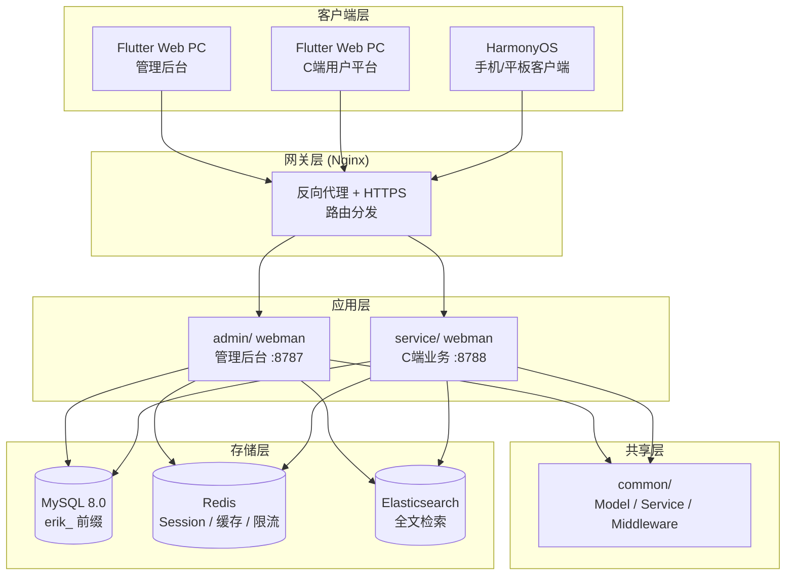
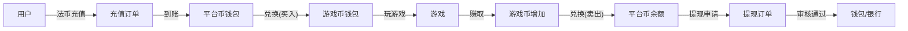

# Глобальная игровая агрегационная платформа — дизайн-спецификация
<!-- lang-nav -->

Languages: **中文** · [English](2026-05-22-game-platform-design.en.md) · [한국어](2026-05-22-game-platform-design.ko.md) · [Русский](2026-05-22-game-platform-design.ru.md) · [Deutsch](2026-05-22-game-platform-design.de.md) · [Français](2026-05-22-game-platform-design.fr.md) · [Español](2026-05-22-game-platform-design.es.md) · [Português](2026-05-22-game-platform-design.pt.md) · [हिन्दी](2026-05-22-game-platform-design.hi.md) · [العربية](2026-05-22-game-platform-design.ar.md) · [বাংলা](2026-05-22-game-platform-design.bn.md) · [Bahasa Indonesia](2026-05-22-game-platform-design.id.md) · [日本語](2026-05-22-game-platform-design.ja.md)


> Copyright (c) 2026 erik <erik@erik.xyz> — https://erik.xyz

## 1. Обзор

Глобальная универсальная игровая агрегационная платформа. После регистрации пользователь пополняет счёт на платформе, обменивает средства на игровую валюту, играет в игры и зарабатывает игровую валюту; игровая валюта может быть переведена обратно в кошелёк и выведена. Админ-панель управляет проверкой выводов, играми и пользователями.

### Стратегия версий

| Версия | Цель | Ориентировочный срок |
|------|------|---------|
| Базовая (MVP) | Отработать сквозной цикл: регистрация→пополнение→обмен→игра→вывод→проверка | 7-10 дней |
| Стандартная | Готовность к продакшену: глобальные платежи, SDK третьих сторон, базовый риск-контроль, три фронтенда | +10-15 дней |
| Полная | Завершённая: мультиязычность, рейтинги, купоны, полный риск-контроль, весь функционал | +10-15 дней |

---

## 2. Технологический стек

### Бэкенд
- PHP 8.3+, webman v2 (workerman/webman)
- БД: MySQL 8.0+, префикс таблиц `erik_`
- Первичные ключи: BIGINT без автоприращения, генерируются `erikwang2013/snowflake-php`
- Шифрование ID на уровне API: `erikwang2013/hashids`
- JWT-аутентификация: `erikwang2013/jwt-webman`
- Флаги стран: `erikwang2013/season`
- Шифрование чувствительных данных API: `erikwang2013/encryption`
- Шифрование чувствительных полей БД: `erikwang2013/encryptable`
- Синхронизация и поиск в ES: `erikwang2013/webman-scout`
- Средства безопасности: `erikwang2013/security-php`
- Случайная проверка чувствительных операций: `erikwang2013/poster-php`

### Фронтенд
- Flutter 3.x, Web-часть оформлена в стиле PC-админки (не в стиле мобильного приложения)
- Клиент HarmonyOS ArkTS
- Админ-панель и C-сторонняя платформа собираются отдельно, обе в стиле PC

### Стандарты кода
- Все новые `.php`-файлы должны содержать заголовок с копирайтом
- Глобальные функции/классы без префиксного `\`, через `use`
- Конфигурационные файлы содержат китайские комментарии с пояснением смысла параметров
- Миграции БД в формате SQL

---

## 3. Структура проекта

```
game-platform-php/
├── admin/                          # 管理后台（webman v2）
│   ├── app/admin/controller/       # 控制器
│   │   ├── GameController.php      # 游戏管理
│   │   ├── WalletController.php    # 钱包管理
│   │   ├── PaymentController.php   # 支付管理
│   │   ├── WithdrawController.php  # 提现审核
│   │   ├── CountryController.php   # 国家配置
│   │   └── ...
│   ├── app/model/                  # 数据模型
│   ├── config/                     # 路由 & 配置
│   └── database/migrations/        # SQL 迁移
│
├── service/                        # C端业务端（webman v2）
│   ├── app/api/v1/controller/      # C端API
│   │   ├── AuthController.php
│   │   ├── WalletController.php
│   │   ├── GameController.php
│   │   ├── DepositController.php
│   │   ├── WithdrawController.php
│   │   ├── ExchangeController.php
│   │   └── ...
│   ├── app/middleware/             # UserAuth(JWT) 等
│   ├── config/                     # 路由 & 配置
│   └── database/migrations/        # 共享迁移
│
├── common/                         # 共享层（PSR-4 autoload）
│   ├── model/                      # 所有 Model
│   ├── service/                    # Snowflake, Hashids, Encryption...
│   └── middleware/                  # 共享中间件
│
├── apps/
│   ├── flutter/                    # Flutter 前端
│   │   ├── admin/                  # PC 管理后台
│   │   └── platform/               # PC C端用户平台
│   └── harmonyos/                  # HarmonyOS 客户端
│
└── docs/superpowers/
    ├── specs/                      # 设计规范
    └── plans/                      # 实现计划
```

---

## 4. Ключевые бизнес-модели

### 4.1 Система валют

```
法币 (USD/CNY/EUR...)
  │  充值/提现
  ▼
平台币 (统一)
  │  兑换（含汇率+平台抽成）
  ▼
游戏币 (每种游戏独立)
  │  玩游戏赚/花
  ▼
平台币 ← 兑回
```

- Точность платформенной валюты: decimal(18,4)
- У каждой игровой валюты свой курс к платформенной
- Платформа берёт спред spread_pct
- Операции с кошельком используют оптимистичную блокировку через поле version от параллельных запросов

### 4.2 Процесс вывода средств

```
用户发起提现
  │
  ├─ 全局开关关闭 → 拒绝，提示暂不可提现
  │
  ├─ 全局开关开启
  │     │
  │     ├─ 金额 < 审核阈值 → 自动通过 → 打款
  │     │
  │     └─ 金额 >= 审核阈值 → 进入人工审核队列
  │           │
  │           ├─ 管理员通过 → 打款
  │           └─ 管理员拒绝 → 退回平台币 + 附注原因
```

---

## 5. Проектирование БД

### 5.1 Таблицы базовой версии (12 штук)

| № | Таблица | Описание |
|------|------|------|
| 1 | `erik_user` | C-сторонний пользователь |
| 2 | `erik_user_wallet` | Кошелёк платформенной валюты |
| 3 | `erik_user_game_wallet` | Кошелёк игровой валюты |
| 4 | `erik_game` | Игра |
| 5 | `erik_game_currency` | Игровая валюта |
| 6 | `erik_deposit_order` | Заказ пополнения |
| 7 | `erik_withdraw_order` | Заказ вывода |
| 8 | `erik_exchange_record` | Запись обмена |
| 9 | `erik_transaction` | Платформенные транзакции |
| 10 | `erik_payment_method` | Способ оплаты |
| 11 | `erik_announcement` | Объявления |
| 12 | `erik_platform_config` | Конфигурация платформы (расширение существующей erik_system_config) |

### 5.2 Новые таблицы стандартной версии (10 штук)

| № | Таблица | Описание |
|------|------|------|
| 13 | `erik_user_identity` | Идентификация/KYC |
| 14 | `erik_user_oauth` | Вход через третьи стороны |
| 15 | `erik_user_payment_account` | Платёжные счета |
| 16 | `erik_user_session` | Сессии входа |
| 17 | `erik_game_server` | Серверы/миры игры |
| 18 | `erik_game_play_log` | Журнал игры |
| 19 | `erik_withdraw_limit` | Правила лимитов вывода |
| 20 | `erik_risk_rule` | Правила риск-контроля |
| 21 | `erik_risk_log` | Журнал срабатывания риск-контроля |
| 22 | `erik_stat_daily` | Ежедневный статистический снимок |

### 5.3 Новые таблицы полной версии (8 штук)

| № | Таблица | Описание |
|------|------|------|
| 23 | `erik_game_category` | Категории игр |
| 24 | `erik_game_category_rel` | Связь игра-категория |
| 25 | `erik_leaderboard` | Рейтинги |
| 26 | `erik_coupon` | Купоны |
| 27 | `erik_user_coupon` | Купоны пользователей |
| 28 | `erik_language` | Определения языков |
| 29 | `erik_translation` | Переводы текстов |
| 30 | `erik_country_config` | Конфигурация стран |
| 31 | `erik_platform_revenue` | Записи дохода платформы |

---

## 6. Дизайн API

### 6.1 API базовой версии (C-сторона ~25 штук)

```
公开接口（无需认证）:
  POST   /api/auth/register
  POST   /api/auth/login
  POST   /api/auth/refresh
  GET    /api/captcha/generate
  GET    /api/game/list
  GET    /api/game/{hashid}
  GET    /api/announcement/list

需认证 (UserAuth):
  GET    /api/wallet/info
  GET    /api/wallet/transactions
  POST   /api/deposit/create
  GET    /api/deposit/orders
  POST   /api/exchange/quote
  POST   /api/exchange/buy
  POST   /api/exchange/sell
  GET    /api/exchange/records
  POST   /api/withdraw/apply
  GET    /api/withdraw/orders
  POST   /api/game/launch
  GET    /api/game/play-logs
  GET    /api/user/profile
  PUT    /api/user/profile

管理后台（AdminAuth + AdminPermission）:
  GET    /admin/game/list
  POST   /admin/game/create
  PUT    /admin/game/{hashid}
  DELETE /admin/game/{hashid}
  GET    /admin/user/list
  GET    /admin/user/{hashid}
  PUT    /admin/user/{hashid}
  GET    /admin/deposit/orders
  GET    /admin/withdraw/orders
  PUT    /admin/withdraw/review
  PUT    /admin/withdraw/switch
  POST   /admin/withdraw/limits/set
  POST   /admin/payment/method/toggle
  POST   /admin/announcement/create
  POST   /admin/export/users
  POST   /admin/export/transactions
  GET    /admin/dashboard/platform
```

### 6.2 Формат ответа

Все интерфейсы используют единый формат ответа:

```json
{
  "code": 0,
  "message": "success",
  "data": { ... }
}
```

| code | Значение |
|------|------|
| 0 | Успех |
| 400 | Ошибка параметров |
| 401 | Не аутентифицирован |
| 403 | Нет прав |
| 404 | Не найдено |
| 422 | Ошибка валидации |
| 500 | Ошибка сервера |

---

## 7. Архитектурные схемы

### 7.1 Системная топология



### 7.2 Движение валют



---

## 8. Дизайн безопасности

На базе существующей 18-уровневой эшелонированной защиты для игровой платформы добавляется:

| Уровень | Меры |
|------|------|
| Безопасность параллелизма | Оптимистичная блокировка version в таблицах кошелька, защита от повторного списания/зачисления |
| Безопасность вывода | Глобальный переключатель + проверка по порогу суммы + дневные/месячные лимиты + случайная проверка poster-php |
| Безопасность обмена | Разделение котировки и сделки, котировка истекает через 60с, курс пересчитывается при сделке |
| Безопасность игр | Проверка подписи колбэков третьих сторон, IP-белые списки, защита от replay attack |
| Риск-контроль | Движок правил риск-контроля, блокировка аномальных транзакций |

---

## 9. Этапы разработки

### Базовая версия (отработка сквозного цикла)

1. Инфраструктура: структура каталогов, composer-конфигурация, миграции БД, общий слой
2. Ядро C-стороны: регистрация/вход, кошелёк платформенной валюты, пополнение (Stripe), обмен (фиксированный курс), вывод (ручная проверка)
3. Управление играми: CRUD в админке, API списка игр, детали игры
4. Админ-панель: кнопки проверки вывода, глобальный переключатель, управление пользователями
5. Flutter PC: расширение админки + C-сторонняя платформа (минимально, 5 страниц)
6. Тестирование: полный путь пополнение→обмен→вывод

### Стандартная версия (готовность к продакшену)

1. OAuth-вход, несколько способов оплаты, автоматические колбэки
2. Интеграция SDK третьих сторон (проверка подписи, расчёты по колбэкам)
3. Динамический курс, KYC, правила лимитов, базовый риск-контроль
4. Визуализация дашборда, экспорт Excel
5. Клиент HarmonyOS

### Полная версия (завершённая)

1. Интернационализация (мультиязычность, мультивалютность, дифференцированная конфигурация стран)
2. Рейтинги, купоны, система объявлений
3. Полный движок риск-контроля, ежедневные статистические снимки
4. Поиск в ES, экспорт PDF
5. Полное тестирование, документация API
