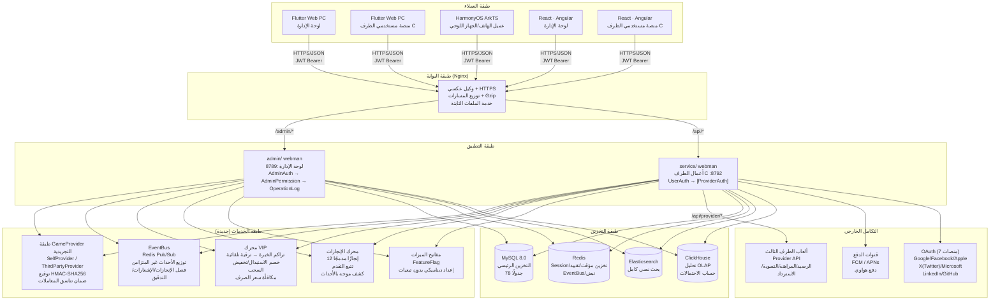
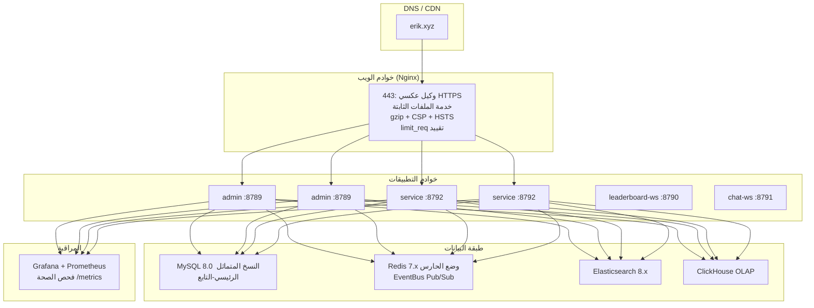

# وثيقة البنية
<!-- lang-nav -->

Languages: **中文** · [English](ARCHITECTURE.en.md) · [한국어](ARCHITECTURE.ko.md) · [Русский](ARCHITECTURE.ru.md) · [Deutsch](ARCHITECTURE.de.md) · [Français](ARCHITECTURE.fr.md) · [Español](ARCHITECTURE.es.md) · [Português](ARCHITECTURE.pt.md) · [हिन्दी](ARCHITECTURE.hi.md) · [العربية](ARCHITECTURE.ar.md) · [বাংলা](ARCHITECTURE.bn.md) · [Bahasa Indonesia](ARCHITECTURE.id.md) · [日本語](ARCHITECTURE.ja.md)


> Copyright (c) 2026 erik <erik@erik.xyz> — https://erik.xyz

## 1. طوبولوجيا النظام



## 2. بنية الوحدات

### 2.1 admin/ — لوحة الإدارة

```
طبقة المسارات: config/route.php
  ↓
سلسلة الوسائط: Cors → SecurityFilter → RateLimit → AdminAuth → AdminPermission → OperationLog
  ↓
طبقة وحدات التحكم (45):
  ┌──────────────────────────────────────────────────────────┐
  │ Dashboard / User / Role / Permission / Config / Log      │ ← أصلي
  │ Profile / Export / Import / Upload / Health / Docs       │ ← أصلي
  │ Game / Withdraw / Payment / PlatformUser / Announce      │ ← أصلي
  │ Analytics / GameCategory / GameServer / Identity         │ ← أصلي
  │ CountryConfig / Coupon / Leaderboard / Metrics           │ ← أصلي
  │ Ticket / Search                                          │ ← جديد
  └──────────────────────────────────────────────────────────┘
  ↓
طبقة الخدمات: VIP / Achievement / EventBus / FeatureFlag / Risk / Notification
  ↓
طبقة Provider: GameProvider → SelfProvider / ThirdPartyProvider
  ↓
طبقة التخزين: MySQL / Redis / Elasticsearch / ClickHouse
```

### 2.2 service/ — طرف أعمال الطرف C

```
طبقة المسارات: config/route.php
  ↓
سلسلة الوسائط: TraceId → Cors → SecurityFilter → RateLimit → Language → [UserAuth | ProviderAuth | SdkSessionAuth]
  ↓
طبقة وحدات التحكم (34):
  ┌──────────────────────────────────────────────────────────┐
  │ Auth / Wallet / Deposit / Exchange / Withdraw            │ ← أصلي
  │ Game / User / Announcement / Captcha                     │ ← أصلي
  │ OAuth / Identity / Payment / GamePlayLog                 │ ← أصلي
  │ Leaderboard / Notification / Referral / TwoFactor        │ ← أصلي
  │ Country / Language / Coupon / Search                     │ ← أصلي
  │ Provider / Ticket / Verification                         │ ← جديد
  └──────────────────────────────────────────────────────────┘
  ↓
طبقة الخدمات: VIP / Achievement / EventBus / FeatureFlag / Risk
  ↓
طبقة Provider: GameProvider → SelfProvider / ThirdPartyProvider
  ↓
طبقة التخزين: MySQL / Redis / Elasticsearch / ClickHouse
```

### 2.3 طبقة Provider — تجريد ربط الألعاب

```
provider/
├── GameProvider.php          # الفئة الأساسية المجردة — واجهة موحدة
│   ├── getBalance()          # الاستعلام عن الرصيد
│   ├── bet()                 # المراهنة
│   ├── settle()              # التسوية
│   ├── refund()              # الاسترداد
│   ├── rollback()            # التراجع
│   ├── verifySignature()     # التحقق من توقيع الاستدعاء
│   └── signRequest()         # توليد توقيع الطلب (HMAC-SHA256)
├── SelfProvider.php          # ألعاب مطوّرة ذاتيًا — تناسق معاملات DB
├── ThirdPartyProvider.php    # ألعاب طرف ثالث — HTTP API + توقيع
└── ProviderFactory.php       # المصنع — match(game.type)
```

### 2.4 EventBus — ناقل الأحداث

```
نشر الأحداث:
  DepositController → EventBus::emit('deposit.completed', $payload)
  ExchangeController → EventBus::emit('exchange.completed', $payload)
  GameController → EventBus::emit('game.played', $payload)
  ReferralController → EventBus::emit('referral.applied', $payload)

Redis Pub/Sub (القناة: platform:events):
  ↓
المشتركون:
  AchievementService  — كشف تقدم الإنجازات
  VipService          — تراكم نقاط الخبرة
  NotificationService — إرسال الإشعارات
  WebhookController   — تسليم webhook الخارجية

> ملاحظة: حتى 2026-08-18، لـ `emit()` مستدعون لكن لا توجد أي عملية مسجّلة لـ `subscribe()` (P0-4 لم يُنفَّذ)، الأحداث حاليًا تُنشر دون استهلاك، والمشتركون أهداف تصميمية.
```

### 2.5 ضمان الاستقرار — قاطع الدائرة / إعادة المحاولة / التدهور

```
packages/platform-common/src/
├── CircuitBreaker.php   # 熔断 — Redis 状态 (cb:{key}:failures / opened_at)，阈值 5 / 窗口 30s
│                        #   达阈值抛 CircuitOpenException 快速失败；成功重置计数；半开探测
│                        #   Redis 不可用 fail-open，不影响主流程
└── Retry.php            # 重试 — 指数退避 (200/400/800ms)，仅网络类异常 (ConnectException/超时/cURL 28)
                         #   maxAttempts 上限 5；与熔断共用 isRetryable 判定
```

مفتاح التدهور `feature.provider_mock` (FeatureFlag / PlatformConfig، يختصر المكالمات الحقيقية عند `on`):

| نقطة الدخول | السلوك عند mock=on |
|--------|-------------|
| `PushService::send` | عودة فورية، لا إرسال إشعار |
| `PayoutService::execute` | يرجع دفعة `mock-{order_no}` ويحدد الطلب completed |
| `ThirdPartyProvider::request` | يرجع `['success' => true]` |

جميع المكالمات الحقيقية مغلفة بـ `Retry::run → CircuitBreaker::call` (Push FCM/APNs/HarmonyOS، مدفوعات PayPal، طلبات موفري الطرف الثالث).

## 3. سلسلة تنفيذ الوسائط

### admin/ (لوحة الإدارة)

```
الطلب → Cors (مشاركة الموارد عبر الأصول)
     → SecurityFilter (أكثر من 30 كاشفًا →405/403)
     → RateLimit (نافذة Redis Lua المنزلقة →429)
     → AdminAuth (مصادقة JWT →401)
     → AdminPermission (تفويض RBAC، تخزين مؤقت Redis 60s →403)
     → OperationLog (تسجيل العمليات تلقائيًا)
     → Controller → الاستجابة
```

### service/ (أعمال الطرف C)

```
واجهات عادية:
  الطلب → TraceId → Cors → SecurityFilter → RateLimit → Language
       → [UserAuth] (JWT →401) → Controller → الاستجابة

واجهات Provider:
  الطلب → Cors → SecurityFilter → RateLimit
       → ProviderAuth (التحقق من توقيع HMAC-SHA256، نافذة 5 دقائق →401)
       → ProviderController → الاستجابة
```

## 4. تدفقات البيانات الأساسية

### 4.1 عملية الشحن

```
المستخدم → POST /api/v1/deposit/create → إنشاء الطلب (status=pending)
     → إنشاء الدفع عبر GatewayFactory (Stripe Checkout (incl. Alipay/WeChat Pay APM)/NowPayments invoice/Coinbase charge) → تعبئة checkout_url + expires_at(+1h)؛ عند الفشل إلغاء الطلب عبر CAS وإعادة المحاولة
     → الانتقال إلى الدفع عبر الطرف الثالث (Stripe (incl. Alipay/WeChat Pay)/PayPal/NowPayments[USDT TRC20/ERC20]/Coinbase[USDC/BTC/ETH])
     → نجاح الدفع → استدعاء /api/v1/payment/callback
     → القائمة البيضاء للمزود (stripe/paypal/nowpayments/coinbase/skrill/neteller/paysafecard/paytm/mercadopago/astropay/paypay/kakaopay/gcash فقط) + التحقق من انتحال القنوات المتقاطعة + التحقق من التوقيع (fail-closed) + الطابع الزمني ±300s + مطابقة المبلغ bccomp
     → تحديث الطلب (status=confirmed، معاملاتي)
     → UserWallet::addBalance() → إيداع عملات المنصة
     → EventBus::emit('deposit.completed')
       → VipService::addExp() → تراكم EXP → كشف ترقية VIP
       → AchievementService::check() → تحديث تقدم الإنجازات
     → تسجيل Transaction (type=deposit)
```

### 4.2 عملية الاستبدال

```
المستخدم → POST /api/v1/exchange/quote → الاستعلام عن السعر
     → VipService::getExchangeDiscount() → تطبيق خصم VIP
     → VipService::getRateBonus() → تطبيق مكافأة سعر الصرف VIP
     → التأكيد → POST /api/v1/exchange/buy (أو sell)
     → DB::beginTransaction()
     ├─ خصم العملة المصدر (lockForUpdate)
     ├─ زيادة العملة الهدف
     ├─ تسجيل ExchangeRecord
     ├─ تسجيل Transaction
     └─ DB::commit()
     → EventBus::emit('exchange.completed')
       → AchievementService::check()
```

### 4.3 عملية السحب

```
المستخدم → POST /api/v1/withdraw/apply
     → VipService::getWithdrawFeeDiscount() → تطبيق تخفيض رسوم السحب VIP
     → فحص المفتاح العام (PlatformConfig)
     → فحص الحدود (min_amount / daily_limit)
     → فحص الرصيد → خصم الرصيد
     → المبلغ < العتبة → موافقة تلقائية (auto-approved)
     → المبلغ >= العتبة → pending (مراجعة بشرية)
     → تسجيل Transaction

المشرف → PUT /admin/v1/withdraw/review
       → approve: وضع علامة مكتمل
       → reject: إعادة عملات المنصة + سجل الاسترداد
```

### 4.4 تدفق تفاعل Provider الألعاب

```
خادم اللعبة من الطرف الثالث:
  POST /api/provider/balance
    X-Game-Id + X-Timestamp + X-Signature (HMAC-SHA256)
    → يتحقق ProviderAuth من التوقيع → ProviderFactory::createById()
    → GameProvider::getBalance() → إرجاع الرصيد

  POST /api/provider/bet
    → ProviderAuth → GameProvider::bet()
    → SelfProvider: خصم معاملاتي DB (SELECT FOR UPDATE)
    → ThirdPartyProvider: توجيه HTTP إلى جهة اللعبة
    → تسجيل GamePlayLog (action=bet, round_id)

  POST /api/provider/settle
    → ProviderAuth → GameProvider::settle()
    → زيادة رصيد عملات اللعبة → تحديث GamePlayLog.ended_at

  POST /api/provider/refund
    → ProviderAuth → GameProvider::refund()
    → إعادة الرصيد → تسجيل سجل الاسترداد
```

### 4.5 تدفق ترقية VIP

```
اكتمال الشحن → VipService::addExp(userId, amount, 'deposit')
         → UserVip.exp += amount, UserVip.total_exp += amount
         → الاستعلام عن VipLevel التالي
         → exp >= required_exp → ترقية: level+1, exp -= required_exp
         → التكرار حتى لا يتحقق شرط الترقية
         → EventBus::emit('user.vip_upgraded')
```

## 5. علاقات ER في قاعدة البيانات

```
game_user ──┬── 1:1 ── game_user_wallet
            ├── 1:1 ── game_user_vip ── game_vip_level
            ├── 1:N ── game_user_game_wallet
            ├── 1:N ── game_deposit_order
            ├── 1:N ── game_withdraw_order
            ├── 1:N ── game_exchange_record
            ├── 1:N ── game_transaction
            ├── 1:N ── game_user_achievement ── game_achievement
            ├── 1:N ── game_exp_log
            ├── 1:N ── game_ticket ── game_ticket_reply
            ├── 1:N ── game_device_token
            ├── 1:N ── game_user_session
            └── 1:N ── game_message

game_game ──┬── 1:N ── game_game_currency
            ├── 1:N ── game_user_game_wallet
            ├── 1:N ── game_exchange_record
            └── 1:N ── game_game_play_log

game_friend ── user_id → game_user
             └── friend_id → game_user

game_vip_level ── 1:N ── game_user_vip
game_achievement ── 1:N ── game_user_achievement
```

## 6. بنية النشر

### 6.1 بيئة التطوير

```
نشر على جهاز واحد:
  admin/         :8789 (webman, 32 عمال)
  service/       :8792 (webman, 32 عمال)
  leaderboard-ws :8790 (WebSocket لوحة المتصدرين)
  chat-ws        :8791 (WebSocket المحادثة)
  MySQL          :3306
  Redis          :6379
```

### 6.2 Docker Compose (7 خدمات)

```yaml
nginx (80/443) → admin (8789) + service (8792) + الملفات الثابتة
leaderboard-ws (8790/8791) — دفع لحظي للوحة المتصدرين عبر WebSocket + رسائل خاصة/محادثة عبر WebSocket
mysql (3306) — قاعدة البيانات الرئيسية، استمرارية البيانات عبر وحدة التخزين
redis (6379) — تخزين مؤقت/تقييد/WebSocket/EventBus
elasticsearch (9200) — بحث نصي كامل
```

### 6.3 بيئة الإنتاج



## 7. بنية الاختبارات

```
tests/                             # 21 ملفًا · 200 حالة اختبار
├── bootstrap.php                  # إقلاع PHPUnit
├── AuthControllerRegisterTest.php # 15 اختبارًا لصرامة كلمة المرور
├── BackendEnhancementTest.php     # 27 اختبارًا للتشفير/خدمات المعرّفات
├── CaptchaTest.php                # 5 اختبارات للكابتشا
├── CdnProbeServiceTest.php        # 5 اختبارات لاستكشاف CDN
├── CdnProviderModelTest.php       # 3 اختبارات لنموذج مزوّد CDN
├── ClickHouseServiceTest.php      # 16 اختبارًا لخدمة ClickHouse
├── ConfigDefaultsTest.php         # 4 اختبارات للقيم الافتراضية للإعدادات
├── EncryptionServiceTest.php      # 8 اختبارات للتشفير وفك التشفير
├── EnvConfigTest.php              # 6 اختبارات لإعدادات البيئة
├── GameControllerTest.php         # 5 اختبارات لوحدة تحكم الألعاب
├── GameRouteTest.php              # 5 اختبارات لمسارات الألعاب
├── HashidsServiceTest.php         # 6 اختبارات لترميز وفك ترميز المعرّفات
├── LeaderboardServiceTest.php     # 4 اختبارات لخدمة لوحة الصدارة
├── NotificationServiceTest.php    # 3 اختبارات لخدمة الإشعارات
├── PayoutServiceTest.php          # 9 اختبارات لخدمة الدفع
├── PlatformCommonTest.php         # 6 اختبارات لبنّاءات الاستعلام المشتركة
├── PlatformTest.php               # 55 اختبارًا لمنطق الأعمال
├── ReportControllerTest.php       # 5 اختبارات لنطاقات تواريخ التقارير
├── SnowflakeServiceTest.php       # 5 اختبارات لمعرّفات Snowflake
└── TranslationServiceTest.php     # 8 اختبارات لخدمة الترجمة
```

## 8. توزيع المنافذ

| الخدمة | المنفذ | الوصف |
|------|------|------|
| admin/ | 8789 | واجهات لوحة الإدارة |
| service/ | 8792 | واجهات أعمال الطرف C |
| leaderboard-ws | 8790 | WebSocket لوحة المتصدرين اللحظية |
| chat-ws | 8791 | WebSocket الرسائل الخاصة/المحادثة |
| MySQL | 3306 | قاعدة البيانات الرئيسية |
| Redis | 6379 | تخزين مؤقت/تقييد/WebSocket/EventBus |
| ClickHouse | 8123 | واجهة OLAP HTTP |
| Elasticsearch | 9200 | بحث نصي كامل |

## 9. توثيق الواجهات

يُستخدَم `erikwang2013/apidoc-php` لتوليد توثيق واجهات تفاعلي تلقائيًا عبر شروحات وحدات التحكم:

| التوثيق | العنوان | وحدات التحكم | نقاط النهاية |
|------|------|--------|------|
| لوحة الإدارة | :8789/apidoc/ | 45 | 154 |
| أعمال الطرف C | :8792/apidoc/ | 34 | 107 |

## 10. قائمة جداول قاعدة البيانات

### الإصدار الأساسي (12 جدولًا) + admin (7 جداول)
game_user, game_user_wallet, game_user_game_wallet,
game_game, game_game_currency, game_deposit_order,
game_withdraw_order, game_exchange_record, game_transaction,
game_payment_method, game_announcement, game_platform_config,
game_admin_user, game_admin_role, game_admin_permission,
game_admin_user_role, game_admin_role_permission, game_operation_log,
game_system_config

### الإصدار القياسي (10 جداول)
game_user_identity, game_user_oauth, game_user_payment_account,
game_user_session, game_game_server, game_game_play_log,
game_withdraw_limit, game_risk_rule, game_risk_log,
game_stat_daily

### الإصدار الكامل (13 جداول)
game_game_category, game_game_category_rel, game_leaderboard,
game_coupon, game_user_coupon, game_language,
game_translation, game_country_config, game_platform_revenue,
game_notification, game_referral, game_referral_reward,
game_user_2fa

### التوسعة البيئية (14 جداول) ← جديدة
game_ticket, game_ticket_reply, game_device_token,
game_vip_level, game_user_vip, game_exp_log,
game_achievement, game_user_achievement, game_friend,
game_message, game_cdn_provider, game_referral_commission,
game_tournament, game_tournament_entry

### إضافات v1.3.15-22 (22 جدولًا)
game_event_outbox, game_reconciliation_batch, game_reconciliation_diff,
game_reconciliation_statement, game_device_fingerprint, game_device_account_map,
game_ip_reputation, game_account_account_link, game_activity,
game_activity_participation, game_activity_reward_log, game_anticheat_event,
game_anticheat_daily_stat, game_group, game_group_member,
game_share_link, game_aml_rule, game_aml_hit,
game_kyc_level, game_user_kyc, game_user_trust,
game_risk_cluster

**الإجمالي: 78 جدولًا**

## 11. مفاتيح الميزات

استنادًا إلى مساحة أسماء `feature.*` في `game_platform_config`، بدون أي تبعيات إضافية:

| المفتاح | الافتراضي | الوظيفة |
|------|------|------|
| feature.tournament | off | نظام البطولات |
| feature.chat | off | رسائل WebSocket الخاصة |
| feature.vip | off | ولاء VIP |
| feature.achievements | off | شارات الإنجازات |

```php
use app\service\FeatureFlag;
if (FeatureFlag::isEnabled('vip')) { /* VIP logic */ }
```

---

> **Copyright (c) 2026 erik <erik@erik.xyz> — https://erik.xyz**
