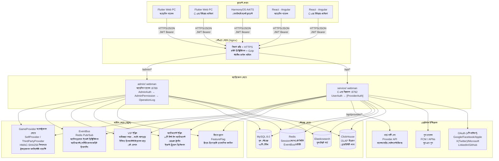
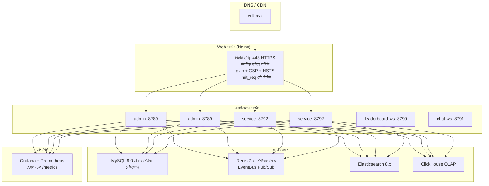

# আর্কিটেকচার ডকুমেন্ট
<!-- lang-nav -->

Languages: [中文](ARCHITECTURE.md) · [English](ARCHITECTURE.en.md) · [한국어](ARCHITECTURE.ko.md) · [Русский](ARCHITECTURE.ru.md) · [Deutsch](ARCHITECTURE.de.md) · [Français](ARCHITECTURE.fr.md) · [Español](ARCHITECTURE.es.md) · [Português](ARCHITECTURE.pt.md) · [हिन्दी](ARCHITECTURE.hi.md) · [العربية](ARCHITECTURE.ar.md) · **বাংলা** · [Bahasa Indonesia](ARCHITECTURE.id.md) · [日本語](ARCHITECTURE.ja.md)


> Copyright (c) 2026 erik <erik@erik.xyz> — https://erik.xyz

## 1. সিস্টেম টপোলজি



## 2. মডিউল আর্কিটেকচার

### 2.1 admin/ — অ্যাডমিন প্যানেল

```
路由层: config/route.php
  ↓
中间件链: Cors → SecurityFilter → RateLimit → AdminAuth → AdminPermission → OperationLog
  ↓
控制器层 (45 个):
  ┌──────────────────────────────────────────────────────────┐
  │ Dashboard / User / Role / Permission / Config / Log      │ ← 原有
  │ Profile / Export / Import / Upload / Health / Docs       │ ← 原有
  │ Game / Withdraw / Payment / PlatformUser / Announce      │ ← 原有
  │ Analytics / GameCategory / GameServer / Identity         │ ← 原有
  │ CountryConfig / Coupon / Leaderboard / Metrics           │ ← 原有
  │ Ticket / Search                                          │ ← 新增
  └──────────────────────────────────────────────────────────┘
  ↓
服务层: VIP / Achievement / EventBus / FeatureFlag / Risk / Notification
  ↓
Provider 层: GameProvider → SelfProvider / ThirdPartyProvider
  ↓
存储层: MySQL / Redis / Elasticsearch / ClickHouse
```

### 2.2 service/ — C-এন্ড ব্যবসা

```
路由层: config/route.php
  ↓
中间件链: TraceId → Cors → SecurityFilter → RateLimit → Language → [UserAuth | ProviderAuth | SdkSessionAuth]
  ↓
控制器层 (34 个):
  ┌──────────────────────────────────────────────────────────┐
  │ Auth / Wallet / Deposit / Exchange / Withdraw            │ ← 原有
  │ Game / User / Announcement / Captcha                     │ ← 原有
  │ OAuth / Identity / Payment / GamePlayLog                 │ ← 原有
  │ Leaderboard / Notification / Referral / TwoFactor        │ ← 原有
  │ Country / Language / Coupon / Search                     │ ← 原有
  │ Provider / Ticket / Verification                         │ ← 新增
  └──────────────────────────────────────────────────────────┘
  ↓
服务层: VIP / Achievement / EventBus / FeatureFlag / Risk
  ↓
Provider 层: GameProvider → SelfProvider / ThirdPartyProvider
  ↓
存储层: MySQL / Redis / Elasticsearch / ClickHouse
```

### 2.3 Provider লেয়ার — গেম ইন্টিগ্রেশন অ্যাবস্ট্রাকশন

```
provider/
├── GameProvider.php          # 抽象基类 — 统一接口
│   ├── getBalance()          # 查询余额
│   ├── bet()                 # 下注
│   ├── settle()              # 结算
│   ├── refund()              # 退款
│   ├── rollback()            # 回滚
│   ├── verifySignature()     # 验证回调签名
│   └── signRequest()         # 生成请求签名 (HMAC-SHA256)
├── SelfProvider.php          # 自研游戏 — DB事务一致
├── ThirdPartyProvider.php    # 第三方游戏 — HTTP API + 签名
└── ProviderFactory.php       # 工厂 — match(game.type)
```

### 2.4 EventBus — ইভেন্ট বাস

```
事件发布:
  DepositController → EventBus::emit('deposit.completed', $payload)
  ExchangeController → EventBus::emit('exchange.completed', $payload)
  GameController → EventBus::emit('game.played', $payload)
  ReferralController → EventBus::emit('referral.applied', $payload)

Redis Pub/Sub (channel: platform:events):
  ↓
订阅者:
  AchievementService  — 检测成就进度
  VipService          — 累计经验值
  NotificationService — 发送通知
  WebhookController   — 投递外部 webhook

> 注：截至 2026-08-18，`emit()` 有调用方但 `subscribe()` 无任何进程注册（P0-4 未做），事件目前仅发布无消费，订阅者为设计目标。
```

### 2.5 স্থিতিশীলতা নিশ্চয়তা — সার্কিট ব্রেকার / পুনঃচেষ্টা / ডিগ্রেডেশন

```
packages/platform-common/src/
├── CircuitBreaker.php   # 熔断 — Redis 状态 (cb:{key}:failures / opened_at)，阈值 5 / 窗口 30s
│                        #   达阈值抛 CircuitOpenException 快速失败；成功重置计数；半开探测
│                        #   Redis 不可用 fail-open，不影响主流程
└── Retry.php            # 重试 — 指数退避 (200/400/800ms)，仅网络类异常 (ConnectException/超时/cURL 28)
                         #   maxAttempts 上限 5；与熔断共用 isRetryable 判定
```

ডিগ্রেডেশন সুইচ `feature.provider_mock` (FeatureFlag / PlatformConfig, `on` হলে প্রকৃত নেটওয়ার্ক কল শর্ট-সার্কিট করে):

| প্রবেশ বিন্দু | mock=on আচরণ |
|--------|-------------|
| `PushService::send` | সাথে সাথে ফেরত, কোনো পুশ নয় |
| `PayoutService::execute` | `mock-{order_no}` ব্যাচ ফেরত দেয় এবং অর্ডার completed চিহ্নিত করে |
| `ThirdPartyProvider::request` | `['success' => true]` ফেরত দেয় |

সব প্রকৃত নেটওয়ার্ক কল `Retry::run → CircuitBreaker::call`-এ মোড়ানো (Push FCM/APNs/HarmonyOS, PayPal পেমেন্ট, থার্ড-পার্টি Provider অনুরোধ)।

## 3. মিডলওয়্যার এক্সিকিউশন চেইন

### admin/ (অ্যাডমিন প্যানেল)

```
请求 → Cors (跨域)
     → SecurityFilter (30+检测器→405/403)
     → RateLimit (Redis Lua滑动窗口→429)
     → AdminAuth (JWT认证→401)
     → AdminPermission (RBAC鉴权, Redis 60s缓存→403)
     → OperationLog (操作日志自动记录)
     → Controller → 响应
```

### service/ (C-এন্ড ব্যবসা)

```
常规API:
  请求 → TraceId → Cors → SecurityFilter → RateLimit → Language
       → [UserAuth] (JWT→401) → Controller → 响应

Provider API:
  请求 → Cors → SecurityFilter → RateLimit
       → ProviderAuth (HMAC-SHA256签名验证, 5min窗口→401)
       → ProviderController → 响应
```

## 4. কোর ডেটা ফ্লো

### 4.1 টপ-আপ প্রক্রিয়া

```
用户 → POST /api/v1/deposit/create → 生成订单 (status=pending)
     → GatewayFactory 创建支付 (Stripe Checkout (incl. Alipay/WeChat Pay APM)/NowPayments invoice/Coinbase charge) → 回填 checkout_url + expires_at(+1h)；失败则 CAS 取消订单可重试
     → 跳转第三方支付 (Stripe (incl. Alipay/WeChat Pay)/PayPal/NowPayments[USDT TRC20/ERC20]/Coinbase[USDC/BTC/ETH])
     → 支付成功 → 回调 /api/v1/payment/callback
     → provider 白名单(仅 stripe/paypal/nowpayments/coinbase/skrill/neteller/paysafecard/paytm/mercadopago/astropay/paypay/kakaopay/gcash) + 跨渠道冒用校验 + 验签(fail-closed) + 时间戳±300s + bccomp 金额核对
     → 更新订单 (status=confirmed, 事务化)
     → UserWallet::addBalance() → 平台币到账
     → EventBus::emit('deposit.completed')
       → VipService::addExp() → EXP累计 → VIP升级检测
       → AchievementService::check() → 成就进度更新
     → 记录 Transaction (type=deposit)
```

### 4.2 বিনিময় প্রক্রিয়া

```
用户 → POST /api/v1/exchange/quote → 询价
     → VipService::getExchangeDiscount() → 应用VIP折扣
     → VipService::getRateBonus() → 应用VIP汇率加成
     → 确认 → POST /api/v1/exchange/buy(或sell)
     → DB::beginTransaction()
     ├─ 扣减源币种 (lockForUpdate)
     ├─ 增加目标币种
     ├─ 记录 ExchangeRecord
     ├─ 记录 Transaction
     └─ DB::commit()
     → EventBus::emit('exchange.completed')
       → AchievementService::check()
```

### 4.3 উত্তোলন প্রক্রিয়া

```
用户 → POST /api/v1/withdraw/apply
     → VipService::getWithdrawFeeDiscount() → 应用VIP手续费减免
     → 检查全局开关 (PlatformConfig)
     → 检查限额 (min_amount / daily_limit)
     → 检查余额 → 扣减余额
     → 金额<阈值 → auto-approved
     → 金额≥阈值 → pending (人工审核)
     → 记录 Transaction

管理员 → PUT /admin/v1/withdraw/review
       → approve: 标记完成
       → reject: 退回平台币 + 退款流水
```

### 4.4 গেম Provider ইন্টারঅ্যাকশন ফ্লো

```
第三方游戏服务器:
  POST /api/provider/balance
    X-Game-Id + X-Timestamp + X-Signature (HMAC-SHA256)
    → ProviderAuth 验证签名 → ProviderFactory::createById()
    → GameProvider::getBalance() → 返回余额

  POST /api/provider/bet
    → ProviderAuth → GameProvider::bet()
    → SelfProvider: DB事务扣减 (SELECT FOR UPDATE)
    → ThirdPartyProvider: HTTP转发到游戏方
    → 记录 GamePlayLog (action=bet, round_id)

  POST /api/provider/settle
    → ProviderAuth → GameProvider::settle()
    → 增加游戏币余额 → 更新 GamePlayLog.ended_at

  POST /api/provider/refund
    → ProviderAuth → GameProvider::refund()
    → 退回余额 → 记录退款日志
```

### 4.5 VIP আপগ্রেড ফ্লো

```
充值完成 → VipService::addExp(userId, amount, 'deposit')
         → UserVip.exp += amount, UserVip.total_exp += amount
         → 查询下一级 VipLevel
         → exp >= required_exp → 升级: level+1, exp -= required_exp
         → 循环直到不再满足升级条件
         → EventBus::emit('user.vip_upgraded')
```

## 5. ডেটাবেস ER সম্পর্ক

```
game_user ──┬── 1:1 ── game_user_wallet
            ├── 1:1 ── game_user_vip ── game_vip_level
            ├── 1:N ── game_user_game_wallet
            ├── 1:N ── game_deposit_order
            ├── 1:N ── game_withdraw_order
            ├── 1:N ── game_exchange_record
            ├── 1:N ── game_transaction
            ├── 1:N ── game_user_achievement ── game_achievement
            ├── 1:N ── game_exp_log
            ├── 1:N ── game_ticket ── game_ticket_reply
            ├── 1:N ── game_device_token
            ├── 1:N ── game_user_session
            └── 1:N ── game_message

game_game ──┬── 1:N ── game_game_currency
            ├── 1:N ── game_user_game_wallet
            ├── 1:N ── game_exchange_record
            └── 1:N ── game_game_play_log

game_friend ── user_id → game_user
             └── friend_id → game_user

game_vip_level ── 1:N ── game_user_vip
game_achievement ── 1:N ── game_user_achievement
```

## 6. ডিপ্লয়মেন্ট আর্কিটেকচার

### 6.1 ডেভেলপমেন্ট এনভায়রনমেন্ট

```
单机部署:
  admin/         :8789 (webman, 32 workers)
  service/       :8792 (webman, 32 workers)
  leaderboard-ws :8790 (WebSocket 排行榜)
  chat-ws        :8791 (WebSocket 聊天)
  MySQL          :3306
  Redis          :6379
```

### 6.2 Docker Compose (৭ সার্ভিস)

```yaml
nginx (80/443) → admin (8789) + service (8792) + static files
leaderboard-ws (8790/8791) — WebSocket 排行榜实时推送 + 私信/聊天
mysql (3306) — 主数据库，数据卷持久化
redis (6379) — 缓存/限流/WebSocket/EventBus
elasticsearch (9200) — 全文检索
```

### 6.3 প্রোডাকশন এনভায়রনমেন্ট



## 7. টেস্ট আর্কিটেকচার

```
tests/                             # 21 个文件 · 200 个用例
├── bootstrap.php                  # PHPUnit 引导
├── AuthControllerRegisterTest.php # 15 个注册口令强度测试
├── BackendEnhancementTest.php     # 27 个加密/ID服务测试
├── CaptchaTest.php                # 5 个验证码测试
├── CdnProbeServiceTest.php        # 5 个 CDN 探测测试
├── CdnProviderModelTest.php       # 3 个 CDN 供应商模型测试
├── ClickHouseServiceTest.php      # 16 个 ClickHouse 服务测试
├── ConfigDefaultsTest.php         # 4 个配置默认值测试
├── EncryptionServiceTest.php      # 8 个加解密测试
├── EnvConfigTest.php              # 6 个环境配置测试
├── GameControllerTest.php         # 5 个游戏控制器测试
├── GameRouteTest.php              # 5 个游戏路由测试
├── HashidsServiceTest.php         # 6 个 ID 编解码测试
├── LeaderboardServiceTest.php     # 4 个排行榜服务测试
├── NotificationServiceTest.php    # 3 个通知服务测试
├── PayoutServiceTest.php          # 9 个代付服务测试
├── PlatformCommonTest.php         # 6 个公共查询构造测试
├── PlatformTest.php               # 55 个业务逻辑测试
├── ReportControllerTest.php       # 5 个报表日期区间测试
├── SnowflakeServiceTest.php       # 5 个 Snowflake ID 测试
└── TranslationServiceTest.php     # 8 个翻译服务测试
```

## 8. পোর্ট বরাদ্দ

| সার্ভিস | পোর্ট | বিবরণ |
|------|------|------|
| admin/ | 8789 | অ্যাডমিন প্যানেল API |
| service/ | 8792 | C-এন্ড ব্যবসা API |
| leaderboard-ws | 8790 | WebSocket রিয়েল-টাইম লিডারবোর্ড |
| chat-ws | 8791 | WebSocket প্রাইভেট মেসেজ/চ্যাট |
| MySQL | 3306 | মূল ডেটাবেস |
| Redis | 6379 | ক্যাশ/রেট লিমিট/WebSocket/EventBus |
| ClickHouse | 8123 | OLAP HTTP ইন্টারফেস |
| Elasticsearch | 9200 | ফুল-টেক্সট সার্চ |

## 9. API ডকুমেন্টেশন

কন্ট্রোলার অ্যানোটেশন থেকে `erikwang2013/apidoc-php` দিয়ে অটো-জেনারেটেড ইন্টারঅ্যাকটিভ API ডক:

| ডকুমেন্টেশন | ঠিকানা | কন্ট্রোলার | এন্ডপয়েন্ট |
|------|------|--------|------|
| অ্যাডমিন প্যানেল | :8789/apidoc/ | 45 | 154 |
| C-এন্ড ব্যবসা | :8792/apidoc/ | 34 | 107 |

## 10. ডেটাবেস টেবিল তালিকা

### বেসিক (12টি) + admin (৭টি)
game_user, game_user_wallet, game_user_game_wallet,
game_game, game_game_currency, game_deposit_order,
game_withdraw_order, game_exchange_record, game_transaction,
game_payment_method, game_announcement, game_platform_config,
game_admin_user, game_admin_role, game_admin_permission,
game_admin_user_role, game_admin_role_permission, game_operation_log,
game_system_config

### স্ট্যান্ডার্ড (10টি)
game_user_identity, game_user_oauth, game_user_payment_account,
game_user_session, game_game_server, game_game_play_log,
game_withdraw_limit, game_risk_rule, game_risk_log,
game_stat_daily

### ফুল (13টি)
game_game_category, game_game_category_rel, game_leaderboard,
game_coupon, game_user_coupon, game_language,
game_translation, game_country_config, game_platform_revenue,
game_notification, game_referral, game_referral_reward,
game_user_2fa

### ইকোসিস্টেম এক্সটেনশন (14টি) ← নতুন
game_ticket, game_ticket_reply, game_device_token,
game_vip_level, game_user_vip, game_exp_log,
game_achievement, game_user_achievement, game_friend,
game_message, game_cdn_provider, game_referral_commission,
game_tournament, game_tournament_entry

### v1.3.15-22-এ নতুন (২২টি)
game_event_outbox, game_reconciliation_batch, game_reconciliation_diff,
game_reconciliation_statement, game_device_fingerprint, game_device_account_map,
game_ip_reputation, game_account_account_link, game_activity,
game_activity_participation, game_activity_reward_log, game_anticheat_event,
game_anticheat_daily_stat, game_group, game_group_member,
game_share_link, game_aml_rule, game_aml_hit,
game_kyc_level, game_user_kyc, game_user_trust,
game_risk_cluster

**মোট: ৭৮টি টেবিল**

## 11. ফিচার সুইচ

`game_platform_config`-এর `feature.*` নেমস্পেসের ভিত্তিতে, শূন্য অতিরিক্ত নির্ভরতা:

| সুইচ | ডিফল্ট | ফিচার |
|------|------|------|
| feature.tournament | off | টুর্নামেন্ট সিস্টেম |
| feature.chat | off | WebSocket প্রাইভেট মেসেজ |
| feature.vip | off | VIP লয়্যালটি |
| feature.achievements | off | অ্যাচিভমেন্ট ব্যাজ |

```php
use app\service\FeatureFlag;
if (FeatureFlag::isEnabled('vip')) { /* VIP logic */ }
```

---

> **Copyright (c) 2026 erik <erik@erik.xyz> — https://erik.xyz**
