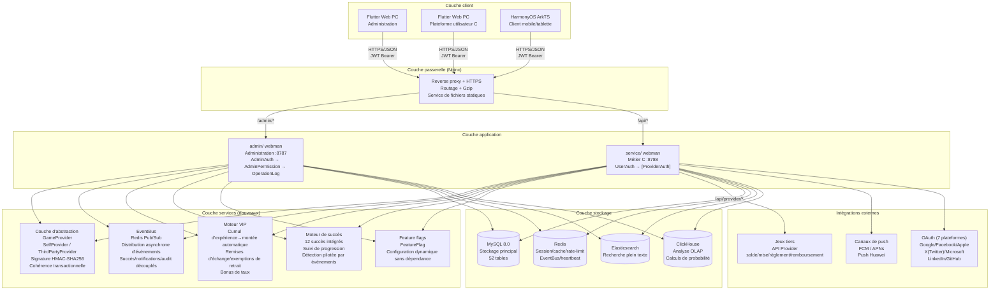
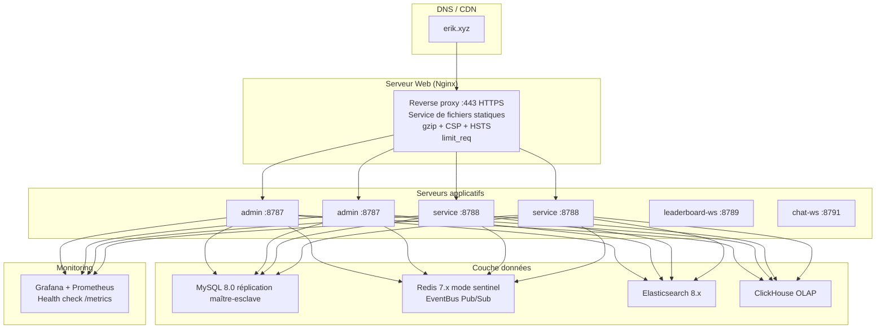

# Document d'architecture
<!-- lang-nav -->

Languages: [中文](ARCHITECTURE.md) · [English](ARCHITECTURE.en.md) · [한국어](ARCHITECTURE.ko.md) · [Русский](ARCHITECTURE.ru.md) · [Deutsch](ARCHITECTURE.de.md) · **Français** · [Español](ARCHITECTURE.es.md) · [Português](ARCHITECTURE.pt.md) · [हिन्दी](ARCHITECTURE.hi.md) · [العربية](ARCHITECTURE.ar.md) · [বাংলা](ARCHITECTURE.bn.md) · [Bahasa Indonesia](ARCHITECTURE.id.md) · [日本語](ARCHITECTURE.ja.md)


> Copyright (c) 2026 erik <erik@erik.xyz> — https://erik.xyz

## 1. Topologie du système



## 2. Architecture des modules

### 2.1 admin/ — Administration

```
Couche de routes: config/route.php
  ↓
Chaîne de middleware: Cors → SecurityFilter → RateLimit → AdminAuth → AdminPermission → OperationLog
  ↓
Couche contrôleurs (28):
  ┌──────────────────────────────────────────────────────────┐
  │ Dashboard / User / Role / Permission / Config / Log      │ ← existant
  │ Profile / Export / Import / Upload / Health / Docs       │ ← existant
  │ Game / Withdraw / Payment / PlatformUser / Announce      │ ← existant
  │ Analytics / GameCategory / GameServer / Identity         │ ← existant
  │ CountryConfig / Coupon / Leaderboard / Metrics           │ ← existant
  │ Ticket / Search                                          │ ← nouveau
  └──────────────────────────────────────────────────────────┘
  ↓
Couche services: VIP / Achievement / EventBus / FeatureFlag / Risk / Notification
  ↓
Couche Provider: GameProvider → SelfProvider / ThirdPartyProvider
  ↓
Couche stockage: MySQL / Redis / Elasticsearch / ClickHouse
```

### 2.2 service/ — Métier côté C

```
Couche de routes: config/route.php
  ↓
Chaîne de middleware: Cors → SecurityFilter → RateLimit → Language → ApiVersion → [UserAuth | ProviderAuth]
  ↓
Couche contrôleurs (25):
  ┌──────────────────────────────────────────────────────────┐
  │ Auth / Wallet / Deposit / Exchange / Withdraw            │ ← existant
  │ Game / User / Announcement / Captcha                     │ ← existant
  │ OAuth / Identity / Payment / GamePlayLog                 │ ← existant
  │ Leaderboard / Notification / Referral / TwoFactor        │ ← existant
  │ Country / Language / Coupon / Search                     │ ← existant
  │ Provider / Ticket / Verification                         │ ← nouveau
  └──────────────────────────────────────────────────────────┘
  ↓
Couche services: VIP / Achievement / EventBus / FeatureFlag / Risk / GameSession
  ↓
Couche Provider: GameProvider → SelfProvider / ThirdPartyProvider
  ↓
Couche stockage: MySQL / Redis / Elasticsearch / ClickHouse
```

### 2.3 Couche Provider — abstraction d'intégration des jeux

```
provider/
├── GameProvider.php          # Classe de base abstraite — interface unifiée
│   ├── getBalance()          # Consultation du solde
│   ├── bet()                 # Mise
│   ├── settle()              # Règlement
│   ├── refund()              # Remboursement
│   ├── rollback()            # Rollback
│   ├── verifySignature()     # Vérification de la signature des callbacks
│   └── signRequest()         # Génération de la signature de requête (HMAC-SHA256)
├── SelfProvider.php          # Jeux propriétaires — transaction DB cohérente
├── ThirdPartyProvider.php    # Jeux tiers — API HTTP + signature
└── ProviderFactory.php       # Fabrique — match(game.type)
```

### 2.4 EventBus — bus d'événements

```
Publication d'événements:
  DepositController → EventBus::emit('deposit.completed', $payload)
  ExchangeController → EventBus::emit('exchange.completed', $payload)
  GameController → EventBus::emit('game.played', $payload)
  ReferralController → EventBus::emit('referral.applied', $payload)

Redis Pub/Sub (canal: platform:events):
  ↓
Abonnés:
  AchievementService  — détecte la progression des succès
  VipService          — cumule l'expérience
  NotificationService — envoie les notifications
  WebhookController   — délivre les webhooks externes

> Note : au 2026-08-18, `emit()` a des appelants mais `subscribe()` n'a aucun processus enregistré (P0-4 non fait) ; les événements sont actuellement publiés sans consommation, les abonnés sont un objectif de conception.
```

### 2.5 Garantie de stabilité — disjoncteur / nouvelle tentative / dégradation

```
packages/platform-common/src/
├── CircuitBreaker.php   # 熔断 — Redis 状态 (cb:{key}:failures / opened_at)，阈值 5 / 窗口 30s
│                        #   达阈值抛 CircuitOpenException 快速失败；成功重置计数；半开探测
│                        #   Redis 不可用 fail-open，不影响主流程
└── Retry.php            # 重试 — 指数退避 (200/400/800ms)，仅网络类异常 (ConnectException/超时/cURL 28)
                         #   maxAttempts 上限 5；与熔断共用 isRetryable 判定
```

Interrupteur de dégradation `feature.provider_mock` (FeatureFlag / PlatformConfig, court-circuite les appels réseau réels quand `on`) :

| Point d'entrée | Comportement quand mock=on |
|--------|-------------|
| `PushService::send` | Retour immédiat, aucune notification envoyée |
| `PayoutService::execute` | Retourne le lot `mock-{order_no}` et marque la commande completed |
| `ThirdPartyProvider::request` | Retourne `['success' => true]` |

Tous les appels réseau réels sont enveloppés dans `Retry::run → CircuitBreaker::call` (Push FCM/APNs/HarmonyOS, paiements PayPal, requêtes des Provider tiers).

## 3. Chaînes d'exécution des middleware

### admin/ (administration)

```
Requête → Cors (cross-origin)
     → SecurityFilter (30+ détecteurs→405/403)
     → RateLimit (fenêtre glissante Redis Lua→429)
     → AdminAuth (authentification JWT→401)
     → AdminPermission (autorisation RBAC, cache Redis 60s→403)
     → OperationLog (journal d'opérations automatique)
     → Controller → Réponse
```

### service/ (métier C)

```
API classiques:
  Requête → Cors → SecurityFilter → RateLimit → Language → ApiVersion
       → [UserAuth] (JWT→401) → Controller → Réponse

API Provider:
  Requête → Cors → SecurityFilter → RateLimit
       → ProviderAuth (vérification signature HMAC-SHA256, fenêtre 5 min→401)
       → ProviderController → Réponse
```

## 4. Flux de données centraux

### 4.1 Flux de recharge

```
Utilisateur → POST /api/deposit/create → création de la commande (status=pending)
     → création du paiement via GatewayFactory (Stripe Checkout (incl. Alipay/WeChat Pay APM)/facture NowPayments/charge Coinbase) → remplir checkout_url + expires_at(+1h) ; en cas d'échec, annulation CAS de la commande et nouvelle tentative
     → redirection vers le paiement tiers (Stripe (incl. Alipay/WeChat Pay)/PayPal/NowPayments[USDT TRC20/ERC20]/Coinbase[USDC/BTC/ETH])
     → paiement réussi → callback /api/payment/callback
     → liste blanche des providers (stripe/paypal/nowpayments/coinbase/skrill/neteller/paysafecard/paytm/mercadopago/astropay/paypay/kakaopay/gcash uniquement) + contrôle d'usurpation inter-canaux + vérification de signature (fail-closed) + horodatage ±300s + contrôle bccomp du montant
     → mise à jour de la commande (status=confirmed, transactionnel)
     → UserWallet::addBalance() → crédit des devises de plateforme
     → EventBus::emit('deposit.completed')
       → VipService::addExp() → cumul EXP → détection de montée VIP
       → AchievementService::check() → mise à jour de la progression des succès
     → enregistrement Transaction (type=deposit)
```

### 4.2 Flux d'échange

```
Utilisateur → POST /api/exchange/quote → cotation
     → VipService::getExchangeDiscount() → application de la remise VIP
     → VipService::getRateBonus() → application du bonus de taux VIP
     → confirmation → POST /api/exchange/buy (ou sell)
     → DB::beginTransaction()
     ├─ débit de la devise source (lockForUpdate)
     ├─ crédit de la devise cible
     ├─ enregistrement ExchangeRecord
     ├─ enregistrement Transaction
     └─ DB::commit()
     → EventBus::emit('exchange.completed')
       → AchievementService::check()
```

### 4.3 Flux de retrait

```
Utilisateur → POST /api/withdraw/apply
     → VipService::getWithdrawFeeDiscount() → application de l'exemption de frais VIP
     → contrôle de l'interrupteur global (PlatformConfig)
     → contrôle des plafonds (min_amount / daily_limit)
     → contrôle du solde → débit du solde
     → montant < seuil → auto-approuvé
     → montant ≥ seuil → pending (validation manuelle)
     → enregistrement Transaction

Administrateur → PUT /admin/withdraw/review
       → approve: marquer comme terminé
       → reject: retour des devises de plateforme + flux de remboursement
```

### 4.4 Flux d'interaction Provider de jeux

```
Serveur de jeu tiers:
  POST /api/provider/balance
    X-Game-Id + X-Timestamp + X-Signature (HMAC-SHA256)
    → ProviderAuth vérifie la signature → ProviderFactory::createById()
    → GameProvider::getBalance() → renvoie le solde

  POST /api/provider/bet
    → ProviderAuth → GameProvider::bet()
    → SelfProvider: débit transactionnel DB (SELECT FOR UPDATE)
    → ThirdPartyProvider: transfert HTTP vers le jeu
    → enregistrement GamePlayLog (action=bet, round_id)

  POST /api/provider/settle
    → ProviderAuth → GameProvider::settle()
    → crédit du solde de devises de jeu → mise à jour GamePlayLog.ended_at

  POST /api/provider/refund
    → ProviderAuth → GameProvider::refund()
    → retour du solde → journalisation du remboursement
```

### 4.5 Flux de montée VIP

```
Recharge terminée → VipService::addExp(userId, amount, 'deposit')
         → UserVip.exp += amount, UserVip.total_exp += amount
         → consultation du VipLevel suivant
         → exp >= required_exp → montée: level+1, exp -= required_exp
         → boucle jusqu'à ce que la condition de montée ne soit plus remplie
         → EventBus::emit('user.vip_upgraded')
```

## 5. Relations ER de la base

```
game_user ──┬── 1:1 ── game_user_wallet
            ├── 1:1 ── game_user_vip ── game_vip_level
            ├── 1:N ── game_user_game_wallet
            ├── 1:N ── game_deposit_order
            ├── 1:N ── game_withdraw_order
            ├── 1:N ── game_exchange_record
            ├── 1:N ── game_transaction
            ├── 1:N ── game_user_achievement ── game_achievement
            ├── 1:N ── game_exp_log
            ├── 1:N ── game_ticket ── game_ticket_reply
            ├── 1:N ── game_device_token
            ├── 1:N ── game_user_session
            └── 1:N ── game_message

game_game ──┬── 1:N ── game_game_currency
            ├── 1:N ── game_user_game_wallet
            ├── 1:N ── game_exchange_record
            └── 1:N ── game_game_play_log

game_friend ── user_id → game_user
             └── friend_id → game_user

game_vip_level ── 1:N ── game_user_vip
game_achievement ── 1:N ── game_user_achievement
```

## 6. Architecture de déploiement

### 6.1 Environnement de développement

```
Déploiement mono-machine:
  admin/         :8787 (webman, 32 workers)
  service/       :8788 (webman, 32 workers)
  leaderboard-ws :8789 (WebSocket classement)
  chat-ws        :8791 (WebSocket chat)
  MySQL          :3306
  Redis          :6379
```

### 6.2 Docker Compose (8 services)

```yaml
nginx (80/443) → admin (8787) + service (8788) + fichiers statiques
leaderboard-ws (8789) — push temps réel du classement WebSocket
chat-ws (8791) — messages privés/chat WebSocket
mysql (3306) — base principale, volume de données persistant
redis (6379) — cache/rate-limit/WebSocket/EventBus
elasticsearch (9200) — recherche plein texte
```

### 6.3 Environnement de production



## 7. Architecture des tests

```
tests/
├── bootstrap.php                  # Bootstrap PHPUnit
├── PlatformTest.php               # 56 tests de logique métier
├── BackendEnhancementTest.php     # 23 tests de chiffrement/services d'ID
├── CaptchaTest.php                # 7 tests de captcha
├── EncryptionServiceTest.php      # 6 tests de chiffrement/déchiffrement
├── EnvConfigTest.php              # 4 tests de configuration d'environnement
├── HashidsServiceTest.php         # 8 tests d'encodage/décodage d'ID
└── SnowflakeServiceTest.php       # 6 tests d'ID Snowflake
```

## 8. Attribution des ports

| Service | Port | Description |
|------|------|------|
| admin/ | 8787 | API d'administration |
| service/ | 8788 | API métier C |
| leaderboard-ws | 8789 | Classement WebSocket temps réel |
| chat-ws | 8791 | Messages privés/chat WebSocket |
| MySQL | 3306 | Base principale |
| Redis | 6379 | Cache/rate-limit/WebSocket/EventBus |
| ClickHouse | 8123 | Interface HTTP OLAP |
| Elasticsearch | 9200 | Recherche plein texte |

## 9. Documentation API

La documentation API interactive est générée automatiquement à partir des annotations des contrôleurs via `hg/apidoc` :

| Documentation | Adresse | Contrôleurs | Points d'API |
|------|------|--------|------|
| Administration | :8787/apidoc/ | 28 | ~85 |
| Métier C | :8788/apidoc/ | 25 | ~65 |

## 10. Liste des tables de la base

### Édition de base (14) + admin (7)
game_user, game_user_wallet, game_user_game_wallet, game_game, game_game_currency,
game_deposit_order, game_withdraw_order, game_exchange_record, game_transaction,
game_payment_method, game_announcement, game-platform_config, game_language, game_translation,
game_admin_user, game_admin_role, game_admin_permission, game_admin_user_role,
game_admin_role_permission, game_operation_log, game_system_config

### Édition standard (10)
game_user_oauth, game_user_session, game_user_identity, game_user_payment_account,
game_withdraw_limit, game_game_server, game_game_play_log, game_risk_rule,
game_risk_log, game_stat_daily

### Édition complète (8)
game_game_category, game_game_category_rel, game_leaderboard, game_coupon,
game_user_coupon, game_country_config, game-platform_revenue

### Extension écosystème (10) ← nouveau
game_ticket, game_ticket_reply, game_device_token,
game_vip_level, game_user_vip, game_exp_log,
game_achievement, game_user_achievement,
game_friend, game_message

**Total : 52 tables**

## 11. Feature flags

Basés sur l'espace de noms `feature.*` de `game-platform_config`, sans dépendance supplémentaire :

| Interrupteur | Défaut | Fonction |
|------|------|------|
| feature.tournament | off | Système de tournois |
| feature.chat | off | Messages privés WebSocket |
| feature.vip | off | Fidélisation VIP |
| feature.achievements | off | Badges de succès |

```php
use app\service\FeatureFlag;
if (FeatureFlag::isEnabled('vip')) { /* Logique VIP */ }
```

---

> **Copyright (c) 2026 erik <erik@erik.xyz> — https://erik.xyz**
