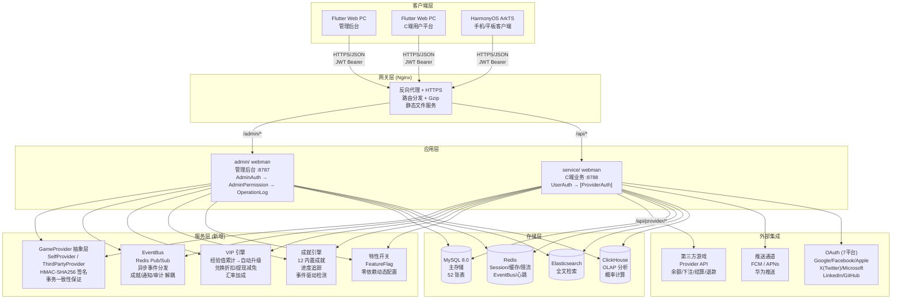
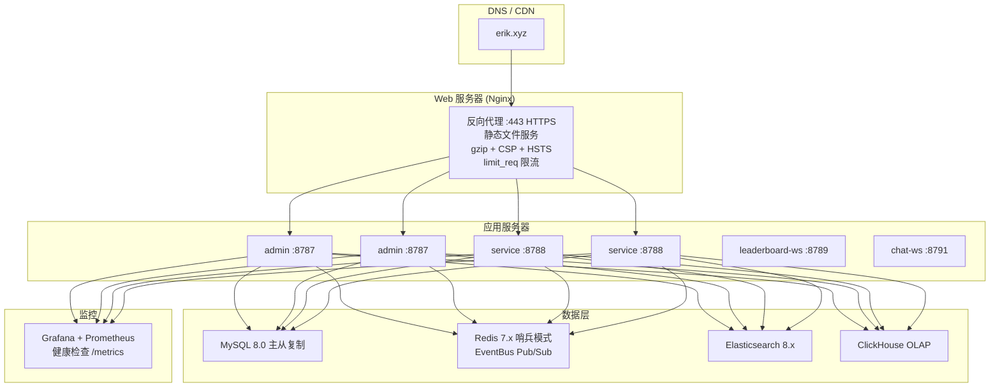

# आर्किटेक्चर दस्तावेज़
<!-- lang-nav -->

Languages: [中文](ARCHITECTURE.md) · [English](ARCHITECTURE.en.md) · [한국어](ARCHITECTURE.ko.md) · [Русский](ARCHITECTURE.ru.md) · [Deutsch](ARCHITECTURE.de.md) · [Français](ARCHITECTURE.fr.md) · [Español](ARCHITECTURE.es.md) · [Português](ARCHITECTURE.pt.md) · **हिन्दी** · [العربية](ARCHITECTURE.ar.md) · [বাংলা](ARCHITECTURE.bn.md) · [Bahasa Indonesia](ARCHITECTURE.id.md) · [日本語](ARCHITECTURE.ja.md)


> Copyright (c) 2026 erik <erik@erik.xyz> — https://erik.xyz

## 1. सिस्टम टोपोलॉजी



## 2. मॉड्यूल आर्किटेक्चर

### 2.1 admin/ — प्रशासन कंसोल

```
रूट परत: config/route.php
  ↓
मिडलवेयर श्रृंखला: Cors → SecurityFilter → RateLimit → AdminAuth → AdminPermission → OperationLog
  ↓
कंट्रोलर परत (28):
  ┌──────────────────────────────────────────────────────────┐
  │ Dashboard / User / Role / Permission / Config / Log      │ ← मौजूदा
  │ Profile / Export / Import / Upload / Health / Docs       │ ← मौजूदा
  │ Game / Withdraw / Payment / PlatformUser / Announce      │ ← मौजूदा
  │ Analytics / GameCategory / GameServer / Identity         │ ← मौजूदा
  │ CountryConfig / Coupon / Leaderboard / Metrics           │ ← मौजूदा
  │ Ticket / Search                                          │ ← नया
  └──────────────────────────────────────────────────────────┘
  ↓
सेवा परत: VIP / Achievement / EventBus / FeatureFlag / Risk / Notification
  ↓
Provider परत: GameProvider → SelfProvider / ThirdPartyProvider
  ↓
भंडारण परत: MySQL / Redis / Elasticsearch / ClickHouse
```

### 2.2 service/ — C-छोर व्यवसाय छोर

```
रूट परत: config/route.php
  ↓
मिडलवेयर श्रृंखला: Cors → SecurityFilter → RateLimit → Language → ApiVersion → [UserAuth | ProviderAuth]
  ↓
कंट्रोलर परत (25):
  ┌──────────────────────────────────────────────────────────┐
  │ Auth / Wallet / Deposit / Exchange / Withdraw            │ ← मौजूदा
  │ Game / User / Announcement / Captcha                     │ ← मौजूदा
  │ OAuth / Identity / Payment / GamePlayLog                 │ ← मौजूदा
  │ Leaderboard / Notification / Referral / TwoFactor        │ ← मौजूदा
  │ Country / Language / Coupon / Search                     │ ← मौजूदा
  │ Provider / Ticket / Verification                         │ ← नया
  └──────────────────────────────────────────────────────────┘
  ↓
सेवा परत: VIP / Achievement / EventBus / FeatureFlag / Risk / GameSession
  ↓
Provider परत: GameProvider → SelfProvider / ThirdPartyProvider
  ↓
भंडारण परत: MySQL / Redis / Elasticsearch / ClickHouse
```

### 2.3 Provider परत — गेम एकीकरण अमूर्तन

```
provider/
├── GameProvider.php          # अमूर्त आधार क्लास — एकीकृत इंटरफ़ेस
│   ├── getBalance()          # शेष क्वेरी
│   ├── bet()                 # दांव
│   ├── settle()              # निपटान
│   ├── refund()              # रिफंड
│   ├── rollback()            # रोलबैक
│   ├── verifySignature()     # कॉलबैक हस्ताक्षर सत्यापन
│   └── signRequest()         # अनुरोध हस्ताक्षर उत्पन्न (HMAC-SHA256)
├── SelfProvider.php          # स्वयं विकसित गेम — DB लेनदेन स्थिरता
├── ThirdPartyProvider.php    # तृतीय-पक्ष गेम — HTTP API + हस्ताक्षर
└── ProviderFactory.php       # फ़ैक्टरी — match(game.type)
```

### 2.4 EventBus — इवेंट बस

```
इवेंट प्रकाशन:
  DepositController → EventBus::emit('deposit.completed', $payload)
  ExchangeController → EventBus::emit('exchange.completed', $payload)
  GameController → EventBus::emit('game.played', $payload)
  ReferralController → EventBus::emit('referral.applied', $payload)

Redis Pub/Sub (channel: platform:events):
  ↓
सब्सक्राइबर:
  AchievementService  — उपलब्धि प्रगति जाँच
  VipService          — अनुभव मान संचय
  NotificationService — अधिसूचना भेजना
  WebhookController   — बाहरी webhook वितरण

> नोट: 2026-08-18 तक, `emit()` के कॉलर हैं लेकिन `subscribe()` के लिए कोई प्रक्रिया पंजीकृत नहीं है (P0-4 नहीं किया गया); इवेंट वर्तमान में केवल प्रकाशित होते हैं, उपभोग नहीं; सब्सक्राइबर डिज़ाइन लक्ष्य हैं।
```

### 2.5 स्थिरता सुरक्षा — सर्किट ब्रेकर / पुनः प्रयास / डिग्रेडेशन

```
packages/platform-common/src/
├── CircuitBreaker.php   # 熔断 — Redis 状态 (cb:{key}:failures / opened_at)，阈值 5 / 窗口 30s
│                        #   达阈值抛 CircuitOpenException 快速失败；成功重置计数；半开探测
│                        #   Redis 不可用 fail-open，不影响主流程
└── Retry.php            # 重试 — 指数退避 (200/400/800ms)，仅网络类异常 (ConnectException/超时/cURL 28)
                         #   maxAttempts 上限 5；与熔断共用 isRetryable 判定
```

डिग्रेडेशन स्विच `feature.provider_mock` (FeatureFlag / PlatformConfig, `on` होने पर वास्तविक नेटवर्क कॉल शॉर्ट-सर्किट करता है):

| प्रवेश बिंदु | mock=on व्यवहार |
|--------|-------------|
| `PushService::send` | तुरंत लौटें, कोई पुश नहीं |
| `PayoutService::execute` | `mock-{order_no}` बैच लौटाता है और ऑर्डर completed चिह्नित करता है |
| `ThirdPartyProvider::request` | `['success' => true]` लौटाता है |

सभी वास्तविक नेटवर्क कॉल `Retry::run → CircuitBreaker::call` में लिपटे हैं (Push FCM/APNs/HarmonyOS, PayPal भुगतान, तृतीय-पक्ष Provider अनुरोध)।

## 3. मिडलवेयर निष्पादन श्रृंखला

### admin/ (प्रशासन कंसोल)

```
अनुरोध → Cors (क्रॉस-ओरिजिन)
     → SecurityFilter (30+ डिटेक्टर→405/403)
     → RateLimit (Redis Lua स्लाइडिंग विंडो→429)
     → AdminAuth (JWT प्रमाणीकरण→401)
     → AdminPermission (RBAC प्राधिकरण, Redis 60s कैश→403)
     → OperationLog (ऑपरेशन लॉग स्वचालित रिकॉर्डिंग)
     → Controller → प्रतिक्रिया
```

### service/ (C-छोर व्यवसाय छोर)

```
सामान्य API:
  अनुरोध → Cors → SecurityFilter → RateLimit → Language → ApiVersion
       → [UserAuth] (JWT→401) → Controller → प्रतिक्रिया

Provider API:
  अनुरोध → Cors → SecurityFilter → RateLimit
       → ProviderAuth (HMAC-SHA256 हस्ताक्षर सत्यापन, 5min विंडो→401)
       → ProviderController → प्रतिक्रिया
```

## 4. मुख्य डेटा प्रवाह

### 4.1 रिचार्ज प्रक्रिया

```
उपयोगकर्ता → POST /api/deposit/create → ऑर्डर बनाएं (status=pending)
     → GatewayFactory से भुगतान बनाएं (Stripe Checkout (incl. Alipay/WeChat Pay APM)/NowPayments invoice/Coinbase charge) → checkout_url + expires_at(+1h) भरें; विफलता पर CAS से ऑर्डर रद्द करें और पुनः प्रयास करें
     → तृतीय-पक्ष भुगतान पर जाएं (Stripe (incl. Alipay/WeChat Pay)/PayPal/NowPayments[USDT TRC20/ERC20]/Coinbase[USDC/BTC/ETH])
     → भुगतान सफल → कॉलबैक /api/payment/callback
     → provider श्वेतसूची (केवल stripe/paypal/nowpayments/coinbase/skrill/neteller/paysafecard/paytm/mercadopago/astropay/paypay/kakaopay/gcash) + क्रॉस-चैनल दुरुपयोग सत्यापन + हस्ताक्षर सत्यापन (fail-closed) + टाइमस्टैम्प±300s + bccomp राशि मिलान
     → ऑर्डर अपडेट करें (status=confirmed, लेनदेनित)
     → UserWallet::addBalance() → प्लेटफ़ॉर्म कॉइन जमा
     → EventBus::emit('deposit.completed')
       → VipService::addExp() → EXP संचय → VIP उन्नयन जाँच
       → AchievementService::check() → उपलब्धि प्रगति अपडेट
     → Transaction रिकॉर्ड करें (type=deposit)
```

### 4.2 विनिमय प्रक्रिया

```
उपयोगकर्ता → POST /api/exchange/quote → मूल्य पूछताछ
     → VipService::getExchangeDiscount() → VIP छूट लागू करें
     → VipService::getRateBonus() → VIP विनिमय दर बोनस लागू करें
     → पुष्टि → POST /api/exchange/buy(या sell)
     → DB::beginTransaction()
     ├─ स्रोत मुद्रा कटौती (lockForUpdate)
     ├─ लक्ष्य मुद्रा वृद्धि
     ├─ ExchangeRecord रिकॉर्ड करें
     ├─ Transaction रिकॉर्ड करें
     └─ DB::commit()
     → EventBus::emit('exchange.completed')
       → AchievementService::check()
```

### 4.3 निकासी प्रक्रिया

```
उपयोगकर्ता → POST /api/withdraw/apply
     → VipService::getWithdrawFeeDiscount() → VIP शुल्क छूट लागू करें
     → वैश्विक स्विच जाँचें (PlatformConfig)
     → सीमाएँ जाँचें (min_amount / daily_limit)
     → शेष जाँचें → शेष कटौती
     → राशि<सीमा → auto-approved
     → राशि≥सीमा → pending (मैन्युअल समीक्षा)
     → Transaction रिकॉर्ड करें

प्रशासक → PUT /admin/withdraw/review
       → approve: पूर्ण चिह्नित
       → reject: प्लेटफ़ॉर्म कॉइन वापस + रिफंड लेनदेन
```

### 4.4 गेम Provider इंटरैक्शन प्रवाह

```
तृतीय-पक्ष गेम सर्वर:
  POST /api/provider/balance
    X-Game-Id + X-Timestamp + X-Signature (HMAC-SHA256)
    → ProviderAuth हस्ताक्षर सत्यापन → ProviderFactory::createById()
    → GameProvider::getBalance() → शेष लौटाएं

  POST /api/provider/bet
    → ProviderAuth → GameProvider::bet()
    → SelfProvider: DB लेनदेन कटौती (SELECT FOR UPDATE)
    → ThirdPartyProvider: HTTP फॉरवर्ड गेम पक्ष को
    → GamePlayLog रिकॉर्ड करें (action=bet, round_id)

  POST /api/provider/settle
    → ProviderAuth → GameProvider::settle()
    → गेम कॉइन शेष वृद्धि → GamePlayLog.ended_at अपडेट करें

  POST /api/provider/refund
    → ProviderAuth → GameProvider::refund()
    → शेष वापस → रिफंड लॉग रिकॉर्ड करें
```

### 4.5 VIP उन्नयन प्रवाह

```
रिचार्ज पूर्ण → VipService::addExp(userId, amount, 'deposit')
         → UserVip.exp += amount, UserVip.total_exp += amount
         → अगला VipLevel क्वेरी
         → exp >= required_exp → उन्नयन: level+1, exp -= required_exp
         → उन्नयन शर्त पूरी न होने तक चक्र जारी
         → EventBus::emit('user.vip_upgraded')
```

## 5. डेटाबेस ER संबंध

```
game_user ──┬── 1:1 ── game_user_wallet
            ├── 1:1 ── game_user_vip ── game_vip_level
            ├── 1:N ── game_user_game_wallet
            ├── 1:N ── game_deposit_order
            ├── 1:N ── game_withdraw_order
            ├── 1:N ── game_exchange_record
            ├── 1:N ── game_transaction
            ├── 1:N ── game_user_achievement ── game_achievement
            ├── 1:N ── game_exp_log
            ├── 1:N ── game_ticket ── game_ticket_reply
            ├── 1:N ── game_device_token
            ├── 1:N ── game_user_session
            └── 1:N ── game_message

game_game ──┬── 1:N ── game_game_currency
            ├── 1:N ── game_user_game_wallet
            ├── 1:N ── game_exchange_record
            └── 1:N ── game_game_play_log

game_friend ── user_id → game_user
             └── friend_id → game_user

game_vip_level ── 1:N ── game_user_vip
game_achievement ── 1:N ── game_user_achievement
```

## 6. परिनियोजन आर्किटेक्चर

### 6.1 विकास वातावरण

```
एकल मशीन परिनियोजन:
  admin/         :8787 (webman, 32 workers)
  service/       :8788 (webman, 32 workers)
  leaderboard-ws :8789 (WebSocket लीडरबोर्ड)
  chat-ws        :8791 (WebSocket चैट)
  MySQL          :3306
  Redis          :6379
```

### 6.2 Docker Compose (8 सेवाएँ)

```yaml
nginx (80/443) → admin (8787) + service (8788) + static files
leaderboard-ws (8789) — WebSocket लीडरबोर्ड वास्तविक समय पुश
chat-ws (8791) — WebSocket निजी संदेश/चैट
mysql (3306) — मुख्य डेटाबेस, डेटा वॉल्यूम स्थायीकरण
redis (6379) — कैश/दर सीमा/WebSocket/EventBus
elasticsearch (9200) — पूर्ण-पाठ खोज
```

### 6.3 उत्पादन वातावरण



## 7. परीक्षण आर्किटेक्चर

```
tests/
├── bootstrap.php                  # PHPUnit बूटस्ट्रैप
├── PlatformTest.php               # 56 व्यवसाय तर्क परीक्षण
├── BackendEnhancementTest.php     # 23 एन्क्रिप्शन/ID सेवा परीक्षण
├── CaptchaTest.php                # 7 कैप्चा परीक्षण
├── EncryptionServiceTest.php      # 6 एन्क्रिप्शन/डिक्रिप्शन परीक्षण
├── EnvConfigTest.php              # 4 पर्यावरण कॉन्फ़िग परीक्षण
├── HashidsServiceTest.php         # 8 ID एन्कोड/डिकोड परीक्षण
└── SnowflakeServiceTest.php       # 6 Snowflake ID परीक्षण
```

## 8. पोर्ट आवंटन

| सेवा | पोर्ट | विवरण |
|------|------|------|
| admin/ | 8787 | प्रशासन कंसोल API |
| service/ | 8788 | C-छोर व्यवसाय API |
| leaderboard-ws | 8789 | WebSocket वास्तविक समय लीडरबोर्ड |
| chat-ws | 8791 | WebSocket निजी संदेश/चैट |
| MySQL | 3306 | मुख्य डेटाबेस |
| Redis | 6379 | कैश/दर सीमा/WebSocket/EventBus |
| ClickHouse | 8123 | OLAP HTTP इंटरफ़ेस |
| Elasticsearch | 9200 | पूर्ण-पाठ खोज |

## 9. API दस्तावेज़

`hg/apidoc` के माध्यम से कंट्रोलर एनोटेशन से स्वचालित रूप से इंटरैक्टिव API दस्तावेज़ उत्पन्न होते हैं:

| दस्तावेज़ | पता | कंट्रोलर | एंडपॉइंट |
|------|------|--------|------|
| प्रशासन कंसोल | :8787/apidoc/ | 28 | ~85 |
| C-छोर व्यवसाय | :8788/apidoc/ | 25 | ~65 |

## 10. डेटाबेस तालिका सूची

### मूल संस्करण (14) + admin (7)
game_user, game_user_wallet, game_user_game_wallet, game_game, game_game_currency,
game_deposit_order, game_withdraw_order, game_exchange_record, game_transaction,
game_payment_method, game_announcement, game-platform_config, game_language, game_translation,
game_admin_user, game_admin_role, game_admin_permission, game_admin_user_role,
game_admin_role_permission, game_operation_log, game_system_config

### मानक संस्करण (10)
game_user_oauth, game_user_session, game_user_identity, game_user_payment_account,
game_withdraw_limit, game_game_server, game_game_play_log, game_risk_rule,
game_risk_log, game_stat_daily

### पूर्ण संस्करण (8)
game_game_category, game_game_category_rel, game_leaderboard, game_coupon,
game_user_coupon, game_country_config, game-platform_revenue

### पारिस्थितिकी विस्तार (10) ← नया
game_ticket, game_ticket_reply, game_device_token,
game_vip_level, game_user_vip, game_exp_log,
game_achievement, game_user_achievement,
game_friend, game_message

**कुल: 52 तालिकाएँ**

## 11. विशेषता स्विच

`game-platform_config` के `feature.*` नेमस्पेस पर आधारित, शून्य अतिरिक्त निर्भरता:

| स्विच | डिफ़ॉल्ट | कार्य |
|------|------|------|
| feature.tournament | off | टूर्नामेंट प्रणाली |
| feature.chat | off | WebSocket निजी संदेश |
| feature.vip | off | VIP वफादारी |
| feature.achievements | off | उपलब्धि बैज |

```php
use app\service\FeatureFlag;
if (FeatureFlag::isEnabled('vip')) { /* VIP logic */ }
```

---

> **Copyright (c) 2026 erik <erik@erik.xyz> — https://erik.xyz**
