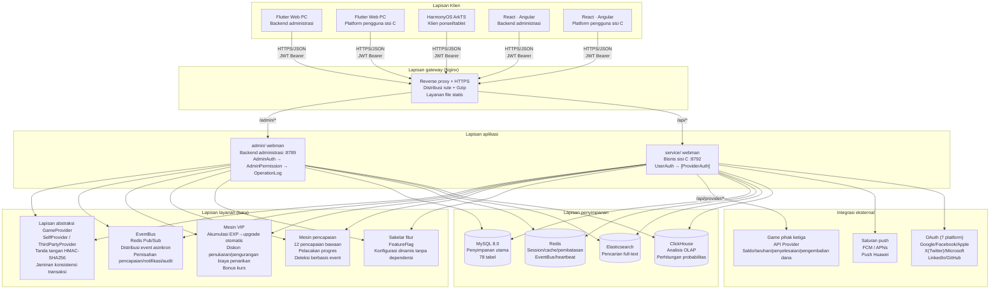
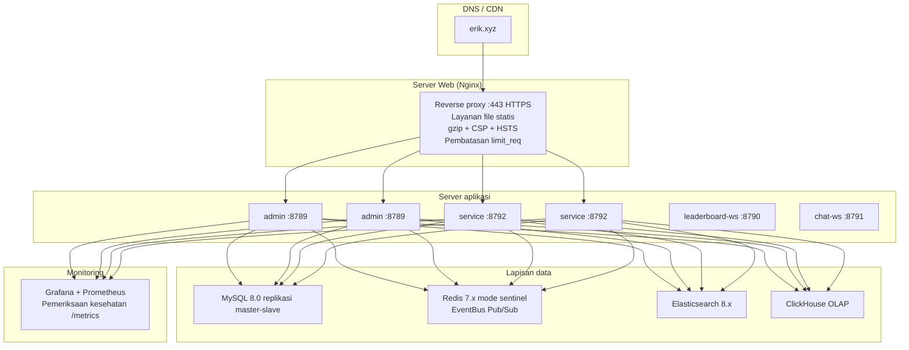

# Dokumen Arsitektur
<!-- lang-nav -->

Languages: [中文](ARCHITECTURE.md) · [English](ARCHITECTURE.en.md) · [한국어](ARCHITECTURE.ko.md) · [Русский](ARCHITECTURE.ru.md) · [Deutsch](ARCHITECTURE.de.md) · [Français](ARCHITECTURE.fr.md) · [Español](ARCHITECTURE.es.md) · [Português](ARCHITECTURE.pt.md) · [हिन्दी](ARCHITECTURE.hi.md) · [العربية](ARCHITECTURE.ar.md) · [বাংলা](ARCHITECTURE.bn.md) · **Bahasa Indonesia** · [日本語](ARCHITECTURE.ja.md)


> Copyright (c) 2026 erik <erik@erik.xyz> — https://erik.xyz

## 1. Topologi Sistem



## 2. Arsitektur Modul

### 2.1 admin/ — Backend Administrasi

```
Lapisan rute: config/route.php
  ↓
Rantai middleware: Cors → SecurityFilter → RateLimit → AdminAuth → AdminPermission → OperationLog
  ↓
Lapisan controller (45):
  ┌──────────────────────────────────────────────────────────┐
  │ Dashboard / User / Role / Permission / Config / Log      │ ← original
  │ Profile / Export / Import / Upload / Health / Docs       │ ← original
  │ Game / Withdraw / Payment / PlatformUser / Announce      │ ← original
  │ Analytics / GameCategory / GameServer / Identity         │ ← original
  │ CountryConfig / Coupon / Leaderboard / Metrics           │ ← original
  │ Ticket / Search                                          │ ← baru
  └──────────────────────────────────────────────────────────┘
  ↓
Lapisan layanan: VIP / Achievement / EventBus / FeatureFlag / Risk / Notification
  ↓
Lapisan Provider: GameProvider → SelfProvider / ThirdPartyProvider
  ↓
Lapisan penyimpanan: MySQL / Redis / Elasticsearch / ClickHouse
```

### 2.2 service/ — Sisi Bisnis C

```
Lapisan rute: config/route.php
  ↓
Rantai middleware: TraceId → Cors → SecurityFilter → RateLimit → Language → [UserAuth | ProviderAuth | SdkSessionAuth]
  ↓
Lapisan controller (34):
  ┌──────────────────────────────────────────────────────────┐
  │ Auth / Wallet / Deposit / Exchange / Withdraw            │ ← original
  │ Game / User / Announcement / Captcha                     │ ← original
  │ OAuth / Identity / Payment / GamePlayLog                 │ ← original
  │ Leaderboard / Notification / Referral / TwoFactor        │ ← original
  │ Country / Language / Coupon / Search                     │ ← original
  │ Provider / Ticket / Verification                         │ ← baru
  └──────────────────────────────────────────────────────────┘
  ↓
Lapisan layanan: VIP / Achievement / EventBus / FeatureFlag / Risk
  ↓
Lapisan Provider: GameProvider → SelfProvider / ThirdPartyProvider
  ↓
Lapisan penyimpanan: MySQL / Redis / Elasticsearch / ClickHouse
```

### 2.3 Lapisan Provider — Abstraksi Integrasi Game

```
provider/
├── GameProvider.php          # Kelas dasar abstrak — antarmuka terpadu
│   ├── getBalance()          # Kueri saldo
│   ├── bet()                 # Taruhan
│   ├── settle()              # Penyelesaian
│   ├── refund()              # Pengembalian dana
│   ├── rollback()            # Rollback
│   ├── verifySignature()     # Verifikasi tanda tangan callback
│   └── signRequest()         # Hasilkan tanda tangan permintaan (HMAC-SHA256)
├── SelfProvider.php          # Game buatan sendiri — konsisten transaksi DB
├── ThirdPartyProvider.php    # Game pihak ketiga — HTTP API + tanda tangan
└── ProviderFactory.php       # Factory — match(game.type)
```

### 2.4 EventBus — Bus Event

```
Penerbitan event:
  DepositController → EventBus::emit('deposit.completed', $payload)
  ExchangeController → EventBus::emit('exchange.completed', $payload)
  GameController → EventBus::emit('game.played', $payload)
  ReferralController → EventBus::emit('referral.applied', $payload)

Redis Pub/Sub (channel: platform:events):
  ↓
Pelanggan:
  AchievementService  — mendeteksi progres pencapaian
  VipService          — mengakumulasi pengalaman
  NotificationService — mengirim notifikasi
  WebhookController   — mengirim webhook eksternal

> Catatan: per 2026-08-18, `emit()` memiliki pemanggil tetapi `subscribe()` tidak terdaftar di proses mana pun (P0-4 belum dikerjakan), event saat ini hanya diterbitkan tanpa konsumsi, pelanggan adalah target desain.
```

### 2.5 Jaminan stabilitas — pemutus sirkuit / percobaan ulang / degradasi

```
packages/platform-common/src/
├── CircuitBreaker.php   # 熔断 — Redis 状态 (cb:{key}:failures / opened_at)，阈值 5 / 窗口 30s
│                        #   达阈值抛 CircuitOpenException 快速失败；成功重置计数；半开探测
│                        #   Redis 不可用 fail-open，不影响主流程
└── Retry.php            # 重试 — 指数退避 (200/400/800ms)，仅网络类异常 (ConnectException/超时/cURL 28)
                         #   maxAttempts 上限 5；与熔断共用 isRetryable 判定
```

Sakelar degradasi `feature.provider_mock` (FeatureFlag / PlatformConfig, short-circuit panggilan jaringan nyata saat `on`):

| Titik masuk | Perilaku saat mock=on |
|--------|-------------|
| `PushService::send` | Kembali langsung, tidak mengirim notifikasi |
| `PayoutService::execute` | Mengembalikan batch `mock-{order_no}` dan menandai pesanan completed |
| `ThirdPartyProvider::request` | Mengembalikan `['success' => true]` |

Semua panggilan jaringan nyata dibungkus dalam `Retry::run → CircuitBreaker::call` (Push FCM/APNs/HarmonyOS, pembayaran PayPal, permintaan Provider pihak ketiga).

## 3. Rantai Eksekusi Middleware

### admin/ (backend administrasi)

```
Permintaan → Cors (CORS)
     → SecurityFilter (30+ detektor→405/403)
     → RateLimit (jendela geser Redis Lua→429)
     → AdminAuth (autentikasi JWT→401)
     → AdminPermission (otorisasi RBAC, cache Redis 60s→403)
     → OperationLog (pencatatan log operasi otomatis)
     → Controller → Respons
```

### service/ (sisi bisnis C)

```
API biasa:
  Permintaan → TraceId → Cors → SecurityFilter → RateLimit → Language
       → [UserAuth] (JWT→401) → Controller → Respons

Provider API:
  Permintaan → Cors → SecurityFilter → RateLimit
       → ProviderAuth (verifikasi tanda tangan HMAC-SHA256, jendela 5 menit→401)
       → ProviderController → Respons
```

## 4. Alur Data Inti

### 4.1 Alur Deposit

```
Pengguna → POST /api/v1/deposit/create → buat pesanan (status=pending)
     → buat pembayaran via GatewayFactory (Stripe Checkout (incl. Alipay/WeChat Pay APM)/invoice NowPayments/charge Coinbase) → isi checkout_url + expires_at(+1h); jika gagal, batalkan pesanan via CAS dan coba lagi
     → lompat ke pembayaran pihak ketiga (Stripe (incl. Alipay/WeChat Pay)/PayPal/NowPayments[USDT TRC20/ERC20]/Coinbase[USDC/BTC/ETH])
     → pembayaran sukses → callback /api/v1/payment/callback
     → daftar putih provider (hanya stripe/paypal/nowpayments/coinbase/skrill/neteller/paysafecard/paytm/mercadopago/astropay/paypay/kakaopay/gcash) + validasi penggunaan lintas saluran + verifikasi tanda tangan (fail-closed) + timestamp ±300s + bccomp perbandingan jumlah
     → perbarui pesanan (status=confirmed, transaksional)
     → UserWallet::addBalance() → koin platform masuk
     → EventBus::emit('deposit.completed')
       → VipService::addExp() → akumulasi EXP → deteksi upgrade VIP
       → AchievementService::check() → pembaruan progres pencapaian
     → catat Transaction (type=deposit)
```

### 4.2 Alur Penukaran

```
Pengguna → POST /api/v1/exchange/quote → kueri harga
     → VipService::getExchangeDiscount() → terapkan diskon VIP
     → VipService::getRateBonus() → terapkan bonus kurs VIP
     → konfirmasi → POST /api/v1/exchange/buy (atau sell)
     → DB::beginTransaction()
     ├─ kurangi mata uang sumber (lockForUpdate)
     ├─ tambah mata uang target
     ├─ catat ExchangeRecord
     ├─ catat Transaction
     └─ DB::commit()
     → EventBus::emit('exchange.completed')
       → AchievementService::check()
```

### 4.3 Alur Penarikan

```
Pengguna → POST /api/v1/withdraw/apply
     → VipService::getWithdrawFeeDiscount() → terapkan keringanan biaya VIP
     → periksa saklar global (PlatformConfig)
     → periksa batas (min_amount / daily_limit)
     → periksa saldo → kurangi saldo
     → jumlah<threshold → auto-approved
     → jumlah≥threshold → pending (review manual)
     → catat Transaction

Admin → PUT /admin/v1/withdraw/review
       → approve: tandai selesai
       → reject: kembalikan koin platform + transaksi pengembalian
```

### 4.4 Alur Interaksi Provider Game

```
Server game pihak ketiga:
  POST /api/provider/balance
    X-Game-Id + X-Timestamp + X-Signature (HMAC-SHA256)
    → ProviderAuth verifikasi tanda tangan → ProviderFactory::createById()
    → GameProvider::getBalance() → kembalikan saldo

  POST /api/provider/bet
    → ProviderAuth → GameProvider::bet()
    → SelfProvider: pengurangan transaksi DB (SELECT FOR UPDATE)
    → ThirdPartyProvider: terusan HTTP ke pihak game
    → catat GamePlayLog (action=bet, round_id)

  POST /api/provider/settle
    → ProviderAuth → GameProvider::settle()
    → tambah saldo koin game → perbarui GamePlayLog.ended_at

  POST /api/provider/refund
    → ProviderAuth → GameProvider::refund()
    → kembalikan saldo → catat log pengembalian
```

### 4.5 Alur Upgrade VIP

```
Deposit selesai → VipService::addExp(userId, amount, 'deposit')
         → UserVip.exp += amount, UserVip.total_exp += amount
         → kueri VipLevel berikutnya
         → exp >= required_exp → upgrade: level+1, exp -= required_exp
         → loop sampai kondisi upgrade tidak terpenuhi lagi
         → EventBus::emit('user.vip_upgraded')
```

## 5. Relasi ER Database

```
game_user ──┬── 1:1 ── game_user_wallet
            ├── 1:1 ── game_user_vip ── game_vip_level
            ├── 1:N ── game_user_game_wallet
            ├── 1:N ── game_deposit_order
            ├── 1:N ── game_withdraw_order
            ├── 1:N ── game_exchange_record
            ├── 1:N ── game_transaction
            ├── 1:N ── game_user_achievement ── game_achievement
            ├── 1:N ── game_exp_log
            ├── 1:N ── game_ticket ── game_ticket_reply
            ├── 1:N ── game_device_token
            ├── 1:N ── game_user_session
            └── 1:N ── game_message

game_game ──┬── 1:N ── game_game_currency
            ├── 1:N ── game_user_game_wallet
            ├── 1:N ── game_exchange_record
            └── 1:N ── game_game_play_log

game_friend ── user_id → game_user
             └── friend_id → game_user

game_vip_level ── 1:N ── game_user_vip
game_achievement ── 1:N ── game_user_achievement
```

## 6. Arsitektur Deployment

### 6.1 Lingkungan Pengembangan

```
Deployment satu mesin:
  admin/         :8789 (webman, 32 workers)
  service/       :8792 (webman, 32 workers)
  leaderboard-ws :8790 (WebSocket papan peringkat)
  chat-ws        :8791 (WebSocket chat)
  MySQL          :3306
  Redis          :6379
```

### 6.2 Docker Compose (7 layanan)

```yaml
nginx (80/443) → admin (8789) + service (8792) + static files
leaderboard-ws (8790/8791) — push real-time papan peringkat WebSocket + pesan pribadi/chat
mysql (3306) — database utama, persistensi volume data
redis (6379) — cache/rate limit/WebSocket/EventBus
elasticsearch (9200) — pencarian full-text
```

### 6.3 Lingkungan Produksi



## 7. Arsitektur Pengujian

```
tests/                             # 21 file · 200 kasus uji
├── bootstrap.php                  # Bootstrap PHPUnit
├── AuthControllerRegisterTest.php # 15 tes kekuatan kata sandi pendaftaran
├── BackendEnhancementTest.php     # 27 tes layanan enkripsi/ID
├── CaptchaTest.php                # 5 tes CAPTCHA
├── CdnProbeServiceTest.php        # 5 tes probe CDN
├── CdnProviderModelTest.php       # 3 tes model penyedia CDN
├── ClickHouseServiceTest.php      # 16 tes layanan ClickHouse
├── ConfigDefaultsTest.php         # 4 tes nilai default konfigurasi
├── EncryptionServiceTest.php      # 8 tes enkripsi/dekripsi
├── EnvConfigTest.php              # 6 tes konfigurasi lingkungan
├── GameControllerTest.php         # 5 tes controller game
├── GameRouteTest.php              # 5 tes rute game
├── HashidsServiceTest.php         # 6 tes encode/decode ID
├── LeaderboardServiceTest.php     # 4 tes layanan papan peringkat
├── NotificationServiceTest.php    # 3 tes layanan notifikasi
├── PayoutServiceTest.php          # 9 tes layanan pembayaran
├── PlatformCommonTest.php         # 6 tes pembuat kueri bersama
├── PlatformTest.php               # 55 tes logika bisnis
├── ReportControllerTest.php       # 5 tes rentang tanggal laporan
├── SnowflakeServiceTest.php       # 5 tes ID Snowflake
└── TranslationServiceTest.php     # 8 tes layanan terjemahan
```

## 8. Alokasi Port

| Layanan | Port | Keterangan |
|------|------|------|
| admin/ | 8789 | API backend administrasi |
| service/ | 8792 | API bisnis sisi C |
| leaderboard-ws | 8790 | Papan peringkat real-time WebSocket |
| chat-ws | 8791 | WebSocket pesan pribadi/chat |
| MySQL | 3306 | Database utama |
| Redis | 6379 | Cache/rate limit/WebSocket/EventBus |
| ClickHouse | 8123 | Antarmuka HTTP OLAP |
| Elasticsearch | 9200 | Pencarian full-text |

## 9. Dokumentasi API

Menggunakan `erikwang2013/apidoc-php` untuk membuat dokumentasi API interaktif otomatis melalui anotasi controller:

| Dokumentasi | Alamat | Controller | Endpoint |
|------|------|--------|------|
| Backend administrasi | :8789/apidoc/ | 45 | 154 |
| Bisnis sisi C | :8792/apidoc/ | 34 | 107 |

## 10. Daftar Tabel Database

### Versi Dasar (12 tabel) + admin (7 tabel)
game_user, game_user_wallet, game_user_game_wallet,
game_game, game_game_currency, game_deposit_order,
game_withdraw_order, game_exchange_record, game_transaction,
game_payment_method, game_announcement, game_platform_config,
game_admin_user, game_admin_role, game_admin_permission,
game_admin_user_role, game_admin_role_permission, game_operation_log,
game_system_config

### Versi Standar (10 tabel)
game_user_identity, game_user_oauth, game_user_payment_account,
game_user_session, game_game_server, game_game_play_log,
game_withdraw_limit, game_risk_rule, game_risk_log,
game_stat_daily

### Versi Lengkap (13 tabel)
game_game_category, game_game_category_rel, game_leaderboard,
game_coupon, game_user_coupon, game_language,
game_translation, game_country_config, game_platform_revenue,
game_notification, game_referral, game_referral_reward,
game_user_2fa

### Perluasan Ekosistem (14 tabel) ← baru
game_ticket, game_ticket_reply, game_device_token,
game_vip_level, game_user_vip, game_exp_log,
game_achievement, game_user_achievement, game_friend,
game_message, game_cdn_provider, game_referral_commission,
game_tournament, game_tournament_entry

### Penambahan v1.3.15-22 (22 tabel)
game_event_outbox, game_reconciliation_batch, game_reconciliation_diff,
game_reconciliation_statement, game_device_fingerprint, game_device_account_map,
game_ip_reputation, game_account_account_link, game_activity,
game_activity_participation, game_activity_reward_log, game_anticheat_event,
game_anticheat_daily_stat, game_group, game_group_member,
game_share_link, game_aml_rule, game_aml_hit,
game_kyc_level, game_user_kyc, game_user_trust,
game_risk_cluster

**Total: 78 tabel**

## 11. Fitur Saklar

Berdasarkan namespace `feature.*` di `game_platform_config`, nol dependensi tambahan:

| Saklar | Default | Fungsi |
|------|------|------|
| feature.tournament | off | Sistem turnamen |
| feature.chat | off | WebSocket pesan pribadi |
| feature.vip | off | Loyalitas VIP |
| feature.achievements | off | Lencana pencapaian |

```php
use app\service\FeatureFlag;
if (FeatureFlag::isEnabled('vip')) { /* VIP logic */ }
```

---

> **Copyright (c) 2026 erik <erik@erik.xyz> — https://erik.xyz**
