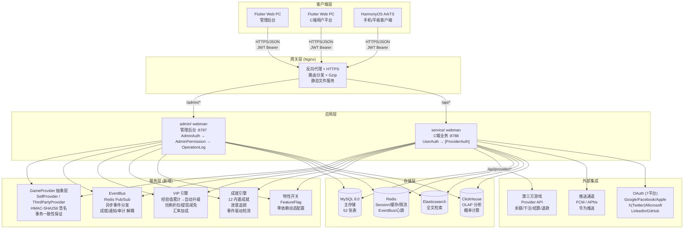
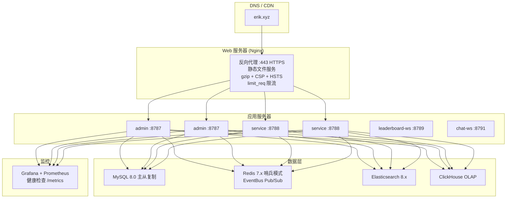

# 아키텍처 문서
<!-- lang-nav -->

Languages: [中文](ARCHITECTURE.md) · [English](ARCHITECTURE.en.md) · **한국어** · [Русский](ARCHITECTURE.ru.md) · [Deutsch](ARCHITECTURE.de.md) · [Français](ARCHITECTURE.fr.md) · [Español](ARCHITECTURE.es.md) · [Português](ARCHITECTURE.pt.md) · [हिन्दी](ARCHITECTURE.hi.md) · [العربية](ARCHITECTURE.ar.md) · [বাংলা](ARCHITECTURE.bn.md) · [Bahasa Indonesia](ARCHITECTURE.id.md) · [日本語](ARCHITECTURE.ja.md)


> Copyright (c) 2026 erik <erik@erik.xyz> — https://erik.xyz

## 1. 시스템 토폴로지



## 2. 모듈 아키텍처

### 2.1 admin/ — 관리 백오피스

```
라우트 레이어: config/route.php
  ↓
미들웨어 체인: Cors → SecurityFilter → RateLimit → AdminAuth → AdminPermission → OperationLog
  ↓
컨트롤러 레이어 (28개):
  ┌──────────────────────────────────────────────────────────┐
  │ Dashboard / User / Role / Permission / Config / Log      │ ← 기존
  │ Profile / Export / Import / Upload / Health / Docs       │ ← 기존
  │ Game / Withdraw / Payment / PlatformUser / Announce      │ ← 기존
  │ Analytics / GameCategory / GameServer / Identity         │ ← 기존
  │ CountryConfig / Coupon / Leaderboard / Metrics           │ ← 기존
  │ Ticket / Search                                          │ ← 신규
  └──────────────────────────────────────────────────────────┘
  ↓
서비스 레이어: VIP / Achievement / EventBus / FeatureFlag / Risk / Notification
  ↓
Provider 레이어: GameProvider → SelfProvider / ThirdPartyProvider
  ↓
저장 레이어: MySQL / Redis / Elasticsearch / ClickHouse
```

### 2.2 service/ — C단 비즈니스 서버

```
라우트 레이어: config/route.php
  ↓
미들웨어 체인: Cors → SecurityFilter → RateLimit → Language → ApiVersion → [UserAuth | ProviderAuth]
  ↓
컨트롤러 레이어 (25개):
  ┌──────────────────────────────────────────────────────────┐
  │ Auth / Wallet / Deposit / Exchange / Withdraw            │ ← 기존
  │ Game / User / Announcement / Captcha                     │ ← 기존
  │ OAuth / Identity / Payment / GamePlayLog                 │ ← 기존
  │ Leaderboard / Notification / Referral / TwoFactor        │ ← 기존
  │ Country / Language / Coupon / Search                     │ ← 기존
  │ Provider / Ticket / Verification                         │ ← 신규
  └──────────────────────────────────────────────────────────┘
  ↓
서비스 레이어: VIP / Achievement / EventBus / FeatureFlag / Risk / GameSession
  ↓
Provider 레이어: GameProvider → SelfProvider / ThirdPartyProvider
  ↓
저장 레이어: MySQL / Redis / Elasticsearch / ClickHouse
```

### 2.3 Provider 레이어 — 게임 연동 추상화

```
provider/
├── GameProvider.php          # 추상 베이스 클래스 — 통일 인터페이스
│   ├── getBalance()          # 잔액 조회
│   ├── bet()                 # 베팅
│   ├── settle()              # 정산
│   ├── refund()              # 환불
│   ├── rollback()            # 롤백
│   ├── verifySignature()     # 콜백 서명 검증
│   └── signRequest()         # 요청 서명 생성 (HMAC-SHA256)
├── SelfProvider.php          # 자체 개발 게임 — DB 트랜잭션 일관
├── ThirdPartyProvider.php    # 서드파티 게임 — HTTP API + 서명
└── ProviderFactory.php       # 팩토리 — match(game.type)
```

### 2.4 EventBus — 이벤트 버스

```
이벤트 발행:
  DepositController → EventBus::emit('deposit.completed', $payload)
  ExchangeController → EventBus::emit('exchange.completed', $payload)
  GameController → EventBus::emit('game.played', $payload)
  ReferralController → EventBus::emit('referral.applied', $payload)

Redis Pub/Sub (channel: platform:events):
  ↓
구독자:
  AchievementService  — 업적 진행도 검출
  VipService          — 경험치 누적
  NotificationService — 알림 전송
  WebhookController   — 외부 webhook 전달

> 참고: 2026-08-18 기준 `emit()`은 호출자가 있으나 `subscribe()`에는 등록된 프로세스가 없습니다(P0-4 미완료). 이벤트는 현재 발행만 되고 소비되지 않으며, 구독자는 설계 목표입니다.
```

### 2.5 안정성 보장 — 서킷 브레이커 / 재시도 / 디그레이션

```
packages/platform-common/src/
├── CircuitBreaker.php   # 熔断 — Redis 状态 (cb:{key}:failures / opened_at)，阈值 5 / 窗口 30s
│                        #   达阈值抛 CircuitOpenException 快速失败；成功重置计数；半开探测
│                        #   Redis 不可用 fail-open，不影响主流程
└── Retry.php            # 重试 — 指数退避 (200/400/800ms)，仅网络类异常 (ConnectException/超时/cURL 28)
                         #   maxAttempts 上限 5；与熔断共用 isRetryable 判定
```

디그레이션 스위치 `feature.provider_mock`(FeatureFlag / PlatformConfig, `on`이면 실제 네트워크 호출 단락):

| 접점 | mock=on 동작 |
|--------|-------------|
| `PushService::send` | 즉시 반환, 푸시 미전송 |
| `PayoutService::execute` | `mock-{order_no}` 배치 반환 및 주문 completed 표시 |
| `ThirdPartyProvider::request` | `['success' => true]` 반환 |

실제 네트워크 호출은 모두 `Retry::run → CircuitBreaker::call`로 래핑(Push FCM/APNs/HarmonyOS, PayPal 지급, 타사 Provider 요청).

## 3. 미들웨어 실행 체인

### admin/ (관리 백오피스)

```
요청 → Cors (크로스 도메인)
     → SecurityFilter (30+ 검출기→405/403)
     → RateLimit (Redis Lua 슬라이딩 윈도우→429)
     → AdminAuth (JWT 인증→401)
     → AdminPermission (RBAC 인가, Redis 60s 캐시→403)
     → OperationLog (작업 로그 자동 기록)
     → Controller → 응답
```

### service/ (C단 비즈니스 서버)

```
일반 API:
  요청 → Cors → SecurityFilter → RateLimit → Language → ApiVersion
       → [UserAuth] (JWT→401) → Controller → 응답

Provider API:
  요청 → Cors → SecurityFilter → RateLimit
       → ProviderAuth (HMAC-SHA256 서명 검증, 5min 창→401)
       → ProviderController → 응답
```

## 4. 핵심 데이터 흐름

### 4.1 충전 플로우

```
사용자 → POST /api/deposit/create → 주문 생성 (status=pending)
     → GatewayFactory로 결제 생성 (Stripe Checkout (incl. Alipay/WeChat Pay APM)/NowPayments invoice/Coinbase charge) → checkout_url + expires_at(+1h) 반영; 실패 시 CAS로 주문 취소 후 재시도
     → 서드파티 결제로 이동 (Stripe (incl. Alipay/WeChat Pay)/PayPal/NowPayments[USDT TRC20/ERC20]/Coinbase[USDC/BTC/ETH])
     → 결제 성공 → 콜백 /api/payment/callback
     → provider 화이트리스트(stripe/paypal/nowpayments/coinbase/skrill/neteller/paysafecard/paytm/mercadopago/astropay/paypay/kakaopay/gcash만) + 채널 간 도용 검증 + 서명 검증(fail-closed) + 타임스탬프±300s + bccomp 금액 대조
     → 주문 업데이트 (status=confirmed, 트랜잭션화)
     → UserWallet::addBalance() → 플랫폼 코인 입금
     → EventBus::emit('deposit.completed')
       → VipService::addExp() → EXP 누적 → VIP 승급 검사
       → AchievementService::check() → 업적 진행도 업데이트
     → Transaction 기록 (type=deposit)
```

### 4.2 환전 플로우

```
사용자 → POST /api/exchange/quote → 견적
     → VipService::getExchangeDiscount() → VIP 할인 적용
     → VipService::getRateBonus() → VIP 환율 보너스 적용
     → 확인 → POST /api/exchange/buy(또는 sell)
     → DB::beginTransaction()
     ├─ 소스 코인 차감 (lockForUpdate)
     ├─ 타겟 코인 증가
     ├─ ExchangeRecord 기록
     ├─ Transaction 기록
     └─ DB::commit()
     → EventBus::emit('exchange.completed')
       → AchievementService::check()
```

### 4.3 출금 플로우

```
사용자 → POST /api/withdraw/apply
     → VipService::getWithdrawFeeDiscount() → VIP 수수료 할인 적용
     → 전역 스위치 확인 (PlatformConfig)
     → 한도 확인 (min_amount / daily_limit)
     → 잔액 확인 → 잔액 차감
     → 금액<임계값 → auto-approved
     → 금액≥임계값 → pending (수동 심사)
     → Transaction 기록

관리자 → PUT /admin/withdraw/review
       → approve: 완료 표시
       → reject: 플랫폼 코인 반환 + 환불 거래 내역
```

### 4.4 게임 Provider 상호작용 흐름

```
서드파티 게임 서버:
  POST /api/provider/balance
    X-Game-Id + X-Timestamp + X-Signature (HMAC-SHA256)
    → ProviderAuth 서명 검증 → ProviderFactory::createById()
    → GameProvider::getBalance() → 잔액 반환

  POST /api/provider/bet
    → ProviderAuth → GameProvider::bet()
    → SelfProvider: DB 트랜잭션 차감 (SELECT FOR UPDATE)
    → ThirdPartyProvider: HTTP로 게임사에 전달
    → GamePlayLog 기록 (action=bet, round_id)

  POST /api/provider/settle
    → ProviderAuth → GameProvider::settle()
    → 게임 코인 잔액 증가 → GamePlayLog.ended_at 업데이트

  POST /api/provider/refund
    → ProviderAuth → GameProvider::refund()
    → 잔액 반환 → 환불 로그 기록
```

### 4.5 VIP 승급 흐름

```
충전 완료 → VipService::addExp(userId, amount, 'deposit')
         → UserVip.exp += amount, UserVip.total_exp += amount
         → 다음 레벨 VipLevel 조회
         → exp >= required_exp → 승급: level+1, exp -= required_exp
         → 승급 조건을 더 이상 만족하지 않을 때까지 반복
         → EventBus::emit('user.vip_upgraded')
```

## 5. 데이터베이스 ER 관계

```
game_user ──┬── 1:1 ── game_user_wallet
            ├── 1:1 ── game_user_vip ── game_vip_level
            ├── 1:N ── game_user_game_wallet
            ├── 1:N ── game_deposit_order
            ├── 1:N ── game_withdraw_order
            ├── 1:N ── game_exchange_record
            ├── 1:N ── game_transaction
            ├── 1:N ── game_user_achievement ── game_achievement
            ├── 1:N ── game_exp_log
            ├── 1:N ── game_ticket ── game_ticket_reply
            ├── 1:N ── game_device_token
            ├── 1:N ── game_user_session
            └── 1:N ── game_message

game_game ──┬── 1:N ── game_game_currency
            ├── 1:N ── game_user_game_wallet
            ├── 1:N ── game_exchange_record
            └── 1:N ── game_game_play_log

game_friend ── user_id → game_user
             └── friend_id → game_user

game_vip_level ── 1:N ── game_user_vip
game_achievement ── 1:N ── game_user_achievement
```

## 6. 배포 아키텍처

### 6.1 개발 환경

```
단일 머신 배포:
  admin/         :8787 (webman, 32 workers)
  service/       :8788 (webman, 32 workers)
  leaderboard-ws :8789 (WebSocket 리더보드)
  chat-ws        :8791 (WebSocket 채팅)
  MySQL          :3306
  Redis          :6379
```

### 6.2 Docker Compose (8 서비스)

```yaml
nginx (80/443) → admin (8787) + service (8788) + static files
leaderboard-ws (8789) — WebSocket 리더보드 실시간 푸시
chat-ws (8791) — WebSocket 쪽지/채팅
mysql (3306) — 메인 데이터베이스, 데이터 볼륨 영속화
redis (6379) — 캐시/레이트 리밋/WebSocket/EventBus
elasticsearch (9200) — 전문 검색
```

### 6.3 프로덕션 환경



## 7. 테스트 아키텍처

```
tests/
├── bootstrap.php                  # PHPUnit 부트스트랩
├── PlatformTest.php               # 비즈니스 로직 테스트 56개
├── BackendEnhancementTest.php     # 암호화/ID 서비스 테스트 23개
├── CaptchaTest.php                # 캡차 테스트 7개
├── EncryptionServiceTest.php      # 암복호화 테스트 6개
├── EnvConfigTest.php              # 환경 설정 테스트 4개
├── HashidsServiceTest.php         # ID 인코딩/디코딩 테스트 8개
└── SnowflakeServiceTest.php       # Snowflake ID 테스트 6개
```

## 8. 포트 할당

| 서비스 | 포트 | 설명 |
|------|------|------|
| admin/ | 8787 | 관리 백오피스 API |
| service/ | 8788 | C단 비즈니스 API |
| leaderboard-ws | 8789 | WebSocket 실시간 리더보드 |
| chat-ws | 8791 | WebSocket 쪽지/채팅 |
| MySQL | 3306 | 메인 데이터베이스 |
| Redis | 6379 | 캐시/레이트 리밋/WebSocket/EventBus |
| ClickHouse | 8123 | OLAP HTTP 인터페이스 |
| Elasticsearch | 9200 | 전문 검색 |

## 9. API 문서

`hg/apidoc`로 컨트롤러 주석을 통해 인터랙티브 API 문서를 자동 생성:

| 문서 | 주소 | 컨트롤러 | 엔드포인트 |
|------|------|--------|------|
| 관리 백오피스 | :8787/apidoc/ | 28 | ~85 |
| C단 비즈니스 | :8788/apidoc/ | 25 | ~65 |

## 10. 데이터베이스 테이블 목록

### 베이직 에디션 (14장) + admin (7장)
game_user, game_user_wallet, game_user_game_wallet, game_game, game_game_currency,
game_deposit_order, game_withdraw_order, game_exchange_record, game_transaction,
game_payment_method, game_announcement, game-platform_config, game_language, game_translation,
game_admin_user, game_admin_role, game_admin_permission, game_admin_user_role,
game_admin_role_permission, game_operation_log, game_system_config

### 스탠다드 에디션 (10장)
game_user_oauth, game_user_session, game_user_identity, game_user_payment_account,
game_withdraw_limit, game_game_server, game_game_play_log, game_risk_rule,
game_risk_log, game_stat_daily

### 풀 에디션 (8장)
game_game_category, game_game_category_rel, game_leaderboard, game_coupon,
game_user_coupon, game_country_config, game-platform_revenue

### 생태계 확장 (10장) ← 신규
game_ticket, game_ticket_reply, game_device_token,
game_vip_level, game_user_vip, game_exp_log,
game_achievement, game_user_achievement,
game_friend, game_message

**총계: 52장 테이블**

## 11. 기능 스위치

`game-platform_config`의 `feature.*` 네임스페이스 기반, 추가 의존성 없음:

| 스위치 | 기본값 | 기능 |
|------|------|------|
| feature.tournament | off | 토너먼트 시스템 |
| feature.chat | off | WebSocket 쪽지 |
| feature.vip | off | VIP 충성도 |
| feature.achievements | off | 업적 배지 |

```php
use app\service\FeatureFlag;
if (FeatureFlag::isEnabled('vip')) { /* VIP logic */ }
```

---

> **Copyright (c) 2026 erik <erik@erik.xyz> — https://erik.xyz**
