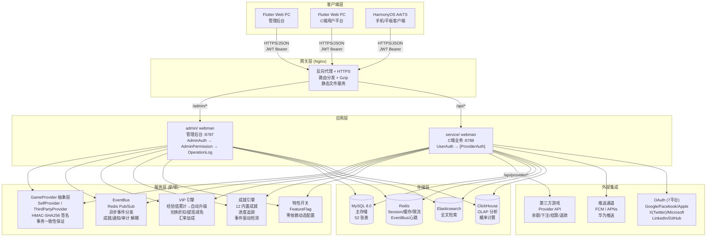
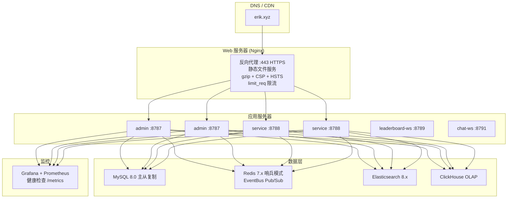

# 架构文档
<!-- lang-nav -->

Languages: **中文** · [English](ARCHITECTURE.en.md) · [한국어](ARCHITECTURE.ko.md) · [Русский](ARCHITECTURE.ru.md) · [Deutsch](ARCHITECTURE.de.md) · [Français](ARCHITECTURE.fr.md) · [Español](ARCHITECTURE.es.md) · [Português](ARCHITECTURE.pt.md) · [हिन्दी](ARCHITECTURE.hi.md) · [العربية](ARCHITECTURE.ar.md) · [বাংলা](ARCHITECTURE.bn.md) · [Bahasa Indonesia](ARCHITECTURE.id.md) · [日本語](ARCHITECTURE.ja.md)


> Copyright (c) 2026 erik <erik@erik.xyz> — https://erik.xyz

## 1. 系统拓扑



## 2. 模块架构

### 2.1 admin/ — 管理后台

```
路由层: config/route.php
  ↓
中间件链: Cors → SecurityFilter → RateLimit → AdminAuth → AdminPermission → OperationLog
  ↓
控制器层 (28 个):
  ┌──────────────────────────────────────────────────────────┐
  │ Dashboard / User / Role / Permission / Config / Log      │ ← 原有
  │ Profile / Export / Import / Upload / Health / Docs       │ ← 原有
  │ Game / Withdraw / Payment / PlatformUser / Announce      │ ← 原有
  │ Analytics / GameCategory / GameServer / Identity         │ ← 原有
  │ CountryConfig / Coupon / Leaderboard / Metrics           │ ← 原有
  │ Ticket / Search                                          │ ← 新增
  └──────────────────────────────────────────────────────────┘
  ↓
服务层: VIP / Achievement / EventBus / FeatureFlag / Risk / Notification
  ↓
Provider 层: GameProvider → SelfProvider / ThirdPartyProvider
  ↓
存储层: MySQL / Redis / Elasticsearch / ClickHouse
```

### 2.2 service/ — C端业务端

```
路由层: config/route.php
  ↓
中间件链: Cors → SecurityFilter → RateLimit → Language → ApiVersion → [UserAuth | ProviderAuth]
  ↓
控制器层 (25 个):
  ┌──────────────────────────────────────────────────────────┐
  │ Auth / Wallet / Deposit / Exchange / Withdraw            │ ← 原有
  │ Game / User / Announcement / Captcha                     │ ← 原有
  │ OAuth / Identity / Payment / GamePlayLog                 │ ← 原有
  │ Leaderboard / Notification / Referral / TwoFactor        │ ← 原有
  │ Country / Language / Coupon / Search                     │ ← 原有
  │ Provider / Ticket / Verification                         │ ← 新增
  └──────────────────────────────────────────────────────────┘
  ↓
服务层: VIP / Achievement / EventBus / FeatureFlag / Risk / GameSession
  ↓
Provider 层: GameProvider → SelfProvider / ThirdPartyProvider
  ↓
存储层: MySQL / Redis / Elasticsearch / ClickHouse
```

### 2.3 Provider 层 — 游戏接入抽象

```
provider/
├── GameProvider.php          # 抽象基类 — 统一接口
│   ├── getBalance()          # 查询余额
│   ├── bet()                 # 下注
│   ├── settle()              # 结算
│   ├── refund()              # 退款
│   ├── rollback()            # 回滚
│   ├── verifySignature()     # 验证回调签名
│   └── signRequest()         # 生成请求签名 (HMAC-SHA256)
├── SelfProvider.php          # 自研游戏 — DB事务一致
├── ThirdPartyProvider.php    # 第三方游戏 — HTTP API + 签名
└── ProviderFactory.php       # 工厂 — match(game.type)
```

### 2.4 EventBus — 事件总线

```
事件发布:
  DepositController → EventBus::emit('deposit.completed', $payload)
  ExchangeController → EventBus::emit('exchange.completed', $payload)
  GameController → EventBus::emit('game.played', $payload)
  ReferralController → EventBus::emit('referral.applied', $payload)

Redis Pub/Sub (channel: platform:events):
  ↓
订阅者:
  AchievementService  — 检测成就进度
  VipService          — 累计经验值
  NotificationService — 发送通知
  WebhookController   — 投递外部 webhook

> 注：截至 2026-08-18，`emit()` 有调用方但 `subscribe()` 无任何进程注册（P0-4 未做），事件目前仅发布无消费，订阅者为设计目标。
```

### 2.5 稳定性保障 — 熔断 / 重试 / 降级

```
packages/platform-common/src/
├── CircuitBreaker.php   # 熔断 — Redis 状态 (cb:{key}:failures / opened_at)，阈值 5 / 窗口 30s
│                        #   达阈值抛 CircuitOpenException 快速失败；成功重置计数；半开探测
│                        #   Redis 不可用 fail-open，不影响主流程
└── Retry.php            # 重试 — 指数退避 (200/400/800ms)，仅网络类异常 (ConnectException/超时/cURL 28)
                         #   maxAttempts 上限 5；与熔断共用 isRetryable 判定
```

降级开关 `feature.provider_mock`（FeatureFlag / PlatformConfig，`on` 时短路真实网络调用）：

| 接入点 | mock=on 行为 |
|--------|-------------|
| `PushService::send` | 直接返回，不发推送 |
| `PayoutService::execute` | 返回 `mock-{order_no}` 批次并标记订单 completed |
| `ThirdPartyProvider::request` | 返回 `['success' => true]` |

真实网络调用均包 `Retry::run → CircuitBreaker::call`（Push FCM/APNs/HarmonyOS、PayPal 打款、第三方 Provider 请求）。

## 3. 中间件执行链

### admin/（管理后台）

```
请求 → Cors (跨域)
     → SecurityFilter (30+检测器→405/403)
     → RateLimit (Redis Lua滑动窗口→429)
     → AdminAuth (JWT认证→401)
     → AdminPermission (RBAC鉴权, Redis 60s缓存→403)
     → OperationLog (操作日志自动记录)
     → Controller → 响应
```

### service/（C端业务端）

```
常规API:
  请求 → Cors → SecurityFilter → RateLimit → Language → ApiVersion
       → [UserAuth] (JWT→401) → Controller → 响应

Provider API:
  请求 → Cors → SecurityFilter → RateLimit
       → ProviderAuth (HMAC-SHA256签名验证, 5min窗口→401)
       → ProviderController → 响应
```

## 4. 核心数据流

### 4.1 充值流程

```
用户 → POST /api/deposit/create → 生成订单 (status=pending)
     → 跳转第三方支付 (Stripe/PayPal)
     → 支付成功 → 回调 /api/payment/callback
     → provider 白名单(仅 stripe/paypal) + 跨渠道冒用校验 + 验签(fail-closed) + 时间戳±300s + bccomp 金额核对
     → 更新订单 (status=confirmed, 事务化)
     → UserWallet::addBalance() → 平台币到账
     → EventBus::emit('deposit.completed')
       → VipService::addExp() → EXP累计 → VIP升级检测
       → AchievementService::check() → 成就进度更新
     → 记录 Transaction (type=deposit)
```

### 4.2 兑换流程

```
用户 → POST /api/exchange/quote → 询价
     → VipService::getExchangeDiscount() → 应用VIP折扣
     → VipService::getRateBonus() → 应用VIP汇率加成
     → 确认 → POST /api/exchange/buy(或sell)
     → DB::beginTransaction()
     ├─ 扣减源币种 (lockForUpdate)
     ├─ 增加目标币种
     ├─ 记录 ExchangeRecord
     ├─ 记录 Transaction
     └─ DB::commit()
     → EventBus::emit('exchange.completed')
       → AchievementService::check()
```

### 4.3 提现流程

```
用户 → POST /api/withdraw/apply
     → VipService::getWithdrawFeeDiscount() → 应用VIP手续费减免
     → 检查全局开关 (PlatformConfig)
     → 检查限额 (min_amount / daily_limit)
     → 检查余额 → 扣减余额
     → 金额<阈值 → auto-approved
     → 金额≥阈值 → pending (人工审核)
     → 记录 Transaction

管理员 → PUT /admin/withdraw/review
       → approve: 标记完成
       → reject: 退回平台币 + 退款流水
```

### 4.4 游戏 Provider 交互流

```
第三方游戏服务器:
  POST /api/provider/balance
    X-Game-Id + X-Timestamp + X-Signature (HMAC-SHA256)
    → ProviderAuth 验证签名 → ProviderFactory::createById()
    → GameProvider::getBalance() → 返回余额

  POST /api/provider/bet
    → ProviderAuth → GameProvider::bet()
    → SelfProvider: DB事务扣减 (SELECT FOR UPDATE)
    → ThirdPartyProvider: HTTP转发到游戏方
    → 记录 GamePlayLog (action=bet, round_id)

  POST /api/provider/settle
    → ProviderAuth → GameProvider::settle()
    → 增加游戏币余额 → 更新 GamePlayLog.ended_at

  POST /api/provider/refund
    → ProviderAuth → GameProvider::refund()
    → 退回余额 → 记录退款日志
```

### 4.5 VIP 升级流

```
充值完成 → VipService::addExp(userId, amount, 'deposit')
         → UserVip.exp += amount, UserVip.total_exp += amount
         → 查询下一级 VipLevel
         → exp >= required_exp → 升级: level+1, exp -= required_exp
         → 循环直到不再满足升级条件
         → EventBus::emit('user.vip_upgraded')
```

## 5. 数据库 ER 关系

```
game_user ──┬── 1:1 ── game_user_wallet
            ├── 1:1 ── game_user_vip ── game_vip_level
            ├── 1:N ── game_user_game_wallet
            ├── 1:N ── game_deposit_order
            ├── 1:N ── game_withdraw_order
            ├── 1:N ── game_exchange_record
            ├── 1:N ── game_transaction
            ├── 1:N ── game_user_achievement ── game_achievement
            ├── 1:N ── game_exp_log
            ├── 1:N ── game_ticket ── game_ticket_reply
            ├── 1:N ── game_device_token
            ├── 1:N ── game_user_session
            └── 1:N ── game_message

game_game ──┬── 1:N ── game_game_currency
            ├── 1:N ── game_user_game_wallet
            ├── 1:N ── game_exchange_record
            └── 1:N ── game_game_play_log

game_friend ── user_id → game_user
             └── friend_id → game_user

game_vip_level ── 1:N ── game_user_vip
game_achievement ── 1:N ── game_user_achievement
```

## 6. 部署架构

### 6.1 开发环境

```
单机部署:
  admin/         :8787 (webman, 32 workers)
  service/       :8788 (webman, 32 workers)
  leaderboard-ws :8789 (WebSocket 排行榜)
  chat-ws        :8791 (WebSocket 聊天)
  MySQL          :3306
  Redis          :6379
```

### 6.2 Docker Compose（8 服务）

```yaml
nginx (80/443) → admin (8787) + service (8788) + static files
leaderboard-ws (8789) — WebSocket 排行榜实时推送
chat-ws (8791) — WebSocket 私信/聊天
mysql (3306) — 主数据库，数据卷持久化
redis (6379) — 缓存/限流/WebSocket/EventBus
elasticsearch (9200) — 全文检索
```

### 6.3 生产环境



## 7. 测试架构

```
tests/
├── bootstrap.php                  # PHPUnit 引导
├── PlatformTest.php               # 56 个业务逻辑测试
├── BackendEnhancementTest.php     # 23 个加密/ID服务测试
├── CaptchaTest.php                # 7 个验证码测试
├── EncryptionServiceTest.php      # 6 个加解密测试
├── EnvConfigTest.php              # 4 个环境配置测试
├── HashidsServiceTest.php         # 8 个 ID 编解码测试
└── SnowflakeServiceTest.php       # 6 个 Snowflake ID 测试
```

## 8. 端口分配

| 服务 | 端口 | 说明 |
|------|------|------|
| admin/ | 8787 | 管理后台 API |
| service/ | 8788 | C端业务 API |
| leaderboard-ws | 8789 | WebSocket 实时排行榜 |
| chat-ws | 8791 | WebSocket 私信/聊天 |
| MySQL | 3306 | 主数据库 |
| Redis | 6379 | 缓存/限流/WebSocket/EventBus |
| ClickHouse | 8123 | OLAP HTTP 接口 |
| Elasticsearch | 9200 | 全文检索 |

## 9. API 文档

使用 `hg/apidoc` 通过控制器注解自动生成交互式 API 文档：

| 文档 | 地址 | 控制器 | 端点 |
|------|------|--------|------|
| 管理后台 | :8787/apidoc/ | 28 | ~85 |
| C端业务 | :8788/apidoc/ | 25 | ~65 |

## 10. 数据库表清单

### 基础版 (14张) + admin (7张)
game_user, game_user_wallet, game_user_game_wallet, game_game, game_game_currency,
game_deposit_order, game_withdraw_order, game_exchange_record, game_transaction,
game_payment_method, game_announcement, game-platform_config, game_language, game_translation,
game_admin_user, game_admin_role, game_admin_permission, game_admin_user_role,
game_admin_role_permission, game_operation_log, game_system_config

### 标准版 (10张)
game_user_oauth, game_user_session, game_user_identity, game_user_payment_account,
game_withdraw_limit, game_game_server, game_game_play_log, game_risk_rule,
game_risk_log, game_stat_daily

### 完整版 (8张)
game_game_category, game_game_category_rel, game_leaderboard, game_coupon,
game_user_coupon, game_country_config, game-platform_revenue

### 生态扩展 (10张) ← 新增
game_ticket, game_ticket_reply, game_device_token,
game_vip_level, game_user_vip, game_exp_log,
game_achievement, game_user_achievement,
game_friend, game_message

**总计: 52 张表**

## 11. 特性开关

基于 `game-platform_config` 的 `feature.*` 命名空间，零额外依赖：

| 开关 | 默认 | 功能 |
|------|------|------|
| feature.tournament | off | 赛事系统 |
| feature.chat | off | WebSocket 私信 |
| feature.vip | off | VIP 忠诚度 |
| feature.achievements | off | 成就徽章 |

```php
use app\service\FeatureFlag;
if (FeatureFlag::isEnabled('vip')) { /* VIP logic */ }
```

---

> **Copyright (c) 2026 erik <erik@erik.xyz> — https://erik.xyz**
