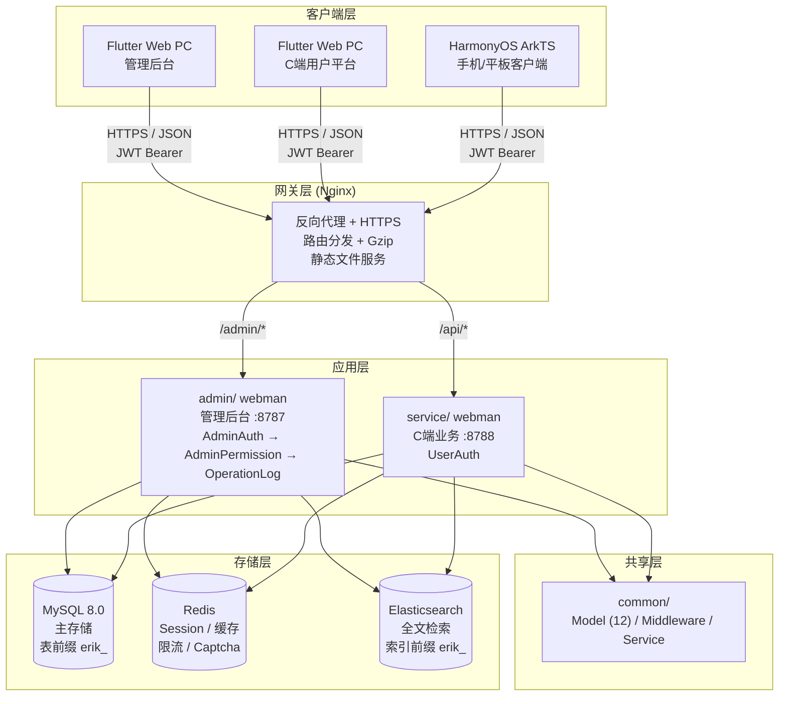
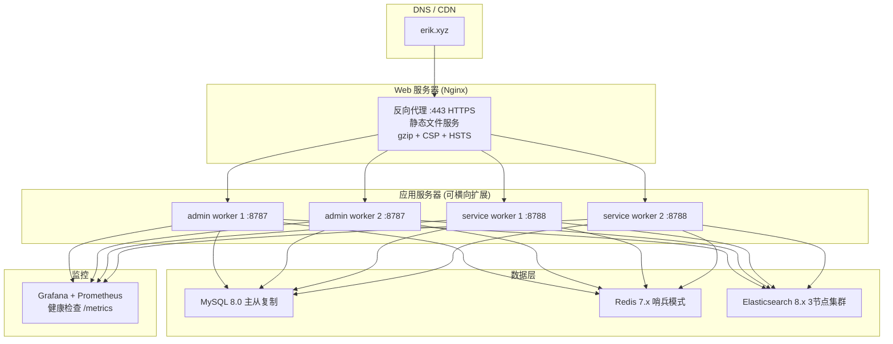

# 架构文档

> Copyright (c) 2026 erik <erik@erik.xyz> — https://erik.xyz

## 1. 系统拓扑



## 2. 模块架构

### 2.1 admin/ — 管理后台

```
路由层: config/route.php
  ↓
中间件链: Cors → SecurityFilter → RateLimit → AdminAuth → AdminPermission → OperationLog
  ↓
控制器层 (14+5 个):
  ┌─────────────────────────────────────────────────────┐
  │ Dashboard / User / Role / Permission / Config / Log │ ← 原有
  │ Profile / Export / Import / Upload / Health / Docs  │ ← 原有
  │ Game / Withdraw / Payment / PlatformUser / Announce │ ← 新增
  └─────────────────────────────────────────────────────┘
  ↓
共享层: common/model/* (Eloquent ORM)
  ↓
存储层: MySQL / Redis / Elasticsearch
```

**职责**：管理员登录、游戏 CRUD、提现审核、C端用户管理、支付方式管理、公告管理、数据导出、仪表盘

### 2.2 service/ — C端业务端

```
路由层: config/route.php
  ↓
中间件链: Cors → SecurityFilter → RateLimit → ApiVersion → [UserAuth]
  ↓
控制器层 (9 个):
  ┌──────────────────────────────────────────────────────┐
  │ Auth / Wallet / Deposit / Exchange / Withdraw        │
  │ Game / User / Announcement / Captcha                  │
  └──────────────────────────────────────────────────────┘
  ↓
共享层: common/model/* (Eloquent ORM)
  ↓
存储层: MySQL / Redis / Elasticsearch
```

**职责**：用户注册登录、钱包管理、充值下单、平台币⇄游戏币兑换、提现申请、游戏列表/详情/启动、公告浏览

### 2.3 common/ — 共享层

```
common/
├── model/
│   ├── (25个数据模型: User/UserWallet/Game/DepositOrder/WithdrawOrder...)
├── middleware/
│   └── UserAuth.php          # C端 JWT 认证中间件
└── service/
    ├── TranslationService.php # 国际化翻译
    ├── RiskService.php       # 风控引擎
    ├── LeaderboardService.php # 排行榜计算
    └── NotificationService.php # 通知发送
```

**设计原则**：
- Model 与数据表一一对应，定义 casts（加密/类型）和 relations（关联关系）
- admin/ 和 service/ 通过 PSR-4 autoload 引用，无需代码复制
- 新增 Model 统一放在 common/ 下，两个应用同步可用

## 3. 中间件执行链

### admin/（管理后台）

```
请求 → Cors (跨域)
     → SecurityFilter (方法白名单+攻击检测→405/403)
     → RateLimit (Redis 滑动窗口限流→429)
     → AdminAuth (JWT 认证→401)
     → AdminPermission (RBAC 鉴权, Redis 60s 缓存→403)
     → OperationLog (操作日志自动记录)
     → Controller → 响应
```

### service/（C端业务端）

```
请求 → Cors (跨域)
     → SecurityFilter (方法白名单+攻击检测→405/403)
     → RateLimit (Redis 滑动窗口限流→429)
     → LanguageMiddleware (检测语言→设置 locale)
     → ApiVersion (API-Version 头校验→400)
     → [UserAuth] (JWT 认证→401, 仅需认证的接口)
     → Controller → 响应
```

## 4. 核心数据流

### 4.1 充值流程

```
用户 → POST /api/deposit/create → 生成订单 (status=pending)
     → 跳转第三方支付 (Stripe/PayPal)
     → 支付成功 → 第三方回调 /api/payment/callback
     → 验证签名 → 更新订单 (status=confirmed)
     → UserWallet::addBalance() → 平台币到账
     → 记录 Transaction (type=deposit)
```

### 4.2 兑换流程

```
用户 → POST /api/exchange/quote → 询价（试算汇率+手续费）
     → 确认 → POST /api/exchange/buy(或sell)
     → DB::beginTransaction()
     ├─ 扣减源币种 (UserWallet::deductBalance 或 deductGameBalance)
     ├─ 增加目标币种 (addBalance 或 addGameBalance)
     ├─ 记录 ExchangeRecord
     ├─ 记录 Transaction
     └─ DB::commit()（任何步骤失败 → rollBack）
```

### 4.3 提现流程

```
用户 → POST /api/withdraw/apply
     → 检查全局开关 (PlatformConfig::get)
     → 检查限额 (min_amount / daily_limit)
     → 检查余额
     → 扣减余额
     → 金额 < 阈值 → status=approved (自动)
     → 金额 >= 阈值 → status=pending (人工审核)
     → 记录 Transaction

管理员 → PUT /admin/withdraw/review
       → approve: 标记完成 (基础版手动打款)
       → reject: 退回平台币 + 记录退款流水
```

## 5. 数据库 ER 关系

```
erik_user ──┬── 1:1 ── erik_user_wallet
            ├── 1:N ── erik_user_game_wallet
            ├── 1:N ── erik_deposit_order
            ├── 1:N ── erik_withdraw_order
            │             └── reviewer_id → erik_admin_user
            ├── 1:N ── erik_exchange_record
            └── 1:N ── erik_transaction

erik_game ──┬── 1:N ── erik_game_currency
            ├── 1:N ── erik_user_game_wallet
            └── 1:N ── erik_exchange_record

erik_game_currency ── 1:N ── erik_exchange_record
erik_payment_method ── 1:N ── erik_deposit_order
```

## 6. 部署架构

### 开发环境

```
单机部署:
  admin/    :8787 (webman, 32 workers)
  service/  :8788 (webman, 32 workers)
  MySQL     :3306
  Redis     :6379
```

### 生产环境



## 7. API 文档

使用 `hg/apidoc` 注解自动生成交互式 API 文档：

| 文档 | 地址 | 控制器 | 分组 | 端点 |
|------|------|--------|------|------|
| 管理后台 | :8787/apidoc/ | 25 | 25 组 | 79 |
| C端业务 | :8788/apidoc/ | 21 | 16 组 | 50 |

密码：admin123

## 8. 端口分配

| 服务 | 端口 | 说明 |
|------|------|------|
| admin/ | 8787 | 管理后台 API + hg/apidoc 文档 |
| service/ | 8788 | C端业务 API + hg/apidoc 文档 |
| MySQL | 3306 | 主数据库 |
| Redis | 6379 | 缓存/限流 |
| Elasticsearch | 9200 | 全文检索 |
