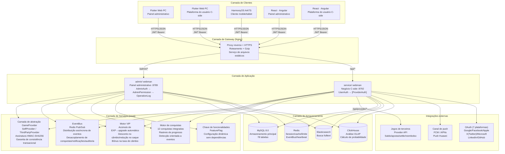
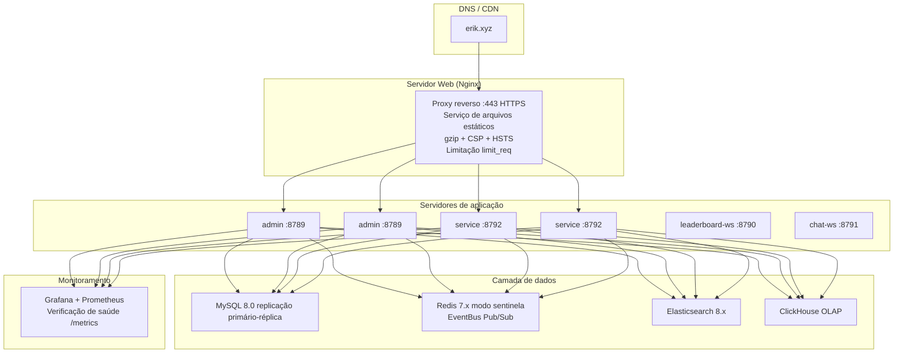

# Documento de arquitetura
<!-- lang-nav -->

Languages: [中文](ARCHITECTURE.md) · [English](ARCHITECTURE.en.md) · [한국어](ARCHITECTURE.ko.md) · [Русский](ARCHITECTURE.ru.md) · [Deutsch](ARCHITECTURE.de.md) · [Français](ARCHITECTURE.fr.md) · [Español](ARCHITECTURE.es.md) · **Português** · [हिन्दी](ARCHITECTURE.hi.md) · [العربية](ARCHITECTURE.ar.md) · [বাংলা](ARCHITECTURE.bn.md) · [Bahasa Indonesia](ARCHITECTURE.id.md) · [日本語](ARCHITECTURE.ja.md)


> Copyright (c) 2026 erik <erik@erik.xyz> — https://erik.xyz

## 1. Topologia do sistema



## 2. Arquitetura de módulos

### 2.1 admin/ — Painel administrativo

```
Camada de rotas: config/route.php
  ↓
Cadeia de middlewares: Cors → SecurityFilter → RateLimit → AdminAuth → AdminPermission → OperationLog
  ↓
Camada de controllers (45):
  ┌──────────────────────────────────────────────────────────┐
  │ Dashboard / User / Role / Permission / Config / Log      │ ← original
  │ Profile / Export / Import / Upload / Health / Docs       │ ← original
  │ Game / Withdraw / Payment / PlatformUser / Announce      │ ← original
  │ Analytics / GameCategory / GameServer / Identity         │ ← original
  │ CountryConfig / Coupon / Leaderboard / Metrics           │ ← original
  │ Ticket / Search                                          │ ← novo
  └──────────────────────────────────────────────────────────┘
  ↓
Camada de serviços: VIP / Achievement / EventBus / FeatureFlag / Risk / Notification
  ↓
Camada de Provider: GameProvider → SelfProvider / ThirdPartyProvider
  ↓
Camada de armazenamento: MySQL / Redis / Elasticsearch / ClickHouse
```

### 2.2 service/ — Serviço C-side

```
Camada de rotas: config/route.php
  ↓
Cadeia de middlewares: TraceId → Cors → SecurityFilter → RateLimit → Language → [UserAuth | ProviderAuth | SdkSessionAuth]
  ↓
Camada de controllers (34):
  ┌──────────────────────────────────────────────────────────┐
  │ Auth / Wallet / Deposit / Exchange / Withdraw            │ ← original
  │ Game / User / Announcement / Captcha                     │ ← original
  │ OAuth / Identity / Payment / GamePlayLog                 │ ← original
  │ Leaderboard / Notification / Referral / TwoFactor        │ ← original
  │ Country / Language / Coupon / Search                     │ ← original
  │ Provider / Ticket / Verification                         │ ← novo
  └──────────────────────────────────────────────────────────┘
  ↓
Camada de serviços: VIP / Achievement / EventBus / FeatureFlag / Risk
  ↓
Camada de Provider: GameProvider → SelfProvider / ThirdPartyProvider
  ↓
Camada de armazenamento: MySQL / Redis / Elasticsearch / ClickHouse
```

### 2.3 Camada de Provider — Abstração de integração de jogos

```
provider/
├── GameProvider.php          # Classe base abstrata — interface unificada
│   ├── getBalance()          # Consultar saldo
│   ├── bet()                 # Apostar
│   ├── settle()              # Liquidar
│   ├── refund()              # Reembolsar
│   ├── rollback()            # Rollback
│   ├── verifySignature()     # Verificar assinatura do callback
│   └── signRequest()         # Gerar assinatura da requisição (HMAC-SHA256)
├── SelfProvider.php          # Jogos próprios — consistência por transação DB
├── ThirdPartyProvider.php    # Jogos de terceiros — HTTP API + assinatura
└── ProviderFactory.php       # Fábrica — match(game.type)
```

### 2.4 EventBus — Barramento de eventos

```
Publicação de eventos:
  DepositController → EventBus::emit('deposit.completed', $payload)
  ExchangeController → EventBus::emit('exchange.completed', $payload)
  GameController → EventBus::emit('game.played', $payload)
  ReferralController → EventBus::emit('referral.applied', $payload)

Redis Pub/Sub (canal: platform:events):
  ↓
Assinantes:
  AchievementService  — detecta progresso de conquistas
  VipService          — acumula pontos de experiência
  NotificationService — envia notificações
  WebhookController   — entrega webhooks externos

> Nota: até 2026-08-18, `emit()` tem chamadores mas `subscribe()` não tem nenhum processo registrado (P0-4 não feito); os eventos hoje são apenas publicados, sem consumo; os assinantes são metas de design.
```

### 2.5 Garantia de estabilidade — disjuntor / nova tentativa / degradação

```
packages/platform-common/src/
├── CircuitBreaker.php   # 熔断 — Redis 状态 (cb:{key}:failures / opened_at)，阈值 5 / 窗口 30s
│                        #   达阈值抛 CircuitOpenException 快速失败；成功重置计数；半开探测
│                        #   Redis 不可用 fail-open，不影响主流程
└── Retry.php            # 重试 — 指数退避 (200/400/800ms)，仅网络类异常 (ConnectException/超时/cURL 28)
                         #   maxAttempts 上限 5；与熔断共用 isRetryable 判定
```

Interruptor de degradação `feature.provider_mock` (FeatureFlag / PlatformConfig, curto-circuita chamadas de rede reais quando `on`):

| Ponto de entrada | Comportamento com mock=on |
|--------|-------------|
| `PushService::send` | Retorno imediato, nenhuma notificação enviada |
| `PayoutService::execute` | Retorna o lote `mock-{order_no}` e marca o pedido como completed |
| `ThirdPartyProvider::request` | Retorna `['success' => true]` |

Todas as chamadas de rede reais são envolvidas em `Retry::run → CircuitBreaker::call` (Push FCM/APNs/HarmonyOS, pagamentos PayPal, solicitações de Provider de terceiros).

## 3. Cadeias de execução de middlewares

### admin/ (painel administrativo)

```
Requisição → Cors (CORS)
     → SecurityFilter (30+ detectores→405/403)
     → RateLimit (Redis Lua janela deslizante→429)
     → AdminAuth (autenticação JWT→401)
     → AdminPermission (autorização RBAC, cache Redis 60s→403)
     → OperationLog (registro automático de operações)
     → Controller → Resposta
```

### service/ (serviço C-side)

```
APIs comuns:
  Requisição → TraceId → Cors → SecurityFilter → RateLimit → Language
       → [UserAuth] (JWT→401) → Controller → Resposta

Provider API:
  Requisição → Cors → SecurityFilter → RateLimit
       → ProviderAuth (verificação de assinatura HMAC-SHA256, janela 5min→401)
       → ProviderController → Resposta
```

## 4. Fluxos de dados principais

### 4.1 Fluxo de depósito

```
Usuário → POST /api/v1/deposit/create → gerar ordem (status=pending)
     → criar pagamento via GatewayFactory (Stripe Checkout (incl. Alipay/WeChat Pay APM)/fatura NowPayments/cobrança Coinbase) → preencher checkout_url + expires_at(+1h); em caso de falha, cancelar pedido via CAS e tentar novamente
     → redirecionar para pagamento de terceiros (Stripe (incl. Alipay/WeChat Pay)/PayPal/NowPayments[USDT TRC20/ERC20]/Coinbase[USDC/BTC/ETH])
     → pagamento com sucesso → callback /api/v1/payment/callback
     → whitelist do provider (apenas stripe/paypal/nowpayments/coinbase/skrill/neteller/paysafecard/paytm/mercadopago/astropay/paypay/kakaopay/gcash) + verificação de uso indevido entre canais + verificação de assinatura (fail-closed) + timestamp ±300s + conferência de valor com bccomp
     → atualizar ordem (status=confirmed, transacional)
     → UserWallet::addBalance() → crédito de moeda da plataforma
     → EventBus::emit('deposit.completed')
       → VipService::addExp() → acúmulo de EXP → detecção de upgrade VIP
       → AchievementService::check() → atualização de progresso de conquistas
     → registrar Transaction (type=deposit)
```

### 4.2 Fluxo de troca

```
Usuário → POST /api/v1/exchange/quote → cotação
     → VipService::getExchangeDiscount() → aplicar desconto VIP
     → VipService::getRateBonus() → aplicar bônus de câmbio VIP
     → confirmação → POST /api/v1/exchange/buy (ou sell)
     → DB::beginTransaction()
     ├─ debitar moeda de origem (lockForUpdate)
     ├─ creditar moeda de destino
     ├─ registrar ExchangeRecord
     ├─ registrar Transaction
     └─ DB::commit()
     → EventBus::emit('exchange.completed')
       → AchievementService::check()
```

### 4.3 Fluxo de saque

```
Usuário → POST /api/v1/withdraw/apply
     → VipService::getWithdrawFeeDiscount() → aplicar redução de tarifa VIP
     → verificar interruptor global (PlatformConfig)
     → verificar limites (min_amount / daily_limit)
     → verificar saldo → debitar saldo
     → valor<threshold → auto-aprovado
     → valor≥threshold → pending (revisão manual)
     → registrar Transaction

Administrador → PUT /admin/v1/withdraw/review
       → approve: marcar como concluído
       → reject: devolver moeda da plataforma + transação de reembolso
```

### 4.4 Fluxo de interação com o Provider de jogos

```
Servidor do jogo de terceiros:
  POST /api/provider/balance
    X-Game-Id + X-Timestamp + X-Signature (HMAC-SHA256)
    → ProviderAuth verifica assinatura → ProviderFactory::createById()
    → GameProvider::getBalance() → retorna saldo

  POST /api/provider/bet
    → ProviderAuth → GameProvider::bet()
    → SelfProvider: débito por transação DB (SELECT FOR UPDATE)
    → ThirdPartyProvider: encaminhamento HTTP ao provedor do jogo
    → registrar GamePlayLog (action=bet, round_id)

  POST /api/provider/settle
    → ProviderAuth → GameProvider::settle()
    → creditar saldo de moeda de jogo → atualizar GamePlayLog.ended_at

  POST /api/provider/refund
    → ProviderAuth → GameProvider::refund()
    → devolver saldo → registrar log de reembolso
```

### 4.5 Fluxo de upgrade VIP

```
Depósito concluído → VipService::addExp(userId, amount, 'deposit')
         → UserVip.exp += amount, UserVip.total_exp += amount
         → consultar próximo nível VipLevel
         → exp >= required_exp → upgrade: level+1, exp -= required_exp
         → loop até não satisfazer mais as condições de upgrade
         → EventBus::emit('user.vip_upgraded')
```

## 5. Relações ER do banco de dados

```
game_user ──┬── 1:1 ── game_user_wallet
            ├── 1:1 ── game_user_vip ── game_vip_level
            ├── 1:N ── game_user_game_wallet
            ├── 1:N ── game_deposit_order
            ├── 1:N ── game_withdraw_order
            ├── 1:N ── game_exchange_record
            ├── 1:N ── game_transaction
            ├── 1:N ── game_user_achievement ── game_achievement
            ├── 1:N ── game_exp_log
            ├── 1:N ── game_ticket ── game_ticket_reply
            ├── 1:N ── game_device_token
            ├── 1:N ── game_user_session
            └── 1:N ── game_message

game_game ──┬── 1:N ── game_game_currency
            ├── 1:N ── game_user_game_wallet
            ├── 1:N ── game_exchange_record
            └── 1:N ── game_game_play_log

game_friend ── user_id → game_user
             └── friend_id → game_user

game_vip_level ── 1:N ── game_user_vip
game_achievement ── 1:N ── game_user_achievement
```

## 6. Arquitetura de implantação

### 6.1 Ambiente de desenvolvimento

```
Implantação em uma máquina:
  admin/         :8789 (webman, 32 workers)
  service/       :8792 (webman, 32 workers)
  leaderboard-ws :8790 (WebSocket de rankings)
  chat-ws        :8791 (WebSocket de chat)
  MySQL          :3306
  Redis          :6379
```

### 6.2 Docker Compose (7 serviços)

```yaml
nginx (80/443) → admin (8789) + service (8792) + arquivos estáticos
leaderboard-ws (8790/8791) — push em tempo real de rankings via WebSocket + mensagens privadas/chat
mysql (3306) — banco principal, persistência com volume de dados
redis (6379) — cache/rate limit/WebSocket/EventBus
elasticsearch (9200) — busca full-text
```

### 6.3 Ambiente de produção



## 7. Arquitetura de testes

```
tests/                             # 21 arquivos · 200 casos de teste
├── bootstrap.php                  # Bootstrap do PHPUnit
├── AuthControllerRegisterTest.php # 15 testes de força de senha no registro
├── BackendEnhancementTest.php     # 27 testes de criptografia/serviço de IDs
├── CaptchaTest.php                # 5 testes de captcha
├── CdnProbeServiceTest.php        # 5 testes de sondagem de CDN
├── CdnProviderModelTest.php       # 3 testes de modelo de provedor de CDN
├── ClickHouseServiceTest.php      # 16 testes de serviço ClickHouse
├── ConfigDefaultsTest.php         # 4 testes de valores padrão de configuração
├── EncryptionServiceTest.php      # 8 testes de criptografia/descriptografia
├── EnvConfigTest.php              # 6 testes de configuração de ambiente
├── GameControllerTest.php         # 5 testes de controlador de jogo
├── GameRouteTest.php              # 5 testes de rotas de jogo
├── HashidsServiceTest.php         # 6 testes de codificação/decodificação de IDs
├── LeaderboardServiceTest.php     # 4 testes de serviço de placar
├── NotificationServiceTest.php    # 3 testes de serviço de notificação
├── PayoutServiceTest.php          # 9 testes de serviço de pagamento
├── PlatformCommonTest.php         # 6 testes de construtores de consulta comuns
├── PlatformTest.php               # 55 testes de lógica de negócio
├── ReportControllerTest.php       # 5 testes de intervalos de datas de relatórios
├── SnowflakeServiceTest.php       # 5 testes de IDs Snowflake
└── TranslationServiceTest.php     # 8 testes de serviço de tradução
```

## 8. Distribuição de portas

| Serviço | Porta | Observação |
|------|------|------|
| admin/ | 8789 | API do painel administrativo |
| service/ | 8792 | API de negócio C-side |
| leaderboard-ws | 8790 | Rankings em tempo real via WebSocket |
| chat-ws | 8791 | Mensagens privadas/chat via WebSocket |
| MySQL | 3306 | Banco principal |
| Redis | 6379 | Cache/rate limit/WebSocket/EventBus |
| ClickHouse | 8123 | Interface HTTP OLAP |
| Elasticsearch | 9200 | Busca full-text |

## 9. Documentação da API

Documentação interativa de API gerada automaticamente a partir das anotações dos controllers com `erikwang2013/apidoc-php`:

| Documentação | Endereço | Controllers | Endpoints |
|------|------|--------|------|
| Painel administrativo | :8789/apidoc/ | 45 | 154 |
| C-side | :8792/apidoc/ | 34 | 107 |

## 10. Lista de tabelas do banco de dados

### Versão base (12) + admin (7)
game_user, game_user_wallet, game_user_game_wallet,
game_game, game_game_currency, game_deposit_order,
game_withdraw_order, game_exchange_record, game_transaction,
game_payment_method, game_announcement, game_platform_config,
game_admin_user, game_admin_role, game_admin_permission,
game_admin_user_role, game_admin_role_permission, game_operation_log,
game_system_config

### Versão padrão (10)
game_user_identity, game_user_oauth, game_user_payment_account,
game_user_session, game_game_server, game_game_play_log,
game_withdraw_limit, game_risk_rule, game_risk_log,
game_stat_daily

### Versão completa (13)
game_game_category, game_game_category_rel, game_leaderboard,
game_coupon, game_user_coupon, game_language,
game_translation, game_country_config, game_platform_revenue,
game_notification, game_referral, game_referral_reward,
game_user_2fa

### Expansão do ecossistema (14) ← nova
game_ticket, game_ticket_reply, game_device_token,
game_vip_level, game_user_vip, game_exp_log,
game_achievement, game_user_achievement, game_friend,
game_message, game_cdn_provider, game_referral_commission,
game_tournament, game_tournament_entry

### Adições v1.3.15-22 (22 tabelas)
game_event_outbox, game_reconciliation_batch, game_reconciliation_diff,
game_reconciliation_statement, game_device_fingerprint, game_device_account_map,
game_ip_reputation, game_account_account_link, game_activity,
game_activity_participation, game_activity_reward_log, game_anticheat_event,
game_anticheat_daily_stat, game_group, game_group_member,
game_share_link, game_aml_rule, game_aml_hit,
game_kyc_level, game_user_kyc, game_user_trust,
game_risk_cluster

**Total: 78 tabelas**

## 11. Feature flags

Baseado no namespace `feature.*` de `game_platform_config`, zero dependências adicionais:

| Flag | Padrão | Função |
|------|------|------|
| feature.tournament | off | Sistema de torneios |
| feature.chat | off | Mensagens privadas via WebSocket |
| feature.vip | off | Fidelidade VIP |
| feature.achievements | off | Insígnias de conquistas |

```php
use app\service\FeatureFlag;
if (FeatureFlag::isEnabled('vip')) { /* VIP logic */ }
```

---

> **Copyright (c) 2026 erik <erik@erik.xyz> — https://erik.xyz**
