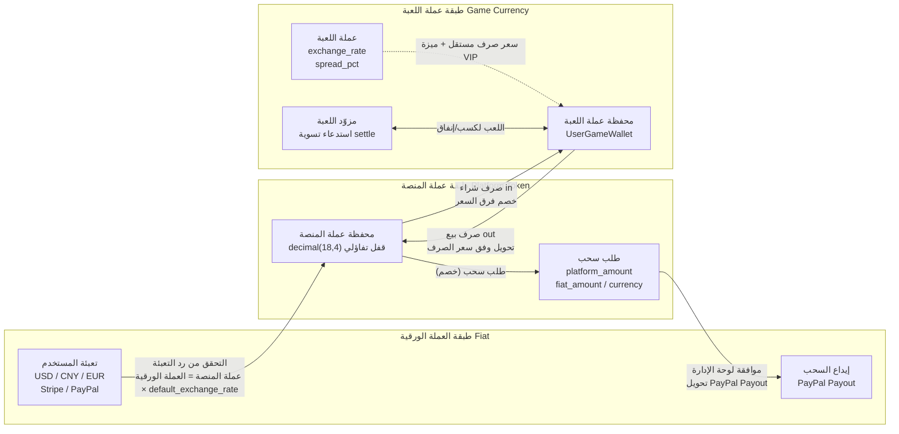
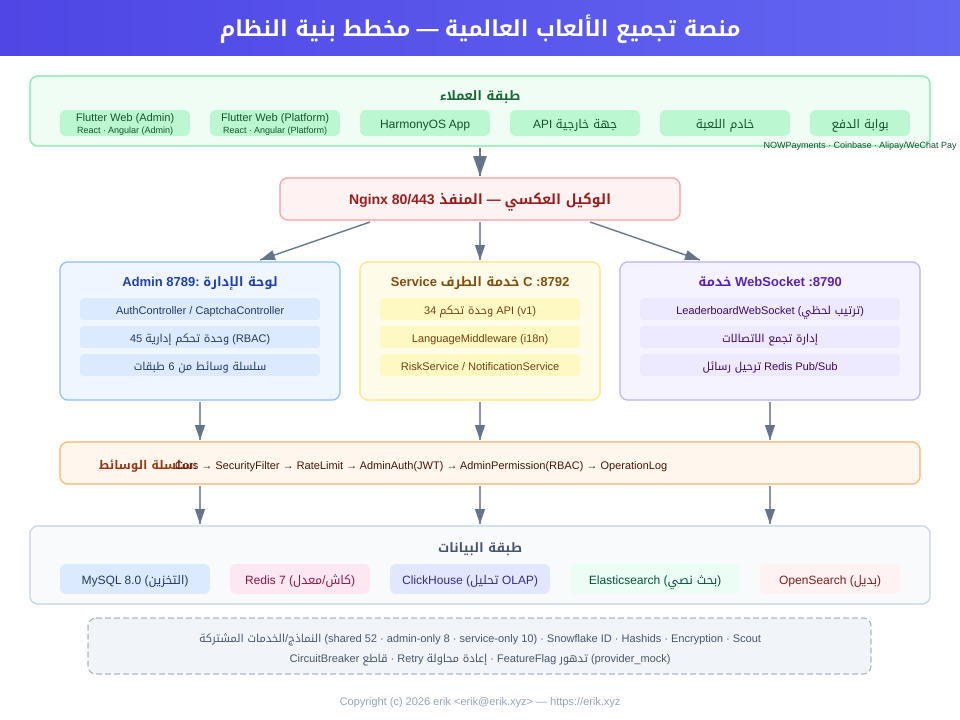
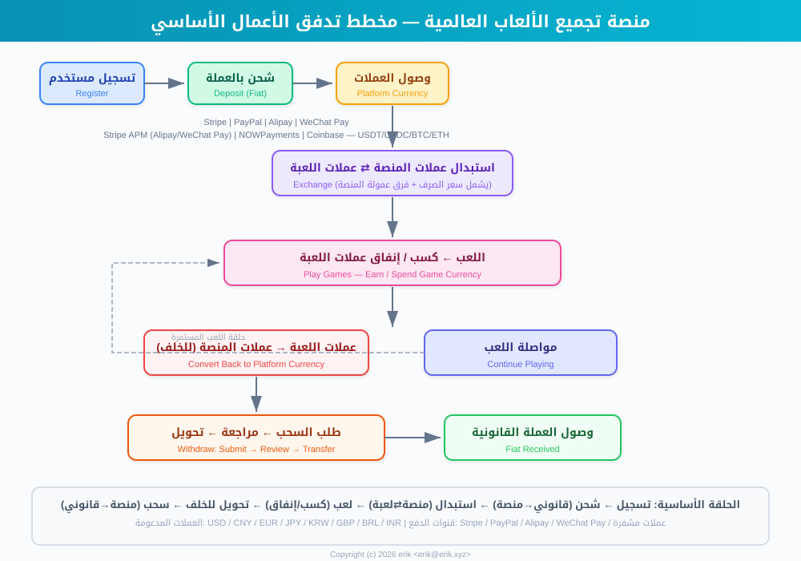
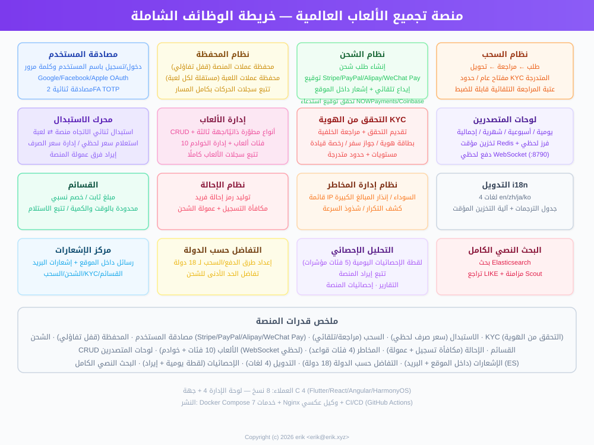
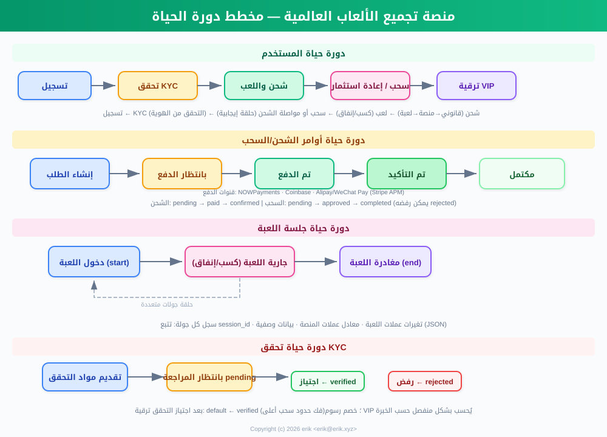
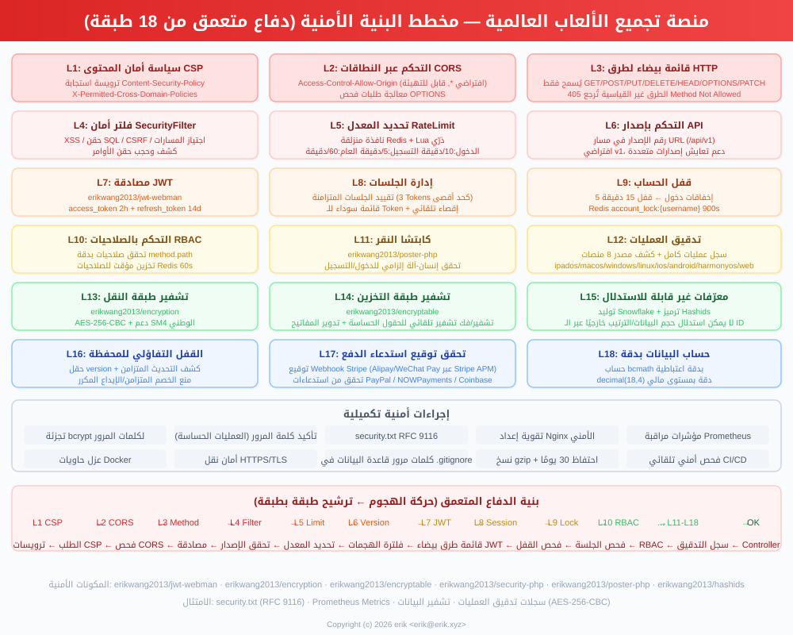
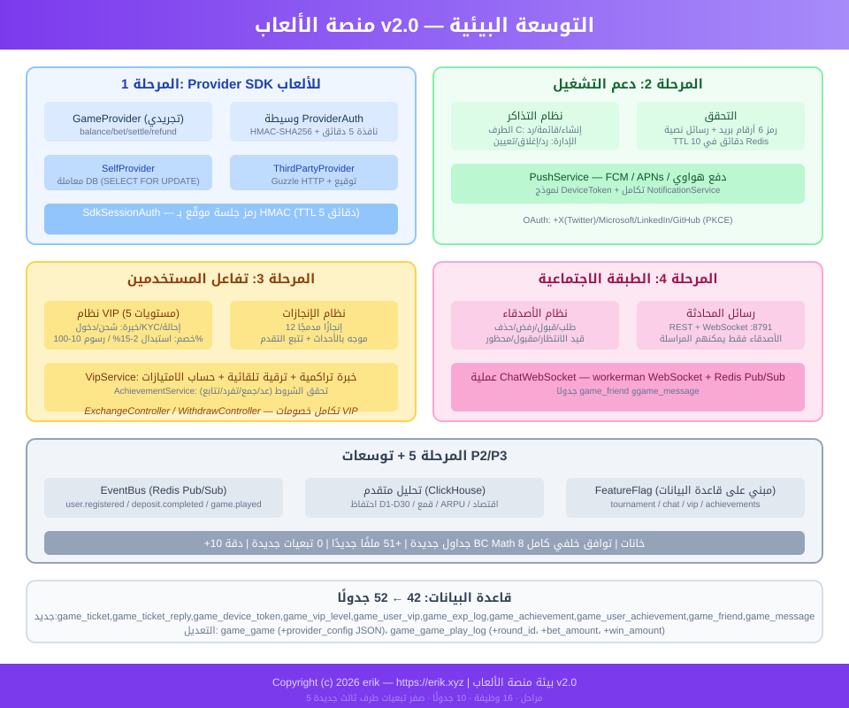

# 全球游戏聚合平台 (Global Game Platform)
<!-- lang-nav -->

Languages: [中文](../../README.md) · [English](README.en.md) · [한국어](README.ko.md) · [Русский](README.ru.md) · [Deutsch](README.de.md) · [Français](README.fr.md) · [Español](README.es.md) · [Português](README.pt.md) · [हिन्दी](README.hi.md) · **العربية** · [বাংলা](README.bn.md) · [Bahasa Indonesia](README.id.md) · [日本語](README.ja.md)


> Copyright (c) 2026 erik <erik@erik.xyz> — https://erik.xyz

منصة ألعاب مجمّعة عالمية موحّدة. يسجّل المستخدم حسابًا في المنصة ثم يعبّئ رصيده لشراء عملة اللعبة، ويستخدمها للعب وكسب المزيد من العملة، ويمكن تحويل عملة اللعبة مجددًا إلى المحفظة وسحبها. توفر الواجهة الخلفية إدارة كاملة للألعاب، ومراجعة السحوبات، وإدارة المستخدمين، وإدارة المدفوعات. تدعم تبديل اللغة (الإنجليزية/الصينية).

## استراتيجية الإصدارات

| الإصدار | الهدف | الحالة |
|------|------|------|
| النسخة الكاملة | الشكل الكامل: لوحات الصدارة، القسائم، تصنيفات الألعاب، تكوينات الدول، بحث ES | مكتمل |
| التوسعة البيئية | v2.0: ربط مزوّدي الألعاب، تذاكر الدعم، VIP، الإنجازات، التواصل الاجتماعي، ناقل الأحداث | مكتمل |

## حزمة التقنيات

### الواجهة الخلفية
- PHP 8.3+، webman v2 (workerman/webman)
- MySQL 8.0+ (بادئة الجداول `game_`، مفاتيح أساسية BIGINT غير متزايدة ذاتيًا)
- Redis (الجلسات / التخزين المؤقت / الحد من المعدل)
- ClickHouse (تحليلات OLAP / الحساب الاحتمالي)
- Elasticsearch (البحث النصي الكامل)
- مصادقة JWT + تحكم بالصلاحيات RBAC
- تشفير البيانات: AES-256-CBC على طبقة نقل API + AES-128-ECB على طبقة تخزين قاعدة البيانات

### الواجهة الأمامية
- Flutter 3.x (نمط PC للويب)
- HarmonyOS ArkTS (الهاتف المحمول)
- تخطيط متجاوب (هاتف / لوحي / مكتبي)
- التدويل (i18n): تبديل الإنجليزية / الصينية المبسطة

### المكونات الأساسية
- `erikwang2013/snowflake-php` — توليد معرفات BIGINT فريدة عالميًا
- `erikwang2013/hashids` — تشفير/فك تشفير المعرفات على طبقة API
- `erikwang2013/jwt-webman` — مصادقة JWT
- `erikwang2013/encryption` — تشفير/فك تشفير بيانات API الحساسة
- `erikwang2013/encryptable` — تشفير/فك تشفير الحقول الحساسة في قاعدة البيانات
- `erikwang2013/webman-scout` — مزامنة واستعلام Elasticsearch
- `erikwang2013/season` — أعلام الدول
- `erikwang2013/security-php` — كشف أدوات الأمان
- `erikwang2013/poster-php` — تحقق عشوائي للعمليات الحساسة
- `erikwang2013/clickhouse-php` — الاتصال بـ ClickHouse والحسابات الاحتمالية

## بنية المشروع

```
game-platform-php/
├── admin/                     # لوحة الإدارة (webman v2, المنفذ 8787)
│   ├── app/admin/controller/  #   وحدات تحكم لوحة الإدارة
│   ├── app/middleware/        #   الوسيطات (Cors/Security/RateLimit/Auth/ProviderAuth)
│   ├── app/provider/          #   طبقة مزوّدي الألعاب
│   ├── app/event/             #   ناقل الأحداث (EventBus Redis Pub/Sub) (Cors/Security/RateLimit/Auth/Permission/ProviderAuth)
│   ├── app/provider/          #   طبقة مزوّدي الألعاب (Self/ThirdParty/Factory)
│   ├── app/middleware/        #   الوسيطات (Cors/Security/RateLimit/Auth/ProviderAuth)
│   ├── app/provider/          #   طبقة مزوّدي الألعاب
│   ├── app/event/             #   ناقل الأحداث (EventBus Redis Pub/Sub) (Cors/Security/RateLimit/Auth/Permission)
│   ├── config/                #   ملفات التكوين
│   ├── install/   #   ملفات ترحيل SQL
│   └── apps/flutter/          #   لوحة إدارة Flutter Web PC
│
├── service/                   # طرف C للأعمال (webman v2, المنفذ 8788)
│   ├── app/api/v1/controller/ #   وحدات تحكم API للطرف C
│   ├── app/middleware/        #   الوسيطات (Cors/Security/RateLimit/Auth/ProviderAuth)
│   ├── app/provider/          #   طبقة مزوّدي الألعاب
│   ├── app/event/             #   ناقل الأحداث (EventBus Redis Pub/Sub)
│   └── config/                #   ملفات التكوين
│
├── install/                   # معالج التثبيت بخطوة واحدة
│   ├── index.php              #   نقطة دخول التثبيت
│   ├── Installer.php          #   المنطق الأساسي للتثبيت
│   ├── install.sql            #   SQL التثبيت المدمج (43 جدولًا + بيانات أولية)
│   └── assets/                #   الموارد الثابتة
│
├── admin/common/ و service/common/   # نسخة من الخدمات المشتركة لكل طرف (DepositLogService وغيرها، بانتظار استخراج طبقة مشتركة)
│   └── service/               #   الخدمات المشتركة (بما فيها الحساب الاحتمالي ClickHouse)
│
├── apps/
│   └── flutter/platform/      # منصة مستخدمي طرف C على Flutter Web PC
│
├── docs/                      # وثائق المشروع
│   ├── ARCHITECTURE.md        #   وثيقة البنية
│   ├── ARCHITECTURE-DESIGN.md #   وثيقة التصميم المعماري
│   ├── FEATURES.md            #   وثيقة الميزات
│   ├── FEATURE-DESIGN.md      #   وثيقة تصميم الميزات
│   └── API.md                 #   وثيقة الواجهات
│
└── admin/docs/superpowers/    # معايير التطوير والخطط
    ├── specs/                 #   مواصفات التصميم
    └── plans/                 #   خطط التنفيذ
```

## البدء السريع

### المتطلبات البيئية
- PHP 8.1+
- MySQL 8.0+
- Redis 6.0+
- Composer 2.x
- Flutter SDK 3.x (الواجهة الأمامية، اختياري)

### الطريقة الأولى: معالج التثبيت بخطوة واحدة (موصى به)

```bash
# 1. تشغيل معالج التثبيت
php -S 0.0.0.0:8888 -t install/

# 2. فتح http://localhost:8888 في المتصفح
#    إكمال الخطوات وفق المعالج: فحص البيئة ← تكوين قاعدة البيانات ← إعداد حساب المدير ← التثبيت التلقائي

# 3. تثبيت التبعيات
cd admin && composer install && cd ..
cd service && composer install && cd ..

# 4. تشغيل الخدمات
cd admin && php start.php start -d && cd ..
cd service && php start.php start -d && cd ..

# 5. الوصول إلى لوحة الإدارة: http://localhost:8787
#    تسجيل الدخول باسم مستخدم وكلمة مرور المدير المُعيّنين أثناء التثبيت

# 6. حذف دليل التثبيت بعد اكتماله (للأمان)
rm -rf install/
```

يقوم معالج التثبيت تلقائيًا بما يلي:
- فحص البيئة (إصدار PHP، الامتدادات، أذونات الدلائل)
- إنشاء قاعدة البيانات والجداول (SQL مدمج، 43 جدولًا + بيانات أولية)
- إنشاء حساب المدير الفائق (مشفّر بـ bcrypt)
- توليد مفاتيح JWT/التشفير تلقائيًا وكتابتها في ملف .env
- إنشاء install.lock لمنع إعادة التثبيت

### الطريقة الثانية: التثبيت اليدوي

<details>
<summary>عرض خطوات التثبيت اليدوي</summary>

#### 1. تهيئة قاعدة البيانات

```bash
# استيراد SQL المدمج بخطوة واحدة
mysql -u root -e "CREATE DATABASE IF NOT EXISTS game-platform CHARACTER SET utf8mb4 COLLATE utf8mb4_unicode_ci;"
mysql -u root game-platform < install/install.sql
```

#### 2. تكوين متغيرات البيئة

```bash
# لوحة الإدارة
cd admin
cp .env.example .env
# تعديل معلومات اتصال قاعدة البيانات والمفاتيح في .env

# طرف C للأعمال
cd ../service
cp .env.example .env
# تعديل معلومات اتصال قاعدة البيانات والمفاتيح في .env
```

#### 3. تشغيل الواجهة الخلفية

```bash
cd admin && composer install && php start.php start -d
cd ../service && composer install && php start.php start -d
```

#### 4. إنشاء المدير

يلزم إدراج حساب المدير يدويًا في قاعدة البيانات (كلمة المرور مشفّرة بـ bcrypt).

</details>

### تشغيل الواجهة الأمامية (اختياري)

```bash
# لوحة الإدارة (Flutter Web PC)
cd admin/apps/flutter
flutter pub get
flutter run -d chrome

# منصة مستخدمي الطرف C (Flutter Web PC)
cd apps/flutter/platform
flutter pub get
flutter run -d chrome
```

### التحقق

```bash
# اختبار لوحة الإدارة
curl http://localhost:8787/health

# اختبار طرف C للأعمال
curl http://localhost:8788/health

# اختبار تسجيل المستخدم
curl -X POST http://localhost:8788/api/auth/register \
  -H "Content-Type: application/json" \
  -d '{"username":"testuser","password":"123456"}'
```

## ميزات الأمان

- **18 طبقة دفاع متعمق**: كشف واعتراض XSS/حقن SQL/CSRF/اجتياز المسار/حقن الأوامر
- **قائمة بيضاء لطرق HTTP**: يُسمح فقط بـ GET/POST/PUT/DELETE/OPTIONS/HEAD
- **مصادقة JWT**: access_token لمدة ساعتين + refresh_token لمدة 14 يومًا، مع تقييد الجلسات المتزامنة
- **التحقق من مفاتيح JWT عند الإقلاع**: مفتاح `ADMIN_JWT_SECRET_KEY` مستقل في طرف admin ومفتاح `SERVICE_JWT_SECRET_KEY` مستقل في طرف service؛ يُرفض الإقلاع عند غياب المفتاح أو بقائه على القيمة الافتراضية
- **إغلاق آمن لاستدعاءات الدفع (fail-closed)**: قائمة بيضاء للمزوّدين (stripe/paypal فقط) + رفض أي مفتاح غير مُهيّأ أو فشل التحقق من التوقيع أو تجاوز حد الطابع الزمني + مطابقة المبالغ عبر bccomp + إيداع المعاملات ذرّيًا في قاعدة البيانات
- **صلاحيات RBAC**: تحكم بالصلاحيات على مستوى method.path، مع تخزين مؤقت في Redis لمدة 60 ثانية
- **رمز تحقق بالنقر**: تحقق إلزامي من أن المستخدم بشري عند تسجيل الدخول/التسجيل
- **تأكيد كلمة المرور ثانويًا**: العمليات الحساسة تتطلب إدخال كلمة المرور للتأكيد
- **تشفير البيانات**: AES-256-CBC على طبقة النقل + AES-128-ECB على طبقة التخزين
- **تشفير المعرّفات**: توليد عبر Snowflake + ترميز Hashids، لا يمكن استنتاجها عكسيًا خارجيًا
- **قفل تفاؤلي للمحفظة**: يمنع الخصم المتزامن / الإيداع المكرر
- **تدقيق العمليات**: سجل كامل للعمليات، مع كشف تلقائي لـ 8 منصات مصدر
- **الحد من المعدل**: نافذة منزلقة في Redis، ذرّية عبر Lua
- **ترويسة CSP**: Content-Security-Policy لمنع XSS
- **أمان الحساب**: قفل لمدة 15 دقيقة بعد 5 محاولات تسجيل دخول فاشلة متتالية

## الاختبارات

```bash
cd admin
phpunit --bootstrap tests/bootstrap.php tests/
```

- PHPUnit 12.x، 116 حالة اختبار
- 56 اختبارًا لمنطق الأعمال (PlatformTest) + 60 اختبارًا للبنية التحتية
- تغطية: دقة bcmath، حسابات الصرف، رسوم السحب، الحدود، إدارة المخاطر، القسائم، KYC، i18n

## نظرة عامة على قدرات المنصة

| القدرة | الوصف |
|------|------|
| مصادقة المستخدم | اسم المستخدم وكلمة المرور + OAuth عبر 7 منصات (Google/Facebook/Apple/X(Twitter)/Microsoft/LinkedIn/GitHub) + 2FA TOTP |
| المحفظة | محفظة عملة المنصة (قفل تفاؤلي) + محفظة عملة اللعبة + سجل الحركات |
| التعبئة | إنشاء الطلب + التحقق من توقيع رد Stripe/PayPal + الإيداع التلقائي |
| الصرف | عملة المنصة ⇄ عملة اللعبة، تسعير فوري، أرباح فرق السعر |
| السحب | تقديم طلب ← مراجعة ← تحويل، مفتاح عام، حدود KYC المتدرجة + رسوم |
| KYC | تقديم التحقق من الهوية + المراجعة، نظام تحقق ثلاثي المستويات |
| الألعاب | CRUD + التصنيفات (10 فئات) + الخوادم + تتبع سجلات اللعب |
| البحث | بحث نصي كامل عبر Elasticsearch (مع التراجع إلى LIKE) |
| لوحة الصدارة | يومية/أسبوعية/شهرية/إجمالية، تخزين مؤقت في Redis، دفع فوري عبر WebSocket (8789) |
| القسائم | مبلغ ثابت + خصم نسبي، محدودة بالوقت والكمية، تتبع الاكتساب والاستخدام |
| الإشعارات | رسائل داخلية + بريد إلكتروني، إشعارات تلقائية للتعبئة/السحب/KYC/القسائم |
| الإحالات | رموز إحالة، مكافآت التسجيل، عمولة على التعبئة |
| إدارة المخاطر | قائمة سوداء للـ IP / تنبيهات المبالغ الكبيرة / كشف التكرار / السرعة |
| التدويل | 4 لغات (en-US/zh-CN/ja-JP/ko-KR)، جدول ترجمة + تخزين مؤقت |
| تكوين الدول | طرق دفع/سحب متمايزة لـ 8 دول، حد أدنى للتعبئة |
| الإحصاءات | لقطات إحصائية يومية (5 مؤشرات) + تتبع إيرادات المنصة |
| رمز التحقق | تحقق بشري بالنقر (poster-php) |
| ربط الألعاب | Provider SDK (Self+ThirdParty) + توقيع HMAC-SHA256 + بوابة الاستدعاءات |
| تذاكر الدعم | إنشاء/رد من الطرف C + معالجة/تعيين/إغلاق من لوحة الإدارة |
| VIP | 5 مستويات ولاء، تراكم نقاط الخبرة، خصم صرف / تخفيض سحب / زيادة سعر صرف |
| الإنجازات | 12 إنجازًا مدمجًا، كشف مدفوع بالأحداث، تتبع التقدم |
| التواصل الاجتماعي | نظام أصدقاء + رسائل خاصة فورية عبر WebSocket (المنفذ 8791)، إرسال للأصدقاء فقط |
| البطولات | نظام بطولات (مفتاح FeatureFlag) + لوحة صدارة + حد أقصى للعدد |
| العمولة | توزيع أرباح الإحالة بمستويين (معدلات عمولة قابلة للتكوين) |
| القسائم | قيود مشروطة (min_deposit/first_user/game_id) |
| الأحداث | ناقل أحداث Redis Pub/Sub + تسليم اشتراكات Webhook (7 أنواع أحداث) |
| النشر | تنظيم Docker Compose لـ 8 خدمات + وكيل عكسي Nginx |
| العملاء | Flutter Admin (15 صفحة) + Platform (10 صفحات) + HarmonyOS (5 صفحات) |

## نموذج الأعمال

```
العملة الورقية (USD/CNY/EUR...)
  │  التعبئة (Stripe/PayPal/Alipay/WeChat Pay)
  ▼
عملة المنصة (موحدة، الدقة decimal(18,4))
  │  الصرف (بما فيه سعر الصرف + فرق سعر المنصة)
  ▼
عملة اللعبة (مستقلة لكل لعبة، سعر صرف مستقل)
  │  كسب/إنفاق عبر اللعب
  ▼
عملة المنصة ← الصرف العكسي ← السحب (مراجعة/تلقائي)
```

## التسوية متعددة العملات

تعتمد المنصة نظام تسوية بعزل ثلاثي الطبقات «العملة الورقية ← عملة المنصة ← عملة اللعبة»: تدعم التعبئة بعملات ورقية متعددة USD/CNY/EUR، ولكل لعبة عملة تسعير مستقلة؛ وتُستخدم حسابات bcmath عالية الدقة في جميع حسابات المبالغ لاستبعاد أخطاء الفاصلة العائمة.

### نموذج العملات الثلاثي الطبقات

| الطبقة | العملة | الوصف |
|------|------|------|
| طبقة العملة الورقية | USD / CNY / EUR | العملة الفعلية لدفع التعبئة/السحب، تُعالَج عبر Stripe / PayPal |
| طبقة عملة المنصة | عملة المنصة (موحدة عبر المنصة) | عملة التسوية الداخلية الموحدة (decimal(18,4))، مع قفل تفاؤلي للمحفظة يمنع الخصم المتزامن/الإيداع المكرر |
| طبقة عملة اللعبة | عملة مستقلة لكل لعبة | لكل لعبة `exchange_rate` مستقل و`spread_pct` خاص، مع محفظة عملة لعبة مستقلة |

### مسارات التسوية

- **تسوية التعبئة**: يدفع المستخدم بالعملة الورقية (التحقق من توقيع رد Stripe / PayPal مع منع التكرار ذرّيًا) ← التحويل إلى عملة المنصة وفق `default_exchange_rate`، ويسجّل طلب التعبئة `amount + currency + platform_amount` في آنٍ واحد
- **تسوية الصرف**: عملة المنصة ⇄ عملة اللعبة بأسعار صرف عملة اللعبة في تسعير فوري (quote)، مع خصم فرق `spread_pct` كإيراد فرق سعر للمنصة، ويتمتع VIP بخصم صرف وزيادة سعر صرف
- **تسوية اللعب**: يزيد/يخفض مزوّد اللعبة عملة اللاعب عبر استدعاء `/api/provider/settle` (توقيع HMAC-SHA256)، مع تسوية تلقائية عند انتهاء مهلة جلسة اللعب
- **تسوية السحب**: خصم عملة المنصة ← إنشاء طلب سحب (تسجيل `platform_amount / fiat_amount / currency`) ← موافقة لوحة الإدارة ← تحويل PayPal Payout ← مزامنة الحالة حتى الاكتمال

### مخطط التدفق



## مخطط البنية



## العمليات الأساسية



## النطاق الكامل للميزات



## دورة الحياة



## البنية الأمنية



## التوسعة البيئية (v2.0)



## فهرس الوثائق

| الوثيقة | الوصف |
|------|------|
| [مقارنة الإصدارات](../VERSIONS.ar.md) | مقارنة ميزات الإصدار الأساسي/القياسي/الكامل |
| [وثيقة التصميم المعماري](../ARCHITECTURE-DESIGN.ar.md) | أسباب الاختيار المعماري وقرارات التصميم |
| [وثيقة البنية](../ARCHITECTURE.ar.md) | طوبولوجيا النظام، بنية الوحدات، تدفق البيانات |
| [وثيقة تصميم الميزات](../FEATURE-DESIGN.ar.md) | نماذج الأعمال، مواصفات الميزات، تصميم العمليات |
| [وثيقة الميزات](../FEATURES.ar.md) | قائمة الميزات، أوصاف الوحدات، رحلة المستخدم |
| [وثيقة الواجهات](../API.ar.md) | مرجع API الكامل (102 واجهة) |
| [الوثائق التفاعلية](http://localhost:8788/apidoc/) | وثائق hg/apidoc التفاعلية (الطرف C) |
| [الوثائق التفاعلية](http://localhost:8787/apidoc/) | وثائق hg/apidoc التفاعلية (لوحة الإدارة) |
| [تثبيت ClickHouse](../CLICKHOUSE_INSTALL.ar.md) | تثبيت/تكوين/ترحيل/تحقق ClickHouse |
| [وثيقة دمج Provider SDK](../PROVIDER-SDK.ar.md) | دليل دمج ألعاب الطرف الثالث (خوارزمية التوقيع + أمثلة PHP/Go/Python) |
| [استخدام ClickHouse](../CLICKHOUSE_USAGE.ar.md) | 4 واجهات خدمة ClickHouse ولوحات الخلفية |
| [وثيقة النشر](../DEPLOYMENT.ar.md) | دليل النشر (Docker + يدوي + Nginx + مراقبة) |
| [مواصفات التصميم](../../admin/docs/superpowers/specs/2026-05-22-game-platform-design.ar.md) | المواصفات الكاملة للتصميم |
| [خطة التنفيذ](../../admin/docs/superpowers/plans/2026-05-22-game-platform-plan.ar.md) | خطة تنفيذ مفصلة |

---

## دعم المشروع

إذا كان هذا المشروع مفيدًا لك، فلا تتردد في دعوة المؤلف لتناول فنجان قهوة ☕

<p align="center">
  <table align="center" border="0" cellspacing="0" cellpadding="0">
    <tr>
      <td align="center" width="200">
        <br>
        <b>WeChat Pay</b>
      </td>
      <td align="center" width="200">
        <br>
        <b>Alipay</b>
      </td>
    </tr>
  </table>
</p>

### التحويل البنكي العالمي (Global Bank Transfer)

**معلومات المستلم (Recipient)**

| البند | المحتوى |
|----|------|
| اسم المستلم (Beneficiary Name) | WANG KEXUN |
| رقم الحساب (Account Number) | 881015918251 |

**البنك المستلم (Beneficiary Bank)**

| البند | المحتوى |
|----|------|
| SWIFT Code | AABLHKHHXXX |
| اسم البنك (Bank Name) | ZA Bank Limited |
| رمز البنك (Bank Code) | 387 |
| عنوان البنك (Bank Address) | Core F, Cyberport 3, 100 Cyberport Road, Hong Kong |

**البنك الوسيط للتحويلات العابرة للحدود (Correspondent Bank، إذا لزم الأمر)**

> يرجى الانتباه: هذه معلومات البنك الوسيط (المحوّل) للتحويلات العابرة للحدود، وليست معلومات البنك المستلم. يُرجى سؤال البنك المُرسِل عما إذا كان مطلوبًا تقديم معلومات البنك الوسيط للتحويلات العابرة للحدود.

- **البنك الوسيط لإيداعات الدولار الهونغ كونغي واليوان والدولار الأمريكي هو Citibank:**
  - اسم البنك: Citibank N.A. Hong Kong
  - SWIFT Code: CITIHKHXXXX
  - رمز البنك: 006
  - اسم الفرع: Hong Kong Branch
  - رقم الفرع: 391
  - عنوان البنك: Citibank Tower, Citibank Plaza, 3 Garden Road, Central, Hong Kong
- **البنك الوسيط للعملات الأخرى هو BNY Mellon:**
  - اسم البنك: THE BANK OF NEW YORK MELLON
  - SWIFT Code: IRVTUS3NXXX
  - عنوان البنك: THE BANK OF NEW YORK MELLON, 240 GREENWICH STREET, NEW YORK, United States
