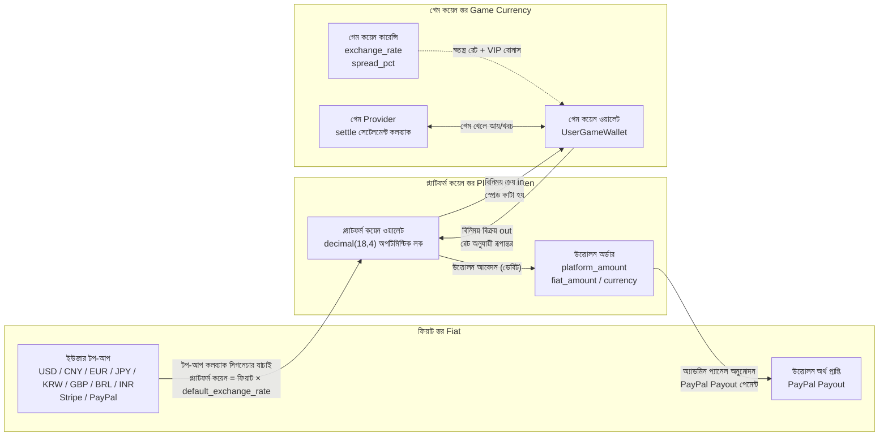

# বৈশ্বিক গেম অ্যাগ্রিগেশন প্ল্যাটফর্ম (Global Game Platform)

## প্রকল্প মাসকট


**ডাইসি (Dicey)** — প্ল্যাটফর্ম মাসকট। পাশা খেলা ও সম্ভাবনা-ভিত্তিক গেমপ্লে বোঝায়, মুদ্রা প্ল্যাটফর্ম অর্থনীতি ও মাল্টি-পেমেন্ট গেটওয়ে বোঝায়, বেগুনি রঙ অ্যাডমিন ব্র্যান্ডিংয়ের সাথে মেলে। SVG ফাইল: `docs/mascot.svg`, ডকুমেন্টেশন, লোগো ও পণ্যে অসীম স্কেলযোগ্য।
<!-- lang-nav -->

Languages: [中文](../../README.md) · [English](README.en.md) · [한국어](README.ko.md) · [Русский](README.ru.md) · [Deutsch](README.de.md) · [Français](README.fr.md) · [Español](README.es.md) · [Português](README.pt.md) · [हिन्दी](README.hi.md) · [العربية](README.ar.md) · **বাংলা** · [Bahasa Indonesia](README.id.md) · [日本語](README.ja.md)

> Copyright (c) 2026 erik <erik@erik.xyz> — https://erik.xyz

বিশ্বব্যাপী, আন্তর্জাতিক গেম অ্যাগ্রিগেশন প্ল্যাটফর্ম। ব্যবহারকারীরা নিবন্ধনের পর প্ল্যাটফর্মে টপ-আপ করে গেম কয়েন বিনিময় করে, গেম কয়েন দিয়ে গেম খেলে এবং গেম কয়েন উপার্জন করে, গেম কয়েন আবার ওয়ালেটে ফিরিয়ে উত্তোলন করা যায়। ব্যাকএন্ডে সম্পূর্ণ গেম ম্যানেজমেন্ট, উত্তোলন অনুমোদন, ব্যবহারকারী ব্যবস্থাপনা এবং পেমেন্ট ব্যবস্থাপনা কার্যকারিতা রয়েছে। বহুভাষা স্যুইচিং সমর্থন করে (ইংরেজি/চীনা)।

## ভার্সন কৌশল

| ভার্সন | লক্ষ্য | অবস্থা |
|------|------|------|
| সম্পূর্ণ ভার্সন | সম্পূর্ণ রূপ: র্যাঙ্কিং, কুপন, গেম ক্যাটাগরি, দেশ কনফিগারেশন, ES সার্চ | সম্পন্ন |
| ইকোসিস্টেম এক্সটেনশন | v2.0: গেম Provider সংযোগ, টিকিট, VIP, অ্যাচিভমেন্ট, সোশ্যাল, ইভেন্ট বাস | সম্পন্ন |
| v1.3.15-22 (৮টি রিলিজ) | সমাধান/সেটেলমেন্ট, গভীর ঝুঁকি নিয়ন্ত্রণ, ইউনিফাইড ওয়ালেট, অ্যাক্টিভিটি ইঞ্জিন, অ্যান্টি-চিট, সামাজিক বৃদ্ধি, Adyen/GrabPay | সম্পূর্ণ |

## টেকনোলজি স্ট্যাক

### ব্যাকএন্ড
- PHP 8.3+, webman v2 (workerman/webman)
- MySQL 8.0+ (টেবিল প্রিফিক্স `game_`, BIGINT নন-অটোইনক্রিমেন্ট প্রাইমারি কী)
- Redis (Session / ক্যাশ / রেট লিমিট)
- ClickHouse (OLAP অ্যানালাইসিস / প্রোবাবিলিটি গণনা)
- Elasticsearch (ফুল-টেক্সট সার্চ)
- JWT অথেনটিকেশন + RBAC পারমিশন কন্ট্রোল
- ডেটা এনক্রিপশন: API ট্রান্সপোর্ট লেয়ার AES-256-CBC + ডেটাবেস স্টোরেজ লেয়ার AES-128-ECB

### ফ্রন্টএন্ড

ফ্রন্টএন্ডের দুটি আলাদা ডিরেক্টরি-ট্রি আছে, **প্রতিটি কেবল নিজের পাশের ব্যাকএন্ড কল করে**, কোনো ক্রসওভার নেই:

| ডিরেক্টরি ট্রি | ভূমিকা | অনুরোধ উপসর্গ | সংশ্লিষ্ট ব্যাকএন্ড | টেক স্ট্যাক |
|--------|------|---------|---------|--------|
| `apps/*` | **C-প্রান্তের প্লেয়ার প্ল্যাটফর্ম** | `/api/v1/...` | service (ডিফল্ট 8792) | Flutter Web / React 19 (Vite) / Angular 21 / HarmonyOS ArkTS |
| `admin/apps/*` | **অ্যাডমিন কনসোল** | `/admin/v1/...` | admin (ডিফল্ট 8789) | Flutter Web / React 19 (Vite) / Angular 21 / HarmonyOS ArkTS |

- রেসপন্সিভ লেআউট (Phone / Tablet / Desktop)
- আন্তর্জাতিকীকরণ (i18n): ইংরেজি / সরলীকৃত চীনা স্যুইচিং

### মূল কম্পোনেন্ট
- `erikwang2013/snowflake-php` — গ্লোবাল ইউনিক BIGINT ID জেনারেশন
- `erikwang2013/hashids` — API লেয়ার ID এনক্রিপশন/ডিক্রিপশন
- `erikwang2013/jwt-webman` — JWT অথেনটিকেশন
- `erikwang2013/encryption` — API সংবেদনশীল ডেটা এনক্রিপশন/ডিক্রিপশন
- `erikwang2013/encryptable` — ডেটাবেস সংবেদনশীল ফিল্ড এনক্রিপশন/ডিক্রিপশন
- `erikwang2013/webman-scout` — Elasticsearch সিঙ্ক ও কোয়েরি
- `erikwang2013/season` — দেশের পতাকা
- `erikwang2013/security-php` — নিরাপত্তা টুল ডিটেকশন
- `erikwang2013/poster-php` — সংবেদনশীল অপারেশনের র্যান্ডম ভেরিফিকেশন
- `erikwang2013/clickhouse-php` — ClickHouse সংযোগ ও প্রোবাবিলিটি গণনা

## প্রজেক্ট স্ট্রাকচার

```
game-platform-php/
├── admin/                     # প্রশাসনিক প্যানেল (webman v2, ডিফল্ট পোর্ট 8789, APP_PORT দিয়ে পরিবর্তনযোগ্য)
│   ├── app/admin/v1/controller/  #   অ্যাডমিন-পাশের কন্ট্রোলার
│   ├── app/middleware/        #   মিডলওয়্যার (Cors/SecurityFilter/RateLimit/AdminAuth/AdminPermission/OperationLog)
│   ├── app/model/             #   শুধু admin-এ থাকা মডেল (৮টি; বাকি ৫২টি শেয়ার্ড মডেল packages/-এ)
│   ├── app/service/           #   শুধু admin-এ থাকা সার্ভিস (WalletService/WalletScope/RiskSandboxService)
│   ├── app/process/           #   স্থায়ী প্রসেস (Http/Monitor/RiskIpCron)
│   ├── app/provider/          #   গেম Provider স্তর (Self/ThirdParty/Factory)
│   ├── app/activity/          #   অ্যাক্টিভিটি ইঞ্জিন (চেক-ইন/রেফারেল/দৈনিক টাস্ক)
│   ├── app/event/             #   ইভেন্ট বাস (EventBus Redis Pub/Sub)
│   ├── config/                #   কনফিগারেশন ফাইল
│   └── apps/                  #   অ্যাডমিন ফ্রন্টএন্ড (৪টি রূপ, /admin/v1 → admin:8789-এ কল করে)
│       ├── flutter/           #     Flutter Web PC প্রশাসনিক প্যানেল
│       ├── react/             #     React 19 (Vite) অ্যাডমিন কনসোল
│       ├── angular/           #     Angular 21 অ্যাডমিন কনসোল
│       └── harmonyos/         #     HarmonyOS ArkTS অ্যাডমিন কনসোল (.hap, nginx এড়িয়ে যায়)
│
├── service/                   # C-এন্ড ব্যবসায়িক সার্ভার (webman v2, ডিফল্ট পোর্ট 8792, APP_PORT দিয়ে পরিবর্তনযোগ্য)
│   ├── app/api/v1/controller/ #   C-এন্ড API কন্ট্রোলার
│   ├── app/middleware/        #   মিডলওয়্যার (TraceId/Cors/SecurityFilter/RateLimit/LanguageMiddleware/UserAuth/ProviderAuth/SdkSessionAuth)
│   ├── app/model/             #   শুধু service-এ থাকা মডেল (১০টি; বাকি ৫২টি শেয়ার্ড মডেল packages/-এ)
│   ├── app/service/           #   শুধু service-এ থাকা সার্ভিস (ওয়ালেট/ঝুঁকি/কমপ্লায়েন্স/মিলকরণ/পুশ/অ্যাচিভমেন্ট/অ্যান্টি-চিট ইত্যাদি)
│   ├── app/payment/           #   ১৮টি পেমেন্ট গেটওয়ে অ্যাডাপ্টার (Stripe/PayPal/Adyen/NowPayments/Skrill…) + GatewayFactory
│   ├── app/cdn/               #   পাঁচটি সরবরাহকারীর CDN অ্যাডাপ্টার (Cloudflare/CloudFront/Alibaba/Tencent/Huawei) + CdnFactory
│   ├── app/process/           #   স্থায়ী প্রসেস (Http/Monitor/LeaderboardWS:8790/ChatWS:8791/EventConsumer/EventSubscriber/AntiCheatWorker/GroupSweepWorker/Health)
│   ├── app/provider/          #   গেম Provider লেয়ার
│   ├── app/activity/          #   অ্যাক্টিভিটি ইঞ্জিন
│   ├── app/event/             #   ইভেন্ট বাস (EventBus Redis Pub/Sub)
│   └── config/                #   কনফিগারেশন ফাইল
│
├── packages/platform-common/  # শেয়ার্ড স্তর: admin ও service এটি composer path রিপোজিটরি দিয়ে আনে, যাতে দুটি কপি না থাকে
│   ├── src/model/             #   শেয়ার্ড Eloquent মডেল (৫২টি, দুই পাশে একই উৎস)
│   ├── src/service/           #   শেয়ার্ড সার্ভিস (DepositLogService / VipService ইত্যাদি, ১১টি, ClickHouse প্রোবাবিলিটি গণনা সহ)
│   ├── src/BcMath.php         #   পরিমাণ/হারের উচ্চ-নির্ভুল গণনা (bcmath মোড়ক), রাউন্ডিং, শতকরা
│   ├── src/EncryptionService.php  #   AES এনক্রিপশন/ডিক্রিপশন ও মাস্কিং
│   ├── src/CircuitBreaker.php #   সার্কিট ব্রেকার (সাথে Retry.php পুনঃপ্রচেষ্টার জন্য)
│   ├── src/HashidsService.php #   API স্তরের ID এনকোড/ডিকোড
│   └── src/SnowflakeService.php   #   বিশ্বব্যাপী অনন্য BIGINT ID
│
├── apps/                      # C-প্রান্তের প্লেয়ার ফ্রন্টএন্ড (৪টি রূপ, /api/v1 → service:8792-এ কল করে)
│   ├── flutter/platform/      #   Flutter Web PC C-এন্ড ইউজার প্ল্যাটফর্ম
│   ├── react/                 #   React 19 (Vite) C-প্রান্ত
│   ├── angular/               #   Angular 21 C-প্রান্ত
│   └── harmonyos/             #   HarmonyOS ArkTS C-প্রান্ত (.hap, nginx এড়িয়ে যায়)
│
├── game/xiaoxiaole/           # অন্তর্নির্মিত মিনি গেম «গ্রামীণ থ্রি-ম্যাচ»: TypeScript + Vite + Vitest, src/domain ইঞ্জিন + চার স্তরের ডিজাইন + tests/, ১৩ ভাষার ডিজাইন ডকুমেন্ট
│
├── install/                   # এক-ক্লিকে ইনস্টলেশন উইজার্ড + ডেটাবেস আরম্ভের SQL
│   ├── index.php              #   ইনস্টলেশন এন্ট্রি
│   ├── Installer.php          #   ইনস্টলেশনের মূল লজিক
│   ├── install.sql            #   মার্জড ইনস্টলেশন SQL (৭৮টি টেবিল + সিড ডেটা)
│   ├── clickhouse.sql         #   ClickHouse বিশ্লেষণী DDL (আলাদা ইঞ্জিন, আলাদাভাবে আমদানি)
│   ├── test-data.sql          #   ডেমো/পরীক্ষা ডেটা
│   ├── migrations/            #   বিদ্যমান ডেটাবেসের জন্য ইনক্রিমেন্টাল আপগ্রেড স্ক্রিপ্ট (*.sql)
│   ├── lang/ + lang.php       #   ইনস্টল উইজার্ড ইন্টারফেস অনুবাদ (১৩ ভাষা)
│   └── assets/                #   স্ট্যাটিক রিসোর্স
│
├── docs/                      # প্রকল্প ডকুমেন্টেশন (সব লেখা ১৩ ভাষায়: .md চীনা মূল, পাশে .{lang}.md অনুবাদ)
│   ├── ARCHITECTURE.md        #   আর্কিটেকচার ডকুমেন্ট
│   ├── ARCHITECTURE-DESIGN.md #   আর্কিটেকচার ডিজাইন ডকুমেন্ট
│   ├── FEATURES.md            #   ফিচার ডকুমেন্ট
│   ├── FEATURE-DESIGN.md      #   ফিচার ডিজাইন ডকুমেন্ট
│   ├── API.md                 #   API ডকুমেন্ট
│   ├── DEPLOYMENT.md          #   ডিপ্লয়মেন্ট ডকুমেন্ট (Docker/ম্যানুয়াল/পোর্ট কনফিগারেশন)
│   ├── PROVIDER-SDK.md        #   তৃতীয় পক্ষের গেম সংযোগ গাইড (সিগনেচার অ্যালগরিদম + PHP/Go/Python উদাহরণ)
│   ├── CLICKHOUSE_INSTALL.md  #   ClickHouse ইনস্টল/কনফিগার/মাইগ্রেট/যাচাই
│   ├── CLICKHOUSE_USAGE.md    #   ClickHouse-এর ৪টি সার্ভিস API ও অ্যাডমিন ড্যাশবোর্ড
│   ├── translations/          #   এই README-এর ১২ ভাষার অনুবাদ
│   ├── diagrams/              #   আর্কিটেকচার/প্রবাহ/ফিচার/লাইফসাইকেল/নিরাপত্তা/ইকোসিস্টেম-সম্প্রসারণের SVG (প্রতিটি ১৩ ভাষায়)
│   ├── test-reports/          #   টেস্ট রিপোর্ট (php-unit / api / resilience / ui / SUMMARY)
│   └── superpowers/           #   এই রিপোজিটরির ডিজাইন স্পেসিফিকেশন ও বাস্তবায়ন পরিকল্পনা (ঐতিহাসিক নথি)
│
├── scripts/                   # অপ্স স্ক্রিপ্ট (মডেল ড্রিফট পরীক্ষা / apidoc অ্যানোটেশন মাইগ্রেশন / exchange পেআউট শব্দার্থ মাইগ্রেশন / সিগনেচার যাচাই)
├── tests/api/                 # API স্বয়ংক্রিয় টেস্ট (run_all.sh)
├── runtime/                   # webman রানটাইম ডিরেক্টরি (লগ/pid, রানটাইমে তৈরি)
│
├── docker-compose.yml         # Docker Compose অর্কেস্ট্রেশন (ডিফল্ট পোর্ট রুট .env থেকে)
├── nginx.conf.template        # Nginx কনফিগারেশন টেমপ্লেট (upstream পোর্ট envsubst দিয়ে রেন্ডার)
├── .env.example               # রুট .env টেমপ্লেট (Docker পোর্ট ভেরিয়েবল, ব্যবহারে .env হিসেবে কপি করুন)
└── admin/docs/superpowers/    # ডেভেলপমেন্ট গাইডলাইন ও প্ল্যান
    ├── specs/                 #   ডিজাইন স্পেক
    └── plans/                 #   ইমপ্লিমেন্টেশন প্ল্যান
```

## দ্রুত শুরু

### পরিবেশের প্রয়োজনীয়তা
- PHP 8.1+
- MySQL 8.0+
- Redis 6.0+
- Composer 2.x
- Flutter SDK 3.x (ফ্রন্টএন্ড, ঐচ্ছিক)

### পদ্ধতি ১: ওয়ান-ক্লিক ইনস্টলেশন উইজার্ড (সুপারিশকৃত)

```bash
# 1. ইনস্টলেশন উইজার্ড চালু করুন
php -S 0.0.0.0:8888 -t install/

# 2. ব্রাউজারে http://localhost:8888 খুলুন
#    উইজার্ড অনুযায়ী সম্পন্ন করুন: এনভায়রনমেন্ট চেক → ডেটাবেস কনফিগারেশন → অ্যাডমিন অ্যাকাউন্ট সেটআপ → অটো ইনস্টল

# 3. ডিপেন্ডেন্সি ইনস্টল করুন
cd admin && composer install && cd ..
cd service && composer install && cd ..

# 4. সার্ভিস চালু করুন (ডিফল্ট পোর্ট admin 8789 / service 8792, নিজ নিজ .env-এর APP_PORT-তে পরিবর্তনযোগ্য)
cd admin && php start.php start -d && cd ..
cd service && php start.php start -d && cd ..

# 5. প্রশাসনিক প্যানেলে প্রবেশ করুন: http://localhost:8789 (ডিফল্ট পোর্ট)
#    ইনস্টলের সময় সেট করা অ্যাডমিন অ্যাকাউন্ট ও পাসওয়ার্ড দিয়ে লগইন করুন

# 6. ইনস্টল শেষে ইনস্টলেশন ডিরেক্টরি মুছে ফেলুন (নিরাপত্তার জন্য)
rm -rf install/
```

ইনস্টলেশন উইজার্ড স্বয়ংক্রিয়ভাবে সম্পন্ন করবে:
- এনভায়রনমেন্ট চেক (PHP ভার্সন, এক্সটেনশন, ডিরেক্টরি পারমিশন)
- ডেটাবেস ও টেবিল তৈরি (মার্জড SQL, ৭৮টি টেবিল + সিড ডেটা)
- সুপার অ্যাডমিন অ্যাকাউন্ট তৈরি (bcrypt এনক্রিপশন)
- স্বয়ংক্রিয়ভাবে JWT/এনক্রিপশন কী তৈরি করে .env ফাইলে লিখবে
- পুনরায় ইনস্টল রোধে install.lock তৈরি করবে

### পদ্ধতি ২: ম্যানুয়াল ইনস্টল

<details>
<summary>ম্যানুয়াল ইনস্টলেশন ধাপ প্রসারিত করুন</summary>

#### 1. ডেটাবেস ইনিশিয়ালাইজেশন

```bash
# এক ক্লিকে মার্জড SQL ইমপোর্ট
mysql -u root -e "CREATE DATABASE IF NOT EXISTS game-platform CHARACTER SET utf8mb4 COLLATE utf8mb4_unicode_ci;"
mysql -u root game-platform < install/install.sql
```

#### 2. এনভায়রনমেন্ট ভেরিয়েবল কনফিগার করুন

```bash
# প্রশাসনিক প্যানেল
cd admin
cp .env.example .env
# .env-এ ডেটাবেস সংযোগ তথ্য ও কী সম্পাদনা করুন

# C-এন্ড ব্যবসায়িক সার্ভার
cd ../service
cp .env.example .env
# .env-এ ডেটাবেস সংযোগ তথ্য ও কী সম্পাদনা করুন
```

#### 3. ব্যাকএন্ড চালু করুন

```bash
cd admin && composer install && php start.php start -d
cd ../service && composer install && php start.php start -d
```

#### 4. অ্যাডমিন তৈরি করুন

ম্যানুয়ালি ডেটাবেসে অ্যাডমিন অ্যাকাউন্ট সন্নিবেশ করতে হবে (পাসওয়ার্ড bcrypt দিয়ে এনক্রিপ্ট করা)।

</details>

### ফ্রন্টএন্ড চালু করুন (ঐচ্ছিক)

ডেভেলপমেন্টে প্রতিটি ফ্রন্টএন্ড নিজের dev সার্ভার চালায়; অনুরোধগুলি তা দিয়েই সংশ্লিষ্ট ব্যাকএন্ডে পাঠানো হয় (প্রতিটি ডিরেক্টরির `proxy.conf.json` / `vite.config.ts` দেখুন):

```bash
# --- C-প্রান্তের প্লেয়ার প্ল্যাটফর্ম (/api/v1 → service:8792) ---
cd apps/react            && npm install && npm run dev      # http://localhost:5173
cd apps/angular          && npm install && npm start        # http://localhost:4200
cd apps/flutter/platform && flutter pub get && flutter run -d chrome

# --- অ্যাডমিন কনসোল (/admin/v1 → admin:8789) ---
cd admin/apps/react      && npm install && npm run dev      # http://localhost:5273
cd admin/apps/angular    && npm install && npm start        # http://localhost:4300
cd admin/apps/flutter    && flutter pub get && flutter run -d chrome
```

> Angular dev সার্ভার পোর্ট: অ্যাডমিন কনসোল `angular.json`-এ স্পষ্টভাবে 4300 সেট করে, আর C-প্রান্ত Angular-এর ডিফল্ট 4200 রাখে; দুটি একসাথে চালাতে একটিতে `--port` দিন।
> HarmonyOS লক্ষ্য (`apps/harmonyos`, `admin/apps/harmonyos`) DevEco Studio দিয়ে খোলা ও বিল্ড করা হয়;
> এমুলেটর হোস্ট ব্যাকএন্ডে পৌঁছায় `http://10.0.2.2:<port>` দিয়ে (প্রতিটি `ApiService.ets`-এর শীর্ষে থাকা ধ্রুবক দেখুন)।

### ফ্রন্টএন্ড ডিপ্লয়মেন্ট (Docker/Nginx)

`docker-compose.yml`-এর nginx সার্ভিস প্রতিটি ফ্রন্টএন্ডের বিল্ড আউটপুট কন্টেইনারে রিড-অনলি হিসেবে মাউন্ট করে, আর `nginx.conf.template` নিচের পাথগুলোতে তা পরিবেশন করে।
বিল্ড না করা থাকলে ডিরেক্টরিটি খালি: পাথ রিকোয়েস্টে 404, খালি ডিরেক্টরি রিকোয়েস্টে (যেমন `/app-react/`) 403 ফেরে।

| URL | আর্টিফ্যাক্ট মাউন্ট পয়েন্ট | বিল্ড কমান্ড |
|-----|-----------|---------|
| `/` | `apps/flutter/platform/build/web` | `flutter build web` |
| `/app-react/` | `apps/react/dist` | `npm run build` (স্ক্রিপ্টে `--base=/app-react/` আছে) |
| `/app-angular/` | `apps/angular/dist/game-client-angular/browser` | `npm run build` (স্ক্রিপ্টে `--base-href=/app-angular/` আছে) |
| `/admin-panel/` | `admin/public` | সাধারণ প্লেসমেন্ট স্লট: যেকোনো কনসোলের আর্টিফ্যাক্ট `admin/public`-এ কপি করুন; না রাখলে তাও 404 ফেরে (খালি ডিরেক্টরি 403)। মনে রাখবেন, আর্টিফ্যাক্টটি `--base=/admin-panel/` দিয়ে বিল্ড করতে হবে (Flutter-এর ক্ষেত্রে `--base-href=/admin-panel/`), নইলে এর রিসোর্সগুলো আগের প্রিফিক্সেই নির্দেশ করবে ও 404 হবে। স্ল্যাশ ছাড়া রূপটি এখানে 301 রিডাইরেক্ট হয়; `nginx.conf.template`-এ `absolute_redirect off` সেট করা, তাই রিডাইরেক্টটি আপেক্ষিক Location এবং 80 ছাড়া অন্য পোর্টে ডিপ্লয় করলে পোর্ট হারায় না |
| `/admin-react/` | `admin/apps/react/dist` | `npm run build` (স্ক্রিপ্টে `--base=/admin-react/` আছে) |
| `/admin-angular/` | `admin/apps/angular/dist/game-admin-angular/browser` | `npm run build` (স্ক্রিপ্টে `--base-href=/admin-angular/` আছে) |
| `/admin-flutter/` | `admin/apps/flutter/build/web` | `flutter build web --base-href=/admin-flutter/` |

`/admin/` (API) → admin কন্টেইনার, `/api/` (API) → service কন্টেইনার; HarmonyOS অংশটি `.hap` প্যাকেজ হিসেবে বিতরণ হয়, nginx দিয়ে যায় না।

### যাচাইকরণ

```bash
# প্রশাসনিক প্যানেল পরীক্ষা (ডিফল্ট পোর্ট 8789)
curl http://localhost:8789/health

# C-এন্ড ব্যবসা পরীক্ষা (ডিফল্ট পোর্ট 8792)
curl http://localhost:8792/health

# ইউজার রেজিস্ট্রেশন পরীক্ষা
curl -X POST http://localhost:8792/api/v1/auth/register \
  -H "Content-Type: application/json" \
  -d '{"username":"testuser","password":"Abcdef12"}'
```

## নিরাপত্তা ফিচার

- **১৮ লেয়ার ডিফেন্স-ইন-ডেপথ**: XSS/SQL ইনজেকশন/CSRF/পাথ ট্রাভার্সাল/কমান্ড ইনজেকশন ডিটেকশন ও ব্লক
- **HTTP মেথড হোয়াইটলিস্ট**: শুধুমাত্র GET/POST/PUT/DELETE/OPTIONS/HEAD অনুমোদিত
- **JWT অথেনটিকেশন**: access_token ২ ঘণ্টা + refresh_token ১৪ দিন, কনকারেন্ট সেশন সীমা
- **JWT কী স্টার্টআপ ভ্যালিডেশন**: admin-এ `ADMIN_JWT_SECRET_KEY`, service-এ `SERVICE_JWT_SECRET_KEY` আলাদা কী; অনুপস্থিত বা ডিফল্ট মান থাকলে স্টার্টআপ সরাসরি প্রত্যাখ্যাত হয়
- **পেমেন্ট কলব্যাক fail-closed**: provider হোয়াইটলিস্ট (শুধুমাত্র stripe/paypal) + কী কনফিগার না থাকা/ভেরিফিকেশন ব্যর্থ/টাইমস্ট্যাম্প সীমা অতিক্রম — সবই প্রত্যাখ্যান + bccomp অ্যামাউন্ট চেক + কলব্যাক লেনদেনভিত্তিক জমা
- **RBAC পারমিশন**: method.path গ্রানুলারিটি পারমিশন কন্ট্রোল, Redis 60s ক্যাশ
- **ক্লিক ক্যাপচা**: লগইন/রেজিস্ট্রেশনে বাধ্যতামূলক হিউম্যান-মেশিন ভেরিফিকেশন
- **পাসওয়ার্ড দ্বিতীয় নিশ্চিতকরণ**: সংবেদনশীল অপারেশনে পাসওয়ার্ড দিয়ে নিশ্চিত করতে হয়
- **ডেটা এনক্রিপশন**: ট্রান্সপোর্ট লেয়ার AES-256-CBC + স্টোরেজ লেয়ার AES-128-ECB
- **ID এনক্রিপশন**: Snowflake জেনারেশন + Hashids এনকোডিং, বাইরে থেকে রিভার্স করা অসম্ভব
- **ওয়ালেট অপটিমিস্টিক লক**: কনকারেন্ট ডেবিট/ডুপ্লিকেট ক্রেডিট রোধ
- **অপারেশন অডিট**: সম্পূর্ণ অপারেশন লগ, ৮ প্ল্যাটফর্ম সোর্স স্বয়ংক্রিয় ডিটেকশন
- **রেট লিমিট**: Redis স্লাইডিং উইন্ডো, Lua অ্যাটমিক
- **CSP হেডার**: Content-Security-Policy দিয়ে XSS রোধ
- **অ্যাকাউন্ট নিরাপত্তা**: টানা ৫ বার লগইন ব্যর্থ হলে ১৫ মিনিট লক

## টেস্ট

টেস্ট রিপোর্ট (স্থানীয়ভাবে সংরক্ষিত): [docs/test-reports/](../test-reports/)

| টেস্টের ধরন | কেস/কভারেজ | ফলাফল |
|---------|----------|------|
| PHP ইউনিট টেস্ট | বর্তমান পরিমাপ `phpunit --list-tests`: admin 200 + service 273 কেস (রিপোর্ট `docs/test-reports/php-unit.md`-এ 09-22 পুনরায় চালানোর ফল admin 190 + service 273 এবং 08-27 স্ন্যাপশট admin 153 + service 45 লিপিবদ্ধ; admin পাশ এখনও বাড়ানো হচ্ছে) | service সবই পাস (701 দাবি, 3 skipped, 2 warnings + 35 deprecations); admin 437 দাবি, 3 skipped, ১টি ব্যর্থতা (`EnvConfigTest` প্রকৃত `admin/.env` যাচাই করে এবং `REDIS_CLUSTER_NODES` নেই পায়; যোগ করলেই সবুজ হবে) |
| স্থিতিশীলতা ব্যবস্থার টেস্ট | সার্কিট ব্রেকার/পুনঃপ্রচেষ্টা/ডিগ্রেডেশন সুইচ, 15 কেস (CircuitBreakerTest/RetryTest/ResilienceMockTest) | সবই পাস |
| স্বয়ংক্রিয় API টেস্ট | 187 এন্ডপয়েন্ট (সূত্র: `docs/test-reports/api.md`, 2026-08-27); route.php বর্তমানে 261 এন্ডপয়েন্ট নিবন্ধন করে | 171 পাস / 50 ব্যর্থ / 4 বাদ (সব ব্যর্থতাই নির্ধারিত ত্রুটি, রিপোর্ট দেখুন) |
| Flutter UI টেস্ট | 12 কেস (লগইন/ড্যাশবোর্ড/নেভিগেশন/ভাষা পরিবর্তন) | সবই পাস |
| Go/Rust | রিপোজিটরিতে Go/Rust কোড নেই | বাদ দেওয়া হয়েছে, লিপিবদ্ধ |

```bash
# PHP ইউনিট টেস্ট (প্রথমে JWT সিক্রেট এনভায়রনমেন্ট ভেরিয়েবল এক্সপোর্ট করুন)
cd admin && ADMIN_JWT_SECRET_KEY=test-jwt-secret-change-me php vendor/bin/phpunit
cd service && SERVICE_JWT_SECRET_KEY=test-jwt-secret-change-me php vendor/bin/phpunit
# স্বয়ংক্রিয় API টেস্ট (সার্ভিসগুলি চালু থাকতে হবে, tests/api/run_all.sh দেখুন)
bash tests/api/run_all.sh
# Flutter UI টেস্ট
cd admin/apps/flutter && flutter test --timeout 300s
```

বিস্তারিত রিপোর্ট:
- [PHP ইউনিট টেস্ট রিপোর্ট](../test-reports/php-unit.md)
- [স্থিতিশীলতা ব্যবস্থার টেস্ট রিপোর্ট (সার্কিট ব্রেকার/পুনঃপ্রচেষ্টা/ডিগ্রেডেশন)](../test-reports/resilience.md)
- [স্বয়ংক্রিয় API টেস্ট রিপোর্ট](../test-reports/api.md)
- [Flutter UI টেস্ট রিপোর্ট](../test-reports/ui.md)

## প্ল্যাটফর্ম ক্ষমতা ওভারভিউ

| ক্ষমতা | বিবরণ |
|------|------|
| ইউজার অথেনটিকেশন | ইউজারনেম+পাসওয়ার্ড + ৭ প্ল্যাটফর্ম OAuth (Google/Facebook/Apple/X(Twitter)/Microsoft/LinkedIn/GitHub) + 2FA TOTP |
| ওয়ালেট | প্ল্যাটফর্ম কয়েন ওয়ালেট (অপটিমিস্টিক লক) + গেম কয়েন ওয়ালেট + লেনদেন রেকর্ড |
| টপ-আপ | অর্ডার তৈরি + Stripe/PayPal কলব্যাক ভেরিফিকেশন + অটো ক্রেডিট |
| বিনিময় | প্ল্যাটফর্ম কয়েন⇄গেম কয়েন, রিয়েল-টাইম কোয়োট, স্প্রেড আয় |
| উত্তোলন | আবেদন→অনুমোদন→পেমেন্ট, গ্লোবাল সুইচ, KYC স্তরভিত্তিক সীমা+ফি |
| KYC | রিয়েল-নেম ভেরিফিকেশন সাবমিট+অনুমোদন, অনুমোদনের পর উইথড্রয়াল সীমা বাড়ায় |
| গেম | CRUD + ক্যাটাগরি (১০টি) + সার্ভার অঞ্চল + গেম রেকর্ড ট্র্যাকিং |
| সার্চ | Elasticsearch ফুল-টেক্সট সার্চ (LIKE ফলব্যাক সহ) |
| র্যাঙ্কিং | দৈনিক/সাপ্তাহিক/মাসিক/সর্বকাল, Redis ক্যাশ, WebSocket রিয়েল-টাইম পুশ (ডিফল্ট পোর্ট 8790, LEADERBOARD_WS_PORT দিয়ে পরিবর্তনযোগ্য) |
| CDN | পাঁচ প্রোভাইডার ইন্টিগ্রেশন (Cloudflare R2 / AWS S3 / Aliyun OSS / Tencent COS / Huawei OBS আপলোড + পার্জ + প্রিলোড) + অ্যাডমিন কনফিগ/টগল/কানেক্টিভিটি টেস্ট |
| কুপন | ফিক্সড অ্যামাউন্ট+রেশিও ডিসকাউন্ট, সময় ও পরিমাণ সীমিত, ক্লেইম ও ব্যবহার ট্র্যাকিং |
| নোটিফিকেশন | ইন-সাইট মেসেজ+ইমেইল, টপ-আপ/উত্তোলন/KYC/কুপন অটো নোটিফিকেশন |
| রেফারেল | রেফারেল কোড, রেজিস্ট্রেশন বোনাস, টপ-আপ কমিশন |
| রিস্ক কন্ট্রোল | IP ব্ল্যাকলিস্ট/বড় অ্যামাউন্ট অ্যালার্ট/ফ্রিকোয়েন্সি/স্পিড ডিটেকশন |
| গভীর ঝুঁকি নিয়ন্ত্রণ | ডিভাইস ফিঙ্গারপ্রিন্ট / আইপি রেপুটেশন / অ্যাকাউন্ট-লিংক গ্রাফ + রুল ইঞ্জিন + রিস্ক ড্যাশবোর্ড + AML/KYC/ট্রাস্ট স্কোর |
| অ্যান্টি-চিট | অ্যান্টি-চিট ইভেন্ট সংগ্রহ + দৈনিক পরিসংখ্যান + ম্যানুয়াল রিভিউ |
| সমাধান/সেটেলমেন্ট | দৈনিক সমাধান ব্যাচ + পার্থক্য বিবরণ + স্টেটমেন্ট সমাধান |
| ইউনিফাইড ওয়ালেট | WalletScope ইউনিফাইড ওয়ালেট স্কোপ |
| অ্যাক্টিভিটি ইঞ্জিন | অ্যাক্টিভিটি তৈরি/অংশগ্রহণ/পুরস্কার + চেক-ইন |
| সামাজিক বৃদ্ধি | গ্রুপ + শেয়ার-লিংক ট্র্যাকিং |
| পেমেন্ট গেটওয়ে | নতুন Adyen / GrabPay গেটওয়ে (L1) |
| আন্তর্জাতিকীকরণ | ৪টি ভাষা (en-US/zh-CN/ja-JP/ko-KR), অনুবাদ টেবিল+ক্যাশ |
| দেশ কনফিগারেশন | ১৮ দেশের ভিন্ন পেমেন্ট/উত্তোলন পদ্ধতি, সর্বনিম্ন টপ-আপ পরিমাণ |
| পরিসংখ্যান | দৈনিক স্ন্যাপশট (৫ ধরনের মেট্রিক) + প্ল্যাটফর্ম আয় ট্র্যাকিং |
| ক্যাপচা | ক্লিক-টাইপ হিউম্যান ভেরিফিকেশন (poster-php) |
| গেম সংযোগ | Provider SDK (Self+ThirdParty) + HMAC-SHA256 সিগনেচার + কলব্যাক গেটওয়ে |
| টিকিট | C-এন্ড তৈরি/রিপ্লাই + প্রশাসনিক প্যানেলে প্রক্রিয়া/বরাদ্দ/বন্ধ |
| VIP | ৫ লেভেল লয়্যালটি, এক্সপি সঞ্চয়, বিনিময় ডিসকাউন্ট/উত্তোলন মওকুফ/এক্সচেঞ্জ রেট বোনাস |
| অ্যাচিভমেন্ট | ১২টি বিল্ট-ইন অ্যাচিভমেন্ট, ইভেন্ট-চালিত ডিটেকশন, প্রগ্রেস ট্র্যাকিং |
| সোশ্যাল | ফ্রেন্ড সিস্টেম + WebSocket রিয়েল-টাইম প্রাইভেট মেসেজ (ডিফল্ট পোর্ট 8791, CHAT_WS_PORT দিয়ে পরিবর্তনযোগ্য), শুধুমাত্র বন্ধুদের সাথে |
| টুর্নামেন্ট | চ্যাম্পিয়নশিপ সিস্টেম (FeatureFlag সুইচ) + র্যাঙ্কিং + সদস্য সংখ্যা সীমা |
| কমিশন | দুই-স্তরের রেফারেল প্রফিট শেয়ারিং (কনফিগারযোগ্য কমিশন রেট) |
| কুপন | শর্ত সীমা (min_deposit/first_user/game_id) |
| ইভেন্ট | Redis Pub/Sub ইভেন্ট বাস + Webhook সাবস্ক্রিপশন ডেলিভারি (৭ ধরনের ইভেন্ট) |
| ডিপ্লয়মেন্ট | Docker Compose ৭ সার্ভিস অর্কেস্ট্রেশন (পোর্ট রুট .env থেকে কনফিগার) + Nginx রিভার্স প্রক্সি |
| ক্লায়েন্ট | অ্যাডমিন ৪টি রূপ (Flutter/React/Angular/HarmonyOS) + C-প্রান্ত ৪টি রূপ (Flutter/React/Angular/HarmonyOS) |

## ব্যবসায়িক মডেল

```
ফিয়াট (USD/CNY/EUR...)
  │  টপ-আপ (Stripe/PayPal/আলিপে/উইচ্যাট পে)
  ▼
প্ল্যাটফর্ম কয়েন (একীভূত, নির্ভুলতা decimal(18,4))
  │  বিনিময় (এক্সচেঞ্জ রেট + প্ল্যাটফর্ম স্প্রেড সহ)
  ▼
গেম কয়েন (প্রতিটি গেমের জন্য আলাদা, আলাদা এক্সচেঞ্জ রেট)
  │  গেম খেলে আয়/ব্যয়
  ▼
প্ল্যাটফর্ম কয়েন ← ফেরত বিনিময় → উত্তোলন (অনুমোদন/স্বয়ংক্রিয়)
```

## মাল্টি-কারেন্সি সেটেলমেন্ট

প্ল্যাটফর্মটি «ফিয়াট → প্ল্যাটফর্ম কয়েন → গেম কয়েন» তিন-স্তরের কারেন্সি আইসোলেশন সেটেলমেন্ট সিস্টেম ব্যবহার করে: USD/CNY/EUR/JPY/KRW/GBP/BRL/INR মাল্টি-ফিয়াট টপ-আপ সমর্থিত, প্রতিটি গেমের আলাদা মূল্যায়ন কারেন্সি রয়েছে; সব অ্যামাউন্ট হিসাব bcmath উচ্চ-নির্ভুলতা অপারেশনে করা হয়, ফ্লোটিং পয়েন্ট ত্রুটি সম্পূর্ণ এড়ানো হয়।

### তিন-স্তরের কারেন্সি মডেল

| স্তর | কারেন্সি | বিবরণ |
|------|------|------|
| ফিয়াট স্তর | USD / CNY / EUR / JPY / KRW / GBP / BRL / INR | ব্যবহারকারীর টপ-আপ/উত্তোলনের প্রকৃত পেমেন্ট কারেন্সি, Stripe / PayPal দ্বারা প্রক্রিয়াকৃত |
| প্ল্যাটফর্ম কয়েন স্তর | প্ল্যাটফর্ম কয়েন (পুরো প্ল্যাটফর্মে একীভূত) | অভ্যন্তরীণ একীভূত সেটেলমেন্ট কারেন্সি (decimal(18,4)), ওয়ালেট অপটিমিস্টিক লক কনকারেন্ট ডেবিট/ডুপ্লিকেট ক্রেডিট রোধ করে |
| গেম কয়েন স্তর | প্রতিটি গেমের আলাদা কারেন্সি | প্রতিটি গেমের আলাদা `exchange_rate` ও `spread_pct`, আলাদা গেম কয়েন ওয়ালেট |

### সেটেলমেন্ট পাথ

- **টপ-আপ সেটেলমেন্ট**: ব্যবহারকারী ফিয়াট দিয়ে পেমেন্ট করে (Stripe / PayPal কলব্যাক ভেরিফিকেশন, আইডেমপোটেন্সি ডিডুপ) → `default_exchange_rate` অনুযায়ী প্ল্যাটফর্ম কয়েন জমা হয়, টপ-আপ অর্ডারে একই সাথে `amount + currency + platform_amount` রেকর্ড হয়
- **বিনিময় সেটেলমেন্ট**: প্ল্যাটফর্ম কয়েন ⇄ গেম কয়েন গেম কারেন্সি রেটে রিয়েল-টাইম কোয়োট (quote) হয়, `spread_pct` স্প্রেড প্ল্যাটফর্মের স্প্রেড আয় হিসেবে কাটা হয়, VIP-দের বিনিময় ডিসকাউন্ট ও রেট বোনাস রয়েছে
- **গেম সেটেলমেন্ট**: গেম Provider `/api/provider/settle` কলব্যাকের মাধ্যমে ইউজারের গেম কয়েন বাড়ায়/কমায় (HMAC-SHA256 সিগনেচার), গেম সেশন টাইমআউটে স্বয়ংক্রিয় সেটেলমেন্ট
- **উত্তোলন সেটেলমেন্ট**: প্ল্যাটফর্ম কয়েন ডেবিট → উত্তোলন অর্ডার তৈরি (`platform_amount / fiat_amount / currency` রেকর্ড) → প্রশাসনিক প্যানেল অনুমোদন → PayPal Payout পেমেন্ট → ব্যাচ স্ট্যাটাস কমপ্লিটে সিঙ্ক

### সেটেলমেন্ট ফ্লো ডায়াগ্রাম



## আর্কিটেকচার ডায়াগ্রাম


## মূল ব্যবসায়িক ফ্লো


## ফিচার প্যানোরামা


## লাইফসাইকেল


## নিরাপত্তা আর্কিটেকচার


## ইকোসিস্টেম এক্সটেনশন (v2.0)


## ডকুমেন্টেশন ইনডেক্স

| ডকুমেন্ট | বিবরণ |
|------|------|
| [ভার্সন তুলনা](../VERSIONS.bn.md) | বেসিক/স্ট্যান্ডার্ড/সম্পূর্ণ ভার্সনের ফিচার তুলনা |
| [আর্কিটেকচার ডিজাইন ডকুমেন্ট](../ARCHITECTURE-DESIGN.bn.md) | আর্কিটেকচার নির্বাচনের কারণ ও ডিজাইন সিদ্ধান্ত |
| [আর্কিটেকচার ডকুমেন্ট](../ARCHITECTURE.bn.md) | সিস্টেম টপোলজি, মডিউল আর্কিটেকচার, ডেটা ফ্লো |
| [ফিচার ডিজাইন ডকুমেন্ট](../FEATURE-DESIGN.bn.md) | ব্যবসায়িক মডেল, ফিচার স্পেক, ফ্লো ডিজাইন |
| [ফিচার ডকুমেন্ট](../FEATURES.bn.md) | ফিচার তালিকা, মডিউল বিবরণ, ইউজার জার্নি |
| [API ডকুমেন্ট](../API.bn.md) | সম্পূর্ণ API রেফারেন্স (১৪৬টি এন্ডপয়েন্ট) |
| [অনলাইন ডকুমেন্ট](http://localhost:8792/apidoc/) | erikwang2013/apidoc-php ইন্টারঅ্যাকটিভ ডকুমেন্ট (C-এন্ড) |
| [অনলাইন ডকুমেন্ট](http://localhost:8789/apidoc/) | erikwang2013/apidoc-php ইন্টারঅ্যাকটিভ ডকুমেন্ট (প্রশাসনিক প্যানেল) |
| [ClickHouse ইনস্টল](../CLICKHOUSE_INSTALL.bn.md) | ClickHouse ইনস্টল/কনফিগার/মাইগ্রেট/ভেরিফাই |
| [Provider SDK সংযোগ ডকুমেন্ট](../PROVIDER-SDK.bn.md) | থার্ড-পার্টি গেম সংযোগ গাইড (সিগনেচার অ্যালগরিদম + PHP/Go/Python উদাহরণ) |
| [ClickHouse ব্যবহার](../CLICKHOUSE_USAGE.bn.md) | ৪টি ClickHouse সার্ভিস API ও ব্যাকএন্ড ড্যাশবোর্ড |
| [ডিপ্লয়মেন্ট ডকুমেন্ট](../DEPLOYMENT.bn.md) | ডিপ্লয়মেন্ট গাইড (Docker + ম্যানুয়াল + Nginx + মনিটরিং) |
| [ডিজাইন স্পেক](../../admin/docs/superpowers/specs/2026-05-22-game-platform-design.bn.md) | সম্পূর্ণ ডিজাইন স্পেক |
| [ইমপ্লিমেন্টেশন প্ল্যান](../../admin/docs/superpowers/plans/2026-05-22-game-platform-plan.bn.md) | বিস্তারিত ইমপ্লিমেন্টেশন প্ল্যান |

---

## প্রজেক্ট সাপোর্ট

এই প্রজেক্ট আপনার কাজে লাগলে, লেখককে এক কাপ কফি খাওয়াতে পারেন ☕

<p align="center">
  <table align="center" border="0" cellspacing="0" cellpadding="0">
    <tr>
      <td align="center" width="200">
        <br>
        <b>উইচ্যাট পে</b>
      </td>
      <td align="center" width="200">
        <br>
        <b>আলিপে</b>
      </td>
    </tr>
  </table>
</p>

### গ্লোবাল ব্যাংক ট্রান্সফার

**প্রাপক তথ্য (Recipient)**

| আইটেম | বিবরণ |
|----|------|
| প্রাপকের নাম (Beneficiary Name) | WANG KEXUN |
| প্রাপক অ্যাকাউন্ট নম্বর (Account Number) | 881015918251 |

**প্রাপক ব্যাংক (Beneficiary Bank)**

| আইটেম | বিবরণ |
|----|------|
| SWIFT Code | AABLHKHHXXX |
| ব্যাংকের নাম (Bank Name) | ZA Bank Limited |
| ব্যাংক কোড (Bank Code) | 387 |
| ব্যাংকের ঠিকানা (Bank Address) | Core F, Cyberport 3, 100 Cyberport Road, Hong Kong |

**ক্রস-বর্ডার রেমিট্যান্স করেসপনডেন্ট ব্যাংক (Correspondent Bank, প্রয়োজনে)**

> লক্ষ্য করুন, এটি ক্রস-বর্ডার রেমিট্যান্সের করেসপনডেন্ট ব্যাংক (মধ্যস্থ ব্যাংক) তথ্য, প্রাপক ব্যাংকের তথ্য নয়। করেসপনডেন্ট ব্যাংক তথ্যের প্রয়োজন আছে কিনা তা রেমিট্যান্স ব্যাংকে জিজ্ঞাসা করুন।

- **HKD, CNY ও USD জমা করার করেসপনডেন্ট ব্যাংক Citibank:**
  - ব্যাংকের নাম: Citibank N.A. Hong Kong
  - SWIFT Code: CITIHKHXXXX
  - ব্যাংক কোড: 006
  - শাখার নাম: Hong Kong Branch
  - শাখা কোড: 391
  - ব্যাংকের ঠিকানা: Citibank Tower, Citibank Plaza, 3 Garden Road, Central, Hong Kong
- **অন্যান্য কারেন্সি জমা করার সময় করেসপনডেন্ট ব্যাংক BNY Mellon:**
  - ব্যাংকের নাম: THE BANK OF NEW YORK MELLON
  - SWIFT Code: IRVTUS3NXXX
  - ব্যাংকের ঠিকানা: THE BANK OF NEW YORK MELLON, 240 GREENWICH STREET, NEW YORK, United States

### ক্রিপ্টো দান (Crypto Donation)

এই প্রকল্পটি আপনার কাজে লাগলে, দান করতে QR কোড স্ক্যান করুন, ধন্যবাদ!

| নেটওয়ার্ক (Network) | QR কোড (QR Code) | ওয়ালেট ঠিকানা (Wallet Address) |
|---|---|---|
| BNB Smart Chain (BEP20) | [](../coin/1.jpg) | `0x355d429f97511897ccb4e271ec888205f9ab6629` |
| Tron (TRC20) | [](../coin/2.jpg) | `TEdDHWLajt1XvqtPDWmQctdrJaC3pzZZzz` |
| Ethereum (ERC20) | [](../coin/3.jpg) | `0x355d429f97511897ccb4e271ec888205f9ab6629` |
| Aptos | [](../coin/4.jpg) | `0x836e3780edfc3f7b2372b39e2a1a3a5d7adfaccd96c726f21cfde1b50dd68030` |
| Plasma | [](../coin/5.jpg) | `0x355d429f97511897ccb4e271ec888205f9ab6629` |
| Polygon POS | [](../coin/6.jpg) | `0x355d429f97511897ccb4e271ec888205f9ab6629` |
| Solana | [](../coin/7.jpg) | `2hfhboHdmdrYsY25XfQSsEWxq5ip4EQsR7f4AzSRMUyr` |
| The Open Network (TON) | [](../coin/8.jpg) | `UQB9kFQohzmXUir9QSSZq01iwl9aQZIDdBpNmDklljRtCoGK` |
| Arbitrum One | [](../coin/9.jpg) | `0x355d429f97511897ccb4e271ec888205f9ab6629` |
| AVAX C-Chain | [](../coin/10.jpg) | `0x355d429f97511897ccb4e271ec888205f9ab6629` |

