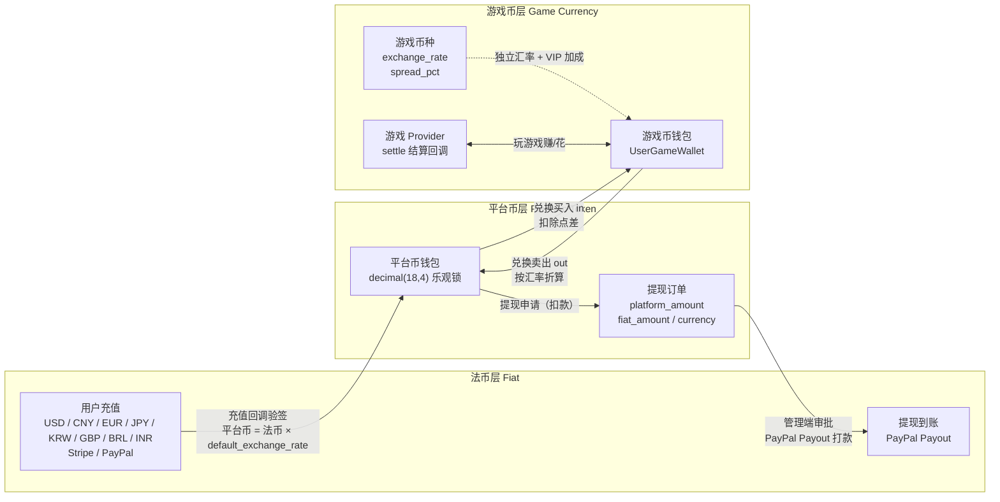

# Globale Spiele-Plattform (Global Game Platform)

## Projekt-Maskottchen


**Dicey** — Plattform-Maskottchen. Der Würfel steht für Spiele und wahrscheinlichkeitsbasiertes Gameplay, die Münze für die Plattform-Ökonomie und die Multi-Payment-Gateways, das Lila spiegelt das Admin-Branding wider. SVG-Quelle: `docs/mascot.svg`, unbegrenzt skalierbar für Doku, Logos und Merchandise.
<!-- lang-nav -->

Languages: [中文](../../README.md) · [English](README.en.md) · [한국어](README.ko.md) · [Русский](README.ru.md) · **Deutsch** · [Français](README.fr.md) · [Español](README.es.md) · [Português](README.pt.md) · [हिन्दी](README.hi.md) · [العربية](README.ar.md) · [বাংলা](README.bn.md) · [Bahasa Indonesia](README.id.md) · [日本語](README.ja.md)

> Copyright (c) 2026 erik <erik@erik.xyz> — https://erik.xyz

Eine weltweit einsetzbare, internationalisierte Spiele-Aggregationsplattform. Nach der Registrierung laden Benutzer Geld auf, um Spielmünzen zu kaufen, spielen mit den Spielmünzen und verdienen Spielmünzen; die Spielmünzen können zurück in die Brieftasche transferiert und ausgezahlt werden. Das Backend bietet vollständige Funktionen für Spielverwaltung, Auszahlungsprüfung, Benutzerverwaltung und Zahlungsverwaltung. Mehrsprachige Umschaltung (Englisch/Chinesisch) wird unterstützt.

## Versionsstrategie

| Version | Ziel | Status |
|------|------|------|
| Vollversion | Komplett: Ranglisten, Gutscheine, Spielkategorien, Länderkonfiguration, ES-Suche | Abgeschlossen |
| Ökosystem-Erweiterung | v2.0: Spiel-Provider-Anbindung, Tickets, VIP, Erfolge, Soziales, Event-Bus | Abgeschlossen |
| v1.3.15-22 (8 Versionen) | Abgleich/Abwicklung, tiefere Risikokontrolle, einheitliche Wallet, Aktions-Engine, Anti-Cheat, soziales Wachstum, Adyen/GrabPay | Abgeschlossen |

## Technologie-Stack

### Backend
- PHP 8.3+, webman v2 (workerman/webman)
- MySQL 8.0+ (Tabellenpräfix `game_`, BIGINT-IDs ohne Auto-Increment)
- Redis (Session / Cache / Rate-Limiting)
- ClickHouse (OLAP-Analyse / Wahrscheinlichkeitsberechnung)
- Elasticsearch (Volltextsuche)
- JWT-Authentifizierung + RBAC-Berechtigungssteuerung
- Datenverschlüsselung: AES-256-CBC auf API-Transportebene + AES-128-ECB auf Datenbankspeicherebene

### Frontend

Es gibt zwei getrennte Frontend-Verzeichnisbäume, **jeder ruft nur das Backend seiner eigenen Seite auf**, ohne Überschneidung:

| Verzeichnisbaum | Rolle | Anfragepräfix | Backend | Technologie-Stack |
|--------|------|---------|---------|--------|
| `apps/*` | **C-End-Spielerplattform** | `/api/v1/...` | service (Standard 8792) | Flutter Web / React 19 (Vite) / Angular 21 / HarmonyOS ArkTS |
| `admin/apps/*` | **Verwaltungskonsole** | `/admin/v1/...` | admin (Standard 8789) | Flutter Web / React 19 (Vite) / Angular 21 / HarmonyOS ArkTS |

- Responsives Layout (Phone / Tablet / Desktop)
- Internationalisierung (i18n): Englisch / vereinfachtes Chinesisch

### Kernkomponenten
- `erikwang2013/snowflake-php` — globale eindeutige BIGINT-ID-Generierung
- `erikwang2013/hashids` — ID-Verschlüsselung auf API-Ebene
- `erikwang2013/jwt-webman` — JWT-Authentifizierung
- `erikwang2013/encryption` — Ver-/Entschlüsselung sensibler API-Daten
- `erikwang2013/encryptable` — Ver-/Entschlüsselung sensibler Datenbankfelder
- `erikwang2013/webman-scout` — Elasticsearch-Synchronisation und -Abfrage
- `erikwang2013/season` — Länderflaggen
- `erikwang2013/security-php` — Sicherheitswerkzeug-Erkennung
- `erikwang2013/poster-php` — Zufallsverifikation bei sensiblen Aktionen
- `erikwang2013/clickhouse-php` — ClickHouse-Verbindung und Wahrscheinlichkeitsberechnung

## Projektstruktur

```
game-platform-php/
├── admin/                     # Verwaltungs-Backend (webman v2, Standardport 8789, über APP_PORT konfigurierbar)
│   ├── app/admin/v1/controller/  #   Controller der Admin-Seite
│   ├── app/middleware/        #   Middleware (Cors/SecurityFilter/RateLimit/AdminAuth/AdminPermission/OperationLog)
│   ├── app/model/             #   Nur im Admin vorhandene Modelle (8; die übrigen 52 gemeinsamen Modelle liegen in packages/)
│   ├── app/service/           #   Nur im Admin vorhandene Services (WalletService/WalletScope/RiskSandboxService)
│   ├── app/process/           #   Dauerprozesse (Http/Monitor/RiskIpCron)
│   ├── app/provider/          #   Spiel-Provider-Schicht (Self/ThirdParty/Factory)
│   ├── app/activity/          #   Aktivitäts-Engine (Check-in/Einladung/Tagesaufgaben)
│   ├── app/event/             #   Event-Bus (EventBus Redis Pub/Sub)
│   ├── config/                #   Konfigurationsdateien
│   └── apps/                  #   Admin-Frontends (4 Varianten, rufen /admin/v1 → admin:8789)
│       ├── flutter/           #     Flutter-Web-PC-Verwaltungs-Backend
│       ├── react/             #     React 19 (Vite) Admin-Konsole
│       ├── angular/           #     Angular 21 Admin-Konsole
│       └── harmonyos/         #     HarmonyOS ArkTS Admin-Konsole (.hap, umgeht nginx)
│
├── service/                   # C-End-Geschäftsdienst (webman v2, Standardport 8792, über APP_PORT konfigurierbar)
│   ├── app/api/v1/controller/ #   C-End-API-Controller
│   ├── app/middleware/        #   Middleware (TraceId/Cors/SecurityFilter/RateLimit/LanguageMiddleware/UserAuth/ProviderAuth/SdkSessionAuth)
│   ├── app/model/             #   Nur im Service vorhandene Modelle (10; die übrigen 52 gemeinsamen Modelle liegen in packages/)
│   ├── app/service/           #   Nur im Service vorhandene Services (Wallet/Risiko/Compliance/Abgleich/Push/Achievements/Anti-Cheat usw.)
│   ├── app/payment/           #   18 Zahlungs-Gateway-Adapter (Stripe/PayPal/Adyen/NowPayments/Skrill…) + GatewayFactory
│   ├── app/cdn/               #   CDN-Adapter für fünf Anbieter (Cloudflare/CloudFront/Alibaba/Tencent/Huawei) + CdnFactory
│   ├── app/process/           #   Dauerprozesse (Http/Monitor/LeaderboardWS:8790/ChatWS:8791/EventConsumer/EventSubscriber/AntiCheatWorker/GroupSweepWorker/Health)
│   ├── app/provider/          #   Spiel-Provider-Schicht
│   ├── app/activity/          #   Aktivitäts-Engine
│   ├── app/event/             #   Event-Bus (EventBus Redis Pub/Sub)
│   └── config/                #   Konfigurationsdateien
│
├── packages/platform-common/  # Gemeinsame Schicht: admin und service binden sie über ein Composer-Path-Repository ein, um Doppelkopien zu vermeiden
│   ├── src/model/             #   Gemeinsame Eloquent-Modelle (52, für beide Seiten dieselbe Quelle)
│   ├── src/service/           #   Gemeinsame Dienste (DepositLogService / VipService usw., 11 Stück, inkl. ClickHouse-Wahrscheinlichkeitsberechnung)
│   ├── src/BcMath.php         #   Hochpräzise Betrags-/Kursrechnung (bcmath-Kapselung), Rundung, Prozentwerte
│   ├── src/EncryptionService.php  #   AES-Ver- und Entschlüsselung sowie Maskierung
│   ├── src/CircuitBreaker.php #   Circuit Breaker (zusätzlich Retry.php für Wiederholungen)
│   ├── src/HashidsService.php #   ID-Kodierung/-Dekodierung der API-Schicht
│   └── src/SnowflakeService.php   #   Global eindeutige BIGINT-IDs
│
├── apps/                      # C-End-Spieler-Frontends (4 Varianten, rufen /api/v1 → service:8792)
│   ├── flutter/platform/      #   Flutter-Web-PC-C-End-Benutzerplattform
│   ├── react/                 #   React 19 (Vite) C-End
│   ├── angular/               #   Angular 21 C-End
│   └── harmonyos/             #   HarmonyOS ArkTS C-End (.hap, umgeht nginx)
│
├── game/xiaoxiaole/           # Eingebautes Mini-Spiel „Landleben-Match-3“: TypeScript + Vite + Vitest, src/domain-Engine + Vier-Level-Design + tests/, Designdokumente in 13 Sprachen
│
├── install/                   # Installationsassistent mit einem Klick + SQL zur Datenbankinitialisierung
│   ├── index.php              #   Installations-Einstiegspunkt
│   ├── Installer.php          #   Kernlogik der Installation
│   ├── install.sql            #   Zusammengeführtes Installations-SQL (78 Tabellen + Seed-Daten)
│   ├── clickhouse.sql         #   ClickHouse-Analyse-DDL (eigene Engine, separat importiert)
│   ├── test-data.sql          #   Demo-/Testdaten
│   ├── migrations/            #   Inkrementelle Upgrade-Skripte für bestehende Datenbanken (*.sql)
│   ├── lang/ + lang.php       #   Übersetzungen der Installationsoberfläche (13 Sprachen)
│   └── assets/                #   Statische Ressourcen
│
├── docs/                      # Projektdokumentation (alle Texte in 13 Sprachen: .md ist die chinesische Quelle, daneben .{lang}.md-Übersetzungen)
│   ├── ARCHITECTURE.md        #   Architekturdokument
│   ├── ARCHITECTURE-DESIGN.md #   Architektur-Design-Dokument
│   ├── FEATURES.md            #   Funktionsdokument
│   ├── FEATURE-DESIGN.md      #   Funktionsdesign-Dokument
│   ├── API.md                 #   Schnittstellendokument
│   ├── DEPLOYMENT.md          #   Bereitstellungsdokument (Docker/manuell/Portkonfiguration)
│   ├── PROVIDER-SDK.md        #   Integrationsleitfaden für Drittanbieter-Spiele (Signaturalgorithmus + PHP/Go/Python-Beispiele)
│   ├── CLICKHOUSE_INSTALL.md  #   ClickHouse installieren/konfigurieren/migrieren/verifizieren
│   ├── CLICKHOUSE_USAGE.md    #   Die 4 ClickHouse-Service-APIs und das Admin-Dashboard
│   ├── translations/          #   Die Übersetzungen dieser README in 12 Sprachen
│   ├── diagrams/              #   SVGs für Architektur/Ablauf/Funktionen/Lebenszyklus/Sicherheit/Ökosystem-Erweiterung (je 13 Sprachen)
│   ├── test-reports/          #   Testberichte (php-unit / api / resilience / ui / SUMMARY)
│   └── superpowers/           #   Design-Spezifikationen und Umsetzungspläne dieses Repos (historische Aufzeichnung)
│
├── scripts/                   # Ops-Skripte (Modell-Drift-Prüfung / apidoc-Annotationsmigration / Migration der Exchange-Auszahlungssemantik / Signaturprüfung)
├── tests/api/                 # Automatisierte API-Tests (run_all.sh)
├── runtime/                   # webman-Laufzeitverzeichnis (Logs/pid, zur Laufzeit erzeugt)
│
├── docker-compose.yml         # Docker-Compose-Orchestrierung (Standardports aus der Root-.env)
├── nginx.conf.template        # Nginx-Konfigurationsvorlage (Upstream-Ports per envsubst gerendert)
├── .env.example               # Root-.env-Vorlage (Docker-Portvariablen, für die Nutzung zu .env kopieren)
└── admin/docs/superpowers/    # Entwicklungsstandards und Pläne
    ├── specs/                 #   Design-Spezifikationen
    └── plans/                 #   Umsetzungspläne
```

## Schnellstart

### Umgebungsanforderungen
- PHP 8.1+
- MySQL 8.0+
- Redis 6.0+
- Composer 2.x
- Flutter SDK 3.x (Frontend, optional)

### Weg 1: Ein-Klick-Installationsassistent (empfohlen)

```bash
# 1. Installationsassistent starten
php -S 0.0.0.0:8888 -t install/

# 2. Browser öffnen: http://localhost:8888
#    Assistenten folgen: Umgebungsprüfung → Datenbankkonfiguration → Admin-Konto einrichten → automatische Installation

# 3. Abhängigkeiten installieren
cd admin && composer install && cd ..
cd service && composer install && cd ..

# 4. Dienste starten (Standardports admin 8789 / service 8792, in der jeweiligen .env über APP_PORT änderbar)
cd admin && php start.php start -d && cd ..
cd service && php start.php start -d && cd ..

# 5. Verwaltungs-Backend öffnen: http://localhost:8789 (Standardport)
#    Mit dem bei der Installation eingerichteten Admin-Konto anmelden

# 6. Nach der Installation Installationsverzeichnis löschen (Sicherheit)
rm -rf install/
```

Der Installationsassistent erledigt automatisch:
- Umgebungsprüfung (PHP-Version, Erweiterungen, Verzeichnisberechtigungen)
- Erstellung der Datenbank und der Tabellen (zusammengeführtes SQL, 78 Tabellen + Seed-Daten)
- Erstellung des Super-Admin-Kontos (bcrypt-verschlüsselt)
- Automatische Generierung von JWT-/Verschlüsselungsschlüsseln und Schreiben in die .env-Datei
- Erzeugung von install.lock zur Verhinderung einer Doppelinstallation

### Weg 2: Manuelle Installation

<details>
<summary>Manuelle Installationsschritte aufklappen</summary>

#### 1. Datenbank initialisieren

```bash
# Zusammengeführtes SQL in einem Schritt importieren
mysql -u root -e "CREATE DATABASE IF NOT EXISTS game-platform CHARACTER SET utf8mb4 COLLATE utf8mb4_unicode_ci;"
mysql -u root game-platform < install/install.sql
```

#### 2. Umgebungsvariablen konfigurieren

```bash
# Verwaltungs-Backend
cd admin
cp .env.example .env
# Datenbankverbindungsdaten und Schlüssel in .env bearbeiten

# C-End-Geschäftsdienst
cd ../service
cp .env.example .env
# Datenbankverbindungsdaten und Schlüssel in .env bearbeiten
```

#### 3. Backend starten

```bash
cd admin && composer install && php start.php start -d
cd ../service && composer install && php start.php start -d
```

#### 4. Administrator anlegen

Das Admin-Konto muss manuell in der Datenbank angelegt werden (Passwort mit bcrypt verschlüsseln).

</details>

### Frontend starten (optional)

Im Entwicklungsbetrieb startet jede Seite ihren eigenen Dev-Server; Anfragen leitet der Dev-Server an das passende Backend weiter (siehe `proxy.conf.json` / `vite.config.ts` in den jeweiligen Verzeichnissen):

```bash
# --- C-End-Spielerplattform (/api/v1 → service:8792) ---
cd apps/react            && npm install && npm run dev      # http://localhost:5173
cd apps/angular          && npm install && npm start        # http://localhost:4200
cd apps/flutter/platform && flutter pub get && flutter run -d chrome

# --- Verwaltungskonsole (/admin/v1 → admin:8789) ---
cd admin/apps/react      && npm install && npm run dev      # http://localhost:5273
cd admin/apps/angular    && npm install && npm start        # http://localhost:4300
cd admin/apps/flutter    && flutter pub get && flutter run -d chrome
```

> Angular-Dev-Server-Ports: die Verwaltungskonsole setzt in `angular.json` explizit 4300, das C-End behält den Angular-Standard 4200; für den Parallelbetrieb einem von beiden `--port` mitgeben.
> Die HarmonyOS-Ziele (`apps/harmonyos`, `admin/apps/harmonyos`) werden mit DevEco Studio geöffnet und gebaut;
> ein Emulator erreicht das Host-Backend unter `http://10.0.2.2:<port>` (siehe die Konstante oben in der jeweiligen `ApiService.ets`).

### Frontend-Deployment (Docker/Nginx)

Der nginx-Dienst in `docker-compose.yml` bindet die Build-Artefakte der einzelnen Frontends schreibgeschützt in den Container ein, `nginx.conf.template` stellt sie unter den folgenden Pfaden bereit.
Ist ein Artefakt nicht gebaut, bleibt das Verzeichnis leer: Pfadanfragen liefern 404, Anfragen auf das nackte Verzeichnis (z. B. `/app-react/`) liefern 403.

| URL | Mount-Punkt des Artefakts | Build-Befehl |
|-----|-----------|---------|
| `/` | `apps/flutter/platform/build/web` | `flutter build web` |
| `/app-react/` | `apps/react/dist` | `npm run build` (Skript enthält `--base=/app-react/`) |
| `/app-angular/` | `apps/angular/dist/game-client-angular/browser` | `npm run build` (Skript enthält `--base-href=/app-angular/`) |
| `/admin-panel/` | `admin/public` | Universeller Ablageplatz: ein beliebiges Konsolen-Artefakt nach `admin/public` kopieren; liegt nichts dort, wird ebenfalls 404 geliefert (nacktes Verzeichnis 403). Das Artefakt muss mit `--base=/admin-panel/` gebaut sein (bei Flutter `--base-href=/admin-panel/`), sonst zeigen seine Assets weiterhin auf das ursprüngliche Präfix und laufen ins 404. Die Form ohne Schrägstrich leitet per 301 hierher um; `nginx.conf.template` setzt `absolute_redirect off`, die Umleitung ist also eine relative Location, sodass Deployments auf Ports außer 80 den Port nicht mehr verlieren |
| `/admin-react/` | `admin/apps/react/dist` | `npm run build` (Skript enthält `--base=/admin-react/`) |
| `/admin-angular/` | `admin/apps/angular/dist/game-admin-angular/browser` | `npm run build` (Skript enthält `--base-href=/admin-angular/`) |
| `/admin-flutter/` | `admin/apps/flutter/build/web` | `flutter build web --base-href=/admin-flutter/` |

`/admin/` (API) → admin-Container, `/api/` (API) → service-Container; das HarmonyOS-Artefakt wird als `.hap`-Paket verteilt und läuft nicht über nginx.

### Verifikation

```bash
# Verwaltungs-Backend testen (Standardport 8789)
curl http://localhost:8789/health

# C-End-Dienst testen (Standardport 8792)
curl http://localhost:8792/health

# Benutzerregistrierung testen
curl -X POST http://localhost:8792/api/v1/auth/register \
  -H "Content-Type: application/json" \
  -d '{"username":"testuser","password":"Abcdef12"}'
```

## Sicherheitsfunktionen

- **18 Ebenen Verteidigung in der Tiefe**: Erkennung und Abwehr von XSS/SQL-Injection/CSRF/Pfad-Traversal/Befehlsinjektion
- **HTTP-Methoden-Whitelist**: nur GET/POST/PUT/DELETE/OPTIONS/HEAD erlaubt
- **JWT-Authentifizierung**: access_token 2h + refresh_token 14d, Begrenzung paralleler Sitzungen
- **JWT-Schlüsselprüfung beim Start**: Admin-Seite `ADMIN_JWT_SECRET_KEY`, Service-Seite `SERVICE_JWT_SECRET_KEY` als getrennte Schlüssel; fehlende oder noch Standardwerte führen direkt zur Startverweigerung
- **Zahlungs-Callback fail-closed**: Provider-Whitelist (nur stripe/paypal) + fehlender Schlüssel/fehlgeschlagene Signaturprüfung/Zeitstempelüberschreitung werden abgelehnt + bccomp-Betragsabgleich + transaktionale Buchung des Callbacks
- **RBAC-Berechtigungen**: method.path-granulare Berechtigungssteuerung, Redis-Cache 60s
- **Klick-CAPTCHA**: erzwungene Mensch-Maschine-Verifikation bei Login/Registrierung
- **Passwort-Bestätigung**: bei sensiblen Aktionen ist die Passworteingabe erforderlich
- **Datenverschlüsselung**: AES-256-CBC auf Transportebene + AES-128-ECB auf Speicherebene
- **ID-Verschlüsselung**: Snowflake-Generierung + Hashids-Kodierung, extern nicht umkehrbar
- **Optimistisches Sperren des Wallets**: verhindert parallele Abbuchungen/doppelte Gutschriften
- **Betriebsprüfung**: vollständige Aktionsprotokolle, automatische Erkennung von 8 Plattform-Quellen
- **Rate-Limiting**: Redis-Sliding-Window, atomar per Lua
- **CSP-Header**: Content-Security-Policy gegen XSS
- **Kontosicherheit**: 5 fehlgeschlagene Logins in Folge sperren das Konto für 15 Minuten

## Tests

Testberichte (lokal abgelegt): [docs/test-reports/](../test-reports/)

| Testart | Fälle/Abdeckung | Ergebnis |
|---------|----------|------|
| PHP-Unit-Tests | aktuell gemessen mit `phpunit --list-tests`: admin 200 + service 273 Testfälle (der Bericht `docs/test-reports/php-unit.md` verzeichnet den Wiederholungslauf vom 09-22 admin 190 + service 273 und den Snapshot vom 08-27 admin 153 + service 45; die admin-Seite wird noch erweitert) | service alle bestanden (701 Assertions, 3 skipped, 2 warnings + 35 deprecations); admin 437 Assertions, 3 skipped, 1 Fehlschlag (`EnvConfigTest` prüft die echte `admin/.env` und vermisst `REDIS_CLUSTER_NODES`; damit wird der Test grün) |
| Tests der Stabilitätsmechanismen | Circuit Breaker/Retry/Degradationsschalter, 15 Testfälle (CircuitBreakerTest/RetryTest/ResilienceMockTest) | alle bestanden |
| Automatisierte API-Tests | 187 Endpunkte (Quelle: `docs/test-reports/api.md`, 2026-08-27); route.php registriert aktuell 261 Endpunkte | 171 bestanden / 50 fehlgeschlagen / 4 übersprungen (alle Fehlschläge sind deterministische Defekte, siehe Bericht) |
| Flutter-UI-Tests | 12 Testfälle (Login/Dashboard/Navigation/Sprachwechsel) | alle bestanden |
| Go/Rust | kein Go/Rust-Code im Repository | übersprungen, dokumentiert |

```bash
# PHP-Unit-Tests (zuerst die JWT-Secret-Umgebungsvariablen exportieren)
cd admin && ADMIN_JWT_SECRET_KEY=test-jwt-secret-change-me php vendor/bin/phpunit
cd service && SERVICE_JWT_SECRET_KEY=test-jwt-secret-change-me php vendor/bin/phpunit
# Automatisierte API-Tests (die Dienste müssen laufen, siehe tests/api/run_all.sh)
bash tests/api/run_all.sh
# Flutter-UI-Tests
cd admin/apps/flutter && flutter test --timeout 300s
```

Ausführliche Berichte:
- [PHP-Unit-Testbericht](../test-reports/php-unit.md)
- [Bericht zu den Stabilitätsmechanismen (Circuit Breaker/Retry/Degradation)](../test-reports/resilience.md)
- [Bericht zu den automatisierten API-Tests](../test-reports/api.md)
- [Flutter-UI-Testbericht](../test-reports/ui.md)

## Plattformfähigkeiten im Überblick

| Fähigkeit | Beschreibung |
|------|------|
| Benutzerauthentifizierung | Benutzername/Passwort + 7-Plattform-OAuth (Google/Facebook/Apple/X(Twitter)/Microsoft/LinkedIn/GitHub) + 2FA TOTP |
| Brieftasche | Plattformmünzen-Wallet (optimistische Sperre) + Spielmünzen-Wallet + Transaktionsprotokoll |
| Einzahlung | Bestellung anlegen + Stripe/PayPal-Callback-Signaturprüfung + automatische Gutschrift |
| Umtausch | Plattformmünzen⇄Spielmünzen, Echtzeit-Kursabfrage, Spread-Einnahmen |
| Auszahlung | Antrag→Prüfung→Auszahlung, globaler Schalter, KYC-Stufenlimits + Gebühren |
| KYC | Echte-Name-Verifizierung einreichen + prüfen, hebt nach Genehmigung die Auszahlungslimits an |
| Spiele | CRUD + Kategorien (10) + Server/Regionen + Spielverlaufs-Tracking |
| Suche | Elasticsearch-Volltextsuche (mit LIKE-Fallback) |
| Ranglisten | Tages/Wochen/Monats/Gesamt-Rankings, Redis-Cache, WebSocket-Echtzeit-Push (Standardport 8790, über LEADERBOARD_WS_PORT konfigurierbar) |
| CDN | Fünf-Anbieter-Integration (Cloudflare R2 / AWS S3 / Aliyun OSS / Tencent COS / Huawei OBS Upload + Purge + Preload) + Admin-Konfiguration/Aktivierung/Konnektivitätstest |
| Gutscheine | Festbetrag + Prozentrabatt, zeit-/mengenbegrenzt, Einlösung- und Nutzungs-Tracking |
| Benachrichtigungen | Interne Nachrichten + E-Mail, automatische Benachrichtigung bei Einzahlung/Auszahlung/KYC/Gutschein |
| Empfehlungen | Empfehlungscode, Registrierungsbonus, Einzahlungs-Provision |
| Risikokontrolle | IP-Blacklist/Großbetragswarnung/Frequenz-/Geschwindigkeitsprüfung |
| Tiefere Risikokontrolle | Geräte-Fingerprint / IP-Reputation / Account-Verknüpfungsgraph + Regel-Engine + Risiko-Dashboard + AML/KYC/Vertrauensscore |
| Anti-Cheat | Anti-Cheat-Ereigniserfassung + Tagesstatistik + manuelle Prüfung |
| Abgleich/Abwicklung | Tägliche Abgleich-Batches + Diff-Details + Kontoauszugsabgleich |
| Einheitliche Wallet | WalletScope einheitlicher Wallet-Scope |
| Aktions-Engine | Aktionserstellung/-teilnahme/Belohnungen + Check-in |
| Soziales Wachstum | Gruppen + Tracking von Teilen-Links |
| Zahlungs-Gateways | Neue Adyen / GrabPay-Gateways (L1) |
| Internationalisierung | 4 Sprachen (en-US/zh-CN/ja-JP/ko-KR), Übersetzungstabelle + Cache |
| Länderkonfiguration | Zahlungs-/Auszahlungsmethoden für 18 Länder, Mindesteinzahlungsbetrag |
| Statistiken | Tagesstatistik-Snapshots (5 Kennzahlen) + Plattform-Einnahmen-Tracking |
| CAPTCHA | Klick-basierte Mensch-Maschine-Verifikation (poster-php) |
| Spielanbindung | Provider SDK (Self+ThirdParty) + HMAC-SHA256-Signatur + Callback-Gateway |
| Tickets | C-End erstellen/antworten + Admin-Seite bearbeiten/zuweisen/schließen |
| VIP | 5 Loyalitätsstufen, Erfahrungspunkte-Akkumulation, Umtauschrabatt/Auszahlungsnachlass/Kursbonus |
| Erfolge | 12 integrierte Erfolge, ereignisgesteuerte Erkennung, Fortschritts-Tracking |
| Soziales | Freundessystem + WebSocket-Echtzeit-Privatnachrichten (Standardport 8791, über CHAT_WS_PORT konfigurierbar), nur Freunde können schreiben |
| Turniere | Turniersystem (FeatureFlag-Schalter) + Ranglisten + Teilnehmerlimit |
| Provision | Zweistufige Empfehlungs-Vergütung (konfigurierbarer Provisionssatz) |
| Gutscheine | Bedingungsbeschränkungen (min_deposit/first_user/game_id) |
| Events | Redis-Pub/Sub-Event-Bus + Webhook-Abo-Zustellung (7 Eventtypen) |
| Bereitstellung | Docker-Compose-Orchestrierung mit 7 Diensten (Ports in der Root-.env konfiguriert) + Nginx-Reverse-Proxy |
| Clients | Verwaltung 4 Varianten (Flutter/React/Angular/HarmonyOS) + C-End 4 Varianten (Flutter/React/Angular/HarmonyOS) |

## Geschäftsmodell

```
Fiat (USD/CNY/EUR...)
  │  Einzahlung (Stripe/PayPal/Alipay/WeChat Pay)
  ▼
Plattformmünzen (einheitlich, Präzision decimal(18,4))
  │  Umtausch (inkl. Kurs + Plattform-Spread)
  ▼
Spielmünzen (pro Spiel unabhängig, eigener Kurs)
  │  Beim Spielen verdienen/ausgeben
  ▼
Plattformmünzen ← zurücktauschen → Auszahlung (Prüfung/automatisch)
```

## Mehrwährungs-Abrechnung

Die Plattform nutzt ein dreistufig währungsgetrenntes Abrechnungssystem „Fiat → Plattformmünzen → Spielmünzen": Mehrwährungs-Einzahlungen in USD/CNY/EUR/JPY/KRW/GBP/BRL/INR werden unterstützt, jedes Spiel besitzt eine eigene Abrechnungswährung; sämtliche Betragsberechnungen erfolgen durchgehend mit bcmath-Hochpräzisionsarithmetik, um Gleitkommafehler auszuschließen.

### Drei-Währungsstufen-Modell

| Stufe | Währung | Beschreibung |
|------|------|------|
| Fiat-Ebene | USD / CNY / EUR / JPY / KRW / GBP / BRL / INR | Tatsächliche Zahlungswährung für Einzahlung/Auszahlung der Benutzer, abgewickelt über Stripe / PayPal |
| Plattformmünzen-Ebene | Plattformmünzen (plattformweit einheitlich) | Interne einheitliche Abrechnungswährung (decimal(18,4)), optimistische Wallet-Sperre gegen parallele Abbuchungen/doppelte Gutschriften |
| Spielmünzen-Ebene | pro Spiel eigene Währung | Jedes Spiel hat eigenen `exchange_rate`-Kurs und `spread_pct`-Spread sowie ein eigenes Spielmünzen-Wallet |

### Abrechnungspfade

- **Einzahlungs-Abrechnung**: Der Benutzer zahlt in Fiat (Stripe / PayPal-Callback-Signaturprüfung, idempotenter Doppelschutz) → Umrechnung in Plattformmünzen über `default_exchange_rate` und Gutschrift; der Einzahlungsauftrag erfasst gleichzeitig `amount + currency + platform_amount`
- **Umtausch-Abrechnung**: Plattformmünzen ⇄ Spielmünzen werden zum Spielkurs in Echtzeit angefragt (quote), `spread_pct`-Spread wird als Plattform-Spread-Einnahme abgezogen; VIP erhält Umtauschrabatt und Kursbonus
- **Spiel-Abrechnung**: Der Spiel-Provider erhöht/verringert die Spielmünzen des Benutzers per Callback über `/api/provider/settle` (HMAC-SHA256-Signatur); Spielsitzungen werden bei Timeout automatisch abgerechnet
- **Auszahlungs-Abrechnung**: Abbuchung von Plattformmünzen → Auszahlungsauftrag erzeugen (erfasst `platform_amount / fiat_amount / currency`) → Freigabe durch die Admin-Seite → PayPal-Payout-Überweisung → Status-Synchronisierung der Charge bis zum Abschluss

### Abrechnungs-Flussdiagramm



## Architekturdiagramm


## Kern-Geschäftsprozesse


## Funktionsübersicht


## Lebenszyklus


## Sicherheitsarchitektur


## Ökosystem-Erweiterung (v2.0)


## Dokumentationsindex

| Dokument | Beschreibung |
|------|------|
| [Versionsvergleich](../VERSIONS.de.md) | Funktionsvergleich Basis-/Standard-/Vollversion |
| [Architektur-Design-Dokument](../ARCHITECTURE-DESIGN.de.md) | Architektur-Auswahlgründe und Designentscheidungen |
| [Architekturdokument](../ARCHITECTURE.de.md) | Systemtopologie, Modularchitektur, Datenfluss |
| [Funktionsdesign-Dokument](../FEATURE-DESIGN.de.md) | Geschäftsmodelle, Funktionsspezifikationen, Prozessdesign |
| [Funktionsdokument](../FEATURES.de.md) | Funktionsliste, Modulbeschreibungen, Benutzerreisen |
| [Schnittstellendokument](../API.de.md) | Vollständige API-Referenz (146 Schnittstellen) |
| [Online-Dokumentation](http://localhost:8792/apidoc/) | erikwang2013/apidoc-php interaktive Dokumentation (C-End) |
| [Online-Dokumentation](http://localhost:8789/apidoc/) | erikwang2013/apidoc-php interaktive Dokumentation (Verwaltungs-Backend) |
| [ClickHouse-Installation](../CLICKHOUSE_INSTALL.de.md) | ClickHouse-Installation/Konfiguration/Migration/Verifikation |
| [Provider-SDK-Integrationsdokument](../PROVIDER-SDK.de.md) | Anleitung zur Anbindung von Drittanbieter-Spielen (Signaturalgorithmus + PHP/Go/Python-Beispiele) |
| [ClickHouse-Nutzung](../CLICKHOUSE_USAGE.de.md) | 4 ClickHouse-Service-APIs und Admin-Dashboard |
| [Bereitstellungsdokument](../DEPLOYMENT.de.md) | Bereitstellungsanleitung (Docker + manuell + Nginx + Monitoring) |
| [Design-Spezifikation](../../admin/docs/superpowers/specs/2026-05-22-game-platform-design.de.md) | Vollständige Design-Spezifikation |
| [Umsetzungsplan](../../admin/docs/superpowers/plans/2026-05-22-game-platform-plan.de.md) | Detaillierter Umsetzungsplan |

---

## Projekt unterstützen

Wenn dieses Projekt dir hilft, lade den Autor gern auf einen Kaffee ein ☕

<p align="center">
  <table align="center" border="0" cellspacing="0" cellpadding="0">
    <tr>
      <td align="center" width="200">
        <br>
        <b>WeChat Pay</b>
      </td>
      <td align="center" width="200">
        <br>
        <b>Alipay</b>
      </td>
    </tr>
  </table>
</p>

### Global Bank Transfer

**Empfängerinformationen (Recipient)**

| Feld | Inhalt |
|----|------|
| Empfängername (Beneficiary Name) | WANG KEXUN |
| Empfängerkontonummer (Account Number) | 881015918251 |

**Empfängerbank (Beneficiary Bank)**

| Feld | Inhalt |
|----|------|
| SWIFT Code | AABLHKHHXXX |
| Bankname (Bank Name) | ZA Bank Limited |
| Bankleitzahl (Bank Code) | 387 |
| Bankadresse (Bank Address) | Core F, Cyberport 3, 100 Cyberport Road, Hong Kong |

**Korrespondenzbank für grenzüberschreitende Überweisungen (Correspondent Bank, falls erforderlich)**

> Bitte beachten: Dies sind die Informationen der Korrespondenzbank (Zwischenbank) für grenzüberschreitende Überweisungen, nicht die der Empfängerbank. Bitte erfrage bei deiner überweisenden Bank, ob Angaben zur Korrespondenzbank benötigt werden.

- **Für Überweisungen in Hongkong-Dollar, Renminbi und US-Dollar ist die Korrespondenzbank Citibank:**
  - Bankname: Citibank N.A. Hong Kong
  - SWIFT Code: CITIHKHXXXX
  - Bankleitzahl: 006
  - Filialname: Hong Kong Branch
  - Filialnummer: 391
  - Bankadresse: Citibank Tower, Citibank Plaza, 3 Garden Road, Central, Hong Kong
- **Bei Überweisungen in andere Währungen ist die Korrespondenzbank BNY Mellon:**
  - Bankname: THE BANK OF NEW YORK MELLON
  - SWIFT Code: IRVTUS3NXXX
  - Bankadresse: THE BANK OF NEW YORK MELLON, 240 GREENWICH STREET, NEW YORK, United States

### Krypto-Spenden (Crypto Donation)

Wenn dieses Projekt Ihnen hilft, scannen Sie gerne den QR-Code, um zu spenden. Vielen Dank!

| Netzwerk (Network) | QR-Code (QR Code) | Wallet-Adresse (Wallet Address) |
|---|---|---|
| BNB Smart Chain (BEP20) | [](../coin/1.jpg) | `0x355d429f97511897ccb4e271ec888205f9ab6629` |
| Tron (TRC20) | [](../coin/2.jpg) | `TEdDHWLajt1XvqtPDWmQctdrJaC3pzZZzz` |
| Ethereum (ERC20) | [](../coin/3.jpg) | `0x355d429f97511897ccb4e271ec888205f9ab6629` |
| Aptos | [](../coin/4.jpg) | `0x836e3780edfc3f7b2372b39e2a1a3a5d7adfaccd96c726f21cfde1b50dd68030` |
| Plasma | [](../coin/5.jpg) | `0x355d429f97511897ccb4e271ec888205f9ab6629` |
| Polygon POS | [](../coin/6.jpg) | `0x355d429f97511897ccb4e271ec888205f9ab6629` |
| Solana | [](../coin/7.jpg) | `2hfhboHdmdrYsY25XfQSsEWxq5ip4EQsR7f4AzSRMUyr` |
| The Open Network (TON) | [](../coin/8.jpg) | `UQB9kFQohzmXUir9QSSZq01iwl9aQZIDdBpNmDklljRtCoGK` |
| Arbitrum One | [](../coin/9.jpg) | `0x355d429f97511897ccb4e271ec888205f9ab6629` |
| AVAX C-Chain | [](../coin/10.jpg) | `0x355d429f97511897ccb4e271ec888205f9ab6629` |

