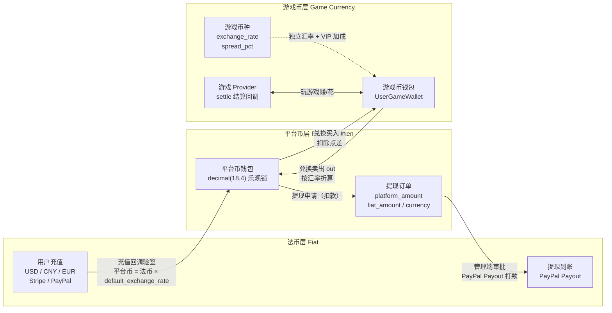
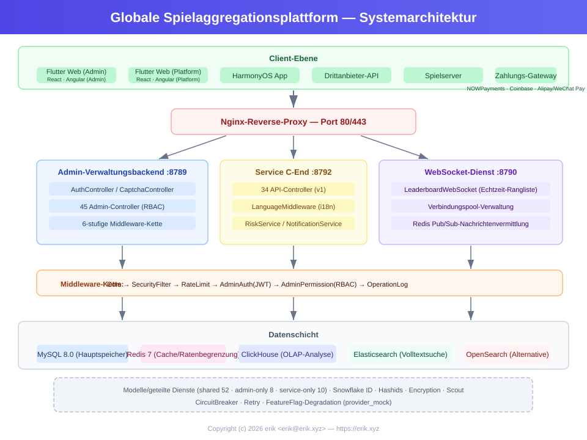
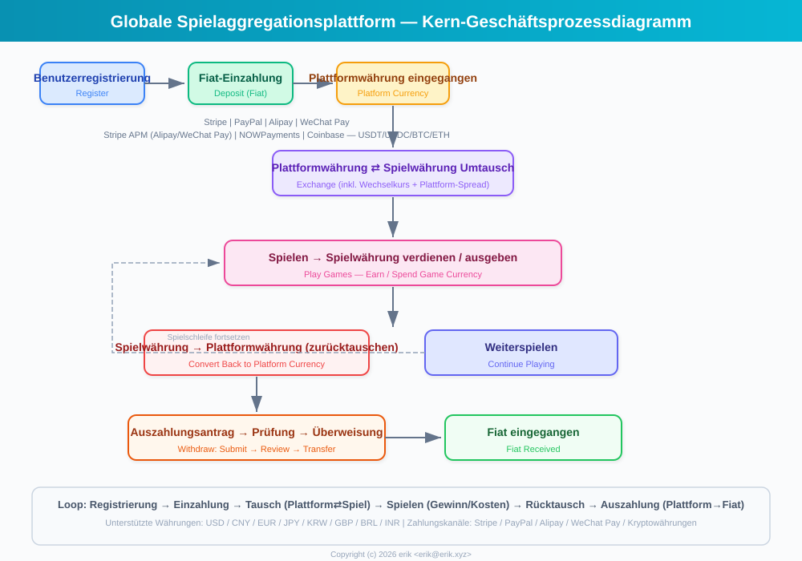
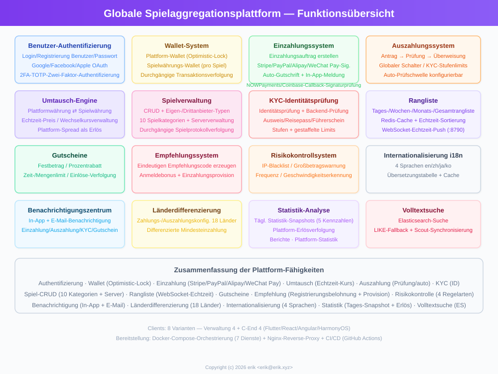
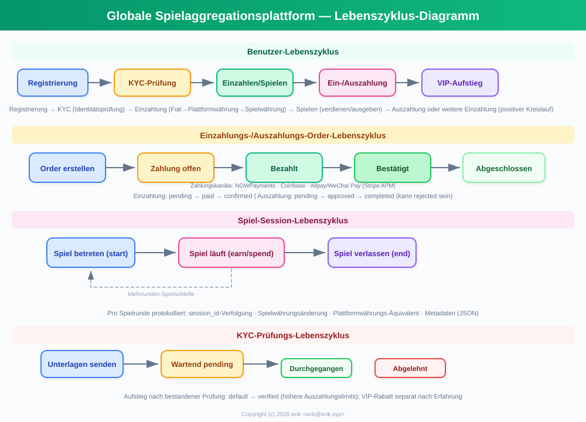
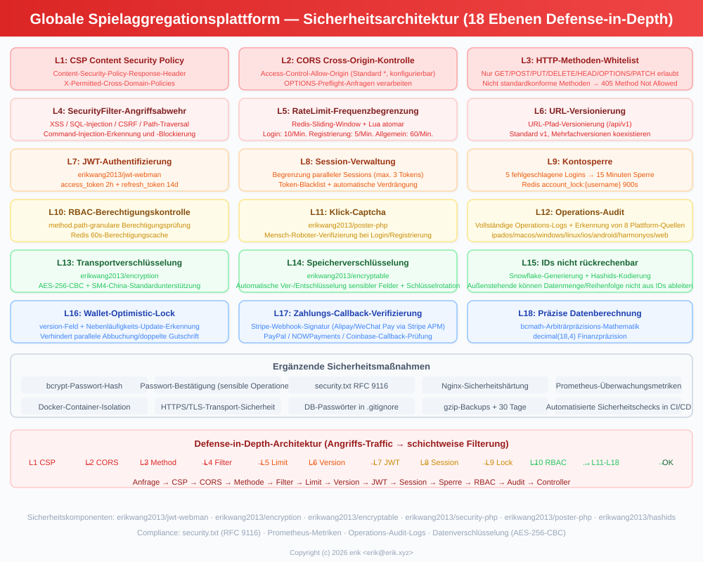
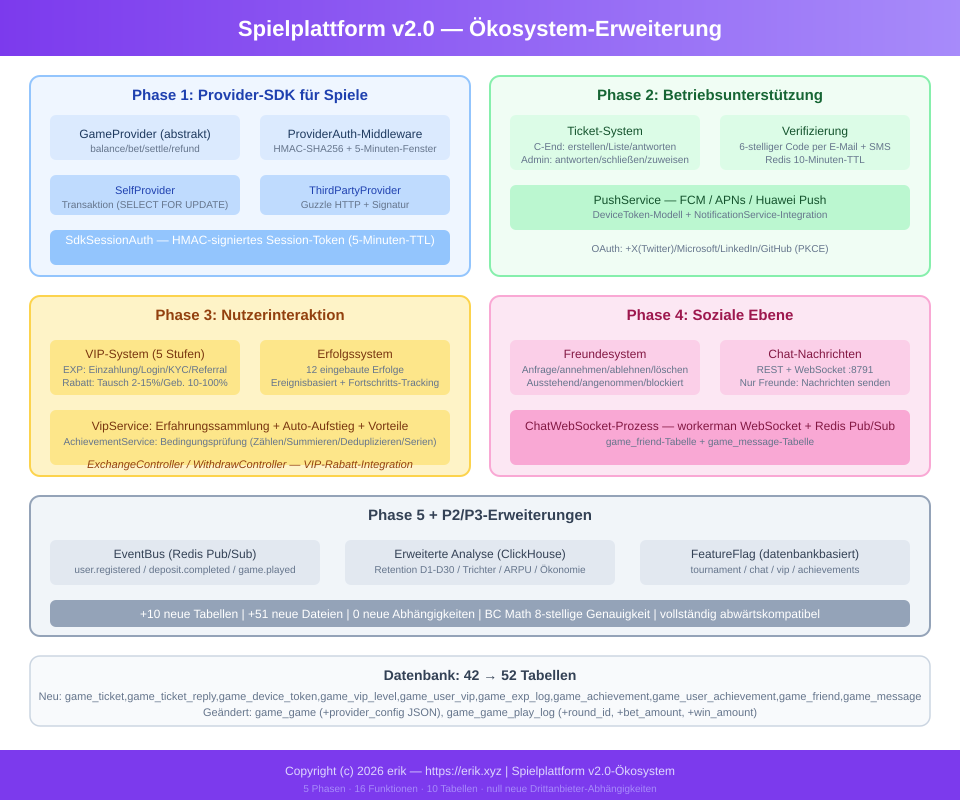

# Globale Spiele-Plattform (Global Game Platform)
<!-- lang-nav -->

Languages: [中文](../../README.md) · [English](README.en.md) · [한국어](README.ko.md) · [Русский](README.ru.md) · **Deutsch** · [Français](README.fr.md) · [Español](README.es.md) · [Português](README.pt.md) · [हिन्दी](README.hi.md) · [العربية](README.ar.md) · [বাংলা](README.bn.md) · [Bahasa Indonesia](README.id.md) · [日本語](README.ja.md)


> Copyright (c) 2026 erik <erik@erik.xyz> — https://erik.xyz

Eine weltweit einsetzbare, internationalisierte Spiele-Aggregationsplattform. Nach der Registrierung laden Benutzer Geld auf, um Spielmünzen zu kaufen, spielen mit den Spielmünzen und verdienen Spielmünzen; die Spielmünzen können zurück in die Brieftasche transferiert und ausgezahlt werden. Das Backend bietet vollständige Funktionen für Spielverwaltung, Auszahlungsprüfung, Benutzerverwaltung und Zahlungsverwaltung. Mehrsprachige Umschaltung (Englisch/Chinesisch) wird unterstützt.

## Versionsstrategie

| Version | Ziel | Status |
|------|------|------|
| Vollversion | Komplett: Ranglisten, Gutscheine, Spielkategorien, Länderkonfiguration, ES-Suche | Abgeschlossen |
| Ökosystem-Erweiterung | v2.0: Spiel-Provider-Anbindung, Tickets, VIP, Erfolge, Soziales, Event-Bus | Abgeschlossen |

## Technologie-Stack

### Backend
- PHP 8.3+, webman v2 (workerman/webman)
- MySQL 8.0+ (Tabellenpräfix `game_`, BIGINT-IDs ohne Auto-Increment)
- Redis (Session / Cache / Rate-Limiting)
- ClickHouse (OLAP-Analyse / Wahrscheinlichkeitsberechnung)
- Elasticsearch (Volltextsuche)
- JWT-Authentifizierung + RBAC-Berechtigungssteuerung
- Datenverschlüsselung: AES-256-CBC auf API-Transportebene + AES-128-ECB auf Datenbankspeicherebene

### Frontend
- Flutter 3.x (Web-PC-Stil)
- HarmonyOS ArkTS (Mobil)
- Responsives Layout (Phone / Tablet / Desktop)
- Internationalisierung (i18n): Englisch / vereinfachtes Chinesisch

### Kernkomponenten
- `erikwang2013/snowflake-php` — globale eindeutige BIGINT-ID-Generierung
- `erikwang2013/hashids` — ID-Verschlüsselung auf API-Ebene
- `erikwang2013/jwt-webman` — JWT-Authentifizierung
- `erikwang2013/encryption` — Ver-/Entschlüsselung sensibler API-Daten
- `erikwang2013/encryptable` — Ver-/Entschlüsselung sensibler Datenbankfelder
- `erikwang2013/webman-scout` — Elasticsearch-Synchronisation und -Abfrage
- `erikwang2013/season` — Länderflaggen
- `erikwang2013/security-php` — Sicherheitswerkzeug-Erkennung
- `erikwang2013/poster-php` — Zufallsverifikation bei sensiblen Aktionen
- `erikwang2013/clickhouse-php` — ClickHouse-Verbindung und Wahrscheinlichkeitsberechnung

## Projektstruktur

```
game-platform-php/
├── admin/                     # Verwaltungs-Backend (webman v2, Port 8787)
│   ├── app/admin/controller/  #   Admin-Controller
│   ├── app/middleware/        #   Middleware (Cors/Security/RateLimit/Auth/ProviderAuth)
│   ├── app/provider/          #   Spiel-Provider-Schicht
│   ├── app/event/             #   Event-Bus (EventBus Redis Pub/Sub) (Cors/Security/RateLimit/Auth/Permission/ProviderAuth)
│   ├── app/provider/          #   Spiel-Provider-Schicht (Self/ThirdParty/Factory)
│   ├── app/middleware/        #   Middleware (Cors/Security/RateLimit/Auth/ProviderAuth)
│   ├── app/provider/          #   Spiel-Provider-Schicht
│   ├── app/event/             #   Event-Bus (EventBus Redis Pub/Sub) (Cors/Security/RateLimit/Auth/Permission)
│   ├── config/                #   Konfigurationsdateien
│   ├── install/   #   SQL-Migrationsdateien
│   └── apps/flutter/          #   Flutter-Web-PC-Verwaltungs-Backend
│
├── service/                   # C-End-Geschäftsdienst (webman v2, Port 8788)
│   ├── app/api/v1/controller/ #   C-End-API-Controller
│   ├── app/middleware/        #   Middleware (Cors/Security/RateLimit/Auth/ProviderAuth)
│   ├── app/provider/          #   Spiel-Provider-Schicht
│   ├── app/event/             #   Event-Bus (EventBus Redis Pub/Sub)
│   └── config/                #   Konfigurationsdateien
│
├── install/                   # Ein-Klick-Installationsassistent
│   ├── index.php              #   Installations-Einstiegspunkt
│   ├── Installer.php          #   Kernlogik der Installation
│   ├── install.sql            #   Zusammengeführtes Installations-SQL (43 Tabellen + Seed-Daten)
│   └── assets/                #   Statische Ressourcen
│
├── admin/common/ 与 service/common/   # 共享服务各一份 (DepositLogService 等，待抽共享层)
│   └── service/               #   Gemeinsame Dienste (inkl. ClickHouse-Wahrscheinlichkeitsberechnung)
│
├── apps/
│   └── flutter/platform/      # Flutter-Web-PC-C-End-Benutzerplattform
│
├── docs/                      # Projektdokumentation
│   ├── ARCHITECTURE.md        #   Architekturdokument
│   ├── ARCHITECTURE-DESIGN.md #   Architektur-Design-Dokument
│   ├── FEATURES.md            #   Funktionsdokument
│   ├── FEATURE-DESIGN.md      #   Funktionsdesign-Dokument
│   └── API.md                 #   Schnittstellendokument
│
└── admin/docs/superpowers/    # Entwicklungsstandards und Pläne
    ├── specs/                 #   Design-Spezifikationen
    └── plans/                 #   Umsetzungspläne
```

## Schnellstart

### Umgebungsanforderungen
- PHP 8.1+
- MySQL 8.0+
- Redis 6.0+
- Composer 2.x
- Flutter SDK 3.x (Frontend, optional)

### Weg 1: Ein-Klick-Installationsassistent (empfohlen)

```bash
# 1. Installationsassistent starten
php -S 0.0.0.0:8888 -t install/

# 2. Browser öffnen: http://localhost:8888
#    Assistenten folgen: Umgebungsprüfung → Datenbankkonfiguration → Admin-Konto einrichten → automatische Installation

# 3. Abhängigkeiten installieren
cd admin && composer install && cd ..
cd service && composer install && cd ..

# 4. Dienste starten
cd admin && php start.php start -d && cd ..
cd service && php start.php start -d && cd ..

# 5. Verwaltungs-Backend öffnen: http://localhost:8787
#    Mit dem bei der Installation eingerichteten Admin-Konto anmelden

# 6. Nach der Installation Installationsverzeichnis löschen (Sicherheit)
rm -rf install/
```

Der Installationsassistent erledigt automatisch:
- Umgebungsprüfung (PHP-Version, Erweiterungen, Verzeichnisberechtigungen)
- Erstellung der Datenbank und der Tabellen (zusammengeführtes SQL, 43 Tabellen + Seed-Daten)
- Erstellung des Super-Admin-Kontos (bcrypt-verschlüsselt)
- Automatische Generierung von JWT-/Verschlüsselungsschlüsseln und Schreiben in die .env-Datei
- Erzeugung von install.lock zur Verhinderung einer Doppelinstallation

### Weg 2: Manuelle Installation

<details>
<summary>Manuelle Installationsschritte aufklappen</summary>

#### 1. Datenbank initialisieren

```bash
# Zusammengeführtes SQL in einem Schritt importieren
mysql -u root -e "CREATE DATABASE IF NOT EXISTS game-platform CHARACTER SET utf8mb4 COLLATE utf8mb4_unicode_ci;"
mysql -u root game-platform < install/install.sql
```

#### 2. Umgebungsvariablen konfigurieren

```bash
# Verwaltungs-Backend
cd admin
cp .env.example .env
# Datenbankverbindungsdaten und Schlüssel in .env bearbeiten

# C-End-Geschäftsdienst
cd ../service
cp .env.example .env
# Datenbankverbindungsdaten und Schlüssel in .env bearbeiten
```

#### 3. Backend starten

```bash
cd admin && composer install && php start.php start -d
cd ../service && composer install && php start.php start -d
```

#### 4. Administrator anlegen

Das Admin-Konto muss manuell in der Datenbank angelegt werden (Passwort mit bcrypt verschlüsseln).

</details>

### Frontend starten (optional)

```bash
# Verwaltungs-Backend (Flutter Web PC)
cd admin/apps/flutter
flutter pub get
flutter run -d chrome

# C-End-Benutzerplattform (Flutter Web PC)
cd apps/flutter/platform
flutter pub get
flutter run -d chrome
```

### Verifikation

```bash
# Verwaltungs-Backend testen
curl http://localhost:8787/health

# C-End-Dienst testen
curl http://localhost:8788/health

# Benutzerregistrierung testen
curl -X POST http://localhost:8788/api/auth/register \
  -H "Content-Type: application/json" \
  -d '{"username":"testuser","password":"123456"}'
```

## Sicherheitsfunktionen

- **18 Ebenen Verteidigung in der Tiefe**: Erkennung und Abwehr von XSS/SQL-Injection/CSRF/Pfad-Traversal/Befehlsinjektion
- **HTTP-Methoden-Whitelist**: nur GET/POST/PUT/DELETE/OPTIONS/HEAD erlaubt
- **JWT-Authentifizierung**: access_token 2h + refresh_token 14d, Begrenzung paralleler Sitzungen
- **JWT-Schlüsselprüfung beim Start**: Admin-Seite `ADMIN_JWT_SECRET_KEY`, Service-Seite `SERVICE_JWT_SECRET_KEY` als getrennte Schlüssel; fehlende oder noch Standardwerte führen direkt zur Startverweigerung
- **Zahlungs-Callback fail-closed**: Provider-Whitelist (nur stripe/paypal) + fehlender Schlüssel/fehlgeschlagene Signaturprüfung/Zeitstempelüberschreitung werden abgelehnt + bccomp-Betragsabgleich + transaktionale Buchung des Callbacks
- **RBAC-Berechtigungen**: method.path-granulare Berechtigungssteuerung, Redis-Cache 60s
- **Klick-CAPTCHA**: erzwungene Mensch-Maschine-Verifikation bei Login/Registrierung
- **Passwort-Bestätigung**: bei sensiblen Aktionen ist die Passworteingabe erforderlich
- **Datenverschlüsselung**: AES-256-CBC auf Transportebene + AES-128-ECB auf Speicherebene
- **ID-Verschlüsselung**: Snowflake-Generierung + Hashids-Kodierung, extern nicht umkehrbar
- **Optimistisches Sperren des Wallets**: verhindert parallele Abbuchungen/doppelte Gutschriften
- **Betriebsprüfung**: vollständige Aktionsprotokolle, automatische Erkennung von 8 Plattform-Quellen
- **Rate-Limiting**: Redis-Sliding-Window, atomar per Lua
- **CSP-Header**: Content-Security-Policy gegen XSS
- **Kontosicherheit**: 5 fehlgeschlagene Logins in Folge sperren das Konto für 15 Minuten

## Tests

```bash
cd admin
phpunit --bootstrap tests/bootstrap.php tests/
```

- PHPUnit 12.x, 116 Testfälle
- 56 Geschäftslogiktests (PlatformTest) + 60 Infrastrukturtests
- Abdeckung: bcmath-Präzision, Umtauschberechnung, Auszahlungsgebühren, Limits, Risikokontrolle, Gutscheine, KYC, i18n

## Plattformfähigkeiten im Überblick

| Fähigkeit | Beschreibung |
|------|------|
| Benutzerauthentifizierung | Benutzername/Passwort + 7-Plattform-OAuth (Google/Facebook/Apple/X(Twitter)/Microsoft/LinkedIn/GitHub) + 2FA TOTP |
| Brieftasche | Plattformmünzen-Wallet (optimistische Sperre) + Spielmünzen-Wallet + Transaktionsprotokoll |
| Einzahlung | Bestellung anlegen + Stripe/PayPal-Callback-Signaturprüfung + automatische Gutschrift |
| Umtausch | Plattformmünzen⇄Spielmünzen, Echtzeit-Kursabfrage, Spread-Einnahmen |
| Auszahlung | Antrag→Prüfung→Auszahlung, globaler Schalter, KYC-Stufenlimits + Gebühren |
| KYC | Echte-Name-Verifizierung einreichen + prüfen, dreistufiges Verifikationssystem |
| Spiele | CRUD + Kategorien (10) + Server/Regionen + Spielverlaufs-Tracking |
| Suche | Elasticsearch-Volltextsuche (mit LIKE-Fallback) |
| Ranglisten | Tages/Wochen/Monats/Gesamt-Rankings, Redis-Cache, WebSocket-Echtzeit-Push (8789) |
| Gutscheine | Festbetrag + Prozentrabatt, zeit-/mengenbegrenzt, Einlösung- und Nutzungs-Tracking |
| Benachrichtigungen | Interne Nachrichten + E-Mail, automatische Benachrichtigung bei Einzahlung/Auszahlung/KYC/Gutschein |
| Empfehlungen | Empfehlungscode, Registrierungsbonus, Einzahlungs-Provision |
| Risikokontrolle | IP-Blacklist/Großbetragswarnung/Frequenz-/Geschwindigkeitsprüfung |
| Internationalisierung | 4 Sprachen (en-US/zh-CN/ja-JP/ko-KR), Übersetzungstabelle + Cache |
| Länderkonfiguration | Länderdifferenzierte Zahlungs-/Auszahlungsmethoden, Mindesteinzahlungsbetrag |
| Statistiken | Tagesstatistik-Snapshots (5 Kennzahlen) + Plattform-Einnahmen-Tracking |
| CAPTCHA | Klick-basierte Mensch-Maschine-Verifikation (poster-php) |
| Spielanbindung | Provider SDK (Self+ThirdParty) + HMAC-SHA256-Signatur + Callback-Gateway |
| Tickets | C-End erstellen/antworten + Admin-Seite bearbeiten/zuweisen/schließen |
| VIP | 5 Loyalitätsstufen, Erfahrungspunkte-Akkumulation, Umtauschrabatt/Auszahlungsnachlass/Kursbonus |
| Erfolge | 12 integrierte Erfolge, ereignisgesteuerte Erkennung, Fortschritts-Tracking |
| Soziales | Freundessystem + WebSocket-Echtzeit-Privatnachrichten (Port 8791), nur Freunde können schreiben |
| Turniere | Turniersystem (FeatureFlag-Schalter) + Ranglisten + Teilnehmerlimit |
| Provision | Zweistufige Empfehlungs-Vergütung (konfigurierbarer Provisionssatz) |
| Gutscheine | Bedingungsbeschränkungen (min_deposit/first_user/game_id) |
| Events | Redis-Pub/Sub-Event-Bus + Webhook-Abo-Zustellung (7 Eventtypen) |
| Bereitstellung | Docker-Compose-Orchestrierung mit 8 Diensten + Nginx-Reverse-Proxy |
| Clients | Flutter Admin (15 Seiten) + Platform (10 Seiten) + HarmonyOS (5 Seiten) |

## Geschäftsmodell

```
Fiat (USD/CNY/EUR...)
  │  Einzahlung (Stripe/PayPal/Alipay/WeChat Pay)
  ▼
Plattformmünzen (einheitlich, Präzision decimal(18,4))
  │  Umtausch (inkl. Kurs + Plattform-Spread)
  ▼
Spielmünzen (pro Spiel unabhängig, eigener Kurs)
  │  Beim Spielen verdienen/ausgeben
  ▼
Plattformmünzen ← zurücktauschen → Auszahlung (Prüfung/automatisch)
```

## Mehrwährungs-Abrechnung

Die Plattform nutzt ein dreistufig währungsgetrenntes Abrechnungssystem „Fiat → Plattformmünzen → Spielmünzen": Mehrwährungs-Einzahlungen in USD/CNY/EUR werden unterstützt, jedes Spiel besitzt eine eigene Abrechnungswährung; sämtliche Betragsberechnungen erfolgen durchgehend mit bcmath-Hochpräzisionsarithmetik, um Gleitkommafehler auszuschließen.

### Drei-Währungsstufen-Modell

| Stufe | Währung | Beschreibung |
|------|------|------|
| Fiat-Ebene | USD / CNY / EUR | Tatsächliche Zahlungswährung für Einzahlung/Auszahlung der Benutzer, abgewickelt über Stripe / PayPal |
| Plattformmünzen-Ebene | Plattformmünzen (plattformweit einheitlich) | Interne einheitliche Abrechnungswährung (decimal(18,4)), optimistische Wallet-Sperre gegen parallele Abbuchungen/doppelte Gutschriften |
| Spielmünzen-Ebene | pro Spiel eigene Währung | Jedes Spiel hat eigenen `exchange_rate`-Kurs und `spread_pct`-Spread sowie ein eigenes Spielmünzen-Wallet |

### Abrechnungspfade

- **Einzahlungs-Abrechnung**: Der Benutzer zahlt in Fiat (Stripe / PayPal-Callback-Signaturprüfung, idempotenter Doppelschutz) → Umrechnung in Plattformmünzen über `default_exchange_rate` und Gutschrift; der Einzahlungsauftrag erfasst gleichzeitig `amount + currency + platform_amount`
- **Umtausch-Abrechnung**: Plattformmünzen ⇄ Spielmünzen werden zum Spielkurs in Echtzeit angefragt (quote), `spread_pct`-Spread wird als Plattform-Spread-Einnahme abgezogen; VIP erhält Umtauschrabatt und Kursbonus
- **Spiel-Abrechnung**: Der Spiel-Provider erhöht/verringert die Spielmünzen des Benutzers per Callback über `/api/provider/settle` (HMAC-SHA256-Signatur); Spielsitzungen werden bei Timeout automatisch abgerechnet
- **Auszahlungs-Abrechnung**: Abbuchung von Plattformmünzen → Auszahlungsauftrag erzeugen (erfasst `platform_amount / fiat_amount / currency`) → Freigabe durch die Admin-Seite → PayPal-Payout-Überweisung → Status-Synchronisierung der Charge bis zum Abschluss

### Abrechnungs-Flussdiagramm



## Architekturdiagramm



## Kern-Geschäftsprozesse



## Funktionsübersicht



## Lebenszyklus



## Sicherheitsarchitektur



## Ökosystem-Erweiterung (v2.0)



## Dokumentationsindex

| Dokument | Beschreibung |
|------|------|
| [Versionsvergleich](../VERSIONS.de.md) | Funktionsvergleich Basis-/Standard-/Vollversion |
| [Architektur-Design-Dokument](../ARCHITECTURE-DESIGN.de.md) | Architektur-Auswahlgründe und Designentscheidungen |
| [Architekturdokument](../ARCHITECTURE.de.md) | Systemtopologie, Modularchitektur, Datenfluss |
| [Funktionsdesign-Dokument](../FEATURE-DESIGN.de.md) | Geschäftsmodelle, Funktionsspezifikationen, Prozessdesign |
| [Funktionsdokument](../FEATURES.de.md) | Funktionsliste, Modulbeschreibungen, Benutzerreisen |
| [Schnittstellendokument](../API.de.md) | Vollständige API-Referenz (102 Schnittstellen) |
| [Online-Dokumentation](http://localhost:8788/apidoc/) | hg/apidoc interaktive Dokumentation (C-End) |
| [Online-Dokumentation](http://localhost:8787/apidoc/) | hg/apidoc interaktive Dokumentation (Verwaltungs-Backend) |
| [ClickHouse-Installation](../CLICKHOUSE_INSTALL.de.md) | ClickHouse-Installation/Konfiguration/Migration/Verifikation |
| [Provider-SDK-Integrationsdokument](../PROVIDER-SDK.de.md) | Anleitung zur Anbindung von Drittanbieter-Spielen (Signaturalgorithmus + PHP/Go/Python-Beispiele) |
| [ClickHouse-Nutzung](../CLICKHOUSE_USAGE.de.md) | 4 ClickHouse-Service-APIs und Admin-Dashboard |
| [Bereitstellungsdokument](../DEPLOYMENT.de.md) | Bereitstellungsanleitung (Docker + manuell + Nginx + Monitoring) |
| [Design-Spezifikation](../../admin/docs/superpowers/specs/2026-05-22-game-platform-design.de.md) | Vollständige Design-Spezifikation |
| [Umsetzungsplan](../../admin/docs/superpowers/plans/2026-05-22-game-platform-plan.de.md) | Detaillierter Umsetzungsplan |

---

## Projekt unterstützen

Wenn dieses Projekt dir hilft, lade den Autor gern auf einen Kaffee ein ☕

<p align="center">
  <table align="center" border="0" cellspacing="0" cellpadding="0">
    <tr>
      <td align="center" width="200">
        <br>
        <b>微信支付</b>
      </td>
      <td align="center" width="200">
        <br>
        <b>支付宝</b>
      </td>
    </tr>
  </table>
</p>

### Global Bank Transfer

**Empfängerinformationen (Recipient)**

| Feld | Inhalt |
|----|------|
| Empfängername (Beneficiary Name) | WANG KEXUN |
| Empfängerkontonummer (Account Number) | 881015918251 |

**Empfängerbank (Beneficiary Bank)**

| Feld | Inhalt |
|----|------|
| SWIFT Code | AABLHKHHXXX |
| Bankname (Bank Name) | ZA Bank Limited |
| Bankleitzahl (Bank Code) | 387 |
| Bankadresse (Bank Address) | Core F, Cyberport 3, 100 Cyberport Road, Hong Kong |

**Korrespondenzbank für grenzüberschreitende Überweisungen (Correspondent Bank, falls erforderlich)**

> Bitte beachten: Dies sind die Informationen der Korrespondenzbank (Zwischenbank) für grenzüberschreitende Überweisungen, nicht die der Empfängerbank. Bitte erfrage bei deiner überweisenden Bank, ob Angaben zur Korrespondenzbank benötigt werden.

- **Für Überweisungen in Hongkong-Dollar, Renminbi und US-Dollar ist die Korrespondenzbank Citibank:**
  - Bankname: Citibank N.A. Hong Kong
  - SWIFT Code: CITIHKHXXXX
  - Bankleitzahl: 006
  - Filialname: Hong Kong Branch
  - Filialnummer: 391
  - Bankadresse: Citibank Tower, Citibank Plaza, 3 Garden Road, Central, Hong Kong
- **Bei Überweisungen in andere Währungen ist die Korrespondenzbank BNY Mellon:**
  - Bankname: THE BANK OF NEW YORK MELLON
  - SWIFT Code: IRVTUS3NXXX
  - Bankadresse: THE BANK OF NEW YORK MELLON, 240 GREENWICH STREET, NEW YORK, United States
